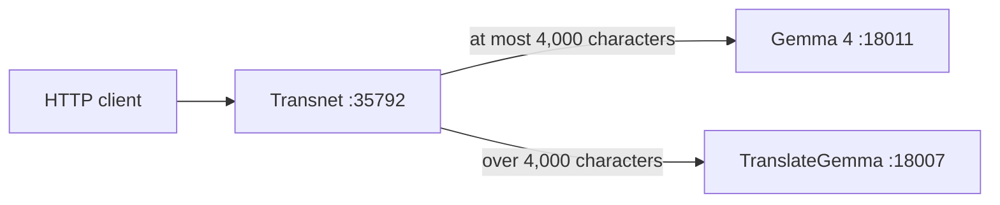

# Transnet

Transnet is a Rust HTTP service for translation and English learning. It preserves direct text translation and provides a first structured, model-generated learning lookup while the canonical RAG platform is built.



## Run

Configure the listener and model servers in `config/transnet.toml`, then run:

```bash
cargo run
```

Verify the service:

```bash
curl http://127.0.0.1:35792/health
curl --request POST http://127.0.0.1:35792/translate \
  --header 'content-type: application/json' \
  --data '{"text":"Hello","source_lang":"en","target_lang":"zh-CN"}'
curl --request POST http://127.0.0.1:35792/v1/lookups \
  --header 'content-type: application/json' \
  --data '{"query":"caliente","source_language":"es","target_language":"en","explanation_language":"en"}'
```

See the [design](docs/transnet.md), [API contract](docs/reference/transnet-api.md), and [development guide](docs/guides/development.md).

## License

Transnet is licensed under the [MIT License](LICENSE).
