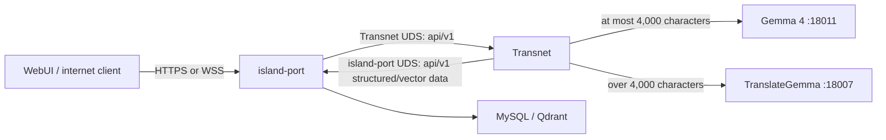

<p align="center">
  
</p>

<h1 align="center">Transnet</h1>

<p align="center">Private, stateless translation and relationship knowledge.</p>

<p align="center">
  <a href="https://www.rust-lang.org/"></a>
  <a href="LICENSE"></a>
  <a href="docs/transnet.md"></a>
</p>

<p align="center">
  <a href="docs/documentation-index.md">Documentation</a> ·
  <a href="README_cn.md">中文</a>
</p>

Transnet is a private, stateless translation and relationship-knowledge service. It translates connected text and, for a resolved lexical sense or domain concept, builds a concise relationship-centered translation-wiki page. The checked-in executable currently provides the loopback translation and structured-lookup subset; the [system design](docs/transnet.md) defines the target service.



## Prerequisites

Install a current stable Rust toolchain with Cargo, rustfmt, and Clippy. Start OpenAI-compatible Gemma 4 and TranslateGemma servers at the endpoints in `config/transnet.toml`. **Gemma 4** is the general-purpose provider used for short-text translation and the current structured lookup; **TranslateGemma** is the translation-specialized provider selected for longer text. The Gemma 4 endpoint used by structured lookup must support OpenAI-compatible strict JSON Schema output.

## Configure

The process always reads `config/transnet.toml` relative to the Cargo manifest. `[server]` currently sets the transitional loopback listener and log filter/format, `[http]` sets the body limit and transitional CORS policy, `[translation]` sets routing and legacy retry defaults, `[gemma4]` and `[translate_gemma]` identify those provider endpoints, and `[provider_resilience.*]` sets independent timeout, retry, concurrency, and circuit-breaker bounds. The target UDS settings are defined in the [configuration guide](docs/guides/configuration.md). Do not commit real provider credentials.

`RUST_LOG` overrides `server.log_level`. `server.log_format = "json"` writes newline-delimited JSON; any other value writes compact text. Debug builds log to `logs/debug/transnet.log`, release builds log to `logs/release/transnet.log`; each file is replaced on startup.

## Build and verify

```bash
cargo build
cargo build --release
cargo fmt --all -- --check
cargo clippy --all-targets -- -D warnings
cargo test --all-targets
cargo doc --no-deps
```

The release binary is `target/release/transnet`.

## Run

Configure the listener and model servers in `config/transnet.toml`, then run:

```bash
cargo run
```

For a release build:

```bash
cargo run --release
```

Target UDS calls (these become runnable when the transport migration lands):

```bash
curl --unix-socket /run/transnet/transnet.sock --request POST http://localhost/api/v1/health \
  --header 'content-type: application/json' --data '{}'
curl --unix-socket /run/transnet/transnet.sock --request POST http://localhost/api/v1/livez \
  --header 'content-type: application/json' --data '{}'
curl --unix-socket /run/transnet/transnet.sock --request POST http://localhost/api/v1/readyz \
  --header 'content-type: application/json' --data '{}'
curl --unix-socket /run/transnet/transnet.sock --request POST http://localhost/api/v1/translations \
  --header 'content-type: application/json' \
  --data '{"text":"Hello","source_language":"auto","target_language":"zh-CN","response_level":"standard"}'
```

These commands show the target UDS interface. The current executable still uses the transitional loopback listener and legacy paths until the transport migration is implemented. MySQL canonical cards and releases plus Qdrant knowledge nodes and edges remain target capabilities until their status is advanced in the interface and guide documents. The process handles Ctrl-C and Unix termination signals for graceful shutdown.

Verify the current transitional runtime with `curl http://127.0.0.1:35792/health`.

See the [design](docs/transnet.md), [island-port-to-Transnet service interface and UDS transport](docs/interfaces/transnet.md), [Transnet-to-island-port SQL endpoints](docs/interfaces/mysql.md), [Transnet-to-island-port vector endpoints](docs/interfaces/qdrant.md), and [configuration reference](docs/guides/configuration.md).

## License

Transnet is licensed under the [MIT License](LICENSE).
