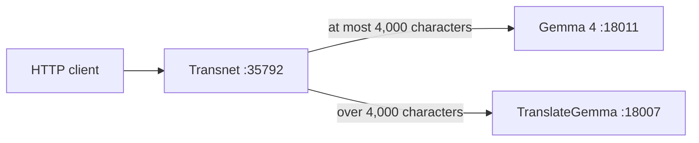

# Transnet

Transnet is Island-port's pure loopback compute service for translation and English-learning generation. Island-port owns the public API, identity, permissions, user data, privacy, encryption, persistence, MySQL, Qdrant, and all stateful product behavior.



## Prerequisites

Install a current stable Rust toolchain with Cargo, rustfmt, and Clippy. Start OpenAI-compatible Gemma 4 and TranslateGemma servers at the endpoints in `config/transnet.toml`. The Gemma 4 endpoint used by structured lookup must support OpenAI-compatible strict JSON Schema output.

## Configure

The process always reads `config/transnet.toml` relative to the Cargo manifest. `[server]` sets the listener and log filter/format, `[http]` sets the body limit and exact CORS origins, `[translation]` sets routing and legacy retry defaults, provider tables identify the model endpoints, and `[provider_resilience.*]` sets independent timeout, retry, concurrency, and circuit-breaker bounds. Do not commit real provider credentials.

`RUST_LOG` overrides `server.log_level`. `server.log_format = "json"` writes newline-delimited JSON; any other value writes compact text. Debug builds log to `logs/debug/transnet.log`, release builds log to `logs/release/transnet.log`; each file is replaced on startup.

## Build and verify

```bash
cargo build
cargo build --release
cargo fmt --all -- --check
cargo clippy --all-targets -- -D warnings
cargo test --all-targets
cargo doc --no-deps
```

The release binary is `target/release/transnet`.

## Run

Configure the listener and model servers in `config/transnet.toml`, then run:

```bash
cargo run
```

For a release build:

```bash
cargo run --release
```

Verify the service:

```bash
curl http://127.0.0.1:35792/health
curl http://127.0.0.1:35792/livez
curl http://127.0.0.1:35792/readyz
curl --request POST http://127.0.0.1:35792/translate \
  --header 'content-type: application/json' \
  --data '{"text":"Hello","source_lang":"en","target_lang":"zh-CN"}'
curl --request POST http://127.0.0.1:35792/v1/lookups \
  --header 'content-type: application/json' \
  --data '{"query":"caliente","source_language":"es","target_language":"en","explanation_language":"en"}'
```

The current executable has no TLS termination and enforces a loopback bind. Keep it behind Island-port; never provide it with database, identity, session, encryption, or persistence configuration. The process handles Ctrl-C and Unix termination signals for graceful shutdown.

See the [design](docs/transnet.md), [Island-port interface](docs/interfaces/port.md), [MySQL adapter](docs/interfaces/mysql.md), [Qdrant adapter](docs/interfaces/qdrant.md), and [configuration reference](docs/guides/configuration.md).

## License

Transnet is licensed under the [MIT License](LICENSE).
