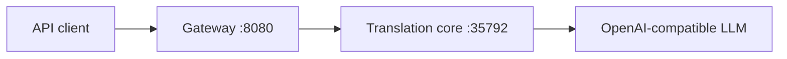

# Transnet

Transnet is a Rust translation service backed by an OpenAI-compatible language-model API. The repository contains a core translation service and an optional HTTP gateway; it does not contain a WebUI.

## Components

- `island-transnet`: validates translation requests, selects prompts and model endpoints, parses model responses, and exposes the core `/health` and `/translate` API.
- `transnet-server`: forwards translation requests to the core service and exposes the wider gateway contract. Account, history, favorites, profile, and statistics routes are currently placeholder interfaces and do not persist data.



## Development

The repository is a Cargo workspace. Install a current stable Rust toolchain, then run the checks from the repository root:

```bash
cargo fmt --all -- --check
cargo clippy --workspace --all-targets -- -D warnings
cargo test --workspace
```

Configure the model endpoints in `island-transnet/config/transnet_llm.toml`. Do not commit real API keys. Start the services in separate terminals:

```bash
cargo run -p transnet
cargo run -p transnet-server
```

The core service defaults to `127.0.0.1:35792`. The gateway defaults to `0.0.0.0:8080` and connects to the core through `BACKEND_HOST` and `BACKEND_PORT`.

## Documentation

- [Coding conventions](conventions.md)
- [Architecture](docs/architecture.md)
- [API index](docs/api.md)
- [Configuration](docs/configuration.md)
- [Development and operations](docs/development.md)

## License

Transnet is licensed under the [MIT License](LICENSE).
