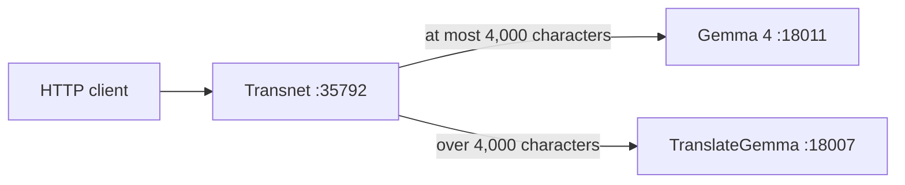

# Transnet

Transnet is a small Rust HTTP service for text translation. Gemma 4 handles text up to 4,000 Unicode characters; longer text is sent intact to TranslateGemma.



## Run

Configure the listener and model servers in `config/transnet.toml`, then run:

```bash
cargo run
```

Verify the service:

```bash
curl http://127.0.0.1:35792/health
curl --request POST http://127.0.0.1:35792/translate \
  --header 'content-type: application/json' \
  --data '{"text":"Hello","source_lang":"en","target_lang":"zh-CN"}'
```

See the [design](docs/transnet.md), [API contract](docs/reference/transnet-api.md), and [development guide](docs/guides/development.md).

## License

Transnet is licensed under the [MIT License](LICENSE).
