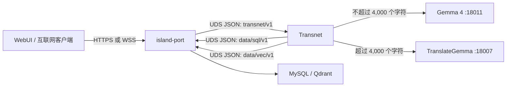

<p align="center">
  
</p>

<h1 align="center">Transnet</h1>

<p align="center">私有、无状态的翻译与关系知识服务。</p>

<p align="center">
  <a href="https://www.rust-lang.org/"></a>
  <a href="LICENSE"></a>
  <a href="docs_cn/transnet_cn.md"></a>
</p>

<p align="center">
  <a href="docs_cn/documentation-index_cn.md">文档</a> ·
  <a href="README.md">English</a>
</p>

Transnet 是一项私有、无状态的翻译与关系知识服务。它翻译连贯文本，并为已解析的词汇词义或领域概念构建简洁、以关系为中心的翻译维基页面。仓库中当前的可执行文件提供回环地址上的翻译与结构化查询子集；目标服务由[系统设计](docs_cn/transnet_cn.md)定义。



## 前置条件

安装包含 Cargo、rustfmt 和 Clippy 的当前稳定版 Rust 工具链。在 `config/transnet.toml` 指定的 endpoint 启动兼容 OpenAI 的 Gemma 4 与 TranslateGemma 服务器。**Gemma 4** 是用于短文本翻译和当前结构化查询的通用 provider；**TranslateGemma** 是为较长文本选择的翻译专用 provider。供结构化查询使用的 Gemma 4 endpoint 必须支持兼容 OpenAI 的严格 JSON Schema 输出。

## 配置

进程始终相对于 Cargo manifest 读取 `config/transnet.toml`。`[server]` 当前设置过渡性回环 listener 以及日志过滤与格式，`[http]` 设置请求体限制和过渡性 CORS 策略，`[translation]` 设置路由及旧版重试默认值，`[gemma4]` 和 `[translate_gemma]` 标识这些 provider endpoint，`[provider_resilience.*]` 设置独立的超时、重试、并发和熔断器边界。目标 UDS 设置见[配置指南](docs_cn/guides/configuration_cn.md)。不得提交真实的 provider 凭据。

`RUST_LOG` 覆盖 `server.log_level`。`server.log_format = "json"` 写入以换行分隔的 JSON；其他值写入紧凑文本。调试构建写入 `logs/debug/transnet.log`，发布构建写入 `logs/release/transnet.log`；每个文件在启动时替换。

## 构建与验证

```bash
cargo build
cargo build --release
cargo fmt --all -- --check
cargo clippy --all-targets -- -D warnings
cargo test --all-targets
cargo doc --no-deps
```

发布二进制文件是 `target/release/transnet`。

## 运行

在 `config/transnet.toml` 中配置 listener 和模型服务器后，运行：

```bash
cargo run
```

发布构建运行：

```bash
cargo run --release
```

目标 UDS 调用（将在传输迁移完成后可运行）：

```bash
curl --unix-socket /run/transnet/transnet.sock --request POST http://localhost/transnet/v1/health \
  --header 'content-type: application/json' --data '{}'
curl --unix-socket /run/transnet/transnet.sock --request POST http://localhost/transnet/v1/livez \
  --header 'content-type: application/json' --data '{}'
curl --unix-socket /run/transnet/transnet.sock --request POST http://localhost/transnet/v1/readyz \
  --header 'content-type: application/json' --data '{}'
curl --unix-socket /run/transnet/transnet.sock --request POST http://localhost/transnet/v1/translations \
  --header 'content-type: application/json' \
  --data '{"text":"Hello","source_language":"auto","target_language":"zh-CN","response_level":"standard"}'
```

这些命令展示目标 UDS 接口。当前可执行文件在传输迁移实现前仍使用过渡性回环 listener 和旧版路径。MySQL 规范卡片与发布，以及 Qdrant 知识节点与边，仍属于目标能力，直至接口和指南文档推进其状态。进程会处理 Ctrl-C 和 Unix 终止信号以优雅停机。

使用 `curl http://127.0.0.1:35792/health` 验证当前过渡性运行时。

参阅[系统设计](docs_cn/transnet_cn.md)、[island-port 到 Transnet 的服务接口与 UDS 传输](docs_cn/interfaces/transnet_cn.md)、[Transnet 到 island-port 的 SQL endpoint](docs_cn/interfaces/mysql_cn.md)、[Transnet 到 island-port 的向量 endpoint](docs_cn/interfaces/qdrant_cn.md)和[配置参考](docs_cn/guides/configuration_cn.md)。

## 许可证

Transnet 使用 [MIT 许可证](LICENSE)。
