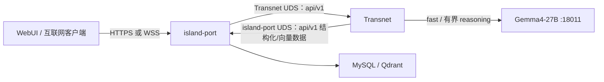

<p align="center">
  
</p>

<h1 align="center">Transnet</h1>

<p align="center">私有、无状态的翻译与关系知识服务。</p>

<p align="center">
  <a href="https://www.rust-lang.org/"></a>
  <a href="LICENSE"></a>
  <a href="docs_cn/transnet_cn.md"></a>
</p>

<p align="center">
  <a href="docs_cn/documentation-index_cn.md">文档</a> ·
  <a href="README.md">English</a>
</p>

Transnet 是一项私有、无状态的翻译与关系知识服务。它翻译连贯文本，并为已解析的词汇词义或领域概念构建简洁、以关系为中心的翻译维基页面。仓库中的可执行文件通过 Unix domain socket 提供目标 API；[系统设计](docs_cn/transnet_cn.md)定义该服务。


```mermaid
flowchart LR
  client["WebUI / 互联网客户端"] -->|"HTTPS 或 WSS"| island["island-port"]
  island -->|"Transnet UDS：api/v1"| service["Transnet"]
  service -->|"island-port UDS：api/v1 结构化/向量数据"| island
  island --> databases["MySQL / Qdrant"]
  service -->|"fast / 有界 reasoning"| gemma4["Gemma4-27B :18011"]
```

## 前置条件

安装包含 Cargo、rustfmt 和 Clippy 的当前稳定版 Rust 工具链。启动配置的 OpenAI-compatible Gemma4-27B 视觉语言 endpoint。Application 通过中立 generation port 选择闭合 `fast` 与有界 `reasoning` profile；不存在按长度切换 provider。只有显式安装请求级 semantic nomination 的组合才使用独立 embedding model。

## 配置

除非可信部署环境通过 `TRANSNET_CONFIG` 指定其他文件，否则进程相对于 Cargo manifest 读取 `config/transnet.toml`。`[server]` 要求 Unix `socket_path` 与 `socket_mode`；`[http]` 设置请求体限制。`[translation]`、`[gemma4]` 与 `[provider_resilience.gemma4]` 定义单一 generation boundary。详见[配置指南](docs_cn/guides/configuration_cn.md)。不得提交真实的 provider 凭据。

`RUST_LOG` 覆盖 `server.log_level`。`server.log_format = "json"` 写入以换行分隔的 JSON；其他值写入紧凑文本。调试构建写入 `logs/debug/transnet.log`，发布构建写入 `logs/release/transnet.log`；每个文件在启动时替换。

## 构建与验证

```bash
cargo build
cargo build --release
cargo fmt --all -- --check
cargo clippy --all-targets -- -D warnings
cargo test --all-targets
cargo doc --no-deps
```

发布二进制文件是 `target/release/transnet`。

## 运行

在 `config/transnet.toml` 中配置 listener 和模型服务器后，运行：

```bash
cargo run
```

发布构建运行：

```bash
cargo run --release
```

目标 UDS 调用：

```bash
curl --unix-socket /run/transnet/transnet.sock --request POST http://localhost/api/v1/health \
  --header 'content-type: application/json' --data '{}'
curl --unix-socket /run/transnet/transnet.sock --request POST http://localhost/api/v1/livez \
  --header 'content-type: application/json' --data '{}'
curl --unix-socket /run/transnet/transnet.sock --request POST http://localhost/api/v1/readyz \
  --header 'content-type: application/json' --data '{}'
curl --unix-socket /run/transnet/transnet.sock --request POST http://localhost/api/v1/translations \
  --header 'content-type: application/json' \
  --data '{"input":{"type":"text","text":"Hello"},"source_language":"auto","target_language":"zh-CN","response_level":"standard"}'
```

仓库配置使用目标 UDS listener。Canonical 与 knowledge client 已实现并可按需启用；其生产 Island-port/MySQL/Qdrant authority 仍由外部负责且尚未验证。进程会处理 Ctrl-C 和 Unix 终止信号以优雅停机。

旧 TCP、CORS、`POST /translate`、`/v1/lookups`、`/v1/senses/*` 与原始 `/v1/graph*` 表面均未注册。

参阅[系统设计](docs_cn/transnet_cn.md)、[island-port 到 Transnet 的服务接口与 UDS 传输](docs_cn/interfaces/transnet_cn.md)、[规范数据 endpoint](docs_cn/interfaces/canonical-data_cn.md)、[检索数据 endpoint](docs_cn/interfaces/retrieval-data_cn.md)、[配置参考](docs_cn/guides/configuration_cn.md)和[部署指南](docs_cn/guides/deployment_cn.md)。

## 许可证

Transnet 使用 [MIT 许可证](LICENSE)。
