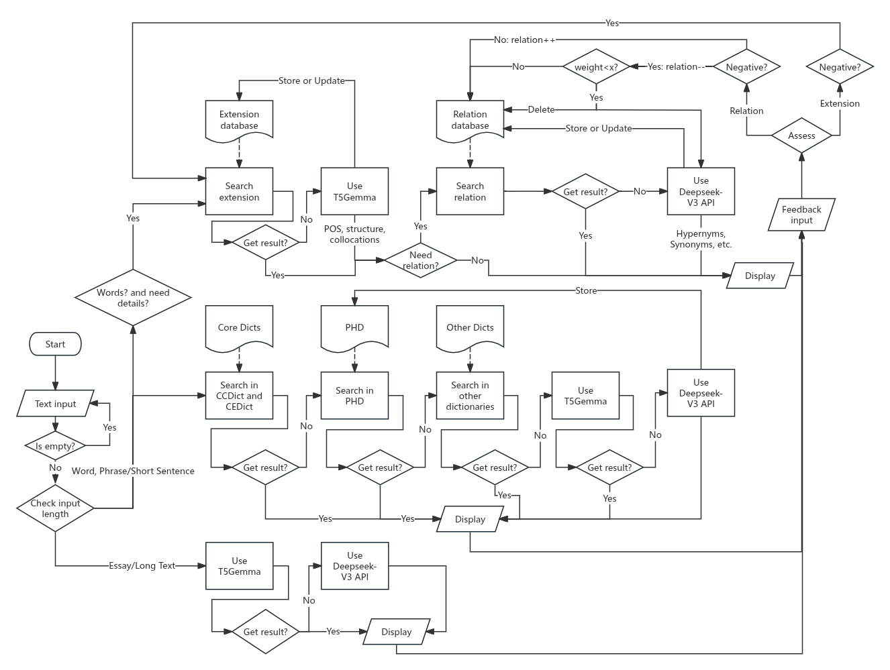
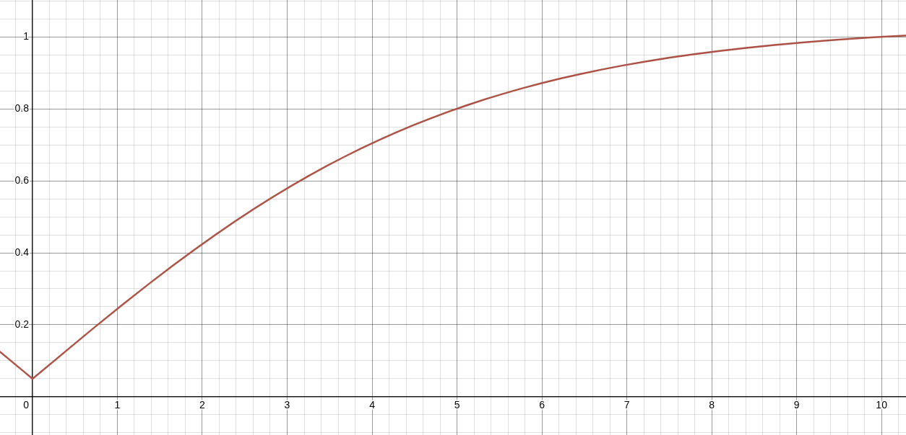
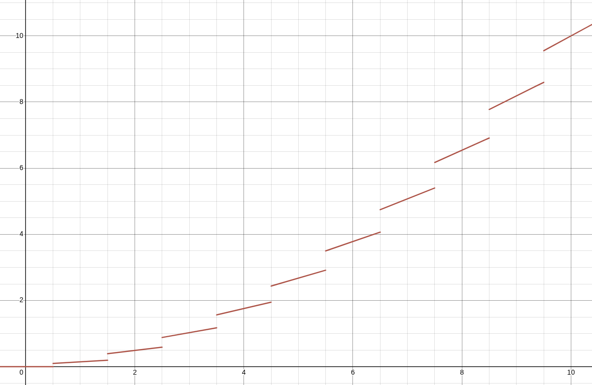

# Architecture
## 1. Description

### Systems:

| **Name** | **Function** | **Note** |
| ---- | ----| ---- |
| Basic Translation System(BTS) | Provide basic translation |  |
| Related Search System(BSeS) | Use agents to provide extend info |  |
| Related Storage System(BStS) | Build an advanced knowladge base |  |

---

### Details:

#### Basic Translation System (BTS):

1. **Basic Translation:** Use **digital dictionary**(CEDict-120k, CCDict-300k) to provide basic translation.
    - Dictoraries will be saved as CSV files.
    - An in-memory data structure (Trie) will serve as the dictionary core.

1. **Replenishment & Source:** Use other open source dictionaries to **replenish** and display the translation source.
    - Use an in-memory data structure or SQLite, depending on dictionary size.
    - **Prior:** Core $\rightarrow$ Source Dict 1 $\rightarrow$ Source Dict 2

1. **Unknown Words:** Use the `T5Gemma` model(referred to as `T5G_trans`)

1. **History Expansion:** Knowledge Augmentation via Personal History Database (PHD).
    - **Description:** We will build a database based on the translation history of all users, focusing on expressions **not covered by existing lexical resources** (e.g., internet slang, contemporary idioms). These will be initially translated by`T5G_trans` and stored in SQLite for rapid future retrieval.
    - Use SQLite for a large PHD.
    - ~~Translate input base on user's context~~

1. **Offline Model:** ~~Deploy a local lightweight model(MarianMT) when offline. User should download it first.~~

1. **Phrase/Short Sentence Translation:** Use a **lightweight model** (e.g., a small T5 variant) to translate phrases.
    - **Switch to Model:** Use the model when no results are found in the database, or when the input is a phrase or sentence.

1. **Essay Translation:** Use LLMs
    - **Deploy Local Model:** Use `T5Gemma`
    - **Use LLM API:** For academic papers etc. , request `Gemini-2.5` / `Gemini-3`.(For lack of money, we use `Deepseek-V3` first.)

1. **File Translation:** ~~Not considering~~
1. **Image Translation:** ~~Not considering~~

---

#### Relation Search System (RSeS):

> This system works only for online word and phrase translations.

1. **Core Knowledge Extraction:** Use `T5G_relate` to extract core lexical features (e.g., detailed POS, structure, common collocations) upon user request for details.
    - This is launched only if the user requests more details about the input.

1. **Semantic Relation Discovery:** Use the `Deepseek-v3` API to find related words.
    - **Result:** The LLM output must be parsable for storage.
    - **For noum:** Find hypernyms and hyponyms.
    - **For adjective/adverb:** Find more or less intense synonyms.
    - **For verb:** Find synonyms.
    - etc.

---

#### Relation Storage System (RStS):

> This system works first when a user requests more details and related words.
> If no translation is found in Extension database or Relation database, the system will use RSeS and store its result.

1. **Serach Translation:** Search the result that the user may want, if can't find any suitable result, sent input to RSeS.

1. **Storage Translation:** Store results.
    - **Extension Database:** Store results from RSeS Word Analysis.
    - **Relation Database:** Store results from RSeS Relation Search.

1. **Feedback and Weighting:** Implement a mechanism to receive user feedback (e.g., upvote/downvote).
    - Dynamically adjust the Weight/Strength of the relations (Edges) in the Relation Database, allowing the graph to be self-correcting and adaptive.

## 2. File structure
- Transnet -> `my workspace`
  - .vscode
  - backend
    - api
      - \_\_init\_\_.py
      - basic_trans.py -> `basic translation` system
    - cpp
    - \_\_init\_\_.py
    - config\.py
    - logger_setup.py
    - utils_test.py
    - utils\.py
  - datebase
    - processed_data
    - raw_data
      - .py -> `isolated converter file`
  - build
  - docs
    - ARCHITECTURE\.md -> `this file`
    - CODE_OF_CONTENTION.md 
  - logs
    - xxx.log -> `running log`
  - static
    - css
      - .css
    - js
      - main.js
      - main_temp.js -> `temporary frontend backend interaction js file`
    - index.html
    - index_temp.html
  - README\.md
  - app.
  - runme\.py

**Details**: 
- file: ...

## 3. Workflow/Algorithm

### 💾 Relation Storage System (RStS) Algorithm:

The RStS manages the storage, retrieval, and dynamic adjustment of detailed lexical and semantic information generated by the Relation Search System (RSeS).

#### I. RStS Database Schemas (Conceptual)

These structures define the two databases needed for RStS, implemented using **SQLite**.

##### 1. Extension Database (Lexical Features)

| Column Name | Data Type | Description |
| :--- | :--- | :--- |
| `word_id` | INTEGER | Primary Key. |
| `word` | TEXT | The input word/phrase analyzed. |
| `pos` | TEXT | Part-of-Speech (Extracted by `T5Gemma`). |
| `structure` | TEXT | Morphological/Syntactic structure details. |
| `collocations` | TEXT | JSON or delimited list of common collocations/examples. |
| `last_updated` | DATETIME | Timestamp of the last RSeS generation. |

##### 2. Relation Database (Semantic Graph)

This database models a directed, weighted graph where words are nodes and relations are edges.

| Column Name | Data Type | Description |
| :--- | :--- | :--- |
| `edge_id` | INTEGER | Primary Key. |
| `source_word` | TEXT | The input word (Source Node). |
| `target_word` | TEXT | The related word (Target Node). |
| `relation_type` | TEXT | e.g., 'Hypernym', 'Hyponym', 'Synonym', 'Intense-Synonym'. |
| `initial_strength`| REAL | Initial weight/strength (e.g., 0.5) set upon creation. |
| `feedback_weight` | REAL | The cumulative adjustment from user feedback (starts at 0.0). |
| **`final_weight`** | REAL | **`initial_strength` + `feedback_weight`** (Used for ranking). |
| `source` | TEXT | 'Deepseek-v3' (LLM source). |
| `last_updated` | DATETIME | Timestamp of the last update (RSeS run or feedback). |

> `source_word` and `target_word` can be exchanged. Make sure that **$\text{source\_word\_id} < \text{target\_word\_id}$**

---

#### II. RStS Core Operations Algorithm

This flow describes the actions taken when a user requests "more details" about a word/phrase.

##### A. Retrieval Algorithm (`SearchRStS(InputWord)`)

1.  **Search Extension DB:**
    * Query `ExtensionDB` for `InputWord`.
    * **IF FOUND:** Retrieve all lexical features (POS, structure, collocations). Store as `StoredFeatures`.
    * **ELSE:** `StoredFeatures` = `NotFound`.
2.  **Search Relation DB:**
    * **IF:** $\text{InputWord\_ID} > \frac{\text{MaxID}}{2}$
      **ACTION:** $\text{InputWord\_ID} = \text{MaxID} \space - \space \text{InputWord\_ID}$

      > **This may greatly reduce search time.**

    * Query `RelationDB` for `source_word` = `InputWord`.
    * **IF FOUND:** Retrieve all `target_word`, `relation_type`, and sort by descending `final_weight`. Store as `StoredRelations`.
    * **ELSE:** `StoredRelations` = `NotFound`.
3.  **Return:** `(StoredFeatures, StoredRelations)`.

##### B. Storage Algorithm (`StoreRStS(InputWord, FeaturesF, RelationG, Relation_type)`)

This is executed only if `SearchRStS` returns `NotFound` for either features or relations, triggering an RSeS run.

1.  **Store Features (Extension DB):**
    * **Action:** INSERT/REPLACE the `InputWord` and its `FeaturesF` (from `T5G_relate`) into the `ExtensionDB`.
    * **Timestamp:** Set `last_updated` to the current time.
2.  **Store Relations (Relation DB):**
    * Iterate through each semantic relation (`RelationG`) generated by Deepseek-v3 (which must be a parsable list/JSON):
        * **For each relation (Source $\rightarrow$ Target, Type):**
            * **IF SourceID < TargetID:** Exchange source and target.
            * **Action:** INSERT a new edge intothe     `RelationDB_Relation_type`(depends on Relation_type).
            * Set `source_word` = `InputWord`.
            * Set `target_word` = `TargetWord`.
            * Set `relation_type` = Type (e.g.,    'Hypernym').
            * Set `initial_strength` = a defaultvalue (e.g., 0.5, from 0 to 1).
            * Set `feedback_weight` = 0.0 (from 0 to 1).
            * Set `final_weight` =`initial_strength`.
            * Set `last_updated` to the current time.

---

#### III. RStS Feedback and Weighting Algorithm

This is the adaptive component, allowing the system to learn from user preference.

##### Algorithm (`AdjustWeight(edge_id, DB_id)`)

1.  **Define Weight Change:**
    * **IF** `FeedbackType` is **Upvote** / Positive: $\Delta W = + ...$
    * **IF** `FeedbackType` is **Downvote** / Negative: $\Delta W = - ...$
2.  **Locate Edge:**
    * **Query:** SELECT `feedback_weight` FROM `RelationDB` where `source_word` = `SourceWord` AND `target_word` = `TargetWord` AND `relation_type` = `RelationType`.
3.  **Update Edge Weight:**
    * **Action:** UPDATE `RelationDB`
    * Set `feedback_weight` = ...
    * Set `final_weight` = ...
    * Set `last_updated` to the current time.
    * **Condition:** WHERE `source_word` = `SourceWord` AND `target_word` = `TargetWord` AND `relation_type` = `RelationType`.

##### Note on Weight:

- **Initial Strength:**
This will be set to { $0.2, 0.4, 0.6, 0.8, 1.0$ }
- **Final Weight:**
    **$\text{Final Weight} = \text{Initial Strength} \cdot (1 - \text{Feedback Weight}) + \text{Feedback Weigh}, (W > 0)$**
    **$\text{Final Weight} = \text{Initial Strength} \cdot (1 + \text{Feedback Weight}), (W \leq 0)$**
- **Feedback Weight $W \in (-1, 1)$**
    $$
    W \rightarrow
    \begin{cases}
    W \cdot (1 - \Delta W) + \Delta W, \Delta W > 0 \\
    W \cdot (1 + \Delta W), \Delta W \leq 0
    \end{cases}
    $$
- **Feedback Weight Change $\Delta W \in (-1, 1)$**
    1. Define Constants:
        - $\Delta W_\text{max}(1):\text{Maximum possible weight change}$
        - $\Delta W_\text{min}(0.05):\text{Minimum possible weight change}$
        - $k(0.2): \text{Steepness or scaling factor. Controls how quickly the } \Delta W \text{reaches its ceiling.}$
        - $\text{score} = $ `consecutive_score`, Tracks the recent consecutive feedback. Starts at 1. Increments for 'Upvote'('Downvote'), resets for 'Downvote'('Upvote'). (Limit to $\text{Maxscore} (10)$)

    1. **Tanh-Based** $\Delta W$ Function:
        $$
        \Delta W = \Delta W_\text{min} + (\Delta W_\text{max} - \Delta W_\text{min}) \cdot \frac{\text{tanh}(k \  \cdot \ |\text{score}|)}{\text{tanh}(k \ \cdot \ \text{Maxscore})}
        $$
        

    1. Update $\Delta W$:
        - Upvote: $\Delta W \rightarrow \Delta W$
        - Downvote: $\Delta W \rightarrow - \Delta W$

    1. Trend of $W$ will **be like**:
        