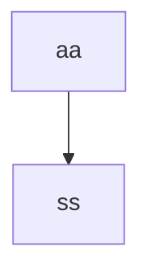

# Architecture
## Description

| **Content** | **Function** | **Note** |
| ---- | ----| ---- |
|  |  |  |

## File structure
- Transnet -> `my workspace`
  - .vscode
  - backend
    - api
      - \_\_init\_\_.py
      - basic_trans.py -> `basic translation` system
    - cpp
    - \_\_init\_\_.py
    - config\.py
    - logger_setup.py
    - utils_test.py
    - utils\.py
  - datebase
    - processed_data
    - raw_data
      - .py -> `isolated converter file`
  - build
  - docs
    - ARCHITECTURE\.md -> `this file`
    - CODE_OF_CONTENTION.md 
  - logs
    - xxx.log -> `running log`
  - static
    - css
      - .css
    - js
      - main.js
      - main_temp.js -> `temporary frontend backend interaction js file`
    - index.html
    - index_temp.html
  - README\.md
  - app.
  - runme\.py

**Details**: 
- file: ...

## Workflow

