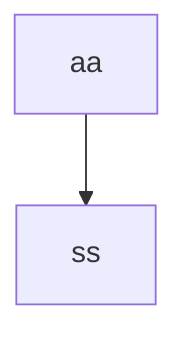

# Architecture
## 1. Description

### Systems:

| **Name** | **Function** | **Note** |
| ---- | ----| ---- |
| Basic Translation System(BTS) | Provide basic translation |  |
| Related Search System(BSeS) | Use agents to provide extend info |  |
| Related Storage System(BStS) | Build an advanced knowladge base |  |

---

### Details:

#### Basic Translation System (BTS):

1. **Basic Translation:** Use **digital dictionary**(CEDict-120k, CCDict-300k) to provide basic translation.
    - Dictoraries will be saved as CSV files.
    - An in-memory data structure (Trie) will serve as the dictionary core.

1. **Replenishment & Source:** Use other open source dictionaries to **replenish** and display the translation source.
    - Use an in-memory data structure or SQLite, depending on dictionary size.
    - **Prior:** Core $\rightarrow$ Source Dict 1 $\rightarrow$ Source Dict 2

1. **Unknown Words:** Use the Gemma2 model(referred to as `G2_trans`)

1. **History Expansion:** Knowledge Augmentation via Personal History Database (PHD).
    - **Description:** We will build a database based on the translation history of all users, focusing on expressions **not covered by existing lexical resources** (e.g., internet slang, contemporary idioms). These will be initially translated by`G2_trans` and stored in SQLite for rapid future retrieval.
    - Use SQLite for a large PHD.
    - ~~Translate input base on user's context~~

1. **Offline Model:** ~~Deploy a local lightweight model(MarianMT) when offline. User should download it first.~~

1. **Phrase/Short Sentence Translation:** Use a **lightweight model** (e.g., a small T5 variant) to translate phrases.
    - **Switch to Model:** Use the model when no results are found in the database, or when the input is a phrase or sentence.

1. **Essay Translation:** Use LLMs
    - **Deploy Local Model:** Use `G2_trans`
    - **Use LLM API:** For academic papers etc. , request Gemini-2.5 / Gemini-3.

1. **File Translation:** ~~Not considering~~
1. **Image Translation:** ~~Not considering~~

---

#### Relation Search System (RSeS):

> This system works only for online word and phrase translations.

1. **Core Knowledge Extraction:** Use `G2_relate` to extract core lexical features (e.g., detailed POS, structure, common collocations) upon user request for details.
    - This is launched only if the user requests more details about the input.

1. **Semantic Relation Discovery:** Use the `Deepseek-v3` API to find related words.
    - **Result:** The LLM output must be parsable for storage.
    - **For noum:** Find hypernyms and hyponyms.
    - **For adjective/adverb:** Find more or less intense synonyms.
    - **For verb:** Find synonyms.
    - etc.

---

#### Relation Storage System (RStS):

> This system works first when a user requests more details and related words.
> If no translation is found in Extension database or Relation database, the system will use RSeS and store its result.

1. **Serach Translation:** Search the result that the user may want, if can't find any suitable result, sent input to RSeS.

1. **Storage Translation:** Store results.
    - **Extension Database:** Store results from RSeS Word Analysis.
    - **Relation Database:** Store results from RSeS Relation Search.

1. **Feedback and Weighting:** Implement a mechanism to receive user feedback (e.g., upvote/downvote).
    - Dynamically adjust the Weight/Strength of the relations (Edges) in the Relation Database, allowing the graph to be self-correcting and adaptive.

## 2. File structure
- Transnet -> `my workspace`
  - .vscode
  - backend
    - api
      - \_\_init\_\_.py
      - basic_trans.py -> `basic translation` system
    - cpp
    - \_\_init\_\_.py
    - config\.py
    - logger_setup.py
    - utils_test.py
    - utils\.py
  - datebase
    - processed_data
    - raw_data
      - .py -> `isolated converter file`
  - build
  - docs
    - ARCHITECTURE\.md -> `this file`
    - CODE_OF_CONTENTION.md 
  - logs
    - xxx.log -> `running log`
  - static
    - css
      - .css
    - js
      - main.js
      - main_temp.js -> `temporary frontend backend interaction js file`
    - index.html
    - index_temp.html
  - README\.md
  - app.
  - runme\.py

**Details**: 
- file: ...

## 3. Workflow

