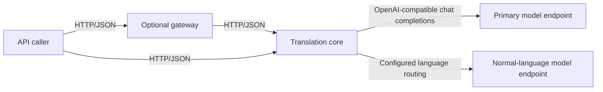

# Architecture

## Contents

- [Overview](#overview)
- [Processes](#processes)
- [Request flow](#request-flow)
- [Boundaries](#boundaries)
- [Current limitations](#current-limitations)

## Overview

Transnet is a Rust Cargo workspace with two HTTP services. The core service owns translation behavior and talks to OpenAI-compatible model endpoints. The gateway is an optional client-facing adapter that forwards translation traffic and exposes provisional platform endpoints.

The repository intentionally contains no browser application or static-file server. API consumers deploy their user interface separately, if they need one.

## Processes

`island-transnet` builds the `transnet` library and its `transnet-core` binary. The library owns request validation, input classification, prompt selection, upstream calls, retry behavior, model-response parsing, and core HTTP handlers. Its configuration is read from `island-transnet/config/`.

`transnet-server` builds the gateway library and binary. It maps the public gateway request into the core wire contract and forwards it over HTTP. Gateway bind and upstream addresses come from environment variables.

Clients may call the core directly when they do not need the gateway contract. The gateway and core use separate request/response types so their public contracts can evolve independently; conversion belongs in the gateway backend adapter.

## Request flow

For `POST /translate`, the core validates non-empty text and language identifiers, resolves `input_type = auto` with deterministic heuristics, validates the requested mode, and builds a prompt for the resolved combination. It selects the configured endpoint and model, sends a chat-completions request, parses the returned JSON, and wraps the result in the standard success envelope.

Provider failures are retried up to `max_retries`. Validation failures return `422`; exhausted provider failures return `503`; configuration and unexpected internal failures return `500`.

## Boundaries

The translation core does not provide authentication, persistence, retrieval-augmented generation, or a WebUI. It treats model output as untrusted input and parses it before returning a structured JSON value.

The gateway's account, history, favorites, profile, about, and statistics routes are compatibility placeholders. They do not implement authentication or database persistence. Their presence must not be interpreted as production-ready user management.

No database is used by the current implementation. The checked-in service configuration is operational configuration, not a schema or durable runtime state.

## Current limitations

- Translation identifiers are process-local counters and reset when the core restarts.
- Permissive CORS is enabled; deployments must place an appropriate policy at the edge or tighten it before exposing the services publicly.
- The core health endpoint reports process liveness and does not probe model providers.
- Translation responses depend on the configured model following the requested JSON schema.

Related: [documentation index](README.md), [service reference](reference/README.md), [configuration](guides/configuration.md), and [development](guides/development.md).
