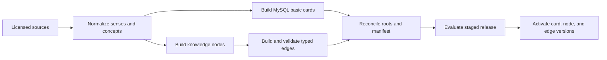

# Publish canonical knowledge content

中文：[发布规范知识内容](../../docs_cn/guides/content-publishing_cn.md)

This guide defines the proposed release workflow for MySQL basic cards and paired Qdrant knowledge-node and knowledge-edge collections. It is intended for content engineers and release operators.

Status: proposed; the current runtime has no ingestion or publication pipeline.

## Preconditions

Every source has an owner, license and display policy, supported languages and domains, evidence granularity, update cadence, and removal procedure. A release pins normalization, alignment, embedding, schema, and evidence-policy versions.

Input must exclude credentials, user data, raw production requests, and unreviewed model output. Generated candidates remain visibly generated and cannot become verified facts without evidence and review.

## Release flow

## Normalize cards and nodes

Normalize Unicode, language and script tags, language-aware canonical and queried forms, parts of speech, senses, translations, transliterations, pronunciation, morphology, domains, dialect, region, period, and evidence scope. Allocate deterministic IDs before embedding.

Create one concise MySQL `BasicCard` per independently selectable lexical sense. It must remain useful without Qdrant and contains canonical and alias forms, concise translations and definitions, pronunciation and morphology summaries, examples, usage notes, domains, evidence metadata, release state, and knowledge-root IDs.

Create Qdrant nodes for independently explainable lexical senses, phrases, terms, concepts, entities, phenomena, mechanisms, processes, equations, quantities, materials, instruments, methods, technologies, applications, standards, organizations, people, places, idioms, metaphors, grammar patterns, collocations, misconceptions, and domains. Aliases, translations, transliterations, romanizations, abbreviations, formulas, and exact technical forms feed the sparse representation; the scoped retrieval description feeds the dense vector.

## Build and validate edges

Build nodes before edges. Each edge names its source and target, relation type and direction, complete relationship explanation, applicable sense and domain, conditions, language, dialect, region, period, evidence state, confidence, provenance, verification state, and release. A versioned relation registry defines inverse, symmetric, transitive, and causal properties; publication does not infer them from labels.

Validation rejects orphan endpoints, cross-release references, invalid direction, duplicate typed edges, missing evidence, incompatible senses, and unsupported language or domain claims. Intensity gradients name their dimension and never masquerade as taxonomy. Embedding neighbors remain exploratory and separate from verified edges.

## Build immutable Qdrant collections

Create one immutable node collection and one immutable edge collection for the release. Both use named dense and sparse vectors and payload indexes required by the [Qdrant contract](../interfaces/qdrant.md). Record dimensions, normalization, embedding models, hashes, schema, counts, and endpoint coverage in the release manifest.

The edge dense vector embeds the complete source–relation–target explanation rather than either endpoint alone. Rebuilding derived exploratory neighbors does not modify verified content.

## Reconcile and evaluate

Reconcile every MySQL knowledge root with the staged node collection and every edge endpoint with the staged node manifest. Compare card, node, and edge counts, identities, hashes, evidence coverage, embedding versions, and release metadata. Any missing, extra, stale, or incompatible record fails the stage.

Run the [quality-assurance guide](quality-assurance.md) against the exact staged trio. Evaluation covers exact and hybrid sense and concept resolution, cross-language terminology, domain assessment, sense separation, relationship precision, page usefulness, unsupported-path rejection, degraded MySQL-only cards, cultural scope, and latency bounds.

## Activate and roll back

Activate the MySQL card release and paired Qdrant node and edge versions as one logical release. Every request pins all three versions. A partial build is never visible, and an alias is never the source of version authority.

Rollback selects one unchanged retained trio. Published canonical records are never silently rewritten.

## Correct, quarantine, and remove

Urgent quarantine first makes affected cards, nodes, and edges ineligible, then removes derived vectors and reconciles the release. Transnet has no dependent private records to migrate or regenerate.

A normal correction creates a new immutable release and preserves evidence lineage. A verified edge can be added, changed, or removed only through an evidence-backed publishing decision. Source removal follows the recorded license procedure and includes derived aliases, vectors, edges, examples, and cached artifacts.

## Related documents

- [System design](../transnet.md)
- [MySQL interface](../interfaces/mysql.md)
- [Qdrant interface](../interfaces/qdrant.md)
- [Quality assurance](quality-assurance.md)
