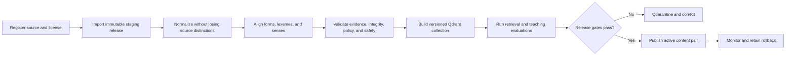

# Publish lexical content

中文：[发布词汇内容](../../docs_cn/guides/content-publishing_cn.md)

Island-port owns this persistence workflow through its MySQL and Qdrant adapters. The current Transnet executable has no database, vector collection, import pipeline, or worker composition.

## Status

This guide defines the proposed ingestion and publication workflow for Transnet learning content. The workflow is not implemented at the branch point.

Use this process for dictionaries, corpora, morphology, pronunciation, audio, frequency, CEFR, etymology, examples, relations, scales, and generated teaching material.

## Preconditions

Before importing a source, record:

- Source owner and stable name.
- Exact version, retrieval date, and content hash.
- License identifier and full terms location.
- Required attribution text and URL.
- Permission to store, transform, display, embed, and redistribute content through the API.
- Restrictions by field, territory, audience, or retention period.
- Removal and correction contact.
- Supported languages, scripts, dialects, domains, and date range.

Do not import content whose permissions are unclear. A source that may be searched internally but not redistributed must carry that restriction on every derived evidence fragment.

## Release flow

## 1. Register the source

Create the canonical `lexical_sources` record and policy manifest before content enters staging. Policy is machine-readable so the lookup pipeline can decide whether a fragment may be displayed, embedded, sent to a model provider, or returned through the public API.

Asset-level metadata is required. A dictionary definition, corpus sentence, IPA transcription, recording, and etymology may have different permissions even when obtained from one provider.

## 2. Create a staging release

Create an immutable `lexicon_releases` candidate with a source-manifest hash. Preserve source-local identifiers so corrections and removals can trace every dependent record.

Imports are idempotent by source, source version, local identifier, and content hash. A retry must update no already-correct row and create no duplicate evidence.

## 3. Normalize language data

- Preserve original Unicode and create explicit NFC, language-aware search keys.
- Store BCP-47 language and dialect tags.
- Preserve accents, punctuation, case, and script when they distinguish words.
- Record tokenizer, segmenter, lemmatizer, transliteration, and morphology versions.
- Map source part-of-speech labels to canonical values without discarding the original label.
- Keep homographs and senses separate.
- Model inflections as forms, derivational family as lexeme relations, and semantic links as sense relations.
- Store source-qualified CEFR and frequency values rather than collapsing them into universal labels.

Romanizations and common misspellings are aliases with scheme, confidence, evidence, and display behavior. They never replace the canonical form silently.

## 4. Align and deduplicate

Use deterministic identifiers and rules before models:

1. Match exact source-local identity from prior releases.
2. Match language, normalized lemma, part of speech, and stable sense key.
3. Compare definitions, glosses, labels, and examples to propose candidate alignment.
4. Use multilingual embeddings only to find additional candidates.
5. Require review for ambiguous merges, splits, cross-language concepts, and strong relation types.

Vector similarity does not establish synonymy, antonymy, hierarchy, translation equivalence, or etymology. It produces reviewable candidates.

## 5. Validate canonical content

Required structural checks:

- Every form belongs to one lexeme.
- Every sense belongs to one lexeme and has permitted definition evidence.
- Every assertion references evidence from the staged release or a declared compatible release.
- Every source policy permits the intended display and model-processing path.
- Symmetric relation endpoints use canonical ordering.
- Directed relations store one authoritative direction and derive the inverse.
- Relation endpoints have compatible entity kinds and valid versions.
- Synonym and antonym edges are not inferred transitively.
- Collocations retain head/dependent roles and construction metadata.
- Scale members have unique positions or explicit ties and a named dimension/context.
- Generated material remains non-authoritative and cannot recursively cite itself.
- Quarantined, retired, or forbidden material cannot enter the default lookup or graph.

Required content checks:

- Definitions match the selected sense.
- Glosses use the configured explanation language accurately.
- Examples demonstrate the intended sense naturally.
- Usage, grammar, dialect, frequency, CEFR, pronunciation, and history claims match their sources.
- Sensitive vocabulary is described neutrally and examples do not demean learners or protected groups.
- Near-synonyms include a useful contrast.
- False friends and common errors identify both the mistaken and correct construction.

## 6. Build the Qdrant collection

Island-port creates a new immutable Qdrant collection version. Use separate records keyed by sense, embedding purpose, content language, embedding model, and collection version.

Recommended records:

- Canonical English sense vector.
- Per-language localized-gloss view.
- Independently citable evidence-fragment vector.
- Relation-candidate vector with proposal and review metadata.

Record content hashes, dimensions, normalization, chunking, model, release, and status in MySQL. Reconcile every expected entity and reject unexpected or stale vectors.

Do not embed private learner queries, context, notes, answers, or comments into shared collections.

## 7. Evaluate the release

Run [quality assurance](quality-assurance.md) against the staged MySQL release and exact collection version. Results are recorded by language, dialect, level, content type, and retrieval path.

The release cannot publish if license, provenance, schema, critical mistranslation, relation correctness, or safety gates fail. A global average cannot hide a weak enabled language.

## 8. Publish

Mark the vector collection ready, then update the singleton MySQL `active_content_version` to the compatible `(lexicon release, collection version, schema version, ranker version)` tuple.

MySQL and Qdrant cannot switch in one transaction. Every request reads the active tuple and queries its exact physical collection, so the service never combines mismatched versions. A Qdrant alias may be updated later as an operational convenience.

Retain the prior compatible pair for rollback. Cache keys include the active tuple, so publication does not require unsafe wildcard deletion.

## 9. Observe and correct

Monitor source freshness, lookup coverage, retrieval quality, evidence failures, vector drift, moderation reports, and language-specific error rates. Corrections create a new staged release; published releases remain immutable.

Urgent safety or license removal can quarantine a record immediately in MySQL and filter it by vector payload status while the cleanup job deletes derived vectors and cache entries.

## Source removal

Source removal is a tested workflow:

1. Mark the source unavailable for new generation and display.
2. Find every dependent evidence fragment, assertion, relation, example, pronunciation, audio asset, card snapshot, generation manifest, cache entry, and vector record.
3. Remove, replace, or quarantine dependent content according to policy.
4. Build and evaluate a replacement release.
5. Publish the compatible database/vector pair.
6. Delete forbidden historical material where the license requires it.

## Sense evolution

A split or merge creates `entity_successors` records. One-to-one high-confidence mappings may migrate saved state. Ambiguous mappings pause affected mastery and ask the learner to choose. Historical exercises and attempts retain their original release and sense.

## Rollback

Rollback changes `active_content_version` to the prior validated pair. The API, prompts, ranker, and scheduler each have independent compatibility and rollback notes.

Do not roll back to a release that contains content removed for license or critical safety reasons. In that case, publish a corrected descendant release instead.

## Related documents

- [System design](../transnet.md)
- [MySQL interface](../interfaces/mysql.md)
- [Qdrant interface](../interfaces/qdrant.md)
- [Island-port interface](../interfaces/port.md)
- [Quality assurance](quality-assurance.md)
- [Overall plan](../todo.md)
