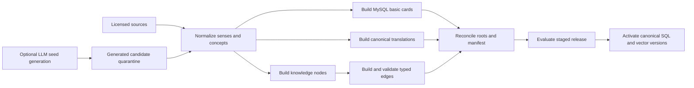

# Publish canonical knowledge content

中文：[发布规范知识内容](../../docs_cn/guides/content-publishing_cn.md)

This guide defines the proposed release workflow for MySQL basic cards and canonical translations plus paired Qdrant knowledge-node and knowledge-edge collections. It is intended for content engineers and release operators.

Status: partially implemented on the Transnet side and not production-complete. The online runtime has no ingestion or mutation pipeline. Transnet has deterministic release-pinned projection preparation, a strict outbound publication client, and offline application orchestration through authoritative status-based resume and reconciliation. It does not generate production embeddings, allocate real collection IDs, write Qdrant, persist island-port build state, or activate a release.

## Preconditions

Every source has an owner, license and display policy, supported languages and domains, evidence granularity, update cadence, and removal procedure. A release pins normalization, alignment, embedding, schema, and evidence-policy versions.

Input must exclude credentials, user data, and raw production requests. Unreviewed model output may enter only the isolated bootstrap candidate stage described below; it cannot enter a release or become a verified fact without evidence, rights checks, validation, and review.

## Release flow

```mermaid
flowchart LR
  source["Licensed sources"] --> normalize["Normalize senses and concepts"]
  seed["Optional LLM seed generation"] --> candidates["Generated candidate quarantine"]
  candidates --> normalize
  normalize --> cards["Build MySQL basic cards"]
  normalize --> translations["Build canonical translations"]
  normalize --> nodes["Build knowledge nodes"]
  nodes --> edges["Build and validate typed edges"]
  cards --> reconcile["Reconcile roots and manifest"]
  translations --> reconcile
  edges --> reconcile
  reconcile --> evaluate["Evaluate staged release"]
  evaluate --> activate["Activate canonical SQL and vector versions"]
```

## Normalize cards and nodes

Normalize Unicode, language and script tags, language-aware canonical and queried forms, parts of speech, senses, translations, transliterations, pronunciation, morphology, domains, dialect, region, period, and evidence scope. Allocate deterministic IDs before embedding.

Create one concise MySQL `BasicCard` per independently selectable lexical sense. It must remain useful without Qdrant and contains canonical and alias forms, concise translations and definitions, pronunciation and morphology summaries, examples, usage notes, domains, evidence metadata, release state, and knowledge-root IDs.

Create a canonical translation revision only for reviewed, reusable shared content. Record its word, phrase, or passage unit; exact source and target language-tagged text; applicable sense, dialect, register, and domain scope; provenance and evidence; publication-rights assertion; selection reason; review decision; normalizer version; and content hash. Never source candidates from request logs, and never ingest private user saves. Basic cards reference the same published translation identities used by exact translation resolution.

The target MySQL schema represents lexemes, senses, basic cards, translations, domains, facts, and semantic scales through shared stable `canonical_entity` identities and immutable `canonical_entity_revision` rows. Frequently filtered keys remain columns; each content family has a closed, versioned JSON payload schema for its bounded fields. The publisher rejects a payload whose declared entity type, references, or schema version do not agree, then pins approved entity and relationship revisions through `release_member`. Do not create a new table merely because a new bounded content field is introduced.

Create domain knowledge profiles and atomic facts before building their vector projections. Each fact has one subject, typed predicate, object or literal value, statement, scope, conditions, evidence, provenance, verification state, and immutable revision. Each profile lists available fact families and honest `seed`, `partial`, or `curated` coverage. Missing families remain explicitly missing.

Create semantic scales independently from taxonomy. A scale names its dimension, direction, conditions, domains, evidence, and ordered sense-qualified members. Positions establish order but not equal distance. Validators reject cycles in taxonomy, inconsistent inverse edges, duplicated scale positions, incompatible member senses, missing evidence, and any conversion between `is_a` and degree relations.

Create Qdrant nodes for independently explainable lexical senses, phrases, terms, concepts, entities, phenomena, mechanisms, processes, equations, quantities, materials, instruments, methods, technologies, applications, standards, organizations, people, places, idioms, metaphors, grammar patterns, collocations, misconceptions, and domains. Aliases, translations, transliterations, romanizations, abbreviations, formulas, and exact technical forms feed the sparse representation; the scoped retrieval description feeds the dense vector.

The implemented preparation builder currently accepts only active authoritative lexemes and senses because those are the node families that can be reconstructed without synthetic publisher identities. It deterministically orders and hashes node points, then admits only Stage 2-validated relationships whose endpoints both exist in that exact node artifact. Missing endpoints, cross-release content, unresolved wire mappings, incompatible embedding specifications, inactive content, and conflicting duplicate nodes fail closed. The resulting summaries carry release, schema, embedding requirements, hashes, counts, node-hash binding, and endpoint coverage, but deliberately carry no physical collection ID or production verification state.

## Bootstrap with generated candidates

An offline bootstrap job may ask an LLM to propose initial domains, translations, atomic facts, taxonomy links, and semantic scales. Every candidate records model and model version, prompt and schema version, generation time, run ID, confidence, and the exact proposed structure. The candidate begins quarantined and is unavailable to runtime retrieval.

Model output is provenance, not evidence. A candidate advances only after domain deduplication against the active inventory, independent source evidence or an explicitly approved editorial-source policy, publication-rights review, deterministic schema and relationship checks, and reviewer approval. The publisher may reject or edit it into a new revision. Live requests, histories, and provider responses never feed this job automatically.

## Build and validate edges

Build nodes before edges. Each edge names its source and target, relation type and direction, applicable sense and domain, conditions, language, dialect, region, period, evidence state, confidence, provenance, verification state, and release. No new relationship-explanation prose is authoritative: the versioned edge input is deterministically assembled from the frozen endpoint lexical inputs, typed wire relation, admitted structured scope, and verified evidence metadata. A versioned relation registry defines inverse, symmetric, transitive, and causal properties; publication does not infer them from labels.

The implemented admission foundation additionally requires an exact frozen Qdrant wire mapping, exact inverse declaration, canonical endpoint kinds and release ownership, verified lifecycle, and a one-to-one resolution of evidence IDs to active source-qualified lineage with storage and embedding permission. Symmetric input is canonicalized for identity only; the publisher does not synthesize an inverse record. Duplicate typed assertions are rejected deterministically regardless of input order or alternate edge IDs. Until canonical domain IDs and condition schemas are frozen, string domain scope and free-text conditions fail closed rather than entering projection payloads.

Validation rejects orphan endpoints, cross-release references, invalid direction, duplicate typed edges, missing evidence, incompatible senses, and unsupported language or domain claims. Intensity gradients name their dimension and never masquerade as taxonomy. Embedding neighbors remain exploratory and separate from verified edges.

## Build immutable Qdrant collections

Create one immutable node collection and one immutable edge collection for the release. Both use named dense and sparse vectors and payload indexes required by the [Qdrant contract](../interfaces/qdrant.md). Record dimensions, normalization, embedding models, hashes, schema, counts, and endpoint coverage in the release manifest.

The publisher completes and verifies the deterministic node projection first. It then freezes the node manifest and builds edges against that exact node hash. Reconciliation compares the canonical roots, canonical schema, typed physical collection IDs, payload schemas, embedding revisions and dimensions, node and edge hashes and counts, and complete endpoint coverage. A partial member, active alias, cross-release reference, unresolved relationship wire mapping, or unverified collection blocks activation.

The edge dense and lexical inputs bind both frozen endpoint input hashes and the complete admitted structured relationship. Island-port resolves those endpoint inputs and applies the exact approved compatibility-registry entry. Rebuilding derived exploratory neighbors does not modify verified content.

The execution baseline uses `Qwen/Qwen3-Embedding-0.6B` at 1,024 dimensions for the `semantic` vector, but publication remains blocked until deployment supplies an exact immutable artifact revision and island-port can attest the revision it actually loaded. Lexical publication uses the non-neural `transnet-lexical-bm25-v1` encoder and the `lexical` sparse vector. It preserves NFC spelling, case, and attached technical `+`/`#` symbols, assigns collision-free release-local term indices from sorted UTF-8 terms, computes document-side BM25 term-frequency saturation only after the complete collection is frozen, and delegates collection-derived IDF to Qdrant's `idf` modifier. IDF never changes a canonical input hash. The exact tokenizer, dictionary, numeric, and execution bounds are normative in the [Qdrant contract](../interfaces/qdrant.md#lexical-encoder-contract).

The checked-in publication foundation validates the node-first lifecycle, stable build and batch identities, conflicting retries, execution receipts, dictionary proofs, and the input/projection/persisted/manifest hash hierarchy. Its outbound publication port and strict island-port client carry begin, bounded node and edge batches, freeze receipts, reconciliation, status, and abort through the shared UDS transport. `KnowledgePublicationService` drives that contract from immutable projection artifacts, always resumes from island-port's authoritative status, retains no local publication progress, and returns only a typed activation candidate after successful reconciliation. A failed or abandoned build cannot become a candidate, and reconciliation never activates a release. Production remains blocked on a deployed immutable Qwen revision and attestation, real dense and lexical execution, island-port build/status and reconciliation persistence, Qdrant node/edge collection creation and mutation, production collection verification and persisted hashes, real MySQL/Qdrant reconciliation, and release-trio end-to-end acceptance.

## Reconcile and evaluate

Reconcile every MySQL knowledge root with the staged node collection and every edge endpoint with the staged node manifest. Compare card, canonical-translation, domain-profile, fact, scale, node, and edge counts, identities, hashes, evidence coverage, embedding versions, and release metadata. Any missing, extra, stale, or incompatible record fails the stage.

Run the [quality-assurance guide](quality-assurance.md) against the exact staged trio. Evaluation covers exact and hybrid sense and concept resolution, cross-language terminology, domain assessment, sense separation, relationship precision, page usefulness, unsupported-path rejection, degraded MySQL-only cards, cultural scope, and latency bounds.

## Activate and roll back

Activate the MySQL card and canonical-translation release plus paired Qdrant node and edge versions as one logical release. Every request pins the same release identity across both stores. A partial build is never visible, and an alias is never the source of version authority.

Transnet's online request path has read-only authority. Transnet publication orchestration stops at `PublicationActivationCandidate`. An external authenticated publisher/control-plane submits that candidate to island-port, which owns MySQL/Qdrant credentials, collection mutation, reconciliation persistence, and the atomic active pointer. Activation selects only a completely reconciled immutable trio.

Rollback re-activates one previously verified and retained immutable trio through the same island-port authority. It does not rewrite the old canonical release or rebuild its immutable Qdrant collections. The target must remain verified, retained, and addressable; build GC must never delete an active or retained rollback target. Production retention and rollback behavior still require external validation.

## Correct, quarantine, and remove

Urgent quarantine first makes affected cards, nodes, and edges ineligible, then removes derived vectors and reconciles the release. Transnet has no dependent private records to migrate or regenerate.

A normal correction creates a new immutable release and preserves evidence lineage. A verified edge can be added, changed, or removed only through an evidence-backed publishing decision. Source removal follows the recorded license procedure and includes derived aliases, vectors, edges, examples, and cached artifacts.

## Related documents

- [System design](../transnet.md)
- [MySQL interface](../interfaces/mysql.md)
- [Qdrant interface](../interfaces/qdrant.md)
- [Quality assurance](quality-assurance.md)
