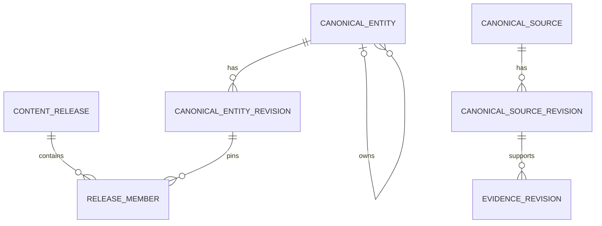

# Canonical-data endpoint interface

中文：[规范数据 endpoint 接口](../../docs_cn/interfaces/canonical-data_cn.md)

This contract defines island-port's storage-neutral HTTP endpoints for shared canonical translations, words, phrases, senses, domains, evidence metadata, and immutable content releases. Every operation is JSON over UDS. Endpoint request examples show the `input` object placed inside the common request envelope; response examples are complete bodies. MySQL is the planned island-port implementation, not part of this wire contract.

Status: target island-port server contract with implemented Transnet read client. The executable can optionally compose the strict outbound `canonical-data-v1` client and active-release readiness probe; `POST /api/v1/basic-cards/lookup` and release-pinned `POST /api/v1/senses/get` consume that dependency. The implemented client covers active-release, translation-candidate, basic-card-candidate, sense-detail, bounded domain-inventory, exact fact-revision, complete semantic-scale, and authoritative knowledge-node reads with the common envelope and strict response-echo validation described here. The domain-assessment and knowledge-view application foundations are not yet exposed as online routes. The external island-port server has not been verified against this contract, and production MySQL migrations, publisher/write operations, old-release retention, and real end-to-end acceptance remain unimplemented outside this repository.

The checked-in M3 publication foundation models Qdrant build lifecycle, idempotency, compatibility receipts, and reconciliation hashes. Its outbound publication port and strict island-port client carry the bounded build contract, while `KnowledgePublicationService` drives authoritative status-based resume through node and edge publication and reconciliation without keeping local progress. Successful reconciliation returns only a typed activation candidate. The offline-only `OfflinePublicationService` and strict `release-control-v1` client explicitly submit that candidate or select a retained rollback target through island-port; they are absent from online `AppState` and never mutate the active pointer themselves. The repository does not add an island-port publication server, MySQL build/reconciliation persistence, active-pointer transaction, or rollback implementation; those authority-owned operations remain external requirements.

## Contents

- [Canonical-data endpoint interface](#canonical-data-endpoint-interface)
  - [Contents](#contents)
  - [Endpoint reference](#endpoint-reference)
  - [Storage boundary](#storage-boundary)
  - [Curated translation storage](#curated-translation-storage)
  - [Domain assertions and semantic scales](#domain-assertions-and-semantic-scales)
  - [Common operation envelope](#common-operation-envelope)
  - [POST /api/v1/translations/resolve](#post-apiv1translationsresolve)
  - [POST /api/v1/translations/stage](#post-apiv1translationsstage)
  - [POST /api/v1/basic-cards/resolve](#post-apiv1basic-cardsresolve)
  - [POST /api/v1/senses/get](#post-apiv1sensesget)
  - [POST /api/v1/domains/resolve](#post-apiv1domainsresolve)
  - [POST /api/v1/assertions/get](#post-apiv1assertionsget)
  - [POST /api/v1/semantic-scales/get](#post-apiv1semantic-scalesget)
  - [POST /api/v1/knowledge-nodes/get](#post-apiv1knowledge-nodesget)
  - [Domain proposal handling](#domain-proposal-handling)
  - [POST /api/v1/cards/revisions/stage](#post-apiv1cardsrevisionsstage)
  - [POST /api/v1/releases/activation-candidates/submit](#post-apiv1releasesactivation-candidatessubmit)
  - [POST /api/v1/releases/rollback/select](#post-apiv1releasesrollbackselect)
  - [Related documents](#related-documents)

## Endpoint reference

Island-port listens on `/run/island-port/island-port.sock` by default and follows the [shared UDS JSON transport](transnet.md). Callers never connect to MySQL or submit SQL; island-port owns queries, transactions, schema compatibility, credentials, and connection pooling. Only the Transnet runtime and authenticated publication tooling may access the socket. Runtime callers receive read access; mutation endpoints additionally require the publisher service account. Authorization comes from socket filesystem credentials, not JSON fields or forwarded headers.

Every route uses the shared `/api/v1` prefix. The island-port socket and the resource path identify this structured-data API; callers do not add `data`, `sql`, or a storage-vendor name to the path.

## Storage boundary

The canonical-data authority behind this endpoint is the authoritative store for compact, structured lexical content, deliberately selected canonical translations, and publication state. The target island-port implementation uses the separately documented `transnet_canonical` MySQL schema. The authority contains no user, learner, account, profile, preference, history, saved item, bookmark, practice, answer, mastery, schedule, graph layout, feedback, privacy request, or ownership record. It never retains live translation requests, lookup queries, disambiguating context, or unreviewed provider output. Canonical source and target text may be stored only through the publication workflow described below. Island-port may use a separately authorized product store for private state, but that store is outside this endpoint and inaccessible to Transnet.

Allowed Transnet service data includes:

- immutable knowledge releases and compatibility manifests;
- canonical words and phrases, language-tagged forms, aliases, and senses;
- reviewed source-target translations for words, established phrases, or reusable passages whose provenance and publication rights are known;
- concise definitions, translations, pronunciations, morphology, examples, and usage notes;
- canonical domains and their scope definitions;
- stable references to Qdrant knowledge roots and evidence records;
- publication jobs, validation results, idempotency records, and a Qdrant projection outbox, provided none contains request text or user data.

Use `utf8mb4`, UTC timestamps with microsecond precision, opaque stable public IDs, explicit foreign keys where both sides have one concrete type, and immutable published revisions. Credentials and encryption keys remain outside MySQL.

The target schema deliberately uses a hybrid relational model. Stable identity, lifecycle, release membership, relationship endpoints, assessment eligibility, and frequent lookup keys are typed and indexed columns. Bounded fields that vary by content family use closed, versioned JSON payload schemas. This avoids a table per card child or domain attribute without turning core joins and filters into JSON scans. `entity_type_revision` makes new content families data-driven rather than requiring an `ALTER TABLE`; publication validates the pinned type definition, payload schema, references, and polymorphic `release_member` target before a release can become active.

## Curated translation storage

The canonical translation model stores a small reviewed catalog, not traffic history or a cache. A `canonical_entity` row with `entity_type = 'translation'` gives one source-target choice a stable identity. Its immutable `canonical_entity_revision` promotes the normalized lookup key, language, optional sense identity, publication state, and content hash to columns. The versioned payload contains the word, phrase, or passage unit; source and target language-tagged text; normalizer version and source fingerprint; optional dialect, register, and domain scope; evidence and provenance references; publication-rights assertion; selection reason; and reviewer decision. One `release_member` row pins exactly one approved revision to a release. Basic-card payloads reference these translation entities instead of maintaining a second independently published translation value.



Source citation, rights, and lifecycle data are immutable `canonical_source_revision` rows. Evidence pins one exact source revision, and a release pins both exact source and evidence revisions. Updating attribution or withdrawing rights therefore creates a new source revision and release; it cannot silently change the provenance seen by an older retained release.

Canonical public IDs follow `canonical-id-v1`: a family prefix identifies the entity kind and the remaining opaque value is publisher-assigned, never derived from normalized text or a content hash. A published translation revision is uniquely selected within a release by source language, `translation-source-v1` fingerprint, target language, and its explicit sense or scope key. The stable translation ID survives corrections, while each correction creates a new positive immutable revision and later release membership rather than modifying published content. The stored source text is retained so Transnet can compare an exact candidate after retrieval; a fingerprint match alone is never sufficient. Lexical scope preserves sense, part of speech, phrase-level versus compositional meaning, and bounded canonical domains so homographs and field-specific meanings do not collide. Passage entries have a configured length bound and must be reusable reference content rather than personal correspondence or arbitrary submitted text.

Importance is an editorial decision with an auditable reason such as approved terminology, an established idiom, reusable product copy, or a reviewed reference passage. Frequency cannot be inferred by logging request text. Publisher authentication, provenance, rights review, and human approval are required before release activation. A runtime translation route has no write capability and no `save` or `important` field.

User saves are a separate concern. When an end user stars or saves a translation, island-port stores that private record in its product-owned database and may retain the rendered result under its own consent and retention policy. It must not send the user ID, save state, or private source text to these canonical publication endpoints.

## Domain assertions and semantic scales

Canonical data also owns domain knowledge profiles, atomic assertions, and semantic scales. A domain revision stores multilingual labels and aliases, definition, inclusion and exclusion scope, broader domain IDs, and a knowledge profile containing available fact families, languages, verified fact count, and coverage state (`seed`, `partial`, or `curated`). Coverage describes the active release and never asserts completeness.

A canonical assertion uses the publisher-owned assertion entity and immutable revision for its relation type, registry revision, reviewed statement, applicability, evidence lineage, provenance, and verification state. `canonical_assertion_participant` is authoritative for its ordered schema-defined entity or typed-literal roles, allowing binary and n-ary assertions without duplicating subject/object values inside one JSON blob. Assertions remain independently reviewable and release-addressable; a flattened subject/predicate/object fact is not a second authority.

`relation_type_revision` is the versioned relation registry. It defines directionality, inverse behavior, symmetric and transitive policy, causality, allowed participant roles, endpoint-type compatibility, and validation schema. A release pins the exact registry revision; neither the UI nor the model infers these properties from a label.

A `canonical_relationship_revision` is a validated binary traversal projection of one exact assertion revision. It maps one stable public edge ID and positive relation version to source and target endpoints, the pinned relation-registry version, direction, restrictions, and assessment eligibility. Endpoint and relation fields remain indexed columns; explanations and bounded scope/support lists use the versioned payload. This projection supports efficient knowledge views without becoming a second source of truth. Relationship judgments and aggregates remain in the separately authorized island-port product schema defined by the [target MySQL implementation](tables/mysql.sql); Transnet cannot access the private rows.

Every domain reference is a canonical `DomainId` resolved in the same release; a label or free-form field name is never identity. Relationship and scale conditions use registry-owned objects containing `condition_id`, `condition_type`, and sorted `parameter_ids`, all resolved in that release. Display prose may be hydrated from those records, but free-text conditions cannot enter canonical scope or projection identity.

A semantic scale uses `canonical_entity` with `entity_type = 'semantic_scale'`. Its immutable revision payload stores the named dimension, increasing or decreasing direction, applicable domains and conditions, ordered sense-qualified node members, and evidence references. Member positions define order only. Publication rejects duplicate positions, missing members, mixed incompatible senses, absent evidence, and any attempt to encode a scale as `is_a` taxonomy. Basic cards, facts, profiles, and scales all join a release through `release_member`.

## Common operation envelope

Every adapter operation carries a request ID, deadline, expected schema version, and optionally an immutable content release. Publication mutations also require an idempotency key. Reads return `ok`, `not_found`, `version_mismatch`, `content_release_unavailable`, `unavailable`, or `timeout`; mutations may additionally return `conflict` or `invalid`. `version_mismatch` requires structured code `schema_incompatible`; `content_release_unavailable` requires the same-named code and applies only to an explicitly pinned release that cannot be served. Neither is inferred from message text.

Errors never expose SQL, credentials, request text, provider bodies, or internal connection details.

The exact request body is `{"context": RequestContext, "input": EndpointInput}`. Request context:

```json
{
  "request_id": "req_01K4Z8P8Y7D3N5Q2F6M1J9T0VX",
  "deadline_at": "2026-09-12T10:30:05.000000Z",
  "schema_version": "canonical-data-v1",
  "content_release": "knowledge-2026-09"
}
```

Closed error response:

```json
{
  "request_id": "req_01K4Z8P8Y7D3N5Q2F6M1J9T0VX",
  "schema_version": "canonical-data-v1",
  "content_release": "knowledge-2026-09",
  "outcome": "content_release_unavailable",
  "error": {
    "code": "content_release_unavailable",
    "message": "The requested content release is not available.",
    "retryable": false
  }
}
```

The Stage 3 Transnet client requires every response to echo `request_id` and `schema_version` at
the top level. Every successful pinned read also returns `content_release`. The client rejects
unknown fields, duplicate indexed-lineage keys, oversized bodies, an absent echo, a different
schema or release, and any response that cannot be reconstructed through the current Rust domain
constructors. Existing island-port deployments that implement the older examples below must be
updated before this adapter can be used end to end; Transnet does not infer omitted authoritative
fields or fall back to an older schema.

## POST /api/v1/releases/active

Stage 4 selects the active immutable canonical release once at the start of an application request. This operation is an authoritative island-port read, not a vector or ranking-policy selection. Its context omits `content_release` because the operation selects that value. `schema_version` is the transport contract version; `canonical_schema_version` is the selected release's content schema. Both successful fields are required and bounded. The request carries no source text.

```json
{
  "context": {
    "request_id": "req_example",
    "deadline_at": "2099-01-01T00:00:00Z",
    "schema_version": "canonical-data-v1"
  },
  "input": {}
}
```

```json
{
  "request_id": "req_example",
  "schema_version": "canonical-data-v1",
  "outcome": "ok",
  "value": {
    "content_release": "release_example",
    "canonical_schema_version": "canonical_example"
  }
}
```

The closed outcomes are `ok`, `not_found` (no safely servable active release), `version_mismatch`, `unavailable`, and `timeout`. Errors use the existing redacted `error` object, require the request and schema echoes, and must not carry a success value. Unknown, missing, contradictory, or oversized response data fails closed. The `value` has no `vector_collection_id` or `ranking_version`: vector composition is later work, and deterministic ranking policy belongs to Transnet. The release and canonical schema must come from one atomic active-pointer read. Every later canonical read within the request sends the returned `content_release`, and island-port must serve that immutable release even if a newer one becomes active; it must never silently upgrade a pinned read. If the pinned release can no longer be served safely, the entire request fails closed.

The island-port server is not in this repository and still needs to implement this operation, atomic selection, old-release retention for bounded in-flight requests, and the closed error outcomes. Transnet's outbound client and fake-UDS tests alone are not a real MySQL end-to-end deployment.

For the bounded translation and basic-card candidate-list reads below, an eligible zero-hit search is `ok` with an empty `matches` list. A downstream `not_found` is not silently converted into an empty result by the Stage 4 composition: it remains a closed error, so an unavailable pinned release cannot masquerade as a search miss.

## POST /api/v1/translations/resolve

Resolves an exact reviewed translation from one immutable release. Transnet computes the versioned fingerprint in memory and sends no live source text or disambiguating sentence to the adapter. The adapter returns all eligible same-fingerprint candidates within the limit; Transnet compares the stored source under the named normalizer and applies sense and scope constraints before using one. This read is safe to retry.

Request `input`:

```json
{
  "source_fingerprint": "sha256:8bb7a7d7b6d9...",
  "normalizer_version": "translation-source-v1",
  "source_language": "en",
  "target_language": "zh-CN",
  "sense_id": "sense_sweltering_hot_01",
  "domain_ids": ["domain_weather"],
  "dialect": "en-US",
  "register": "neutral",
  "limit": 5
}
```

Response. Lexical matches require `scope`; reusable passage matches require `scope: null`:

```json
{
  "request_id": "req_01K4Z8P8Y7D3N5Q2F6M1J9T0VX",
  "schema_version": "canonical-data-v1",
  "outcome": "ok",
  "value": {
    "matches": [
      {
        "translation_id": "tr_sweltering_zh_cn_01",
        "revision": 3,
        "unit": "word",
        "source_fingerprint": "sha256:8bb7a7d7b6d9...",
        "source": {"text": "sweltering", "language": "en"},
        "target": {"text": "酷热的", "language": "zh-CN"},
        "scope": {
          "lexeme_id": "lexeme_sweltering_en_adj_01",
          "sense_id": "sense_sweltering_hot_01",
          "part_of_speech": "adjective",
          "composition": "compositional",
          "domain_ids": ["domain_weather"]
        },
        "evidence_ids": ["evidence_dictionary_1042"]
      }
    ]
  },
  "content_release": "knowledge-2026-09"
}
```

## POST /api/v1/translations/stage

Stages one candidate revision for review and later release activation. Only authenticated publication tooling may call this idempotent mutation. Staging does not make content readable by runtime traffic. The publisher must supply canonical, non-personal text and attest that provenance and publication rights have been reviewed.

Request `input`:

```json
{
  "translation_id": "tr_up_in_the_air_zh_cn_01",
  "unit": "phrase",
  "source": {"text": "up in the air", "language": "en"},
  "target": {"text": "悬而未决", "language": "zh-CN"},
  "sense_id": "sense_up_in_the_air_undecided_01",
  "domain_ids": ["domain_general"],
  "dialect": "en-US",
  "register": "neutral",
  "normalizer_version": "translation-source-v1",
  "selection_reason": "established_idiom",
  "evidence_ids": ["evidence_dictionary_2117"],
  "provenance": ["source_dictionary_2026_01"],
  "rights_assertion": "approved_for_canonical_publication",
  "idempotency_key": "stage-translation-up-in-the-air-zh-cn-r1",
  "review": {
    "state": "approved",
    "policy_version": "canonical-translation-review-v1"
  }
}
```

Response:

```json
{
  "outcome": "ok",
  "value": {
    "translation_id": "tr_up_in_the_air_zh_cn_01",
    "revision": 1,
    "publication_state": "staged",
    "content_hash": "sha256:4ef760d1..."
  }
}
```

A repeated idempotency key with the same request fingerprint returns the original result; reuse with different content returns `conflict`. Activation uses the existing release staging and activation operations, which validate that every translation revision is approved, internally consistent, and evidence-backed.

## POST /api/v1/basic-cards/resolve

Normalization belongs to the Transnet runtime. The adapter receives a bounded, ordered set of derived forms; it never receives the raw query, intermediate transformations, or context. Exact canonical and alias forms precede inflection, spelling-correction, and relaxed aliases. Significant symbols remain distinct, so `C`, `C++`, and `C#` cannot collapse into one identity.

This operation returns release-pinned identity and core candidate data, not a finished presentation card. Transnet performs deterministic ranking, deduplication, ambiguity resolution, and coverage calculation. After selecting a sense it calls `senses/get` for typed details and forms the final `CanonicalLookupCard` in the application layer. Rank, fusion score, coverage, and final resolution are never island-port authority. Qdrant and knowledge-root data remain outside Milestone 2.

Request `input`:

```json
{
  "lookup_forms": [
    {
      "form": "sweltering",
      "match_class": "exact_canonical",
      "rank": 0
    }
  ],
  "normalizer_version": "unicode-nfc-lookup-v1",
  "source_language": "en",
  "explanation_language": "zh-CN",
  "dialect": "en-US",
  "evidence_use": "api_redistribution",
  "limit": 5
}
```

Response:

```json
{
  "request_id": "req_01K4Z8P8Y7D3N5Q2F6M1J9T0VX",
  "schema_version": "canonical-data-v1",
  "outcome": "ok",
  "value": {
    "matches": [
      {
        "matched_form": "sweltering",
        "match_class": "exact_canonical",
        "matched_form_id": "form_sweltering_lemma_01",
        "lexical_score_basis_points": 10000,
        "candidate": {
          "lexeme": {"id": "lexeme_sweltering_en_adj_01", "language": "en", "lemma": "sweltering", "lemma_evidence_ids": ["evidence_dictionary_lemma_1041"], "normalized_lemma": "sweltering", "part_of_speech": "adjective", "status": "active"},
          "sense": {"id": "sense_sweltering_hot_01", "lexeme_id": "lexeme_sweltering_en_adj_01", "sense_key": "weather-hot", "definition": "uncomfortably hot", "definition_evidence_ids": ["evidence_dictionary_1042"], "status": "active"},
          "forms": [{"id": "form_sweltering_lemma_01", "lexeme_id": "lexeme_sweltering_en_adj_01", "form": "sweltering", "normalized_form": "sweltering", "kind": "lemma", "morphology": null, "evidence_ids": ["evidence_dictionary_1042"], "status": "active"}],
          "sources": [{"release_id": "knowledge-2026-09", "source": {"id": "source_dictionary_2026_01", "name": "Reviewed dictionary", "version": "2026-09", "license": "reviewed", "attribution": "Dictionary publisher (2026)", "permissions": {"storage": true, "display": true, "embedding": true, "model_processing": true, "api_redistribution": true}}}],
          "evidence": [{"id": "evidence_dictionary_lemma_1041", "source_id": "source_dictionary_2026_01", "source_reference": "entry:sweltering:lemma", "language": "en", "kind": "other", "confidence": "high", "text": "sweltering", "content_hash": "sha256:lemma...", "permissions": {"storage": true, "display": true, "embedding": true, "model_processing": true, "api_redistribution": true}, "status": "active"}, {"id": "evidence_dictionary_1042", "source_id": "source_dictionary_2026_01", "source_reference": "entry:sweltering:adj:1", "language": "en", "kind": "definition", "confidence": "high", "text": "uncomfortably hot", "content_hash": "sha256:4ef760d1...", "permissions": {"storage": true, "display": true, "embedding": true, "model_processing": true, "api_redistribution": true}, "status": "active"}]
        }
      }
    ],
    "alternatives": [],
    "truncated": false
  },
  "content_release": "knowledge-2026-09"
}
```

Uniqueness is enforced by stable form, card, and sense IDs plus published canonical-form and alias rows, never by an ad hoc normalized lookup string. All eligible collisions at the best applicable rank are returned for resolution by the service.

`matched_form_id` and `matched_form` are proof inputs, not display hints. Transnet requires the ID to resolve to an active form owned by the returned lexeme and requires the surface value to equal that stored form. The claimed class must also agree with the authoritative form role: `exact_canonical` requires a lemma, `exact_alias` requires a published spelling variant, alias, or phrase, and `inflection` requires an inflection. Spelling-correction and transliteration results still name the authoritative stored target form. Any mismatch fails the whole authority response instead of being downgraded to a semantic nomination.

Each candidate must carry the authoritative, release-bound source record for every evidence fragment. `source.id` must equal `evidence.source_id`; source and evidence permissions must both authorize the requested use, and evidence permissions cannot exceed source permissions. For public redistribution, `source.attribution` is a nonempty, reviewed human-readable attribution (at most 256 Unicode characters), not a label synthesized from source ID or name. Missing, duplicate, conflicting, unlicensed, or cross-release source/evidence records fail closed. The adapter resolves these strict private DTOs into the existing candidate/source/evidence domain types; island-port must add this source chain before production delivery. Content hash and permission bits remain internal.

`lexeme.lemma_evidence_ids` is a required, sorted, unique list of one to eight evidence IDs supporting the canonical lemma assertion itself. It is not borrowed from sense-definition evidence, does not imply `FormKind::Lemma`, and never participates in lexeme identity. Every ID must resolve through the response evidence/source chain (or the indexed `lineages` map for `senses/get`) to the same release and requested permission; dangling, duplicate, conflicting, or unused lineage fails closed.

The Stage 4 canonical-only caller names its actual baseline NFC/lowercased lookup behavior `unicode-nfc-lookup-v1`; the previous illustrative `unicode-nfkc-v2` value did not describe that implementation. This version is request-local normalization metadata, not canonical authority data or identity.

## POST /api/v1/senses/get

Returns independently constructible typed detail data for one canonical sense. `target` contains the complete authoritative lexeme and sense. `lineages` is an object indexed by evidence ID; assertions refer to those IDs. Island-port rejects duplicate or conflicting IDs, and Transnet rejects dangling references, unused lineages, release or target mismatches, permission escalation, invalid lifecycle state, and incompatible evidence kinds before constructing `CanonicalSenseDetails`.

Request:

```json
{
  "sense_id": "sense_sweltering_hot_01",
  "explanation_language": "zh-CN",
  "dialect": "en-US",
    "evidence_use": "api_redistribution"
}
```

Response:

```json
{
  "request_id": "req_01K4Z8P8Y7D3N5Q2F6M1J9T0VX",
  "schema_version": "canonical-data-v1",
  "outcome": "ok",
  "content_release": "knowledge-2026-09",
  "value": {
    "canonical_schema_version": "canonical-v1",
    "target": {
      "lexeme": {"id": "lexeme_sweltering_en_adj_01", "language": "en", "lemma": "sweltering", "lemma_evidence_ids": ["evidence_dictionary_lemma_1041"], "normalized_lemma": "sweltering", "part_of_speech": "adjective", "status": "active"},
      "sense": {"id": "sense_sweltering_hot_01", "lexeme_id": "lexeme_sweltering_en_adj_01", "sense_key": "weather-hot", "definition": "uncomfortably hot", "definition_evidence_ids": [], "status": "active"}
    },
    "lineages": {"evidence_dictionary_lemma_1041": {"source": {"id": "source_dictionary_2026_01", "name": "Reviewed dictionary", "version": "2026-09", "license": "reviewed", "attribution": "Dictionary publisher (2026)", "permissions": {"storage": true, "display": true, "embedding": true, "model_processing": true, "api_redistribution": true}}, "fragment": {"id": "evidence_dictionary_lemma_1041", "source_id": "source_dictionary_2026_01", "source_reference": "entry:sweltering:lemma", "language": "en", "kind": "other", "confidence": "high", "text": "sweltering", "content_hash": "sha256:lemma...", "permissions": {"storage": true, "display": true, "embedding": true, "model_processing": true, "api_redistribution": true}, "status": "active"}, "origin": {"kind": "licensed_source"}}},
    "localized_glosses": [],
    "pronunciations": [],
    "usage_labels": [],
    "grammar_patterns": [],
    "collocations": [],
    "examples": [],
    "pitfalls": [],
    "etymologies": [],
    "history": []
  }
}
```

The required `canonical_schema_version` in a successful sense value must match the caller-supplied immutable `CanonicalReleasePin`; a different schema fails closed. A pinned R1 read remains on R1 after active selection changes to R2. Island-port must retain readable old releases for the supported in-flight/follow-up window. If the explicitly requested R1 is unavailable, return `content_release_unavailable` with code `content_release_unavailable`; adapter/schema incompatibility instead returns `version_mismatch` with code `schema_incompatible`. Never silently select R2 or use an error message to classify these outcomes.

## POST /api/v1/domains/resolve

Domains are canonical versioned records, not free-form tags. Resolution first checks published labels and aliases. If more than one scope matches, the adapter returns candidates and the publishing workflow must disambiguate.

Request:

```json
{
  "context": {
    "request_id": "req_01K4Z8P8Y7D3N5Q2F6M1J9T0VX",
    "deadline_at": "2026-09-18T12:00:02Z",
    "schema_version": "canonical-data-v1",
    "content_release": "knowledge-2026-09"
  },
  "input": {
    "normalized_labels": ["meteorology", "weather"],
    "scope_key": "earth-atmosphere-weather",
    "languages": ["en", "zh-CN"],
    "limit": 5
  }
}
```

Response:

```json
{
  "request_id": "req_01K4Z8P8Y7D3N5Q2F6M1J9T0VX",
  "schema_version": "canonical-data-v1",
  "outcome": "ok",
  "content_release": "knowledge-2026-09",
  "value": {
    "catalog_complete": true,
    "candidates": [
      {
        "domain_id": "domain_weather",
        "revision": 4,
        "labels": [{"language": "en", "text": "weather"}, {"language": "zh-CN", "text": "天气"}],
        "aliases": [{"language": "en", "text": "meteorological weather"}],
        "definitions": [{"language": "en", "text": "Conditions of the atmosphere at a place and time."}, {"language": "zh-CN", "text": "某一地点和时间的大气状态。"}],
        "inclusion_scope": ["humidity", "precipitation", "temperature", "wind"],
        "exclusion_scope": ["long-term climate classification"],
        "broader_domain_ids": ["domain_earth_science"],
        "knowledge_profile": {
          "available_fact_families": ["definition", "measurement", "taxonomy", "terminology"],
          "languages": ["en", "zh-CN"],
          "verified_fact_count": 184,
          "coverage_state": "partial"
        }
      }
    ]
  }
}
```

The request and response are bounded to 32 candidates, 8 labels, 16 aliases, 8 definitions, 16 inclusion items, 16 exclusion items, 8 broader domains, 16 fact families, and 8 profile languages per record. Candidates are strictly sorted and unique by `domain_id`; labels, aliases, and definitions are strictly sorted and unique by canonical language tag and then exact text. Inclusion scope, exclusion scope, broader-domain IDs, fact families, and profile languages are also sorted and unique. Every candidate belongs to the echoed immutable release, and `domain_id` plus `broader_domain_ids` use canonical `DomainId` values rather than labels.

`catalog_complete` means island-port examined the complete eligible published catalog for this bounded query; it does not claim that human knowledge is complete. Transnet validates all selected IDs against exactly this returned allowlist. An unavailable, malformed, cross-release, or otherwise failed inventory produces the application outcome `uncertain`. A request-local `proposed_new` outcome is permitted only when `catalog_complete` is true, its optional broader IDs come from this allowlist, and its canonical language-plus-label pair does not exactly collide with any supplied label or alias. Neither operation writes a domain.

## POST /api/v1/assertions/get

Hydrates an ordered, bounded set of exact canonical assertion revisions after vector retrieval. Qdrant supplies only a relationship projection proof: edge and relationship revisions, assertion and registry revisions, the selected traversal, endpoints, and typed relation. Island-port returns the authoritative assertion, full evidence lineage, and the exact resolved registry entry. Transnet validates all three together; no flattened fact record is a competing authority. The frozen sub-contract is `canonical-assertions-v1` inside the `canonical-data-v1` envelope.

Request `input`:

```json
{
  "projections": [{"edge_id":"edge_heat_01","relationship_revision":3,"assertion_id":"assertion_heat_01","assertion_revision":2,"traversal_id":"traversal_degree","source_node_id":"node_scorching_heat_01","target_node_id":"node_sweltering_hot_01","relation_type":"higher_degree_than","relation_registry_revision":1}],
  "assertion_contract_version": "canonical-assertions-v1",
  "content_release": "knowledge-2026-09",
  "canonical_schema_version": "canonical-v1",
  "evidence_use": "display",
  "limit": 20
}
```

Response:

```json
{
  "request_id": "01K6G7R1S8Z3Q4P5T6V7W8X9Y0",
  "schema_version": "canonical-data-v1",
  "canonical_schema_version": "canonical-v1",
  "outcome": "ok",
  "value": {"assertion_contract_version":"canonical-assertions-v1","assertions":[]},
  "content_release": "knowledge-2026-09"
}
```

The returned order is a subsequence of the request after omitted references are removed. Each non-omitted item contains `projection`, `assertion`, and `registry`. The assertion carries ordered role participants, structured domains and conditions, applicable senses, evidence IDs plus complete lineage, provenance IDs, and verification state. The registry carries role cardinalities/value rules, same-release resolved domain/condition records, and explicit binary traversals. Transnet rejects substituted revisions, unknown roles or traversals, endpoint/relation disagreement, unsupported or cross-release scope, and evidence that does not permit the requested use. Requests and responses are limited to 50 projections. Island-port server/schema implementation and rebuilding the Qdrant edge payload remain external work.

## POST /api/v1/semantic-scales/get

Returns complete authoritative semantic scales by stable ID. The caller normally obtains candidate scale IDs from Qdrant and supplies the selected sense or node so island-port can apply scope and condition eligibility. A scale is returned whole or omitted; callers must not reconstruct a ladder from unrelated pairwise edges.

Request `input`:

```json
{
  "scale_ids": ["scale_environmental_heat_intensity_01"],
  "for_node_id": "node_sweltering_hot_01",
  "content_release": "knowledge-2026-09",
  "canonical_schema_version": "canonical-v1",
  "verification_states": ["verified"],
  "limit": 5
}
```

Response:

```json
{
  "request_id": "01K6G7R1S8Z3Q4P5T6V7W8X9Y0",
  "schema_version": "canonical-data-v1",
  "canonical_schema_version": "canonical-v1",
  "outcome": "ok",
  "value": {
    "scales": [
      {
        "scale_id": "scale_environmental_heat_intensity_01",
        "revision": 1,
        "dimension": "environmental_heat_intensity",
        "direction": "increasing",
        "domain_ids": ["domain_weather"],
        "conditions": [{"condition_id": "condition_environmental_weather_01", "condition_type": "usage_context", "parameter_ids": ["context_environment", "context_weather"]}],
        "members": [
          {"node_id": "node_warm_temperature_01", "position": 10},
          {"node_id": "node_hot_temperature_01", "position": 20},
          {"node_id": "node_sweltering_hot_01", "position": 30},
          {"node_id": "node_scorching_heat_01", "position": 40}
        ],
        "evidence_ids": ["evidence_dictionary_1042"],
        "verification_state": "verified"
      }
    ]
  },
  "content_release": "knowledge-2026-09"
}
```

`position` establishes ordinal order only; it never represents a numeric intensity interval. The caller derives adjacent degree presentation from this returned scale, while taxonomy remains a separately typed `is_a` / `has_subtype` relation.

The response order is a subsequence of the requested scale IDs. Each returned scale must contain `for_node_id`, carry a positive revision, contain two to 32 unique members in strictly increasing positive position order, and provide one to 32 sorted unique evidence IDs. Requests and responses are limited to 50 scales; `limit` may not exceed 50.

## POST /api/v1/knowledge-nodes/get

Hydrates display-safe authoritative values for retrieval-nominated nodes. This operation is recommended whenever a node label, language, domain membership, or evidence reference will appear in a knowledge view; the minimal Qdrant candidate payload is nomination data and is not authority.

Request `input`:

```json
{
  "node_ids": ["node_sweltering_hot_01"],
  "content_release": "knowledge-2026-09",
  "canonical_schema_version": "canonical-v1",
  "evidence_use": "api_redistribution",
  "limit": 20
}
```

Response:

```json
{
  "request_id": "01K6G7R1S8Z3Q4P5T6V7W8X9Y0",
  "schema_version": "canonical-data-v1",
  "canonical_schema_version": "canonical-v1",
  "outcome": "ok",
  "value": {
    "nodes": [
      {
        "node_id": "node_sweltering_hot_01",
        "revision": 4,
        "node_type": "lexical_sense",
        "sense_id": "sense_sweltering_hot_01",
        "canonical_label": "sweltering",
        "language": "en",
        "domain_ids": ["domain_weather"],
        "evidence_ids": ["evidence_dictionary_1042"],
        "verification_state": "verified"
      }
    ]
  },
  "content_release": "knowledge-2026-09"
}
```

All three hydration operations require `content_release` and `canonical_schema_version` in the input and echo both at the top level. Transnet rejects either mismatch; the transport `schema_version` does not substitute for the content-schema pin.

The response order is a subsequence of the requested node IDs after omitted ineligible values are removed. Every node has a positive immutable revision, a closed node family, an optional canonical BCP 47 language, a reviewed label of at most 512 scalar values, sorted unique domain IDs, and one to 32 sorted unique evidence IDs. A `lexical_sense` node must carry its canonical `sense_id`; every other node family must set `sense_id` to `null`. Requests and responses are limited to 50 nodes. Missing or ineligible values are omitted; an unrequested, duplicated, cross-release, unverified, or malformed node fails the whole response closed.

## Domain proposal handling

There is no live create-domain endpoint. Transnet gives the LLM a bounded allowlist returned by domain resolution. If the LLM selects none and emits a structured proposal, deterministic code returns `proposed_new` for that request. An unavailable or failed catalog produces `uncertain`, not a proposal. Runtime traffic cannot write the proposal.

An offline publisher may later place proposed domains, generated fact candidates, semantic scales, and their provenance in the ordinary staged release artifact. The same collision, scope, evidence, rights, review, idempotency, and immutable-release validation used for other canonical content applies. New domains therefore require no domain-specific creation endpoint.

## POST /api/v1/cards/revisions/stage

Stages an immutable word-or-phrase revision and its Qdrant root references. Staging validates all structured fields but does not make content readable from an active release.

Request:

```json
{
  "card": {
    "card_id": "card_sweltering_en_adj_01",
    "sense_id": "sense_sweltering_hot_01",
    "canonical_form": "sweltering",
    "language": "en",
    "part_of_speech": "adjective",
    "definitions": ["uncomfortably hot, especially because of the weather"],
    "translations": [
      {
        "language": "zh-CN",
        "text": "酷热的"
      }
    ],
    "knowledge_root_ids": ["node_sweltering_hot_01"],
    "domain_ids": ["domain_weather"]
  },
  "target_release": "knowledge-2026-10",
  "source_revision": 3,
  "evidence_ids": ["evidence_dictionary_1042"],
  "idempotency_key": "stage-card-sweltering-r4"
}
```

Response:

```json
{
  "outcome": "ok",
  "value": {
    "card_id": "card_sweltering_en_adj_01",
    "sense_id": "sense_sweltering_hot_01",
    "revision": 4,
    "publication_state": "staged",
    "target_release": "knowledge-2026-10"
  }
}
```

## POST /api/v1/releases/activation-candidates/submit

This publisher-only island-port operation accepts a reconciled activation proof. Island-port performs the atomic selection and rejects missing or incompatible canonical content, collection manifests, active-release preconditions, or append-only audit preconditions. The strict Transnet client submits build and reconciliation identities, the storage-neutral canonical-content hash, both immutable collection proofs, the publication manifest, idempotency key, and exact next audit sequence; it validates every receipt echo.

The referenced Qdrant manifest is the complete typed release trio defined by the vector contract: one canonical release and schema, one verified immutable node collection, and one verified immutable edge collection built against the exact node hash. Activation never accepts one generic vector collection identifier, an active alias, an incomplete pair, or a local Transnet ranking version. The supplied manifest hash commits to collection identities, schemas, embedding revisions, counts, hashes, and complete endpoint coverage.

Request:

```json
{
  "build_id": "sha256:aaaaaaaaaaaaaaaaaaaaaaaaaaaaaaaaaaaaaaaaaaaaaaaaaaaaaaaaaaaaaaaa",
  "reconcile_id": "sha256:bbbbbbbbbbbbbbbbbbbbbbbbbbbbbbbbbbbbbbbbbbbbbbbbbbbbbbbbbbbbbbbb",
  "release_id": "knowledge-2026-10",
  "canonical_schema_version": "canonical-v1",
  "expected_active_release": "knowledge-2026-09",
  "canonical_content_hash": "sha256:cccccccccccccccccccccccccccccccccccccccccccccccccccccccccccccccc",
  "publication_manifest_hash": "sha256:dddddddddddddddddddddddddddddddddddddddddddddddddddddddddddddddd",
  "node_collection_id": "knowledge_nodes__knowledge_2026_10",
  "node_projection_hash": "sha256:eeeeeeeeeeeeeeeeeeeeeeeeeeeeeeeeeeeeeeeeeeeeeeeeeeeeeeeeeeeeeeee",
  "node_persisted_hash": "sha256:ffffffffffffffffffffffffffffffffffffffffffffffffffffffffffffffff",
  "node_point_count": 184220,
  "edge_collection_id": "knowledge_edges__knowledge_2026_10",
  "edge_projection_hash": "sha256:1111111111111111111111111111111111111111111111111111111111111111",
  "edge_persisted_hash": "sha256:2222222222222222222222222222222222222222222222222222222222222222",
  "edge_point_count": 612840,
  "edge_verified_node_projection_hash": "sha256:eeeeeeeeeeeeeeeeeeeeeeeeeeeeeeeeeeeeeeeeeeeeeeeeeeeeeeeeeeeeeeee",
  "expected_endpoint_count": 1225680,
  "resolved_endpoint_count": 1225680,
  "dense_artifact_revision": "deployment-supplied-immutable-revision",
  "sparse_encoder_revision": "v1",
  "idempotency_key": "activate-knowledge-2026-10",
  "prior_audit_sequence": 183,
  "audit_sequence": 184
}
```

Response:

```json
{
  "request_id": "req_activate_01",
  "schema_version": "release-control-v1",
  "content_release": "knowledge-2026-10",
  "outcome": "ok",
  "value": {
    "active_release": "knowledge-2026-10",
    "previous_release": "knowledge-2026-09",
    "selected_at": "2026-10-01T00:00:00Z",
    "audit_sequence": 184,
    "publication_manifest_hash": "sha256:dddddddddddddddddddddddddddddddddddddddddddddddddddddddddddddddd"
  },
  "error": null
}
```

Quarantine, withdrawal, and correction create new publication state or a new release; published rows are never silently rewritten.

## POST /api/v1/releases/rollback/select

This publisher-only island-port operation selects one previously verified, retained, and addressable immutable trio. The strict `release-control-v1` request names the expected active release, target canonical-content and publication-manifest proofs, an idempotency key, exact next audit sequence, and one closed reason: `verification_failure`, `canonical_defect`, `projection_defect`, or `security_quarantine`. It never rewrites the target.

Request `input`:

```json
{
  "expected_active_release": "knowledge-2026-10",
  "target_release": "knowledge-2026-09",
  "target_canonical_content_hash": "sha256:3333333333333333333333333333333333333333333333333333333333333333",
  "target_publication_manifest_hash": "sha256:4444444444444444444444444444444444444444444444444444444444444444",
  "reason_code": "verification_failure",
  "idempotency_key": "rollback-knowledge-2026-09",
  "prior_audit_sequence": 184,
  "audit_sequence": 185
}
```

Response uses the activation receipt shape with `active_release` set to `knowledge-2026-09`, `previous_release` set to `knowledge-2026-10`, and the exact target manifest and audit sequence echoed.

Both release-control operations use the shared context envelope. `prior_audit_sequence` is the last authority receipt observed by the offline caller and `audit_sequence` must be exactly its checked successor; the client rejects a gap before transport and island-port rechecks the precondition atomically. Closed outcomes are `ok`, `invalid_payload`, `version_mismatch`, `conflict`, `missing`, `unavailable`, and `timeout`; the client validates outcome/code pairs instead of parsing messages. A different proof under the same idempotency key, stale expected-active release, nonconsecutive audit sequence, unknown field, mismatched echo, malformed timestamp, or contradictory receipt fails closed.

## Related documents

- [Shared UDS JSON transport and Transnet interface](transnet.md)
- [Target MySQL implementation](tables/mysql.sql)
- [Transnet design and external interface](../transnet.md)
- [Retrieval-data interface](retrieval-data.md)
- [Content publishing](../guides/content-publishing.md)
