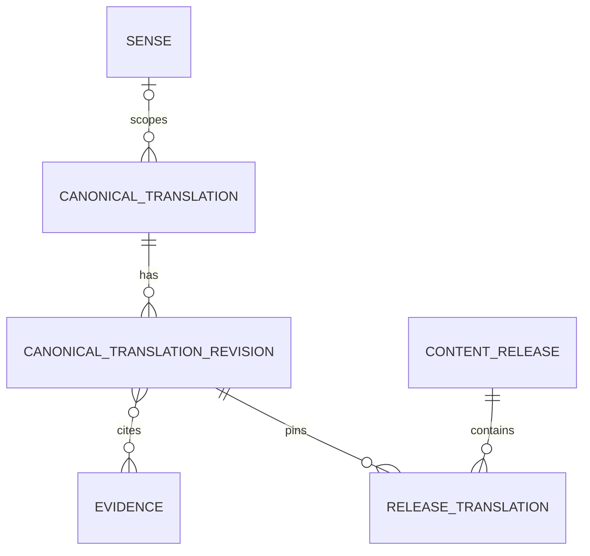

# SQL data endpoint interface

中文：[SQL 数据 endpoint 接口](../../docs_cn/interfaces/mysql_cn.md)

This contract defines island-port's structured-data HTTP endpoints for shared canonical translations, words, phrases, senses, domains, evidence metadata, and immutable content releases. Every operation is JSON over UDS. Endpoint request examples show the `input` object placed inside the common request envelope; response examples are complete bodies.

Status: target contract; the current executable does not compose this service client.

## Contents

- [Storage boundary](#storage-boundary)
- [Curated translation storage](#curated-translation-storage)
- [Domain facts and semantic scales](#domain-facts-and-semantic-scales)
- [Common operation envelope](#common-operation-envelope)
- [Endpoint reference](#endpoint-reference)
- [Domain proposal handling](#domain-proposal-handling)
- [Related documents](#related-documents)

## Endpoint reference

- [`POST /data/sql/v1/translations/resolve`](#post-datasqlv1translationsresolve)
- [`POST /data/sql/v1/translations/stage`](#post-datasqlv1translationsstage)
- [`POST /data/sql/v1/basic-cards/resolve`](#post-datasqlv1basic-cardsresolve)
- [`POST /data/sql/v1/senses/get`](#post-datasqlv1sensesget)
- [`POST /data/sql/v1/domains/resolve`](#post-datasqlv1domainsresolve)
- [`POST /data/sql/v1/knowledge-facts/get`](#post-datasqlv1knowledge-factsget)
- [`POST /data/sql/v1/semantic-scales/get`](#post-datasqlv1semantic-scalesget)
- [`POST /data/sql/v1/cards/revisions/stage`](#post-datasqlv1cardsrevisionsstage)
- [`POST /data/sql/v1/releases/activate`](#post-datasqlv1releasesactivate)

Island-port listens on `/run/island-port/island-port.sock` by default and follows the [shared UDS JSON transport](transnet.md). Callers never connect to MySQL or submit SQL; island-port owns queries, transactions, schema compatibility, credentials, and connection pooling. Only the Transnet runtime and authenticated publication tooling may access the socket. Runtime callers receive read access; mutation endpoints additionally require the publisher service account. Authorization comes from socket filesystem credentials, not JSON fields or forwarded headers.

## Storage boundary

MySQL is the authoritative store for compact, structured lexical content, deliberately selected canonical translations, and publication state. It contains no user, learner, account, profile, preference, history, saved item, bookmark, practice, answer, mastery, schedule, graph layout, feedback, privacy request, or ownership record. It never retains live translation requests, lookup queries, disambiguating context, or unreviewed provider output. Canonical source and target text may be stored only through the publication workflow described below.

Allowed Transnet service data includes:

- immutable knowledge releases and compatibility manifests;
- canonical words and phrases, language-tagged forms, aliases, and senses;
- reviewed source-target translations for words, established phrases, or reusable passages whose provenance and publication rights are known;
- concise definitions, translations, pronunciations, morphology, examples, and usage notes;
- canonical domains and their scope definitions;
- stable references to Qdrant knowledge roots and evidence records;
- publication jobs, validation results, idempotency records, and a Qdrant projection outbox, provided none contains request text or user data.

Use `utf8mb4`, UTC timestamps with microsecond precision, opaque stable public IDs, explicit foreign keys, and immutable published revisions. Credentials and encryption keys remain outside MySQL.

## Curated translation storage

The canonical translation model stores a small reviewed catalog, not traffic history or a cache. A `canonical_translation` row gives one source-target choice a stable `translation_id`, `unit` (`word`, `phrase`, or `passage`), source and target language tags, and an optional canonical `sense_id`. An immutable `canonical_translation_revision` contains source text, target text, the normalizer version and source fingerprint, optional dialect, register, and domain scope, evidence IDs, provenance, publication-rights assertion, selection reason, reviewer decision, and content hash. A release membership row pins exactly one approved revision to a content release. Basic-card translations reference these IDs instead of maintaining a second independently published translation value.



Published identity is unique by source language, versioned source fingerprint, target language, sense or scope key, and content release. The stored source text is retained so Transnet can compare an exact candidate after retrieval; a fingerprint match alone is never sufficient. Passage entries have a configured length bound and must be reusable reference content rather than personal correspondence or arbitrary submitted text.

Importance is an editorial decision with an auditable reason such as approved terminology, an established idiom, reusable product copy, or a reviewed reference passage. Frequency cannot be inferred by logging request text. Publisher authentication, provenance, rights review, and human approval are required before release activation. A runtime translation route has no write capability and no `save` or `important` field.

User saves are a separate concern. When an end user stars or saves a translation, island-port stores that private record in its product-owned database and may retain the rendered result under its own consent and retention policy. It must not send the user ID, save state, or private source text to these canonical publication endpoints.

## Domain facts and semantic scales

MySQL also owns canonical domain knowledge profiles, atomic basic facts, and semantic scales. A domain revision stores multilingual labels and aliases, definition, inclusion and exclusion scope, broader domain IDs, and a knowledge profile containing available fact families, languages, verified fact count, and coverage state (`seed`, `partial`, or `curated`). Coverage describes the active release and never asserts completeness.

A `knowledge_fact_revision` stores a stable fact ID, subject node, typed predicate, object node or typed literal, statement, applicable senses and domains, conditions, evidence IDs, provenance IDs, verification state, content hash, and immutable revision. Facts are independently reviewable and release-addressable. Qdrant edges and fact-search points reference the authoritative fact revision rather than becoming a second source of truth.

A `semantic_scale_revision` stores a stable scale ID, named dimension, increasing or decreasing direction, applicable domains and conditions, ordered sense-qualified node members, evidence IDs, verification state, content hash, and immutable revision. Member positions define order only. Publication rejects duplicate positions, missing members, mixed incompatible senses, absent evidence, and any attempt to encode a scale as `is_a` taxonomy. Basic cards, facts, profiles, and scales join the same immutable release.

## Common operation envelope

Every adapter operation carries a request ID, deadline, expected schema version, and optionally an immutable content release. Publication mutations also require an idempotency key. Reads return `ok`, `not_found`, `version_mismatch`, `unavailable`, or `timeout`; mutations may additionally return `conflict` or `invalid`.

Errors never expose SQL, credentials, request text, provider bodies, or internal connection details.

The exact request body is `{"context": RequestContext, "input": EndpointInput}`. Request context:

```json
{
  "request_id": "req_01K4Z8P8Y7D3N5Q2F6M1J9T0VX",
  "deadline_at": "2026-09-12T10:30:05.000000Z",
  "schema_version": "mysql-adapter-v1",
  "content_release": "knowledge-2026-09"
}
```

Closed error response:

```json
{
  "outcome": "version_mismatch",
  "error": {
    "code": "content_release_mismatch",
    "message": "The requested content release is not available.",
    "retryable": false
  }
}
```

## POST /data/sql/v1/translations/resolve

Resolves an exact reviewed translation from one immutable release. Transnet computes the versioned fingerprint in memory and sends no live source text or disambiguating sentence to the adapter. The adapter returns all eligible same-fingerprint candidates within the limit; Transnet compares the stored source under the named normalizer and applies sense and scope constraints before using one. This read is safe to retry.

Request `input`:

```json
{
  "source_fingerprint": "sha256:8bb7a7d7b6d9...",
  "normalizer_version": "translation-source-v1",
  "source_language": "en",
  "target_language": "zh-CN",
  "sense_id": "sense_sweltering_hot_01",
  "domain_ids": ["domain_weather"],
  "dialect": "en-US",
  "register": "neutral",
  "content_release": "knowledge-2026-09",
  "limit": 5
}
```

Response:

```json
{
  "outcome": "ok",
  "value": {
    "matches": [
      {
        "translation_id": "tr_sweltering_zh_cn_01",
        "unit": "word",
        "source": {"text": "sweltering", "language": "en"},
        "target": {"text": "酷热的", "language": "zh-CN"},
        "sense_id": "sense_sweltering_hot_01",
        "domain_ids": ["domain_weather"],
        "evidence_ids": ["evidence_dictionary_1042"],
        "revision": 3
      }
    ]
  },
  "content_release": "knowledge-2026-09"
}
```

## POST /data/sql/v1/translations/stage

Stages one candidate revision for review and later release activation. Only authenticated publication tooling may call this idempotent mutation. Staging does not make content readable by runtime traffic. The publisher must supply canonical, non-personal text and attest that provenance and publication rights have been reviewed.

Request `input`:

```json
{
  "translation_id": "tr_up_in_the_air_zh_cn_01",
  "unit": "phrase",
  "source": {"text": "up in the air", "language": "en"},
  "target": {"text": "悬而未决", "language": "zh-CN"},
  "sense_id": "sense_up_in_the_air_undecided_01",
  "domain_ids": ["domain_general"],
  "dialect": "en-US",
  "register": "neutral",
  "normalizer_version": "translation-source-v1",
  "selection_reason": "established_idiom",
  "evidence_ids": ["evidence_dictionary_2117"],
  "provenance": ["source_dictionary_2026_01"],
  "rights_assertion": "approved_for_canonical_publication",
  "idempotency_key": "stage-translation-up-in-the-air-zh-cn-r1",
  "review": {
    "state": "approved",
    "policy_version": "canonical-translation-review-v1"
  }
}
```

Response:

```json
{
  "outcome": "ok",
  "value": {
    "translation_id": "tr_up_in_the_air_zh_cn_01",
    "revision": 1,
    "publication_state": "staged",
    "content_hash": "sha256:4ef760d1..."
  }
}
```

A repeated idempotency key with the same request fingerprint returns the original result; reuse with different content returns `conflict`. Activation uses the existing release staging and activation operations, which validate that every translation revision is approved, internally consistent, and evidence-backed.

## POST /data/sql/v1/basic-cards/resolve

Normalization belongs to the Transnet runtime. The adapter receives a bounded, ordered set of derived forms; it never receives the raw query, intermediate transformations, or context. Exact canonical and alias forms precede inflection, spelling-correction, and relaxed aliases. Significant symbols remain distinct, so `C`, `C++`, and `C#` cannot collapse into one identity.

Both this operation and `get_sense` return the same compact `BasicCard` shape. It includes the canonical and alias forms, concise definitions and translations, pronunciation and morphology summaries, short canonical examples and usage notes, domain and evidence metadata, knowledge roots, revision, and release. Relationship detail remains in Qdrant.

Request `input`:

```json
{
  "lookup_forms": [
    {
      "form": "sweltering",
      "match_class": "exact_canonical",
      "rank": 0
    }
  ],
  "normalizer_version": "unicode-nfkc-v2",
  "source_language": "en",
  "explanation_language": "zh-CN",
  "dialect": "en-US",
  "content_release": "knowledge-2026-09",
  "limit": 5
}
```

Response:

```json
{
  "outcome": "ok",
  "value": {
    "matches": [
      {
        "matched_form": "sweltering",
        "match_class": "exact_canonical",
        "card": {
          "card_id": "card_sweltering_en_adj_01",
          "sense_id": "sense_sweltering_hot_01",
          "canonical_form": "sweltering",
          "aliases": ["oppressively hot"],
          "language": "en",
          "part_of_speech": "adjective",
          "translations": [
            {
              "language": "zh-CN",
              "text": "酷热的"
            }
          ],
          "definitions": ["uncomfortably hot, especially because of the weather"],
          "pronunciations": [{"dialect": "en-US", "ipa": "/ˈswɛltərɪŋ/"}],
          "forms": [{"form": "swelteringly", "label": "adverb"}],
          "examples": [{"text": "We waited until evening to leave the sweltering house.", "translation": "我们一直等到傍晚才离开闷热难耐的房子。"}],
          "usage_notes": ["Usually describes weather or an uncomfortably hot place."],
          "knowledge_root_ids": ["node_sweltering_hot_01"],
          "domain_ids": ["domain_weather"],
          "evidence_ids": ["evidence_dictionary_1042"],
          "revision": 3
        }
      }
    ],
    "alternatives": []
  },
  "content_release": "knowledge-2026-09"
}
```

Uniqueness is enforced by stable form, card, and sense IDs plus published canonical-form and alias rows, never by an ad hoc normalized lookup string. All eligible collisions at the best applicable rank are returned for resolution by the service.

## POST /data/sql/v1/senses/get

Returns one compact canonical sense revision using the shared `BasicCard` shape.

Request:

```json
{
  "sense_id": "sense_sweltering_hot_01",
  "explanation_language": "zh-CN",
  "dialect": "en-US",
  "content_release": "knowledge-2026-09"
}
```

Response:

```json
{
  "outcome": "ok",
  "value": {
    "card_id": "card_sweltering_en_adj_01",
    "sense_id": "sense_sweltering_hot_01",
    "canonical_form": "sweltering",
    "aliases": ["oppressively hot"],
    "language": "en",
    "part_of_speech": "adjective",
    "definitions": ["uncomfortably hot, especially because of the weather"],
    "translations": [
      {
        "language": "zh-CN",
        "text": "酷热的"
      }
    ],
    "pronunciations": [
      {
        "dialect": "en-US",
        "ipa": "/ˈswɛltərɪŋ/"
      }
    ],
    "forms": [
      {
        "form": "swelteringly",
        "label": "adverb"
      }
    ],
    "examples": [
      {
        "text": "We waited until evening to leave the sweltering house.",
        "translation": "我们一直等到傍晚才离开闷热难耐的房子。"
      }
    ],
    "usage_notes": ["Usually describes weather or an uncomfortably hot place."],
    "knowledge_root_ids": ["node_sweltering_hot_01"],
    "domain_ids": ["domain_weather"],
    "evidence_ids": ["evidence_dictionary_1042"],
    "revision": 3
  },
  "content_release": "knowledge-2026-09"
}
```

## POST /data/sql/v1/domains/resolve

Domains are canonical versioned records, not free-form tags. Resolution first checks published labels and aliases. If more than one scope matches, the adapter returns candidates and the publishing workflow must disambiguate.

Request:

```json
{
  "normalized_labels": ["meteorology", "weather"],
  "scope_key": "earth-atmosphere-weather",
  "content_release": "knowledge-2026-09",
  "limit": 5
}
```

Response:

```json
{
  "outcome": "ok",
  "value": {
    "candidates": [
      {
        "domain_id": "domain_weather",
        "canonical_label": "weather",
        "definition": "Conditions of the atmosphere at a place and time.",
        "inclusion_scope": ["temperature", "precipitation", "wind", "humidity"],
        "exclusion_scope": ["long-term climate classification"],
        "broader_domain_ids": ["domain_earth_science"],
        "knowledge_profile": {
          "available_fact_families": ["definition", "taxonomy", "terminology", "measurement"],
          "languages": ["en", "zh-CN"],
          "verified_fact_count": 184,
          "coverage_state": "partial"
        },
        "revision": 4
      }
    ]
  },
  "content_release": "knowledge-2026-09"
}
```

## POST /data/sql/v1/knowledge-facts/get

Hydrates an ordered, bounded set of exact fact revisions after vector retrieval. Qdrant may nominate `fact_id` values, but it is never allowed to supply the authoritative statement, evidence, rights, or verification state. The caller supplies the release and the eligible fact IDs; the adapter silently excludes IDs that are absent from that release or fail eligibility. This read is safe to retry.

Request `input`:

```json
{
  "fact_ids": ["fact_sweltering_degree_scorching_01"],
  "content_release": "knowledge-2026-09",
  "verification_states": ["verified"],
  "limit": 20
}
```

Response:

```json
{
  "outcome": "ok",
  "value": {
    "facts": [
      {
        "fact_id": "fact_sweltering_degree_scorching_01",
        "revision": 2,
        "statement": "For environmental heat, scorching usually indicates greater intensity than sweltering.",
        "subject_node_id": "node_scorching_heat_01",
        "predicate": "higher_degree_than",
        "object_node_id": "node_sweltering_hot_01",
        "domain_ids": ["domain_weather"],
        "applicable_sense_ids": ["sense_sweltering_hot_01"],
        "conditions": ["describes weather or an environment"],
        "evidence_ids": ["evidence_dictionary_1042"],
        "provenance": ["source_dictionary_2026_01"],
        "verification_state": "verified"
      }
    ]
  },
  "content_release": "knowledge-2026-09"
}
```

The returned order follows the request after omitted IDs are removed. Facts are atomic: a response projector may summarize them, but must retain the exact fact ID and evidence state whenever it presents a factual claim at `full` level.

## POST /data/sql/v1/semantic-scales/get

Returns complete authoritative semantic scales by stable ID. The caller normally obtains candidate scale IDs from Qdrant and supplies the selected sense or node so island-port can apply scope and condition eligibility. A scale is returned whole or omitted; callers must not reconstruct a ladder from unrelated pairwise edges.

Request `input`:

```json
{
  "scale_ids": ["scale_environmental_heat_intensity_01"],
  "for_node_id": "node_sweltering_hot_01",
  "content_release": "knowledge-2026-09",
  "verification_states": ["verified"],
  "limit": 5
}
```

Response:

```json
{
  "outcome": "ok",
  "value": {
    "scales": [
      {
        "scale_id": "scale_environmental_heat_intensity_01",
        "revision": 1,
        "dimension": "environmental_heat_intensity",
        "direction": "increasing",
        "domain_ids": ["domain_weather"],
        "conditions": ["describes weather or an environment"],
        "members": [
          {"node_id": "node_warm_temperature_01", "position": 10},
          {"node_id": "node_hot_temperature_01", "position": 20},
          {"node_id": "node_sweltering_hot_01", "position": 30},
          {"node_id": "node_scorching_heat_01", "position": 40}
        ],
        "evidence_ids": ["evidence_dictionary_1042"],
        "verification_state": "verified"
      }
    ]
  },
  "content_release": "knowledge-2026-09"
}
```

`position` establishes ordinal order only; it never represents a numeric intensity interval. The caller derives adjacent degree presentation from this returned scale, while taxonomy remains a separately typed `is_a` / `has_subtype` relation.

## Domain proposal handling

There is no live create-domain endpoint. Transnet gives the LLM a bounded allowlist returned by domain resolution. If the LLM selects none and emits a structured proposal, deterministic code returns `proposed_new` for that request. An unavailable or failed catalog produces `uncertain`, not a proposal. Runtime traffic cannot write the proposal.

An offline publisher may later place proposed domains, generated fact candidates, semantic scales, and their provenance in the ordinary staged release artifact. The same collision, scope, evidence, rights, review, idempotency, and immutable-release validation used for other canonical content applies. New domains therefore require no domain-specific creation endpoint.

## POST /data/sql/v1/cards/revisions/stage

Stages an immutable word-or-phrase revision and its Qdrant root references. Staging validates all structured fields but does not make content readable from an active release.

Request:

```json
{
  "card": {
    "card_id": "card_sweltering_en_adj_01",
    "sense_id": "sense_sweltering_hot_01",
    "canonical_form": "sweltering",
    "language": "en",
    "part_of_speech": "adjective",
    "definitions": ["uncomfortably hot, especially because of the weather"],
    "translations": [
      {
        "language": "zh-CN",
        "text": "酷热的"
      }
    ],
    "knowledge_root_ids": ["node_sweltering_hot_01"],
    "domain_ids": ["domain_weather"]
  },
  "target_release": "knowledge-2026-10",
  "source_revision": 3,
  "evidence_ids": ["evidence_dictionary_1042"],
  "idempotency_key": "stage-card-sweltering-r4"
}
```

Response:

```json
{
  "outcome": "ok",
  "value": {
    "card_id": "card_sweltering_en_adj_01",
    "sense_id": "sense_sweltering_hot_01",
    "revision": 4,
    "publication_state": "staged",
    "target_release": "knowledge-2026-10"
  }
}
```

## POST /data/sql/v1/releases/activate

Activation is atomic and references a compatible immutable Qdrant node/edge release. It fails if any card root, domain, evidence record, content hash, or Qdrant manifest is missing or incompatible.

Request:

```json
{
  "release_id": "knowledge-2026-10",
  "expected_active_release": "knowledge-2026-09",
  "mysql_content_hash": "sha256:9c49d7f6...",
  "qdrant_manifest_hash": "sha256:2e17a054...",
  "idempotency_key": "activate-knowledge-2026-10"
}
```

Response:

```json
{
  "outcome": "ok",
  "value": {
    "active_release": "knowledge-2026-10",
    "previous_release": "knowledge-2026-09",
    "activated_at": "2026-10-01T00:00:00.000000Z"
  }
}
```

Quarantine, withdrawal, and correction create new publication state or a new release; published rows are never silently rewritten.

## Related documents

- [Shared UDS JSON transport and Transnet interface](transnet.md)
- [Transnet design and external interface](../transnet.md)
- [Qdrant interface](qdrant.md)
- [Content publishing](../guides/content-publishing.md)
