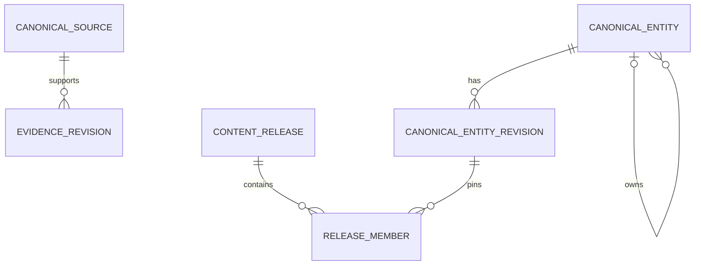

# SQL data endpoint interface

中文：[SQL 数据 endpoint 接口](../../docs_cn/interfaces/mysql_cn.md)

This contract defines island-port's structured-data HTTP endpoints for shared canonical translations, words, phrases, senses, domains, evidence metadata, and immutable content releases. Every operation is JSON over UDS. Endpoint request examples show the `input` object placed inside the common request envelope; response examples are complete bodies.

Status: target server contract; the executable can optionally compose the strict outbound canonical-read client and active-release readiness probe, but no public BasicCard route consumes them and the external island-port server has not been verified against this contract. Publisher and production MySQL operations remain unimplemented here.

## Contents

- [SQL data endpoint interface](#sql-data-endpoint-interface)
  - [Contents](#contents)
  - [Endpoint reference](#endpoint-reference)
  - [Storage boundary](#storage-boundary)
  - [Curated translation storage](#curated-translation-storage)
  - [Domain facts and semantic scales](#domain-facts-and-semantic-scales)
  - [Common operation envelope](#common-operation-envelope)
  - [POST /api/v1/translations/resolve](#post-apiv1translationsresolve)
  - [POST /api/v1/translations/stage](#post-apiv1translationsstage)
  - [POST /api/v1/basic-cards/resolve](#post-apiv1basic-cardsresolve)
  - [POST /api/v1/senses/get](#post-apiv1sensesget)
  - [POST /api/v1/domains/resolve](#post-apiv1domainsresolve)
  - [POST /api/v1/knowledge-facts/get](#post-apiv1knowledge-factsget)
  - [POST /api/v1/semantic-scales/get](#post-apiv1semantic-scalesget)
  - [Domain proposal handling](#domain-proposal-handling)
  - [POST /api/v1/cards/revisions/stage](#post-apiv1cardsrevisionsstage)
  - [POST /api/v1/releases/activate](#post-apiv1releasesactivate)
  - [Related documents](#related-documents)

## Endpoint reference

Island-port listens on `/run/island-port/island-port.sock` by default and follows the [shared UDS JSON transport](transnet.md). Callers never connect to MySQL or submit SQL; island-port owns queries, transactions, schema compatibility, credentials, and connection pooling. Only the Transnet runtime and authenticated publication tooling may access the socket. Runtime callers receive read access; mutation endpoints additionally require the publisher service account. Authorization comes from socket filesystem credentials, not JSON fields or forwarded headers.

Every route uses the shared `/api/v1` prefix. The island-port socket and the resource path identify this structured-data API; callers do not add `data`, `sql`, or a storage-vendor name to the path.

## Storage boundary

The `transnet_canonical` MySQL schema behind this endpoint is the authoritative store for compact, structured lexical content, deliberately selected canonical translations, and publication state. It contains no user, learner, account, profile, preference, history, saved item, bookmark, practice, answer, mastery, schedule, graph layout, feedback, privacy request, or ownership record. It never retains live translation requests, lookup queries, disambiguating context, or unreviewed provider output. Canonical source and target text may be stored only through the publication workflow described below. Island-port may use a separately authorized product schema for private state, but that schema is outside this endpoint and inaccessible to Transnet.

Allowed Transnet service data includes:

- immutable knowledge releases and compatibility manifests;
- canonical words and phrases, language-tagged forms, aliases, and senses;
- reviewed source-target translations for words, established phrases, or reusable passages whose provenance and publication rights are known;
- concise definitions, translations, pronunciations, morphology, examples, and usage notes;
- canonical domains and their scope definitions;
- stable references to Qdrant knowledge roots and evidence records;
- publication jobs, validation results, idempotency records, and a Qdrant projection outbox, provided none contains request text or user data.

Use `utf8mb4`, UTC timestamps with microsecond precision, opaque stable public IDs, explicit foreign keys where both sides have one concrete type, and immutable published revisions. Credentials and encryption keys remain outside MySQL.

The target schema deliberately uses a hybrid relational model. Stable identity, lifecycle, release membership, relationship endpoints, assessment eligibility, and frequent lookup keys are typed and indexed columns. Bounded fields that vary by content family use closed, versioned JSON payload schemas. This avoids a table per card child or domain attribute without turning core joins and filters into JSON scans. Publication validates payload schemas, referenced entity types, evidence references, and the polymorphic `release_member` target before a release can become active.

## Curated translation storage

The canonical translation model stores a small reviewed catalog, not traffic history or a cache. A `canonical_entity` row with `entity_type = 'translation'` gives one source-target choice a stable identity. Its immutable `canonical_entity_revision` promotes the normalized lookup key, language, optional sense identity, publication state, and content hash to columns. The versioned payload contains the word, phrase, or passage unit; source and target language-tagged text; normalizer version and source fingerprint; optional dialect, register, and domain scope; evidence and provenance references; publication-rights assertion; selection reason; and reviewer decision. One `release_member` row pins exactly one approved revision to a release. Basic-card payloads reference these translation entities instead of maintaining a second independently published translation value.


```mermaid
erDiagram
  CANONICAL_ENTITY ||--o{ CANONICAL_ENTITY_REVISION : has
  CANONICAL_ENTITY o|--o{ CANONICAL_ENTITY : owns
  CONTENT_RELEASE ||--o{ RELEASE_MEMBER : contains
  CANONICAL_ENTITY_REVISION ||--o{ RELEASE_MEMBER : pins
  CANONICAL_SOURCE ||--o{ EVIDENCE_REVISION : supports
```

Canonical public IDs follow `canonical-id-v1`: a family prefix identifies the entity kind and the remaining opaque value is publisher-assigned, never derived from normalized text or a content hash. A published translation revision is uniquely selected within a release by source language, `translation-source-v1` fingerprint, target language, and its explicit sense or scope key. The stable translation ID survives corrections, while each correction creates a new positive immutable revision and later release membership rather than modifying published content. The stored source text is retained so Transnet can compare an exact candidate after retrieval; a fingerprint match alone is never sufficient. Lexical scope preserves sense, part of speech, phrase-level versus compositional meaning, and bounded canonical domains so homographs and field-specific meanings do not collide. Passage entries have a configured length bound and must be reusable reference content rather than personal correspondence or arbitrary submitted text.

Importance is an editorial decision with an auditable reason such as approved terminology, an established idiom, reusable product copy, or a reviewed reference passage. Frequency cannot be inferred by logging request text. Publisher authentication, provenance, rights review, and human approval are required before release activation. A runtime translation route has no write capability and no `save` or `important` field.

User saves are a separate concern. When an end user stars or saves a translation, island-port stores that private record in its product-owned database and may retain the rendered result under its own consent and retention policy. It must not send the user ID, save state, or private source text to these canonical publication endpoints.

## Domain facts and semantic scales

MySQL also owns canonical domain knowledge profiles, atomic basic facts, and semantic scales. A domain revision stores multilingual labels and aliases, definition, inclusion and exclusion scope, broader domain IDs, and a knowledge profile containing available fact families, languages, verified fact count, and coverage state (`seed`, `partial`, or `curated`). Coverage describes the active release and never asserts completeness.

A fact uses `canonical_entity` with `entity_type = 'fact'`. Its immutable `canonical_entity_revision` payload stores the subject, typed predicate, object node or typed literal, statement, applicable senses and domains, conditions, evidence references, provenance, and verification data. Facts remain independently reviewable and release-addressable. Qdrant edges and fact-search points reference the authoritative entity revision rather than becoming a second source of truth.

A `canonical_relationship_revision` maps one stable public edge ID and positive relation version to the exact fact revision, endpoints, relation type, direction, restrictions, and assessment eligibility published in a release. Endpoint and relation fields remain indexed columns; explanations and bounded scope/support lists use the versioned payload. This mapping lets island-port validate a WebUI assessment target without treating the judgment as canonical content. Relationship judgments and aggregates remain in the separately authorized island-port product schema defined by the [target MySQL schema](tables/sql.sql); Transnet cannot access the private rows.

A semantic scale uses `canonical_entity` with `entity_type = 'semantic_scale'`. Its immutable revision payload stores the named dimension, increasing or decreasing direction, applicable domains and conditions, ordered sense-qualified node members, and evidence references. Member positions define order only. Publication rejects duplicate positions, missing members, mixed incompatible senses, absent evidence, and any attempt to encode a scale as `is_a` taxonomy. Basic cards, facts, profiles, and scales all join a release through `release_member`.

## Common operation envelope

Every adapter operation carries a request ID, deadline, expected schema version, and optionally an immutable content release. Publication mutations also require an idempotency key. Reads return `ok`, `not_found`, `version_mismatch`, `content_release_unavailable`, `unavailable`, or `timeout`; mutations may additionally return `conflict` or `invalid`. `version_mismatch` requires structured code `schema_incompatible`; `content_release_unavailable` requires the same-named code and applies only to an explicitly pinned release that cannot be served. Neither is inferred from message text.

Errors never expose SQL, credentials, request text, provider bodies, or internal connection details.

The exact request body is `{"context": RequestContext, "input": EndpointInput}`. Request context:

```json
{
  "request_id": "req_01K4Z8P8Y7D3N5Q2F6M1J9T0VX",
  "deadline_at": "2026-09-12T10:30:05.000000Z",
  "schema_version": "mysql-adapter-v1",
  "content_release": "knowledge-2026-09"
}
```

Closed error response:

```json
{
  "request_id": "req_01K4Z8P8Y7D3N5Q2F6M1J9T0VX",
  "schema_version": "mysql-adapter-v1",
  "content_release": "knowledge-2026-09",
  "outcome": "content_release_unavailable",
  "error": {
    "code": "content_release_unavailable",
    "message": "The requested content release is not available.",
    "retryable": false
  }
}
```

The Stage 3 Transnet client requires every response to echo `request_id` and `schema_version` at
the top level. Every successful pinned read also returns `content_release`. The client rejects
unknown fields, duplicate indexed-lineage keys, oversized bodies, an absent echo, a different
schema or release, and any response that cannot be reconstructed through the current Rust domain
constructors. Existing island-port deployments that implement the older examples below must be
updated before this adapter can be used end to end; Transnet does not infer omitted authoritative
fields or fall back to an older schema.

## POST /api/v1/releases/active

Stage 4 selects the active immutable canonical release once at the start of an application request. This operation is an authoritative island-port read, not a vector or ranking-policy selection. Its context omits `content_release` because the operation selects that value. `schema_version` is the transport contract version; `canonical_schema_version` is the selected release's content schema. Both successful fields are required and bounded. The request carries no source text.

```json
{
  "context": {
    "request_id": "req_example",
    "deadline_at": "2099-01-01T00:00:00Z",
    "schema_version": "mysql-adapter-v1"
  },
  "input": {}
}
```

```json
{
  "request_id": "req_example",
  "schema_version": "mysql-adapter-v1",
  "outcome": "ok",
  "value": {
    "content_release": "release_example",
    "canonical_schema_version": "canonical_example"
  }
}
```

The closed outcomes are `ok`, `not_found` (no safely servable active release), `version_mismatch`, `unavailable`, and `timeout`. Errors use the existing redacted `error` object, require the request and schema echoes, and must not carry a success value. Unknown, missing, contradictory, or oversized response data fails closed. The `value` has no `vector_collection_id` or `ranking_version`: vector composition is later work, and deterministic ranking policy belongs to Transnet. The release and canonical schema must come from one atomic active-pointer read. Every later canonical read within the request sends the returned `content_release`, and island-port must serve that immutable release even if a newer one becomes active; it must never silently upgrade a pinned read. If the pinned release can no longer be served safely, the entire request fails closed.

The island-port server is not in this repository and still needs to implement this operation, atomic selection, old-release retention for bounded in-flight requests, and the closed error outcomes. Transnet's outbound client and fake-UDS tests alone are not a real MySQL end-to-end deployment.

For the bounded translation and basic-card candidate-list reads below, an eligible zero-hit search is `ok` with an empty `matches` list. A downstream `not_found` is not silently converted into an empty result by the Stage 4 composition: it remains a closed error, so an unavailable pinned release cannot masquerade as a search miss.

## POST /api/v1/translations/resolve

Resolves an exact reviewed translation from one immutable release. Transnet computes the versioned fingerprint in memory and sends no live source text or disambiguating sentence to the adapter. The adapter returns all eligible same-fingerprint candidates within the limit; Transnet compares the stored source under the named normalizer and applies sense and scope constraints before using one. This read is safe to retry.

Request `input`:

```json
{
  "source_fingerprint": "sha256:8bb7a7d7b6d9...",
  "normalizer_version": "translation-source-v1",
  "source_language": "en",
  "target_language": "zh-CN",
  "sense_id": "sense_sweltering_hot_01",
  "domain_ids": ["domain_weather"],
  "dialect": "en-US",
  "register": "neutral",
  "limit": 5
}
```

Response. Lexical matches require `scope`; reusable passage matches require `scope: null`:

```json
{
  "request_id": "req_01K4Z8P8Y7D3N5Q2F6M1J9T0VX",
  "schema_version": "mysql-adapter-v1",
  "outcome": "ok",
  "value": {
    "matches": [
      {
        "translation_id": "tr_sweltering_zh_cn_01",
        "revision": 3,
        "unit": "word",
        "source_fingerprint": "sha256:8bb7a7d7b6d9...",
        "source": {"text": "sweltering", "language": "en"},
        "target": {"text": "酷热的", "language": "zh-CN"},
        "scope": {
          "lexeme_id": "lexeme_sweltering_en_adj_01",
          "sense_id": "sense_sweltering_hot_01",
          "part_of_speech": "adjective",
          "composition": "compositional",
          "domain_ids": ["domain_weather"]
        },
        "evidence_ids": ["evidence_dictionary_1042"]
      }
    ]
  },
  "content_release": "knowledge-2026-09"
}
```

## POST /api/v1/translations/stage

Stages one candidate revision for review and later release activation. Only authenticated publication tooling may call this idempotent mutation. Staging does not make content readable by runtime traffic. The publisher must supply canonical, non-personal text and attest that provenance and publication rights have been reviewed.

Request `input`:

```json
{
  "translation_id": "tr_up_in_the_air_zh_cn_01",
  "unit": "phrase",
  "source": {"text": "up in the air", "language": "en"},
  "target": {"text": "悬而未决", "language": "zh-CN"},
  "sense_id": "sense_up_in_the_air_undecided_01",
  "domain_ids": ["domain_general"],
  "dialect": "en-US",
  "register": "neutral",
  "normalizer_version": "translation-source-v1",
  "selection_reason": "established_idiom",
  "evidence_ids": ["evidence_dictionary_2117"],
  "provenance": ["source_dictionary_2026_01"],
  "rights_assertion": "approved_for_canonical_publication",
  "idempotency_key": "stage-translation-up-in-the-air-zh-cn-r1",
  "review": {
    "state": "approved",
    "policy_version": "canonical-translation-review-v1"
  }
}
```

Response:

```json
{
  "outcome": "ok",
  "value": {
    "translation_id": "tr_up_in_the_air_zh_cn_01",
    "revision": 1,
    "publication_state": "staged",
    "content_hash": "sha256:4ef760d1..."
  }
}
```

A repeated idempotency key with the same request fingerprint returns the original result; reuse with different content returns `conflict`. Activation uses the existing release staging and activation operations, which validate that every translation revision is approved, internally consistent, and evidence-backed.

## POST /api/v1/basic-cards/resolve

Normalization belongs to the Transnet runtime. The adapter receives a bounded, ordered set of derived forms; it never receives the raw query, intermediate transformations, or context. Exact canonical and alias forms precede inflection, spelling-correction, and relaxed aliases. Significant symbols remain distinct, so `C`, `C++`, and `C#` cannot collapse into one identity.

This operation returns release-pinned identity and core candidate data, not a finished presentation card. Transnet performs deterministic ranking, deduplication, ambiguity resolution, and coverage calculation. After selecting a sense it calls `senses/get` for typed details and forms the final `CanonicalLookupCard` in the application layer. Rank, fusion score, coverage, and final resolution are never island-port authority. Qdrant and knowledge-root data remain outside Milestone 2.

Request `input`:

```json
{
  "lookup_forms": [
    {
      "form": "sweltering",
      "match_class": "exact_canonical",
      "rank": 0
    }
  ],
  "normalizer_version": "unicode-nfc-lookup-v1",
  "source_language": "en",
  "explanation_language": "zh-CN",
  "dialect": "en-US",
  "evidence_use": "api_redistribution",
  "limit": 5
}
```

Response:

```json
{
  "request_id": "req_01K4Z8P8Y7D3N5Q2F6M1J9T0VX",
  "schema_version": "mysql-adapter-v1",
  "outcome": "ok",
  "value": {
    "matches": [
      {
        "matched_form": "sweltering",
        "match_class": "exact_canonical",
        "matched_form_id": "form_sweltering_lemma_01",
        "lexical_score_basis_points": 10000,
        "candidate": {
          "lexeme": {"id": "lexeme_sweltering_en_adj_01", "language": "en", "lemma": "sweltering", "normalized_lemma": "sweltering", "part_of_speech": "adjective", "status": "active"},
          "sense": {"id": "sense_sweltering_hot_01", "lexeme_id": "lexeme_sweltering_en_adj_01", "sense_key": "weather-hot", "definition": "uncomfortably hot", "definition_evidence_ids": ["evidence_dictionary_1042"], "status": "active"},
          "forms": [{"id": "form_sweltering_lemma_01", "lexeme_id": "lexeme_sweltering_en_adj_01", "form": "sweltering", "normalized_form": "sweltering", "kind": "lemma", "morphology": null, "evidence_ids": ["evidence_dictionary_1042"], "status": "active"}],
          "sources": [{"release_id": "knowledge-2026-09", "source": {"id": "source_dictionary_2026_01", "name": "Reviewed dictionary", "version": "2026-09", "license": "reviewed", "attribution": "Dictionary publisher (2026)", "permissions": {"storage": true, "display": true, "embedding": true, "model_processing": true, "api_redistribution": true}}}],
          "evidence": [{"id": "evidence_dictionary_1042", "source_id": "source_dictionary_2026_01", "source_reference": "entry:sweltering:adj:1", "language": "en", "kind": "definition", "confidence": "high", "text": "uncomfortably hot", "content_hash": "sha256:4ef760d1...", "permissions": {"storage": true, "display": true, "embedding": true, "model_processing": true, "api_redistribution": true}, "status": "active"}]
        }
      }
    ],
    "alternatives": [],
    "truncated": false
  },
  "content_release": "knowledge-2026-09"
}
```

Uniqueness is enforced by stable form, card, and sense IDs plus published canonical-form and alias rows, never by an ad hoc normalized lookup string. All eligible collisions at the best applicable rank are returned for resolution by the service.

Each candidate must carry the authoritative, release-bound source record for every evidence fragment. `source.id` must equal `evidence.source_id`; source and evidence permissions must both authorize the requested use, and evidence permissions cannot exceed source permissions. For public redistribution, `source.attribution` is a nonempty, reviewed human-readable attribution (at most 256 Unicode characters), not a label synthesized from source ID or name. Missing, duplicate, conflicting, unlicensed, or cross-release source/evidence records fail closed. The adapter resolves these strict private DTOs into the existing candidate/source/evidence domain types; island-port must add this source chain before production delivery. Content hash and permission bits remain internal.

The Stage 4 canonical-only caller names its actual baseline NFC/lowercased lookup behavior `unicode-nfc-lookup-v1`; the previous illustrative `unicode-nfkc-v2` value did not describe that implementation. This version is request-local normalization metadata, not canonical authority data or identity.

## POST /api/v1/senses/get

Returns independently constructible typed detail data for one canonical sense. `target` contains the complete authoritative lexeme and sense. `lineages` is an object indexed by evidence ID; assertions refer to those IDs. Island-port rejects duplicate or conflicting IDs, and Transnet rejects dangling references, unused lineages, release or target mismatches, permission escalation, invalid lifecycle state, and incompatible evidence kinds before constructing `CanonicalSenseDetails`.

Request:

```json
{
  "sense_id": "sense_sweltering_hot_01",
  "explanation_language": "zh-CN",
  "dialect": "en-US",
    "evidence_use": "api_redistribution"
}
```

Response:

```json
{
  "request_id": "req_01K4Z8P8Y7D3N5Q2F6M1J9T0VX",
  "schema_version": "mysql-adapter-v1",
  "outcome": "ok",
  "content_release": "knowledge-2026-09",
  "value": {
    "canonical_schema_version": "canonical-v1",
    "target": {
      "lexeme": {"id": "lexeme_sweltering_en_adj_01", "language": "en", "lemma": "sweltering", "normalized_lemma": "sweltering", "part_of_speech": "adjective", "status": "active"},
      "sense": {"id": "sense_sweltering_hot_01", "lexeme_id": "lexeme_sweltering_en_adj_01", "sense_key": "weather-hot", "definition": "uncomfortably hot", "definition_evidence_ids": [], "status": "active"}
    },
    "lineages": {},
    "localized_glosses": [],
    "pronunciations": [],
    "usage_labels": [],
    "grammar_patterns": [],
    "collocations": [],
    "examples": [],
    "pitfalls": [],
    "etymologies": [],
    "history": []
  }
}
```

The required `canonical_schema_version` in a successful sense value must match the caller-supplied immutable `CanonicalReleasePin`; a different schema fails closed. A pinned R1 read remains on R1 after active selection changes to R2. Island-port must retain readable old releases for the supported in-flight/follow-up window. If the explicitly requested R1 is unavailable, return `content_release_unavailable` with code `content_release_unavailable`; adapter/schema incompatibility instead returns `version_mismatch` with code `schema_incompatible`. Never silently select R2 or use an error message to classify these outcomes.

## POST /api/v1/domains/resolve

Domains are canonical versioned records, not free-form tags. Resolution first checks published labels and aliases. If more than one scope matches, the adapter returns candidates and the publishing workflow must disambiguate.

Request:

```json
{
  "normalized_labels": ["meteorology", "weather"],
  "scope_key": "earth-atmosphere-weather",
  "content_release": "knowledge-2026-09",
  "limit": 5
}
```

Response:

```json
{
  "outcome": "ok",
  "value": {
    "candidates": [
      {
        "domain_id": "domain_weather",
        "canonical_label": "weather",
        "definition": "Conditions of the atmosphere at a place and time.",
        "inclusion_scope": ["temperature", "precipitation", "wind", "humidity"],
        "exclusion_scope": ["long-term climate classification"],
        "broader_domain_ids": ["domain_earth_science"],
        "knowledge_profile": {
          "available_fact_families": ["definition", "taxonomy", "terminology", "measurement"],
          "languages": ["en", "zh-CN"],
          "verified_fact_count": 184,
          "coverage_state": "partial"
        },
        "revision": 4
      }
    ]
  },
  "content_release": "knowledge-2026-09"
}
```

## POST /api/v1/knowledge-facts/get

Hydrates an ordered, bounded set of exact fact revisions after vector retrieval. Qdrant may nominate `fact_id` values, but it is never allowed to supply the authoritative statement, evidence, rights, or verification state. The caller supplies the release and the eligible fact IDs; the adapter silently excludes IDs that are absent from that release or fail eligibility. This read is safe to retry.

Request `input`:

```json
{
  "fact_ids": ["fact_sweltering_degree_scorching_01"],
  "content_release": "knowledge-2026-09",
  "verification_states": ["verified"],
  "limit": 20
}
```

Response:

```json
{
  "outcome": "ok",
  "value": {
    "facts": [
      {
        "fact_id": "fact_sweltering_degree_scorching_01",
        "revision": 2,
        "statement": "For environmental heat, scorching usually indicates greater intensity than sweltering.",
        "subject_node_id": "node_scorching_heat_01",
        "predicate": "higher_degree_than",
        "object_node_id": "node_sweltering_hot_01",
        "domain_ids": ["domain_weather"],
        "applicable_sense_ids": ["sense_sweltering_hot_01"],
        "conditions": ["describes weather or an environment"],
        "evidence_ids": ["evidence_dictionary_1042"],
        "provenance": ["source_dictionary_2026_01"],
        "verification_state": "verified"
      }
    ]
  },
  "content_release": "knowledge-2026-09"
}
```

The returned order follows the request after omitted IDs are removed. Facts are atomic: a response projector may summarize them, but must retain the exact fact ID and evidence state whenever it presents a factual claim at `full` level.

## POST /api/v1/semantic-scales/get

Returns complete authoritative semantic scales by stable ID. The caller normally obtains candidate scale IDs from Qdrant and supplies the selected sense or node so island-port can apply scope and condition eligibility. A scale is returned whole or omitted; callers must not reconstruct a ladder from unrelated pairwise edges.

Request `input`:

```json
{
  "scale_ids": ["scale_environmental_heat_intensity_01"],
  "for_node_id": "node_sweltering_hot_01",
  "content_release": "knowledge-2026-09",
  "verification_states": ["verified"],
  "limit": 5
}
```

Response:

```json
{
  "outcome": "ok",
  "value": {
    "scales": [
      {
        "scale_id": "scale_environmental_heat_intensity_01",
        "revision": 1,
        "dimension": "environmental_heat_intensity",
        "direction": "increasing",
        "domain_ids": ["domain_weather"],
        "conditions": ["describes weather or an environment"],
        "members": [
          {"node_id": "node_warm_temperature_01", "position": 10},
          {"node_id": "node_hot_temperature_01", "position": 20},
          {"node_id": "node_sweltering_hot_01", "position": 30},
          {"node_id": "node_scorching_heat_01", "position": 40}
        ],
        "evidence_ids": ["evidence_dictionary_1042"],
        "verification_state": "verified"
      }
    ]
  },
  "content_release": "knowledge-2026-09"
}
```

`position` establishes ordinal order only; it never represents a numeric intensity interval. The caller derives adjacent degree presentation from this returned scale, while taxonomy remains a separately typed `is_a` / `has_subtype` relation.

## Domain proposal handling

There is no live create-domain endpoint. Transnet gives the LLM a bounded allowlist returned by domain resolution. If the LLM selects none and emits a structured proposal, deterministic code returns `proposed_new` for that request. An unavailable or failed catalog produces `uncertain`, not a proposal. Runtime traffic cannot write the proposal.

An offline publisher may later place proposed domains, generated fact candidates, semantic scales, and their provenance in the ordinary staged release artifact. The same collision, scope, evidence, rights, review, idempotency, and immutable-release validation used for other canonical content applies. New domains therefore require no domain-specific creation endpoint.

## POST /api/v1/cards/revisions/stage

Stages an immutable word-or-phrase revision and its Qdrant root references. Staging validates all structured fields but does not make content readable from an active release.

Request:

```json
{
  "card": {
    "card_id": "card_sweltering_en_adj_01",
    "sense_id": "sense_sweltering_hot_01",
    "canonical_form": "sweltering",
    "language": "en",
    "part_of_speech": "adjective",
    "definitions": ["uncomfortably hot, especially because of the weather"],
    "translations": [
      {
        "language": "zh-CN",
        "text": "酷热的"
      }
    ],
    "knowledge_root_ids": ["node_sweltering_hot_01"],
    "domain_ids": ["domain_weather"]
  },
  "target_release": "knowledge-2026-10",
  "source_revision": 3,
  "evidence_ids": ["evidence_dictionary_1042"],
  "idempotency_key": "stage-card-sweltering-r4"
}
```

Response:

```json
{
  "outcome": "ok",
  "value": {
    "card_id": "card_sweltering_en_adj_01",
    "sense_id": "sense_sweltering_hot_01",
    "revision": 4,
    "publication_state": "staged",
    "target_release": "knowledge-2026-10"
  }
}
```

## POST /api/v1/releases/activate

Activation is atomic and references a compatible immutable Qdrant node/edge release. It fails if any card root, domain, evidence record, content hash, or Qdrant manifest is missing or incompatible.

Request:

```json
{
  "release_id": "knowledge-2026-10",
  "expected_active_release": "knowledge-2026-09",
  "mysql_content_hash": "sha256:9c49d7f6...",
  "qdrant_manifest_hash": "sha256:2e17a054...",
  "idempotency_key": "activate-knowledge-2026-10"
}
```

Response:

```json
{
  "outcome": "ok",
  "value": {
    "active_release": "knowledge-2026-10",
    "previous_release": "knowledge-2026-09",
    "activated_at": "2026-10-01T00:00:00.000000Z"
  }
}
```

Quarantine, withdrawal, and correction create new publication state or a new release; published rows are never silently rewritten.

## Related documents

- [Shared UDS JSON transport and Transnet interface](transnet.md)
- [Target MySQL schema](tables/sql.sql)
- [Transnet design and external interface](../transnet.md)
- [Qdrant interface](qdrant.md)
- [Content publishing](../guides/content-publishing.md)
