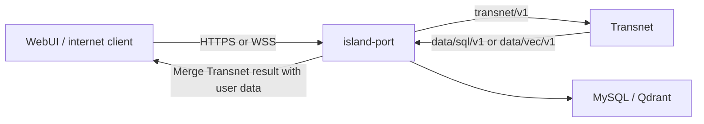

# Transnet service interface

中文：[Transnet 服务接口](../../docs_cn/interfaces/transnet_cn.md)

This contract defines how island-port requests translation and relationship knowledge from Transnet and receives the information needed to build a client response. It is an internal service interface, not the internet-facing WebUI API. Island-port owns HTTPS/WSS client transport, authentication, user data, personalization, response merging, and the final public response. Transnet receives no end-user identity or user-owned state.

This document also defines the transport shared by every internal process boundary involving Transnet. It is normative for island-port, Transnet, publication tooling, and deployment tooling.

Status: target contract. The current runtime still exposes transitional loopback HTTP and does not yet compose the data services.

## Contents

- [Transnet service interface](#transnet-service-interface)
  - [Contents](#contents)
  - [Endpoint reference](#endpoint-reference)
  - [Connection contract](#connection-contract)
  - [HTTP and JSON rules](#http-and-json-rules)
  - [Deadlines, limits, and lifecycle](#deadlines-limits-and-lifecycle)
  - [Example](#example)
  - [Service boundary](#service-boundary)
  - [Shared wire rules](#shared-wire-rules)
  - [Simple translation request](#simple-translation-request)
  - [Request-scoped translation history](#request-scoped-translation-history)
  - [Shared translation result](#shared-translation-result)
  - [Response levels](#response-levels)
  - [Translation persistence](#translation-persistence)
  - [POST /transnet/v1/health](#post-transnetv1health)
  - [POST /transnet/v1/livez](#post-transnetv1livez)
  - [POST /transnet/v1/readyz](#post-transnetv1readyz)
  - [POST /transnet/v1/translations](#post-transnetv1translations)
  - [POST /transnet/v1/senses/get](#post-transnetv1sensesget)
  - [POST /transnet/v1/graph/get](#post-transnetv1graphget)
  - [POST /transnet/v1/graph/neighbors](#post-transnetv1graphneighbors)
  - [Related documents](#related-documents)

## Endpoint reference

- [Transnet service interface](#transnet-service-interface)
  - [Contents](#contents)
  - [Endpoint reference](#endpoint-reference)
  - [Connection contract](#connection-contract)
  - [HTTP and JSON rules](#http-and-json-rules)
  - [Deadlines, limits, and lifecycle](#deadlines-limits-and-lifecycle)
  - [Example](#example)
  - [Service boundary](#service-boundary)
  - [Shared wire rules](#shared-wire-rules)
  - [Simple translation request](#simple-translation-request)
  - [Request-scoped translation history](#request-scoped-translation-history)
  - [Shared translation result](#shared-translation-result)
  - [Response levels](#response-levels)
  - [Translation persistence](#translation-persistence)
  - [POST /transnet/v1/health](#post-transnetv1health)
  - [POST /transnet/v1/livez](#post-transnetv1livez)
  - [POST /transnet/v1/readyz](#post-transnetv1readyz)
  - [POST /transnet/v1/translations](#post-transnetv1translations)
  - [POST /transnet/v1/senses/get](#post-transnetv1sensesget)
  - [POST /transnet/v1/graph/get](#post-transnetv1graphget)
  - [POST /transnet/v1/graph/neighbors](#post-transnetv1graphneighbors)
  - [Related documents](#related-documents)

## Connection contract

Every internal interface involving Transnet uses HTTP/1.1 over a Unix domain stream socket (UDS). TCP listeners, host names, and port numbers are not part of these internal contracts. Island-port calls Transnet through `/run/transnet/transnet.sock`; Transnet calls island-port's structured, vector, and graph endpoints through `/run/island-port/island-port.sock`. Deployments may relocate sockets through configuration, but endpoint paths and payload schemas do not change. Client-to-island-port traffic is outside this UDS rule and uses island-port's public HTTPS/WSS contract.

The process that owns a socket creates its parent directory, removes only its own stale socket after proving no listener is active, binds with mode `0660`, and runs under a dedicated service account. The configured group grants caller access. Socket directory permissions prevent path replacement. Services reject requests forwarded from TCP and do not trust identity headers supplied by clients.

Socket ownership authenticates the calling workload on a single host. These Transnet and database-port interfaces are UDS-only and are not exposed to internet clients.



## HTTP and JSON rules

Requests use HTTP/1.1 with an origin-form path and `Host: localhost`; the Host value is ignored for routing. Request and response bodies use UTF-8 JSON with `Content-Type: application/json`. Every operation, including reads and probes, uses `POST` and carries one JSON object; an empty input is `{}`. Query strings, form data, multipart bodies, upgrades, and streaming responses are rejected.

Endpoint namespaces identify the owning service and contract version:

- Transnet: `/transnet/v1/...`
- structured data: `/data/sql/v1/...`
- vector and graph data: `/data/vec/v1/...`

Clients send `Accept: application/json`, a bounded `Content-Length`, and optionally `X-Request-Id`. Chunked request bodies are rejected. Servers return `X-Request-Id`, reject unknown JSON fields, and close the connection after a bounded number of requests. IDs are opaque URL-safe strings and timestamps are UTC RFC 3339 with microsecond precision.

Application success and error schemas belong to each interface contract. HTTP status reports transport-level acceptance; a data operation may additionally return its documented closed outcome in JSON. Island-port propagates a request ID across both directions but never forwards user identity or user-owned state to Transnet. Malformed JSON, an unsupported media type, an unknown endpoint, or an unsupported method fails before application dispatch.

## Deadlines, limits, and lifecycle

Internal data requests carry `deadline_at` in their documented request context. Public Transnet requests inherit the server's bounded deadline unless their endpoint schema explicitly accepts one. A receiver rejects an expired deadline and never extends it when calling another service. Retryable operations are explicitly identified by their owning contract; mutation retries require an idempotency key.

The default maximum body is 1,048,576 bytes unless an endpoint specifies a smaller bound. Servers bound response size, concurrency, parsing time, and connection lifetime. They stop accepting new connections during graceful shutdown, finish admitted requests within their deadlines, close the listener, and then unlink their own socket.

Request bodies, response bodies, canonical text, vectors, credentials, and socket peer details are excluded from logs and metrics. Observability may record the request ID, static endpoint template, outcome class, byte counts, and elapsed time.

## Example

The following call uses curl's Unix-socket support; the URL host is a placeholder and does not open a TCP connection.

```bash
curl --unix-socket /run/transnet/transnet.sock \
  --request POST http://localhost/transnet/v1/health \
  --header 'content-type: application/json' \
  --header 'accept: application/json' \
  --data '{}'
```

This document is the primary interface contract for Transnet. Transnet is a shared, user-agnostic translation and relationship-knowledge service: it translates connected text and builds bounded meaning-specific detail around one or more materially plausible lexical senses or domain concepts. Calling products own their users, private state, and presentation workflows.

Status: target service contract. The current runtime still uses a transitional loopback TCP listener and legacy paths; runtime availability is stated here.

## Service boundary

Transnet accepts no user ID, learner ID, account ID, cookie, end-user bearer token, profile, preference set, saved-item state, mastery state, or durable personal-history record. It accepts only the minimal prior translation turns that island-port selects as request-scoped linguistic context. Learning profiles, lessons, exercises, mastery, review scheduling, coaching, progress tracking, writing evaluation, speech, and pronunciation are not Transnet modules.

Current text and translation history are request payloads, not user records. They may exist in memory only for the bounded request lifetime and must not be written to MySQL, Qdrant, logs, metrics, traces, caches, or durable queues. Island-port owns history selection and every association between a response and an end user.

Transnet exposes HTTP/1.1 only over `/run/transnet/transnet.sock` by default and does not bind a TCP port or terminate TLS. Filesystem ownership authenticates local calling services, never end users. A cross-host gateway authenticates remote callers and connects through the local socket.

## Shared wire rules

Requests and responses use JSON. Every response returns `X-Request-Id`. Timestamps are UTC RFC 3339 with microsecond precision. IDs are opaque URL-safe strings; clients must not infer type or order from them. Unknown request fields are rejected.

Successful application responses use `data` and `meta`. `meta.request_id` matches the response header. Canonical reads also return the immutable content release used to answer the request.

```json
{
  "data": {},
  "meta": {
    "request_id": "req_01K4Z8P8Y7D3N5Q2F6M1J9T0VX",
    "content_release": "knowledge-2026-09"
  }
}
```

Errors use one safe envelope and never echo request text, context, credentials, provider bodies, vectors, or storage internals.

```json
{
  "error": {
    "code": "invalid_request",
    "message": "The request is invalid.",
    "request_id": "req_01K4Z8P8Y7D3N5Q2F6M1J9T0VX",
    "retryable": false,
    "fields": [
      {
        "field": "target_language",
        "message": "A valid BCP 47 language tag is required."
      }
    ]
  }
}
```

Common statuses are `400` malformed JSON or unknown fields, `401` failed deployment authentication, `404` unknown canonical resource, `409` release conflict, `413` body too large, `422` invalid semantic input, `429` bounded capacity, `502` invalid provider result, `503` required dependency unavailable, and `504` deadline exceeded.

## Simple translation request

Ease of use is a contract requirement. The WebUI asks for the text, source language, target language, and response level only. It does not ask the user to choose translation versus lookup, a domain, dialect, audience, purpose, register, formatting policy, retrieval filters, or model. Island-port forwards the same four fields and may append request-scoped history; Transnet derives every other decision.

```json
{
  "text": "What does ‘hot’ mean here?",
  "source_language": "auto",
  "target_language": "zh-CN",
  "response_level": "standard"
}
```

For the initial version, `source_language` accepts `auto`, `en`, or `zh-CN`; `target_language` accepts `en` or `zh-CN`. The WebUI may display “Chinese” or “CN,” but the wire value remains the valid language tag `zh-CN`. `response_level` accepts `brief`, `standard`, or `full`. Island-port validates these closed values before calling Transnet, and Transnet validates them again.

## Request-scoped translation history

Island-port may append `history` to support several translation turns. The array is chronological, oldest first, and each item contains only the previous source text, translated text, and their languages. There is no protocol-level item-count limit: island-port owns selection, truncation, and the amount sent. The common maximum request-body size still applies, so “unlimited” means no separate history-count cap rather than an unbounded HTTP body.

```json
{
  "text": "Make that more natural.",
  "source_language": "en",
  "target_language": "zh-CN",
  "response_level": "standard",
  "history": [
    {
      "source_text": "The launch date is still up in the air.",
      "translated_text": "发布日期仍未确定。",
      "source_language": "en",
      "target_language": "zh-CN"
    }
  ]
}
```

History is linguistic context, not stored history. It contains no turn ID, time, user ID, feedback, preference, domain tag, model output metadata, or saved-item state. Transnet uses it only for reference resolution, terminology consistency, tone continuity, and follow-up instructions, then discards it with the current request. It never returns the history verbatim.

## Shared translation result

Every successful translation returns one `TranslationResult` at `data.translation`. `translations` is an ordered array rather than one string because a word or phrase may require several materially different meanings. The first item is the preferred interpretation given the current text and history. Additional items appear only when ambiguity matters; the service does not pad the response with trivial synonyms.

Each item has a stable `text` and `language`. `meaning` distinguishes choices when more than one is returned. `canonical` appears only for reviewed content from the named immutable release. `details` is a meaning-specific projection selected by `response_level`; it is not a separate database record.

Brief word response with two necessary meanings:

```json
{
  "translation": {
    "unit": "word",
    "detected_source_language": "en",
    "translations": [
      {
        "text": "热的",
        "language": "zh-CN",
        "meaning": "having a high temperature"
      },
      {
        "text": "热门的",
        "language": "zh-CN",
        "meaning": "currently popular or receiving much attention"
      }
    ]
  }
}
```

Full word response from the same canonical record:

```json
{
  "translation": {
    "unit": "word",
    "detected_source_language": "en",
    "translations": [
      {
        "text": "酷热的",
        "language": "zh-CN",
        "meaning": "uncomfortably hot, especially because of the weather",
        "canonical": {
          "translation_id": "tr_sweltering_zh_cn_01",
          "sense_id": "sense_sweltering_hot_01",
          "release": "knowledge-2026-09"
        },
        "details": {
          "type": "word",
          "part_of_speech": "adjective",
          "aliases": ["oppressively hot"],
          "pronunciations": [{"dialect": "en-US", "ipa": "/ˈswɛltərɪŋ/"}],
          "examples": [
            {
              "source_text": "It was a sweltering afternoon.",
              "translated_text": "那是一个酷热难耐的下午。"
            }
          ],
          "domain_assessment": {
            "classification": "domain_specific",
            "resolution": "existing",
            "selected_domain_ids": ["domain_weather"]
          },
          "domain_facts": [
            {
              "fact_id": "fact_sweltering_degree_scorching_01",
              "statement": "For environmental heat, scorching usually indicates greater intensity than sweltering.",
              "evidence_ids": ["evidence_dictionary_1042"],
              "evidence_state": "verified"
            }
          ],
          "taxonomy": {
            "hypernyms": ["hot"],
            "hyponyms": []
          },
          "intensity_scales": [
            {
              "dimension": "temperature_intensity",
              "items": ["warm", "hot", "sweltering", "scorching"],
              "selected_index": 2
            }
          ]
        }
      }
    ]
  }
}
```

Standard phrase response:

```json
{
  "translation": {
    "unit": "phrase",
    "detected_source_language": "en",
    "translations": [
      {
        "text": "悬而未决",
        "language": "zh-CN",
        "meaning": "not yet decided or settled",
        "details": {
          "type": "phrase",
          "phrase_type": "idiom",
          "usage_notes": ["Used for plans or questions whose outcome is uncertain."],
          "example": {
            "source_text": "Our travel dates are still up in the air.",
            "translated_text": "我们的旅行日期仍未确定。"
          }
        }
      }
    ]
  }
}
```

Standard passage response:

```json
{
  "translation": {
    "unit": "passage",
    "detected_source_language": "en",
    "translations": [
      {
        "text": "那个计划仍然悬而未决。",
        "language": "zh-CN",
        "details": {
          "type": "passage",
          "tips": [
            {
              "kind": "idiom",
              "message": "“up in the air” means undecided rather than physically airborne."
            }
          ]
        }
      }
    ]
  }
}
```

These examples show the reusable inner payload without the outer `data` and `meta` success envelope. Endpoint examples below are complete response bodies.

## Response levels

All response levels may use the same MySQL card and canonical translation records plus the same eligible Qdrant facts. A deterministic response projector selects fields and applies size caps after sense resolution; it never asks the model to invent a smaller schema.

| Level | Always returned | Additional eligible content |
| --- | --- | --- |
| `brief` | Unit, detected source language, ordered translations, and short meaning labels when ambiguity requires them | No examples, tips, or relationship expansion |
| `standard` | Everything in `brief` | Concise definition or phrase usage, at most one example per meaning, at most two passage tips, and only a material contrast or relationship |
| `full` | Everything in `standard` | Pronunciation, aliases, morphology, more examples and usage notes, domain facts, provenance, taxonomy, hypernyms, hyponyms, intensity scales, and other bounded relationship groups |

Multiple meanings override brevity when omission would make the translation misleading. Empty fields and empty relationship groups are omitted at every level. A lower level never changes the ranked meanings or their translations; it only projects fewer supporting fields.

Domain assessment uses the closed `resolution` values `existing`, `proposed_new`, `general`, and `uncertain`. A `proposed_new` result has no domain ID and may include a request-local label, definition, broader-domain candidates, and reason only at `full` level. It is never represented as verified knowledge. Failure to load the existing-domain inventory always produces `uncertain`, not `proposed_new`.

## Translation persistence

A live translation result is ephemeral and has no save flag. Transnet first may resolve an exact reviewed canonical translation from the pinned MySQL release; otherwise it calls a provider and discards the request, response, and intermediate terminology ledger after the bounded request. It never stores a provider result as a side effect of traffic or decides importance from user behavior.

There are two meanings of important and they have different owners. A translation saved, starred, or labeled important by an end user is private product data and island-port stores the association outside Transnet. A translation important to the shared language product is a canonical-content candidate: authorized publication tooling stages it with provenance and rights metadata, reviewers approve it, and a later immutable content release makes it readable by Transnet. The [SQL data endpoint contract](mysql.md) owns that storage and publication design.

## POST /transnet/v1/health

Returns process health without probing dependencies or revealing configuration.

Request:

```json
{}
```

Response `200`:

```json
{
  "data": {
    "status": "ok"
  },
  "meta": {
    "request_id": "req_01K4Z8P8Y7D3N5Q2F6M1J9T0VX"
  }
}
```

## POST /transnet/v1/livez

Returns success while the process event loop is responsive.

Request:

```json
{}
```

Response `200`:

```json
{
  "data": {
    "status": "ok"
  },
  "meta": {
    "request_id": "req_01K4Z8Q8X2A6B7C4D9E0F3G5HJ"
  }
}
```

## POST /transnet/v1/readyz

Returns `200` only when dependencies required by enabled routes are ready. Optional capabilities may be degraded without making the process unready.

Request:

```json
{}
```

Response `200`:

```json
{
  "data": {
    "status": "ok",
    "dependencies": {
      "mysql": "ready",
      "qdrant": "ready",
      "translation_provider": "ready"
    },
    "capabilities": {
      "translation": "available",
      "canonical_lookup": "available",
      "relationship_pages": "available"
    }
  },
  "meta": {
    "request_id": "req_01K4Z8R4CX7E2J6K1M9N3P5Q8S"
  }
}
```

Response `503` uses the standard error envelope with code `not_ready`. It may name a dependency class but must not expose a host, credential, collection name, or provider response.

## POST /transnet/v1/translations

This is the single entry point for a new translation turn. It translates a word, phrase, sentence, or passage and automatically chooses lexical lookup, domain expansion, or connected-text translation. The WebUI and island-port never select that mode. The request uses the simple fields above; `history` is optional and defaults to an empty array.

Request:

```json
{
  "text": "That plan is still up in the air.",
  "source_language": "auto",
  "target_language": "zh-CN",
  "response_level": "standard",
  "history": []
}
```

Response `200`:

```json
{
  "data": {
    "translation": {
      "unit": "passage",
      "detected_source_language": "en",
      "translations": [
        {
          "text": "那个计划仍然悬而未决。",
          "language": "zh-CN",
          "details": {
            "type": "passage",
            "tips": [
              {
                "kind": "idiom",
                "message": "“up in the air” means undecided rather than physically airborne."
              }
            ]
          }
        }
      ]
    }
  },
  "meta": {
    "request_id": "req_01K4Z8S1AK6C8D2F0G4H7J9M3N",
    "response_level": "standard",
    "model_version": "translate-2026-09"
  }
}
```

Passage `tips` contains at most two one-sentence items and is omitted when it adds no material value. Protected spans, paragraph structure, and formatting are inferred and preserved automatically. Any chunk plan or terminology ledger used for long text is discarded with the request. If Qdrant is unavailable but MySQL resolves a canonical word or phrase, Transnet returns the eligible lexical fields with relationship sections omitted and `meta.degraded: true`; it never invents replacements.

## POST /transnet/v1/senses/get

Reads one canonical sense and projects it with the same response-level rules as a translation result. It is a port-driven follow-up using an ID previously returned by Transnet, not a second user-selected translation mode. The service keeps no access or saved-item records.

Request:

```json
{
  "sense_id": "sense_sweltering_hot_01",
  "target_language": "zh-CN",
  "response_level": "full",
  "release": "knowledge-2026-09"
}
```

Response `200`:

```json
{
  "data": {
    "card_id": "card_sweltering_en_adj_01",
    "sense_id": "sense_sweltering_hot_01",
    "canonical_form": "sweltering",
    "aliases": ["oppressively hot"],
    "language": "en",
    "part_of_speech": "adjective",
    "definitions": ["uncomfortably hot, especially because of the weather"],
    "translations": [
      {
        "language": "zh-CN",
        "text": "酷热的"
      }
    ],
    "forms": [
      {
        "form": "swelteringly",
        "label": "adverb"
      }
    ],
    "examples": [
      {
        "text": "We waited until evening to leave the sweltering house.",
        "translation": "我们一直等到傍晚才离开闷热难耐的房子。"
      }
    ],
    "usage_notes": ["Usually describes weather or an uncomfortably hot place."],
    "knowledge_root_ids": ["node_sweltering_hot_01"],
    "domain_ids": ["domain_weather"],
    "evidence_ids": ["evidence_dictionary_1042"]
  },
  "meta": {
    "request_id": "req_01K4Z8V2DE5F7G9H1J3K6M8NPQ",
    "content_release": "knowledge-2026-09",
    "response_level": "full"
  }
}
```

## POST /transnet/v1/graph/get

Reads a bounded canonical subgraph rooted at one sense, concept node, or domain. The port derives its filters from the selected resource and response level; these fields are not WebUI controls. `depth` is limited to the configured shallow maximum. Results remain rooted, typed, and scope-filtered; this endpoint is not a general graph-query language or an unrestricted neighbor dump.

Request:

```json
{
  "root_kind": "sense",
  "root_id": "sense_sweltering_hot_01",
  "depth": 1,
  "relation_types": ["lower_degree", "higher_degree", "collocation"],
  "verification_state": "verified",
  "node_limit": 20,
  "edge_limit": 30,
  "release": "knowledge-2026-09"
}
```

Response `200`:

```json
{
  "data": {
    "root": {
      "kind": "sense",
      "id": "sense_sweltering_hot_01",
      "node_id": "node_sweltering_hot_01"
    },
    "nodes": [
      {
        "node_id": "node_sweltering_hot_01",
        "node_type": "lexical_sense",
        "label": "sweltering"
      },
      {
        "node_id": "node_scorching_heat_01",
        "node_type": "lexical_sense",
        "label": "scorching"
      }
    ],
    "edges": [
      {
        "edge_id": "edge_sweltering_scorching_01",
        "source_node_id": "node_sweltering_hot_01",
        "target_node_id": "node_scorching_heat_01",
        "relation_type": "higher_degree",
        "explanation": "Scorching usually expresses a stronger degree of heat than sweltering.",
        "restrictions": {"dimension": "temperature_intensity"},
        "evidence_state": "verified",
        "confidence": 0.96,
        "provenance": ["evidence_dictionary_1042"],
        "verification_state": "verified"
      }
    ],
    "truncated": false
  },
  "meta": {
    "request_id": "req_01K4Z8W9RS2T4V6X0Y1Z3A5BCD",
    "content_release": "knowledge-2026-09"
  }
}
```

## POST /transnet/v1/graph/neighbors

Pages direct incoming and outgoing relationships for one canonical node. The cursor is scoped to the root, filters, and release and must not contain request text.

Request:

```json
{
  "kind": "knowledge_node",
  "id": "node_sweltering_hot_01",
  "direction": "both",
  "relation_types": ["lower_degree", "higher_degree"],
  "verification_state": "verified",
  "limit": 10,
  "cursor": null,
  "release": "knowledge-2026-09"
}
```

Response `200`:

```json
{
  "data": {
    "root_node_id": "node_sweltering_hot_01",
    "neighbors": [
      {
        "edge": {
          "edge_id": "edge_hot_sweltering_01",
          "source_node_id": "node_hot_temperature_01",
          "target_node_id": "node_sweltering_hot_01",
          "relation_type": "higher_degree",
          "explanation": "Sweltering expresses a more uncomfortable degree of heat than hot.",
          "restrictions": {"dimension": "temperature_intensity"},
          "evidence_state": "verified",
          "confidence": 0.96,
          "provenance": ["evidence_dictionary_1042"],
          "verification_state": "verified"
        },
        "node": {
          "node_id": "node_hot_temperature_01",
          "node_type": "lexical_sense",
          "label": "hot"
        }
      }
    ],
    "next_cursor": null
  },
  "meta": {
    "request_id": "req_01K4Z8X6FG1H3J5K7M9N2P4QRS",
    "content_release": "knowledge-2026-09"
  }
}
```

## Related documents

- [System design](../transnet.md)
- [MySQL interface](mysql.md)
- [Qdrant interface](qdrant.md)
