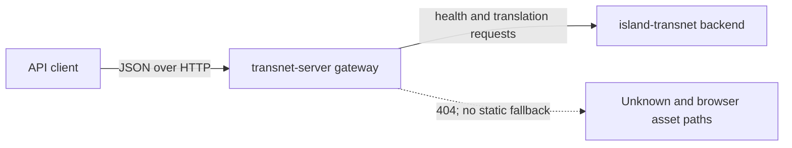

# Gateway reference

## Contents

- [Overview](#overview)
- [Architecture](#architecture)
- [API](#api)
- [Design](#design)
- [Testing](#testing)

## Overview

`transnet-server` is the public JSON HTTP gateway for the Transnet translation backend. It owns HTTP routing, gateway response envelopes, CORS, process configuration, and translation forwarding. It does not own translation logic, persistence, authentication enforcement, browser assets, or a WebUI.

The crate depends on Axum and Tokio for HTTP execution, Reqwest for backend calls, Serde for wire types, `thiserror` for library error categories, and `anyhow` for process startup context.

## Architecture

`routes` owns the Axum boundary, `model` owns gateway wire types, `backend` owns the outbound backend adapter, `config` owns environment parsing, and `error` owns stable internal error categories. `lib.rs` re-exports the public crate surface; `main.rs` only composes dependencies and process lifecycle.

## API

Call [`create_router`](../../../transnet-server/src/routes.rs) and attach an [`AppState`](../../../transnet-server/src/routes.rs) configured with the backend base URL. The returned router exposes JSON endpoints documented in the [gateway API index](api/README.md). Unknown paths, `/`, `/index.html`, `/assets/*`, and `/resource/*` return `404 Not Found`.

`ServerConfig::from_env` reads `GATEWAY_HOST` (default `0.0.0.0`), `GATEWAY_PORT` (default `8080`), `WORKERS` (default `4`), and `RUST_LOG` (default `info`). Invalid numeric values stop startup with contextual errors. `BACKEND_HOST` and `BACKEND_PORT` are composed by the binary and default to `127.0.0.1:35792`.

## Design

The gateway preserves the existing API routes while separating the backend adapter from HTTP handlers. Backend status 422 maps to `VALIDATION_ERROR`; transport and other backend failures map to `BACKEND_ERROR`. The `/api/health` readiness route intentionally hides backend error details, while `/health` preserves the legacy backend envelope.

Account, history, favorites, profile, about, and stats handlers remain compatibility stubs. They are not a security or persistence implementation. CORS remains permissive for compatibility and should be narrowed before exposing the service to untrusted browser origins.

Static serving was removed so API deployment cannot accidentally expose source files or stale frontend bundles. A separate static host or browser application may consume the API without coupling its release lifecycle to the gateway.

## Testing

Unit tests cover configuration defaults and invalid numeric input, response-envelope serialization, optional user ID omission, backend URL normalization, and the absence of WebUI fallback routes. Run all gateway tests with `cargo test -p transnet-server`, lint with `cargo clippy -p transnet-server --all-targets -- -D warnings`, and format with `cargo fmt --all -- --check`.
