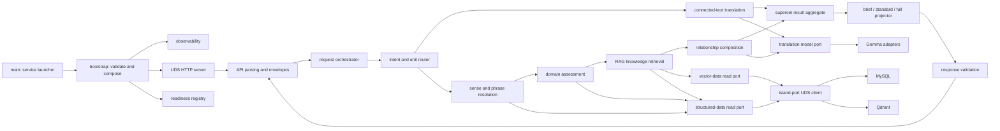
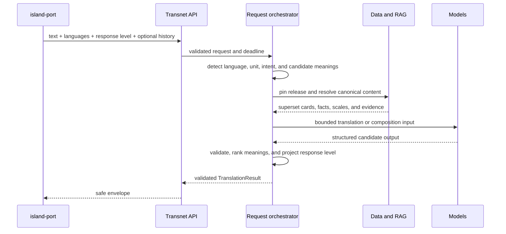

# Service module reference

中文：[服务模块参考](../../docs_cn/reference/modules_cn.md)

This reference defines the target module boundaries from process launch through translation, RAG, storage, publication, and shutdown. It also maps the checked-in Rust modules so an implementer can distinguish existing runtime behavior from target architecture.

Status: target module design with a current-runtime inventory. Names under target layout are architectural destinations, not claims that those files already exist.

## Dependency rule

Transnet remains one Cargo package. Runtime dependencies point inward as `transport -> application -> domain <- ports <- adapters`. Domain code knows no HTTP, Unix socket, database, provider, or logging implementation. API modules validate and map wire data but contain no translation, retrieval, or persistence decisions. Application modules orchestrate use cases through narrow ports. Adapters implement provider and island-port I/O.

The online service receives read-only structured/vector ports. Only the separate offline publisher composition receives mutation-capable ports. Current text and translation history never cross a durable write port.

## End-to-end components

The WebUI talks to island-port, never directly to Transnet. The only human choices besides entering text are source language, target language, and response level. Island-port may add minimal prior translation turns. Transnet automatically chooses every internal branch shown above.

## Current module inventory

| Status | Modules | Responsibility and disposition |
| --- | --- | --- |
| Current and wired | `src/main.rs`, `src/api.rs`, `src/config.rs`, `src/logger.rs`, `src/provider.rs`, `src/resilience.rs` | Launch the transitional loopback server, expose legacy routes, configure providers, route plain translation by length, and provide resilience/logging. Retain behavior where useful but refactor into the target boundaries. |
| Current and wired | `src/application/lookup.rs`, `src/adapters/learning_model.rs` | Provide the model-backed legacy structured lookup. Replace its learning-specific schema with the shared translation aggregate and automatic router. |
| Existing foundation, not production-composed | canonical lookup/card/cache/sense, retrieval, graph, graph topology cache, content release, request ID, problem mapping, readiness, metrics, and their ports/in-memory adapters | Reuse tested invariants, then connect them through production UDS adapters and the target request orchestrator. |
| Existing foundation to narrow | `src/domain/graph.rs` and graph application/port modules | Retain sense-qualified nodes, relation direction, evidence, and semantic-scale concepts. Expand to target facts/domains while removing feedback or user-view concerns. |
| Scheduled for removal | learner/profile/vocabulary, practice/mastery/scheduling, private feedback, saved graph views, lookup jobs, durable workers, and their ports/adapters/routes | These are product-owned or durable request workflows outside the focused Transnet boundary. They must not be reachable or reusable service APIs. |

The executable currently binds loopback TCP and wires only health, translation, and legacy model lookup. Existing sense, graph, release, and retrieval foundations appearing in source are not evidence that the default launcher composes those capabilities.

## Target source layout

### Launcher and composition

- `src/main.rs`: parse no business input; call bootstrap, report fatal startup failure, and choose the process exit status.
- `src/bootstrap.rs`: load and validate configuration, initialize observability, construct adapters and application services, register readiness, bind the owned UDS, and coordinate graceful shutdown.
- `src/config.rs`: typed configuration, defaults, cross-field validation, and secret references. It never reads request data.
- `src/resilience.rs`: bounded deadlines, concurrency, retries, and circuit breakers for idempotent provider and data reads.
- `src/observability/mod.rs`, `logging.rs`, `metrics.rs`: safe aggregate events only; never format current text, history, canonical text, provider bodies, vectors, or credentials.

Startup order is configuration -> observability -> provider clients -> island-port client -> application services -> readiness registry -> UDS bind -> accept loop. Shutdown stops admission, drains accepted work within deadlines, closes clients, unlinks only the owned socket, flushes safe telemetry, and exits.

### Transport and API

- `src/transport/uds_server.rs`: HTTP/1.1 over the configured Unix stream socket, ownership/mode checks, connection bounds, and graceful listener lifecycle.
- `src/transport/json.rs`: UTF-8 JSON media type, body limit, strict decoding, response encoding, and no body logging.
- `src/transport/middleware.rs`: request ID, deadline, concurrency, outcome metrics, and safe status mapping.
- `src/api/request.rs`: exact wire requests, including the simple translation turn and minimal history item.
- `src/api/response.rs`: success metadata, `TranslationResult`, meanings, details, graph reads, and response-level serialization.
- `src/api/problem.rs`: closed safe errors without request echo or storage/provider internals.
- `src/api/v1/probes.rs`, `translations.rs`, `sense.rs`, `graph.rs`: thin handlers. `translations` is the only new-turn entry; sense and graph routes are follow-up reads by returned canonical ID.

### Application orchestration

- `request_orchestrator.rs`: one deadline and release pin across routing, provider calls, retrieval, composition, projection, and validation.
- `intent_router.rs`: classify word, phrase, or passage and choose lexical/domain versus connected-text processing without a WebUI mode.
- `translation.rs`: translate short connected text and build the primary passage result.
- `long_text.rs`: request-local chunk plan and terminology ledger; both are dropped before return.
- `sense_resolution.rs`: normalize and rank exact, alias, inflection, spelling, and semantic candidates; retain several meanings when materially plausible.
- `domain_assessment.rs`: retrieve existing domains, allowlist model selection, and emit `existing`, `proposed_new`, `general`, or `uncertain`.
- `knowledge_retrieval.rs`: read domain profiles, retrieve Qdrant candidates, hydrate authoritative facts/evidence from structured data, and build a bounded fact bundle.
- `relationship_ranker.rs`: rank only sense-applicable, domain-applicable, evidence-eligible facts; keep taxonomy, intensity, contrast, and similarity separate.
- `page_composer.rs`: organize meaning-specific lexical/domain detail and concise explanations without changing fact identity or evidence state.
- `response_projection.rs`: project one superset aggregate to `brief`, `standard`, or `full` through deterministic field and item allowlists.
- `validation.rs`: enforce language support, history shape, meaning consistency, release IDs, relationship direction, evidence labels, graph bounds, and response size.

### Domain types

- `language.rs`: current product language selectors—automatic source, English, and Simplified Chinese—and canonical internal language-tag mapping.
- `request.rs`: current text, requested languages, response level, and chronological minimal translation history.
- `translation.rs`: unit classification, ordered meaning-specific translations, passage tips, and canonical translation references.
- `lexical.rs`: lexemes, phrases, stable senses, definitions, pronunciation, morphology, examples, usage, and aliases.
- `domain.rs`: domain identity, scope, existing/new resolution, and knowledge coverage profile.
- `knowledge.rs`: atomic fact identity, typed statement, conditions, evidence, provenance, verification, and release.
- `relationship.rs`: exact relation registry including `is_a`, `has_subtype`, contrasts, grammar, terminology, technical facts, and derived degree comparisons.
- `semantic_scale.rs`: named dimension, direction, conditions, ordered sense-qualified members, and evidence. It is never a taxonomy alias.
- `evidence.rs`: source, rights, support status, and display-safe provenance.
- `release.rs`: immutable compatible MySQL/Qdrant release identity and degradation state.
- `response_level.rs`: closed `brief`, `standard`, and `full` values plus projection policy identifiers.

### Ports and adapters

- `ports/translation_model.rs`: connected-text translation and bounded structured composition operations.
- `ports/structured_data.rs`: operation-focused canonical translation, card, sense, domain inventory, fact hydration, scale, evidence, and release reads.
- `ports/vector_data.rs`: operation-focused node, fact/edge, neighborhood, and semantic-scale retrieval.
- `ports/clock.rs` and `ports/metrics.rs`: deadline time and safe aggregate outcomes.
- `adapters/providers/openai.rs`, `gemma4.rs`, `translate_gemma.rs`: protocol client plus role-specific prompts and strict schemas.
- `adapters/island_port/uds_client.rs`, `sql.rs`, `vector.rs`: bounded HTTP/1.1 JSON calls over island-port's socket. Transnet contains no direct MySQL or Qdrant driver.

Port traits express application operations rather than generic persistence. Read inputs may contain derived lookup forms, fingerprints, canonical IDs, filters, and release IDs, but never user identity. Runtime compositions receive no mutation method.

## Translation-turn lifecycle

History is read-only context, oldest first, with no independent item-count maximum. Island-port fits it within the request-body limit; Transnet either accepts the full body or rejects it and never silently drops turns. The request owns every history allocation. No cache key, metric, trace, provider log, vector, queue, or durable adapter may retain it.

The orchestrator builds one release-pinned superset regardless of response level. Multiple lexical meanings are ranked from current text and history. A lower response level may remove supporting fields and excess low-value items, but it cannot hide a materially plausible meaning when doing so would mislead.

## Domain and RAG lifecycle

Domain assessment first retrieves a compact inventory of existing domain IDs, multilingual names, scope boundaries, broader domains, and RAG coverage. The model may select only supplied IDs. Selecting none with a structured explanation produces a request-local new-domain proposal; an unavailable inventory produces `uncertain`. Neither outcome writes storage.

For selected existing domains, retrieval consults the knowledge profile, requests only useful available fact families, retrieves candidates from Qdrant, and hydrates exact basic facts and evidence through the structured-data port. The composer receives facts with explicit missing families and provenance. Vector similarity is only candidate selection.

Taxonomy and intensity form a core vertical slice across domain schema, publication validation, vector projection, retrieval, and response. `is_a` points child sense -> parent category and `has_subtype` is its inverse. A semantic scale such as `warm -> hot -> sweltering -> scorching` is a separate ordered entity with a named dimension and conditions. Derived adjacent degree edges never become parent-child edges.

## Offline publication composition

Publication code is reusable library code under `src/publication`: staging, validation, projection, reconciliation, activation, quarantine, and rollback. If this repository owns a launcher, `src/bin/transnet-publisher.rs` composes it separately from the online service. This is the only composition allowed mutation-capable structured/vector ports.

The publisher accepts licensed sources and deliberately generated seed candidates. Generated candidates record their model, prompt, schema, run, and time and begin quarantined. Evidence or an approved editorial-source policy, rights review, deterministic validation, and reviewer approval are required before immutable activation. The release builds MySQL canonical translations/cards/domains/facts/scales first, projects Qdrant nodes and edges second, reconciles hashes and references, evaluates the exact pair, and activates atomically.

## Failure and readiness ownership

Bootstrap reports ready only when dependencies required by enabled routes can serve compatible schemas and a compatible active release. Provider failure may use a bounded alternate provider. Qdrant failure degrades a resolved lexical response to MySQL content. Missing optional fact families produce explicit partial coverage. MySQL or release incompatibility fails canonical reads safely. Domain-inventory failure cannot create a new-domain proposal. Deadline exhaustion stops downstream work and returns the safe timeout envelope.

## Migration sequence

1. Introduce shared request, history, language, response-level, translation-result, and superset types without changing the current listener.
2. Replace the legacy translation and learning lookup handlers with the single automatic orchestration path.
3. Add deterministic response projection and multi-meaning contract tests.
4. Compose canonical read foundations behind operation-focused structured/vector ports.
5. Add domain inventory, fact hydration, semantic-scale retrieval, and relationship composition.
6. Move to the UDS transport and production island-port adapters.
7. Add the separate publisher composition and paired release activation.
8. Remove unreachable learner, practice, feedback, saved-view, job, and durable-work modules.

Each slice updates types, handlers, ports, adapters, tests, current/target status, and both language trees together.

## Related documents

- [System design](../transnet.md)
- [Transnet service interface](../interfaces/transnet.md)
- [SQL data endpoints](../interfaces/mysql.md)
- [Vector data endpoints](../interfaces/qdrant.md)
- [Content publishing](../guides/content-publishing.md)
- [Quality assurance](../guides/quality-assurance.md)
