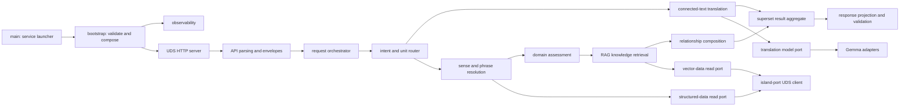

# Service module reference

中文：[服务模块参考](../../docs_cn/reference/modules_cn.md)

This catalog defines the target module boundaries from process launch through translation, retrieval, publication, and shutdown. Each target module has one focused reference page; this catalog owns only the dependency rules, runtime inventory, end-to-end map, and reading order shared across modules.

Status: target module design with a current-runtime inventory. A linked target page describes an architectural destination unless its status note explicitly identifies checked-in and composed behavior.

## Dependency rule

Transnet remains one Cargo package. Runtime dependencies point inward as `transport -> application -> domain <- ports <- adapters`. Domain code knows no HTTP, Unix socket, database, provider, or logging implementation. API modules validate and map wire data but contain no translation, retrieval, or persistence decisions. Application modules orchestrate use cases through narrow ports. Adapters implement provider and island-port I/O.

The online service receives read-only structured/vector ports. Only the separate offline publisher composition receives mutation-capable ports. Current text and translation history never cross a durable write port.

## End-to-end components

The WebUI talks to island-port, never directly to Transnet. Island-port may add minimal prior translation turns as request-scoped context. Transnet automatically selects the internal path, pins one compatible release trio, and discards current text, history, intermediate model output, and request-local proposals with the request.

## Current module inventory

- Current and wired: `src/main.rs`, `src/api.rs`, `src/config.rs`, `src/logger.rs`, `src/provider.rs`, `src/resilience.rs`, `src/application/lookup.rs`, and `src/adapters/learning_model.rs` launch the transitional loopback server, expose legacy routes, configure and protect providers, route plain translation by length, and provide the model-backed legacy structured lookup.
- Existing foundation, not production-composed: canonical lookup, card, cache, sense, retrieval, graph, graph topology cache, content release, request ID, problem mapping, readiness, metrics, their ports, and their in-memory adapters provide tested pieces for the target service.
- Existing foundation to narrow: graph domain, application, and port modules retain useful sense-qualified nodes, relationship direction, evidence, and semantic-scale concepts but must lose feedback and user-view concerns.
- Scheduled for removal: learner/profile/vocabulary, practice/mastery/scheduling, private feedback, saved graph views, lookup jobs, durable workers, and their ports, adapters, and routes are product-owned or durable request workflows outside Transnet's boundary.

The executable currently binds loopback TCP and wires only health, translation, and legacy model lookup. A checked-in foundation or a target reference page is not evidence that the default launcher composes that capability.

## Launcher and composition

- [Main launcher](main.md): process entry, fatal startup reporting, and exit status.
- [Bootstrap](bootstrap.md): configuration, adapter composition, readiness, listener ownership, and shutdown.
- [Configuration](config.md): typed settings, defaults, validation, and secret references.
- [Resilience](resilience.md): bounded timeouts, concurrency, retries, and circuit breakers.
- [Observability](observability/telemetry.md), [logging](observability/logging.md), and [metrics](observability/metrics.md): safe aggregate telemetry with no request content.

## Transport and API

- [UDS server](transport/uds-server.md), [JSON transport](transport/json.md), and [transport middleware](transport/middleware.md): HTTP/1.1 over the owned Unix socket, strict bodies, request bounds, and safe outcomes.
- [API request types](api/request.md), [response types](api/response.md), and [problem responses](api/problem.md): exact wire mapping and closed safe errors.
- [Probes](api/v1/probes.md), [translations](api/v1/translations.md), [sense reads](api/v1/sense.md), and [graph reads](api/v1/graph.md): thin versioned route handlers.

## Application orchestration

- [Request orchestrator](application/request-orchestrator.md): one deadline and release pin across a translation turn.
- [Intent router](application/intent-router.md): automatic word, phrase, or passage classification.
- [Translation](application/translation.md) and [long text](application/long-text.md): connected-text translation plus request-local chunk and terminology planning.
- [Sense resolution](application/sense-resolution.md) and [domain assessment](application/domain-assessment.md): canonical candidate ranking and closed domain outcomes.
- [Knowledge retrieval](application/knowledge-retrieval.md), [relationship ranker](application/relationship-ranker.md), and [page composer](application/page-composer.md): evidence-aware fact hydration, ranking, and explanation.
- [Response projection](application/response-projection.md) and [validation](application/validation.md): deterministic `brief`, `standard`, and `full` views plus final invariant checks.

## Domain types

- [Language](domain/language.md), [request](domain/request.md), [translation](domain/translation.md), and [response level](domain/response-level.md): request and result vocabulary independent of transport.
- [Lexical](domain/lexical.md) and [domain](domain/domain.md): stable sense, phrase, and knowledge-domain identity.
- [Knowledge](domain/knowledge.md), [relationship](domain/relationship.md), and [semantic scale](domain/semantic-scale.md): atomic facts, exact typed relations, and ordered non-taxonomic degree dimensions.
- [Evidence](domain/evidence.md) and [release](domain/release.md): support, provenance, immutable compatible release identity, and degradation state.

## Ports and adapters

- [Translation model](ports/translation-model.md), [structured data](ports/structured-data.md), and [vector data](ports/vector-data.md): operation-focused model and canonical/retrieval reads.
- [Clock](ports/clock.md) and [metrics](ports/metrics.md): deadline time and aggregate outcome boundaries.
- [OpenAI-compatible protocol](adapters/providers/openai.md), [Gemma 4](adapters/providers/gemma4.md), and [TranslateGemma](adapters/providers/translate-gemma.md): protocol and role-specific provider adapters.
- [Island-port UDS client](adapters/island-port/uds-client.md), [SQL adapter](adapters/island-port/sql.md), and [vector adapter](adapters/island-port/vector.md): bounded JSON calls without direct MySQL or Qdrant drivers.

Port traits express application operations rather than generic persistence. Read inputs may contain derived lookup forms, fingerprints, canonical IDs, filters, and release IDs, but never user identity. Runtime composition receives no mutation method.

## Offline publication

- [Publication module](publication/publication-workflow.md): staging, validation, projection, reconciliation, activation, quarantine, and rollback library boundary.
- [Publisher launcher](bin/transnet-publisher.md): optional composition root that alone receives mutation-capable structured and vector ports.

The publisher builds authoritative structured content first, projects immutable vector collections second, reconciles the exact release trio, evaluates it, and activates it atomically. Live request handling never publishes itself.

## Migration sequence

1. Introduce shared request, history, language, response-level, translation-result, and superset types without changing the current listener.
2. Replace the legacy translation and learning lookup handlers with the single automatic orchestration path.
3. Add deterministic response projection and multi-meaning contract tests.
4. Compose canonical read foundations behind operation-focused structured/vector ports.
5. Add domain inventory, fact hydration, semantic-scale retrieval, and relationship composition.
6. Move to the UDS transport and production island-port adapters.
7. Add the separate publisher composition and paired release activation.
8. Remove unreachable learner, practice, feedback, saved-view, job, and durable-work modules.

Each slice updates types, handlers, ports, adapters, tests, current/target status, and both language trees together.

## Related documents

- [System design](../transnet.md)
- [Transnet service interface](../interfaces/transnet.md)
- [SQL data endpoints](../interfaces/mysql.md)
- [Vector data endpoints](../interfaces/qdrant.md)
- [Content publishing](../guides/content-publishing.md)
- [Quality assurance](../guides/quality-assurance.md)
