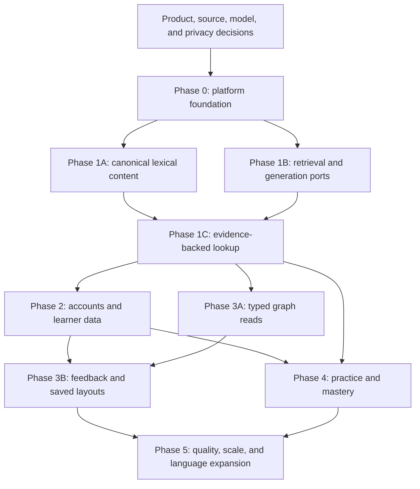

# Basic-core overall plan

## Status

This plan tracks delivery of the English-learning platform. The default executable still runs the model-only structured learning slice. The repository also contains reusable Rust foundations for canonical content and retrieval, content-release transitions, typed graph reads, private learner, feedback, and layout state, lookup-job lifecycle, and boundary ports with in-memory adapters. Those foundations are not production integrations: the default executable does not wire canonical content, a durable persistence backend, a worker, or authentication. They do not change the unfinished roadmap checkboxes or satisfy a phase exit criterion.

Checkbox meanings:

- `[x]` completed and verified.
- `[ ]` not completed.
- A task is not complete until its code, tests, documentation, migration, observability, and rollback requirements pass.

## Product outcome

Deliver a multilingual-to-English learning backend that returns evidence-backed word senses, usage, relationships, private history, a bounded graph contract, and adaptive practice while preserving the existing `/translate` contract.

## Current baseline

- [x] Rust HTTP service builds and tests.
- [x] `GET /health` reports process health.
- [x] `POST /translate` validates input and routes to the configured local model provider.
- [x] `POST /v1/lookups` returns a validated, model-generated English learning card without pretending generated content is canonical evidence.
- [x] Current translation API and configuration are documented.
- [x] Target learning architecture is documented in [system design](transnet.md).
- [x] Proposed learner behavior is documented in [learning experience](product/learning-experience.md).
- [x] Proposed `/v1` routes are documented in [learning API](reference/learning-api.md).
- [x] Proposed persistence is documented in [MySQL schema](reference/mysql-schema.md).
- [x] Content and quality workflows are documented.

## Decisions required before code

- [ ] Confirm the first enabled source language; recommended first slice is Simplified Chinese.
- [ ] Confirm the next language candidates and reviewer availability; current candidates are Spanish, Japanese, and Korean.
- [ ] Confirm initial English dialect coverage; recommended default is `en-US` with sourced `en-GB` alternatives.
- [ ] Confirm the initial audience and optimized CEFR range; recommended default is age 16+ and A1 through B2.
- [ ] Approve dictionary, corpus, pronunciation, audio, frequency, CEFR, and etymology sources and licenses.
- [ ] Decide whether learning-card LLM and embedding providers must remain local or may be managed.
- [ ] Benchmark and select the vector engine against retrieval, filtering, rebuild, backup, Rust client, and operations needs.
- [ ] Confirm OIDC identity provider and same-site WebUI/API deployment.
- [ ] Confirm history is opt-in with a default 90-day retention period.
- [ ] Confirm community feedback affects ranking and review queues but cannot publish facts.
- [ ] Select and version the initial spaced-repetition scheduler.
- [ ] Approve per-language abstention and release thresholds.
- [ ] Record confirmed choices as architecture decision records.

## Delivery dependency graph

## Phase 0: Preserve and prepare

### Repository and process boundary

- [ ] Keep one Cargo package and split runtime entry points into API and worker binaries.
- [x] Introduce HTTP-only, application, domain, port, and adapter module boundaries for the lookup slice.
- [x] Keep provider DTOs, domain types, and public API DTOs separate in the lookup slice.
- [ ] Add dependency-injected clock, repositories, retriever, model client, and durable queue ports.
- [x] Keep existing `/translate` behavior and integration tests unchanged.

### Configuration and observability

- [ ] Define configuration for MySQL, vector engine, OIDC, content release, encryption keys, model providers, deadlines, limits, and allowed origins.
- [ ] Add request IDs and structured redacted tracing.
- [ ] Add `/livez` and `/readyz` with documented dependency policy.
- [ ] Add per-provider deadlines, concurrency bounds, retry classification, bulkheads, and circuit breakers.
- [ ] Add metric names for lookup stages, model validation, jobs, vector lag, graph, feedback, and practice.
- [ ] Prove raw queries, contexts, answers, tokens, and identity fields are absent from telemetry.

### Database and API foundation

- [ ] Select and add a migration framework.
- [ ] Add MySQL connection pooling, transaction helpers, and migration readiness.
- [ ] Add application-generated ULIDs and UTC clock handling.
- [ ] Add versioned `/v1` routing and RFC 9457-style errors.
- [ ] Publish OpenAPI and JSON Schemas and generate or contract-test Rust and TypeScript types.
- [ ] Add scoped idempotency storage and concurrency behavior.
- [ ] Add transactional outbox claiming, leases, retry, dead state, and replay tooling.
- [ ] Add exact CORS origins, payload limits, Unicode validation, and secret management.

### Phase 0 exit criteria

- [ ] Existing checks pass with no `/translate` contract regression.
- [ ] API and worker start independently against an empty migrated database.
- [ ] A synthetic durable job survives process restart and executes once effectively.
- [ ] Contract tests cover error, idempotency, readiness, and version envelopes.
- [ ] Rollback to the pre-foundation process is documented and tested.

## Phase 1: Evidence-backed lookup

### Phase 1A: Canonical lexical content

- [ ] Implement releases, active content pointer, languages, sources, and evidence fragments.
- [ ] Implement lexemes, word forms, aliases, pronunciations, senses, and localized glosses.
- [ ] Implement usage labels, grammar patterns, collocations, examples, pitfalls, etymology, and sense history.
- [ ] Implement sense and lexeme relation types with inverse projection rules.
- [ ] Implement semantic scales and ordered members.
- [ ] Implement entity successor mappings for sense split and merge.
- [ ] Enforce assertion-level source permission, confidence, status, and release lineage.
- [ ] Build the first licensed Simplified-Chinese-to-English staging release.

### Phase 1B: Retrieval and model infrastructure

- [ ] Implement exact form, phrase, lemma, and morphology retrieval.
- [ ] Implement MySQL full-text retrieval with language-aware normalization.
- [ ] Select and integrate the vector engine through a port.
- [ ] Index canonical English senses and per-language gloss views separately.
- [ ] Index independently citable evidence fragments.
- [ ] Implement release and metadata filters on every vector query.
- [ ] Implement deterministic candidate fusion, reranking, and deduplication.
- [ ] Implement vector reconciliation and blue-green collection build.
- [x] Implement JSON-Schema-constrained model output and one bounded repair attempt.
- [ ] Add deterministic retrieval-only fallback.

### Phase 1C: Lookup API

- [x] Implement model-only `POST /v1/lookups` validation and language resolution; canonical resolution remains pending.
- [ ] Return exact query analysis, parts of speech, forms, senses, and section coverage.
- [ ] Add progressive disclosure and cursor pagination for uncommon senses.
- [ ] Add assertion-level provenance and generated-content labels.
- [ ] Support explicit spelling suggestions and configured romanization.
- [ ] Support optional context reranking without hiding plausible alternatives.
- [x] Mark model-only context responses `no-store`; shared snapshots are not implemented.
- [ ] Implement durable synchronous/async lookup transition before the soft deadline.
- [ ] Implement owner or capability authorization for lookup jobs.
- [ ] Implement canonical card snapshots with version-complete cache keys.
- [ ] Apply mature-content and learner policy after shared retrieval.

### Phase 1 content release

- [ ] Implement the staging, validation, embedding, evaluation, publication, rollback, and source-removal workflow.
- [ ] Publish only a compatible lexicon/vector pair through the active-content pointer.
- [ ] Exclude generated artifacts from recursive factual evidence unless reviewed and promoted.
- [ ] Run the per-language benchmark and human-review rubric.

### Phase 1 exit criteria

- [ ] A supported non-English word returns ranked English senses with correct lexeme/POS/sense separation.
- [ ] English input enters learner-dictionary mode.
- [ ] Inflected forms resolve to lemmas without losing the original form.
- [ ] Context reranks but does not silently delete plausible senses.
- [ ] Every factual field is traceable to permitted evidence.
- [ ] Missing, disputed, filtered, and degraded sections have distinct coverage states.
- [ ] Exact lookup remains useful without the vector engine or LLM.
- [ ] Per-language accuracy, abstention, provenance, safety, and latency gates pass.

## Phase 2: Accounts and learner-owned data

### Authentication and profiles

- [ ] Implement OIDC authorization code with PKCE, state, nonce, issuer, and audience validation.
- [ ] Implement service-session issue, rotation, reuse detection, expiry, logout, and revocation.
- [ ] Store identity equality tokens as HMACs and display fields as authenticated ciphertext.
- [ ] Implement `/v1/me` and preference updates.
- [ ] Implement explanation language, known languages, English level, dialect, goal, accessibility, and privacy settings.
- [ ] Keep anonymous lookup available under separate rate limits.

### History and vocabulary

- [ ] Implement opt-in history and per-request incognito mode.
- [ ] Encrypt queries and notes and calculate non-null event expiry.
- [ ] Implement list, current reopen, retained snapshot reopen, item delete, and clear all.
- [ ] Implement save, update, pause, archive, and remove sense state.
- [ ] Implement successor-aware handling of retired, split, and merged senses.
- [ ] Implement portable export and account deletion with privacy capabilities.
- [ ] Delete raw context from completed async jobs and never retain it as history.

### Phase 2 exit criteria

- [ ] Cross-account access returns the same `404` as an absent private resource.
- [ ] Session rotation and reuse detection pass concurrency tests.
- [ ] Incognito lookups create no history ID or private cache record.
- [ ] History expiration, item deletion, clear all, export, and account deletion pass end-to-end tests.
- [ ] Shared caches contain no identity, context, mature-content choice, or personal state.

## Phase 3: Typed graph and feedback

### Graph reads

- [ ] Implement stable graph node and edge DTOs for senses, lexemes, constructions, and scales.
- [ ] Implement generic typed roots and incremental typed-node expansion.
- [ ] Enforce default and maximum depth, node, and edge limits.
- [ ] Return relation direction, evidence, scope, score components, and ranking versions.
- [ ] Project inverse relations and adjacent scale edges without duplicating canonical facts.
- [ ] Separate public topology caching from private feedback overlays.
- [ ] Add private ETags that include content, aggregate, ranking, filter, and learner projection versions.

### Layout and accessibility

- [ ] Implement saved graph views and finite bounded node positions with `ETag`/`If-Match`.
- [ ] Ensure coordinates never change topology or ranking.
- [ ] Provide all graph content through an accessible list/tree representation.
- [ ] Document WebUI integration examples without coupling the backend to one rendering library.

### Feedback and moderation

- [ ] Implement version-pinned usefulness and accuracy feedback events.
- [ ] Update current personal projections in the feedback transaction.
- [ ] Aggregate eligible accuracy reports asynchronously with a prior, capped trust, and minimum voter threshold.
- [ ] Add rate limits, anomaly detection, Sybil controls, moderation decisions, and audit history.
- [ ] Keep generated or community-suggested edges as candidates until evidence and review permit activation.
- [ ] Prevent derived and visual-only edges from accepting votes.

### Phase 3 exit criteria

- [ ] A graph response is bounded, internally complete, and suitable for 3D and accessible clients.
- [ ] Dragging changes only local or explicitly saved private layout state.
- [ ] Personal usefulness affects one learner immediately.
- [ ] Old judgments never attach silently to a new relation version.
- [ ] One or coordinated votes cannot publish, retype, or rewrite a canonical edge.
- [ ] The audited default graph meets the type-and-sense accuracy gate.

## Phase 4: Practice and mastery

### Content and scheduling

- [ ] Implement frozen exercise instances with focus and secondary targets.
- [ ] Implement recognition, discrimination, recall, spelling/form, collocation, and grammar items.
- [ ] Store prompt language, dialect, level, content, model, prompt, normalization, rubric, evaluator, and scheduler versions.
- [ ] Select and implement the initial versioned spaced-repetition scheduler.
- [ ] Track state per `(user, sense, skill)`.
- [ ] Generate candidates asynchronously and validate answerability, distractors, evidence, level, and safety.

### Session and attempt API

- [ ] Create bounded adaptive sessions.
- [ ] Claim or return one outstanding item idempotently with row locking.
- [ ] Never expose accepted answers before submission.
- [ ] Submit one attempt, update counters, and advance mastery in one transaction.
- [ ] Treat uncertain grading as `needs_review` without mastery penalty.
- [ ] Cap learner-relative response-time influence and allow accessibility settings to disable it.
- [ ] Encrypt raw answers and redact them after the correction window.

### Phase 4 exit criteria

- [ ] Retry and concurrent-submit tests never advance mastery twice.
- [ ] Skipped and uncertain attempts have the documented scheduler effect.
- [ ] The reviewed practice sample is at least 95% clearly answerable with no answer leakage.
- [ ] Learners receive corrections linked to the right sense and evidence.
- [ ] Progress summaries remain correct through scheduler migration and sense evolution.

## Phase 5: Quality, scale, and expansion

- [ ] Add languages only after their own source, reviewer, and benchmark gates pass.
- [ ] Add request and job capacity tests for the deployment hardware.
- [ ] Tune cache, concurrency, token, cost, and graph limits from measured workloads.
- [ ] Add register, contrast, and free-production practice after evaluator calibration.
- [ ] Add listening and pronunciation only with licensed assets and dialect-aware evaluation.
- [ ] Evaluate an offline relation/retrieval reranker using reviewed and privacy-safe aggregate labels.
- [ ] Add teacher or classroom features only as a separately scoped privacy and authorization project.
- [ ] Review whether a dedicated graph database is justified by measured MySQL traversal limits.

## Cross-cutting definition of done

Every feature requires:

- [ ] Domain invariants and threat model reviewed.
- [ ] Forward migration and rollback or compensating-release strategy.
- [ ] Unit, contract, integration, security, and relevant end-to-end tests.
- [ ] Failure injection and degraded behavior.
- [ ] Structured redacted metrics and traces.
- [ ] Ownership, idempotency, concurrency, and deletion behavior.
- [ ] Source permission and assertion-level provenance.
- [ ] Accessibility behavior for learner-facing contracts.
- [ ] Documentation updated from proposed to implemented status.
- [ ] No regression in existing `/translate` clients.

## Deferred backlog

- [ ] Full-document learning mode beyond the existing translation route.
- [ ] Code-switched per-span language analysis.
- [ ] Speech recognition and pronunciation feedback.
- [ ] Offline-first clients and synchronization.
- [ ] Teacher, classroom, assignment, and organization accounts.
- [ ] Public profiles, social graph, or learner-created public content.
- [ ] Child-directed experience and parental consent.
- [ ] Online model training from explicitly consented learner data.
- [ ] Real-time collaborative graph layout.

Deferred work is not authorized by the basic-core plan and requires separate design.

## Related documents

- [System design](transnet.md)
- [Learning experience](product/learning-experience.md)
- [Learning API](reference/learning-api.md)
- [MySQL schema](reference/mysql-schema.md)
- [Content publishing](guides/content-publishing.md)
- [Quality assurance](guides/quality-assurance.md)
