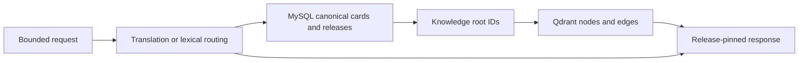

# Transnet service design

中文：[Transnet 服务设计](../docs_cn/transnet_cn.md)

Status: authoritative target design. Transnet is a private, stateless language and canonical-knowledge service. It translates bounded text, resolves words and phrases, and exposes bounded reads of a versioned relationship graph. It is not an end-user application, learning product, account system, or personal-data store.

## Contents

- [Service boundary](#service-boundary)
- [Request processing](#request-processing)
- [Canonical content](#canonical-content)
- [Retrieval and graph safety](#retrieval-and-graph-safety)
- [Content publication](#content-publication)
- [HTTP service](#http-service)
- [Agent technology](#agent-technology)
- [Safety and reproducibility](#safety-and-reproducibility)
- [Quality scenarios](#quality-scenarios)

## Service boundary

Transnet owns shared language and knowledge capabilities only:

- translation of a sentence, passage, or bounded text fragment;
- lexical resolution for words, terms, idioms, phrasal verbs, and established phrases;
- concise canonical sense information, including definitions, translations, pronunciation, morphology, examples, and usage restrictions; and
- verified and explicitly exploratory relationships among canonical concepts.

Transnet does not accept, derive, store, or return a user ID, learner ID, account ID, profile, preference set, history, saved item, bookmark, mastery record, schedule, answer record, recording, graph layout, feedback, export, or deletion request. A product application may call Transnet on behalf of an end user, but owns authentication, authorization, personalization, retention, and all associations between its users and Transnet responses.

Request text and optional disambiguating context are transient inputs. They are permitted only in memory for the bounded request lifetime and must never enter MySQL, Qdrant, logs, metrics, traces, caches, telemetry, or durable queues. Request-scoped language, dialect, register, and detail options guide one response and never create durable state.

## Request processing

The service routes by linguistic shape, not by client identity.

1. A sentence, clause, or passage is translated first while preserving meaning, tone, register, and paragraph structure.
2. A word, term, idiom, phrasal verb, or established lexical phrase is resolved to canonical senses.
3. An ambiguous short fragment defaults to translation unless it is confidently a lexical unit.
4. The response adds at most two concise tips only for a material ambiguity, idiom, register consequence, or cultural context.

Input normalization is request-local. A versioned normalizer derives bounded retrieval forms using Unicode normalization, language-aware case folding, whitespace handling, and canonical punctuation equivalents. Exact canonical and exact alias matches rank before inflections, spelling corrections, and relaxed aliases. Symbols remain disambiguation features: `C`, `C++`, and `C#` are distinct canonical forms. The original text and normalization trace are not persisted.

## Canonical content

MySQL is authoritative for compact canonical content and release state. Each `BasicCard` represents one word or phrase sense and contains stable card and sense IDs, canonical form, language, part of speech, concise definitions and translations, pronunciation and morphology summaries, CEFR metadata, domain IDs, Qdrant root IDs, evidence references, revision, and publication state.

Canonical domains are versioned concepts rather than free-form model labels. A domain has a stable ID, label, aliases, concise scope definition, inclusion and exclusion boundaries, optional broader-domain IDs, evidence references, and revision. Collisions remain distinct until a publishing decision resolves them.

Qdrant is a rebuildable read projection containing immutable, release-pinned `knowledge_nodes` and `knowledge_edges` collections. Nodes represent independently explainable lexical senses, phrases, concepts, entities, phenomena, idioms, metaphors, speech acts, cultural practices, grammar patterns, collocations, misconceptions, or domains. Edges represent typed, explained, evidence-backed relationships.

Neither database contains request text or any user-related data. MySQL never stores raw lookup forms or context; Qdrant never embeds runtime input.

## Retrieval and graph safety

Lexical lookup first resolves a concise MySQL card. Qdrant then retrieves a bounded set of eligible graph nodes and typed edges using exact, dense, sparse, and endpoint retrieval. The response separates verified relationships from exploratory associations.

Dense similarity retrieves candidates; it never proves translation, synonymy, hierarchy, causation, shared mechanism, or cultural meaning. The service applies release, publication, language, dialect, region, period, domain, evidence, and verification filters before limiting results. It returns uncertainty or alternatives when a canonical resolution is not sufficiently supported.

Graph expansion is bounded to a selected root and shallow depth. Arbitrary-depth traversal, shortest paths, centrality, mutable graph transactions, and similarity chains presented as facts are outside the service contract.

## Content publication

Canonical content is prepared outside request handling. A publication pipeline:

1. resolves or stages stable cards, senses, domains, evidence references, aliases, and Qdrant root IDs in MySQL;
2. validates uniqueness, scope, language, domain, evidence, endpoint, and release compatibility;
3. writes deterministic node points before edge points to new immutable Qdrant collections;
4. reconciles counts, endpoint coverage, content hashes, vector metadata, and an authenticated manifest; and
5. atomically activates compatible MySQL and Qdrant releases.

Corrections create a new immutable release. Quarantine blocks ineligible content before a later removal release. Rollback selects an unchanged retained release pair. Runtime lookups never create cards, domains, edges, or mutable graph state.

## HTTP service

The primary HTTP contract is [the Transnet service interface](interfaces/port.md). The public service surface is intentionally small:

- process probes: `GET /health`, `GET /livez`, and `GET /readyz`;
- translation: `POST /translate`;
- lexical lookup: `POST /v1/lookups`;
- canonical sense read: `GET /v1/senses/{sense_id}`; and
- bounded graph reads: `GET /v1/graph` and `GET /v1/graph/nodes/{kind}/{id}/neighbors`.

The service binds a private address and does not terminate public TLS. Deployment authentication identifies an allowed calling service, never an end user. Responses return `X-Request-Id`, explicit content-release metadata where relevant, and safe error envelopes that do not echo request text or infrastructure internals.

## Agent technology

Models are bounded service components rather than autonomous personal agents. Roles include translation, lexical analysis, canonical-content curation, relationship explanation, and domain-draft assistance. Each role has versioned input and output schemas, prompts, limits, and evaluation criteria.

Structured generation is validated before use. Deterministic logic owns normalization, canonical IDs, release eligibility, exact matches, bounds, filtering, and response envelopes. Generated material must be labeled as generated when it is not a canonical, evidence-backed assertion. Invalid model output is repaired within configured limits or rejected with a safe failure.

Provider telemetry contains only static provider boundary, operation name, attempt number, outcome class, status class, elapsed time, and retry delay. It omits request content, response content, credentials, vectors, and caller identity.

## Safety and reproducibility

Every response is reproducible against the recorded content release, schema version, normalizer version, retrieval configuration, and model contract version. Canonical assertions include evidence references and verification state. Verified relationships and exploratory associations are visibly distinct.

Transnet does not use request inputs to train models, create profiles, or infer interests. It rejects public-edge authentication material and must not add hidden persistence as an optimization. Caches, if enabled, use only safe release-pinned canonical artifacts and never include request content or caller identity.

## Quality scenarios

- A sentence receives a translation-first response; a lexical unit receives sense-specific canonical information.
- `C`, `C++`, and `C#` remain distinct under normalization and collision resolution.
- A MySQL card remains useful when Qdrant is unavailable, and the response declares degraded relationship capability.
- A Qdrant result never promotes vector similarity into a verified fact.
- Release activation rejects missing endpoints, mismatched hashes, incompatible embedding metadata, and unsupported evidence claims.
- Requests, contexts, caller identities, and generated provider bodies are absent from storage, caches, logs, traces, metrics, and vectors.
- English and Chinese contracts, OpenAPI, guides, and tests are updated together when the service contract changes.

## Related documents

- [Transnet service interface](interfaces/port.md)
- [MySQL adapter interface](interfaces/mysql.md)
- [Qdrant adapter interface](interfaces/qdrant.md)
- [Content publishing](guides/content-publishing.md)
- [Quality assurance](guides/quality-assurance.md)
