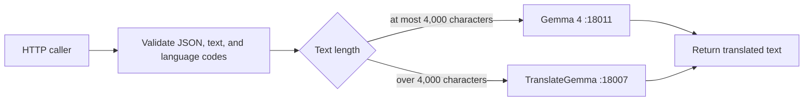

# Transnet design

## Overview

Transnet is one Rust package and one HTTP process. It validates translation requests, selects one of two local OpenAI-compatible model servers by Unicode character count, and returns the model's translated text. It has no gateway, account system, persistence, browser application, or compatibility API.

## Request flow

Gemma 4 receives standard system and user chat messages. TranslateGemma receives one structured user content item containing `type`, `source_lang_code`, `target_lang_code`, and the complete source `text`. Long text is not chunked.

Each model call uses the configured timeout. Transport errors, non-success statuses, malformed envelopes, and empty responses are retried according to `max_retries`; exhausted attempts become HTTP 503 without exposing provider response bodies.

## Boundaries

The public surface is only `GET /health` and `POST /translate`. The service does not authenticate callers, retain source text, assign translation identifiers, provide history, or expose translation modes. CORS headers are not added.

The health route reports process availability and does not probe either model server. Deployment infrastructure owns TLS, access control, request-size limits, and public-origin policy.

Related: [API contract](reference/transnet-api.md), [configuration](guides/configuration.md), and [development](guides/development.md).
