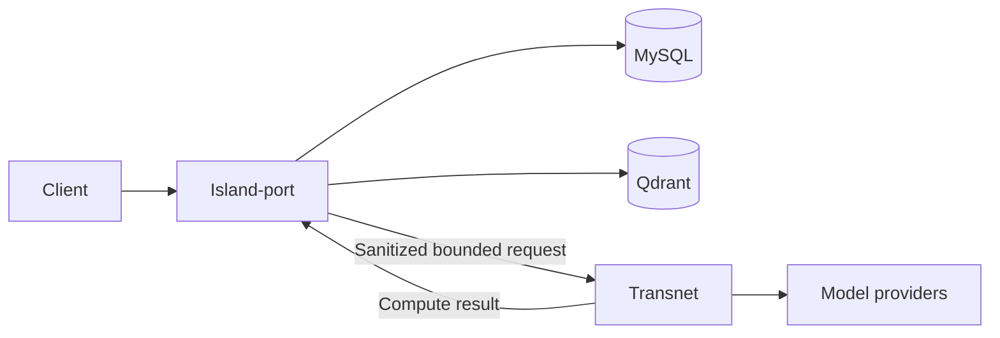

# Transnet compute-service architecture

## Boundary

Transnet is a pure loopback compute service used by Island-port. It owns deterministic input validation, model-provider calls, result parsing, pure ranking and assembly, provider resilience, and redacted compute telemetry.

Island-port owns the public API, identity and permission checks, user data, privacy, encryption, persistence, cache policy, idempotency, rate limits, durable work, content publication, MySQL, Qdrant, and every stateful product transition. The `transnet_*` tables are an Island-port product-domain namespace, not tables owned by this process.

## Trust contract

- Transnet binds only to loopback and is not a public security boundary.
- Island-port strips cookies, bearer tokens, `X-Island-*` headers, caller identifiers, roles, persistence instructions, idempotency keys, and task capabilities before a compute call.
- Query and context are sent only when needed for the calculation. Transnet does not log or retain them.
- Compute output is not evidence that a history entry, save, feedback event, attempt, task, or other mutation committed.
- A data-assisted computation receives a bounded, licensed, permitted snapshot from Island-port. Transnet never receives a pool, database URL, table name, collection credential, or raw query capability.

## Current runtime

The executable wires process probes, direct translation, and model-only structured lookup:

| Route | Responsibility |
| --- | --- |
| `GET /health` | Process health |
| `GET /livez` | Process liveness |
| `GET /readyz` | Compute readiness |
| `POST /translate` | Direct text translation |
| `POST /v1/lookups` | Structured learning-card computation |

Gemma 4 handles short translation and structured lookup. TranslateGemma handles longer direct translation. Provider calls use independent timeout, retry, concurrency, and circuit-breaker policies. Requests, credentials, and provider bodies are excluded from traces.

The crate contains legacy foundations for canonical content, graph traversal, learner state, feedback, layouts, practice, jobs, caches, and repositories. They are not deployment authority and must not be exposed as Transnet-owned HTTP or storage interfaces.

## Future compute extensions

Future endpoints are appropriate only when they remain identity-free and storage-free: for example, ranking a supplied candidate set, assembling a card from a permitted snapshot, generating a frozen exercise candidate, evaluating an answer against a supplied rubric, or calculating a graph layout from supplied topology.

Island-port supplies trusted learner context and Transnet coordinates computation and state through its adapters. See the [Island-port interface](interfaces/port.md), [MySQL adapter](interfaces/mysql.md), and [Qdrant adapter](interfaces/qdrant.md).
