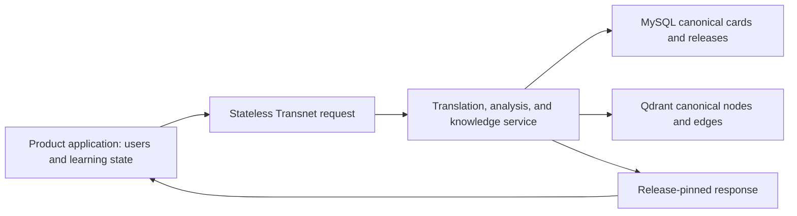

# Transnet service and integration design

中文：[Transnet 服务与集成设计](../docs_cn/transnet_cn.md)

Status: authoritative target design. Transnet is the stateless language and canonical-knowledge service in a broader English-learning system. The surrounding product owns people, accounts, bookmarks, history, mastery, review schedules, practice sessions, and retention. Transnet owns no user data.

## Contents

- [System boundary](#system-boundary)
- [Learning capability map](#learning-capability-map)
- [Translation and lexical learning](#translation-and-lexical-learning)
- [Canonical cards and knowledge graph](#canonical-cards-and-knowledge-graph)
- [Product-owned learning loop](#product-owned-learning-loop)
- [Practice, writing, listening, and pronunciation](#practice-writing-listening-and-pronunciation)
- [Agent technology design](#agent-technology-design)
- [Content publication and quality](#content-publication-and-quality)

## System boundary

Transnet currently exposes bounded translation, lexical resolution, canonical sense detail, and graph-exploration requests. The target capability map additionally includes stateless writing evaluation, reference speech, pronunciation evaluation, and exercise generation; these operations remain unreleased until added to the interface contract and runtime. It runs behind a private gateway or service mesh. Deployment authentication identifies an allowed calling service, never an end user.

Requests may carry text, context, language, dialect, register, purpose, and bounded audio only for the duration of processing. They must not be written to MySQL, Qdrant, caches, logs, metrics, traces, telemetry, vectors, or durable queues. A caller must not send cookies, end-user bearer tokens, account IDs, learner IDs, profile data, or private state.

The product layer is a separate system of record. It may retain a bookmark, select an exercise, calculate scheduling, record an attempt, or associate a Transnet response with a person. It supplies Transnet only the minimum request-scoped linguistic inputs needed for a single operation.



## Learning capability map

The system supports translation, vocabulary, spelling, grammar, writing, cultural communication, listening, pronunciation, and later review. These are capabilities, not evidence of an individual inside Transnet.

Transnet returns reusable, scoped material: canonical senses, examples, grammar patterns, corrections, pronunciation cues, and evidence-backed relationship explanations. The product decides when to show a response, whether to retain it, how to create exercises, and how to measure progress.

English is the primary target language. Request-scoped explanation language, English dialect, first-language support, accessibility options, register, audience, purpose, and medium control the response only. They are not stored or used to infer a profile.

## Translation and lexical learning

### Intent routing

A word, term, idiom, phrasal verb, or established lexical phrase receives a canonical lookup response. A clause, sentence, or passage receives translation first. An ambiguous short fragment defaults to translation unless it is confidently a lexical unit. Low-confidence routing selects the least intrusive useful response and states uncertainty where needed.

### Input normalization and identity

Normalization is local to a request. A versioned normalizer derives bounded retrieval forms through Unicode normalization, language-aware case folding, whitespace handling, and punctuation equivalents. Exact canonical and exact alias matches precede inflection, spelling correction, and relaxed aliases. Meaningful symbols are retained: `C`, `C++`, and `C#` remain distinct.

Cards use stable sense IDs, not normalized strings, as identity. The service passes only bounded derived forms to MySQL and never persists original text, intermediate forms, context, or transformation traces. New cards and aliases are created only by the content-publication workflow.

### Words and lexical phrases

A translation-wiki response starts with a concise MySQL basic card and enriches it with bounded Qdrant knowledge. Meanings and parts of speech remain separate. Sections are ordered by relevance and omitted when weakly supported.

The service can provide these sense-scoped sections:

- taxonomy and intensity scales, keeping hierarchy distinct from degree;
- valency and syntax patterns, including structural slots and prepositions;
- collocations and fixed phrases, with form and setting restrictions;
- focus, nuance, connotation, register, scene, dialect, region, and domain suitability;
- morphology, derivations, irregular forms, and useful word-family shifts; and
- idioms, cultural context, and metaphorical extensions with explicit scope.

For example, `warm → hot → sweltering → scorching` is an intensity scale, not a parent-child taxonomy. Near-synonyms include a contrast rather than an unsupported claim of interchangeability.

### Sentences and passages

Translation preserves meaning, tone, register, and paragraph structure in natural target-language wording. The response contains at most two one-sentence tips, and only for a material ambiguity, idiom, consequential register choice, or cultural context. Detailed lexical analysis requires a separate lookup request.

## Canonical cards and knowledge graph

### MySQL basic cards and domains

MySQL is authoritative for compact canonical content: cards, senses, forms, aliases, definitions, translations, pronunciation, morphology, examples, usage notes, domains, evidence metadata, immutable revisions, and release manifests. A `BasicCard` contains stable card and sense IDs, canonical form, language, part of speech, concise definitions and translations, CEFR and domain metadata, Qdrant root IDs, evidence references, revision, and publication state.

Domains are canonical versioned concepts, not free-form model tags. A domain includes a stable ID, label, aliases, scope boundary, broader-domain IDs, evidence, and revision. Exact MySQL matching precedes bounded Qdrant domain retrieval. Draft creation, collision resolution, and activation are publication operations, never runtime lookup side effects.

### Qdrant nodes and edges

Qdrant is a rebuildable, release-pinned projection. Nodes represent lexical senses, phrases, concepts, entities, phenomena, idioms, metaphors, speech acts, cultural practices, grammar patterns, collocations, misconceptions, and domains. Nodes use a named cross-lingual dense vector and a sparse lexical vector.

Edges are searchable explanations of typed relationships. Families include naming, lexical, conceptual, contrast, cultural, domain, and exploratory relationships. Every edge records endpoints, relation type, restrictions, evidence, confidence, verification state, and release. Intensity relations name their comparison dimension rather than pretending to be hierarchy.

### Retrieval safety

Lookup resolves MySQL first, then performs exact, hybrid, endpoint, and bounded graph retrieval. Filters apply before limiting by release, publication state, language, dialect, region, period, domain, evidence, and verification state. Verified relationships and exploratory associations remain separate. Vector similarity is candidate evidence only; it never proves translation, synonymy, hierarchy, causation, shared mechanism, or cultural meaning.

When Qdrant is unavailable, a resolved MySQL card may be returned with explicit degraded metadata and no invented relationships. Graph expansion is shallow and rooted at one selected canonical resource; arbitrary-depth traversal, shortest paths, and mutable graph transactions are outside the contract.

## Product-owned learning loop

The following complete learning loop remains the project map, but it is implemented and persisted by the product layer:

1. Resolve a word or phrase through Transnet to a canonical sense and knowledge root.
2. Product-owned logic may bookmark that sense and retain a frozen learning artifact.
3. Product-owned logic may reconstruct strategy from its own current bookmarks and bounded history.
4. The product selects a diagnostic or practice objective and calls Transnet for an explanation, exercise, correction, reference audio, or pronunciation analysis.
5. The product evaluates or records an attempt according to its own policy, updates mastery dimensions, and schedules later review or transfer.

Recognition, recall, spelling, morphology, collocation, grammar, composition, writing, register, cultural pragmatics, listening, and pronunciation are separate dimensions. A product must require direct evidence before advancing a dimension; a Transnet response is not durable mastery evidence by itself.

Bookmarks, history, mastery, schedules, attempts, feedback records, and retained audio are external product data. They are never accepted by, stored in, or reconstructed by Transnet.

## Practice, writing, listening, and pronunciation

### Stateless exercise and feedback generation

The product may call Transnet to generate controlled recognition, recall, spelling, dictation, morphology, collocation, grammar, composition, or transfer material for a specified canonical target. A response includes the target, prompt, allowed variants or rubric, difficulty, hints, and version metadata. It does not create an exercise record or queue.

### Writing and communication

A writing-evaluation request can state audience, purpose, medium, register, constraints, and text. Transnet returns a minimal correction, an optional natural alternative, at most two prioritized explanations, and a retry prompt. It preserves intended meaning and voice, distinguishes grammatical acceptability from naturalness, and does not treat one rewrite as uniquely correct.

Communication and cultural guidance describes likely interpretation in a stated relationship, setting, medium, dialect, and region. It offers scoped alternatives and rejects stereotypes or universal claims about a group.

### Reference speech and pronunciation analysis

Reference speech can provide generated TTS for words, minimal pairs, examples, dictation, and shadowing. Options include dialect, voice, normal or natural slow rate, and purpose; generated audio is labeled as such.

Pronunciation evaluation accepts bounded audio and expected language or target phrase. It checks recording quality, alignment confidence, timing, stress, rhythm, linking, and other acoustic evidence. The service returns at most two intelligibility targets and a retry prompt. Inadequate audio returns uncertainty without a score. Audio is processed only for the request and is not retained.

## Agent technology design

### Model roles and orchestration

Models are bounded service components, not autonomous personal agents. Roles include translation, lexical analysis, canonical-content curation, relationship explanation, domain drafting, exercise generation, writing evaluation, pragmatics coaching, TTS, speech recognition, and pronunciation analysis. Each role has independent versioned input/output schemas, prompts, limits, and evaluation criteria.

```mermaid
flowchart LR
  input["Bounded request"] --> route["Typed intent router"]
  route --> context["Request-local context builder"]
  cards["MySQL canonical cards"] --> context
  graph["Qdrant nodes and edges"] --> context
  context --> plan["Response planner"]
  plan --> tools["Specialist models and deterministic tools"]
  tools --> validate["Schema and evidence validation"]
  validate --> response["Stateless response"]
```

### Grounding, evaluation, and reproducibility

Deterministic logic owns normalization, canonical IDs, exact matching, release eligibility, bounds, filtering, and response envelopes. Structured tools may provide parses, alignments, and acoustic measurements. Models must label generated material and may not elevate generated text or similarity to a canonical fact.

Prompts, schemas, models, normalizers, retrieval configuration, evidence policy, analyzers, and releases are versioned. Invalid structured output receives bounded repair; unresolved invalid output fails safely. Provider telemetry contains only operation and reliability metadata, never request or response content, credentials, vectors, or caller identity.

## Content publication and quality

Publication stages immutable MySQL revisions, builds deterministic Qdrant nodes before edges, reconciles hashes and endpoint coverage against an authenticated manifest, and atomically activates a compatible release pair. Corrections create a new release; quarantine blocks ineligible content; rollback selects an unchanged retained pair.

Quality scenarios include translation-first routing, lexical collision safety, sense separation, cross-language terminology, evidence scope, relationship precision, degraded MySQL-only reads, cultural safety, reference-speech quality, pronunciation uncertainty, release activation, rollback, prompt injection resistance, and request non-persistence.

The design is successful when the product can compose rich learning experiences using Transnet’s grounded responses while Transnet remains free of user identity and personal learning state.

## Related documents

- [Service interface](interfaces/port.md)
- [MySQL interface](interfaces/mysql.md)
- [Qdrant interface](interfaces/qdrant.md)
- [Service behavior](product/learning-experience.md)
- [Content publishing](guides/content-publishing.md)
- [Quality assurance](guides/quality-assurance.md)
