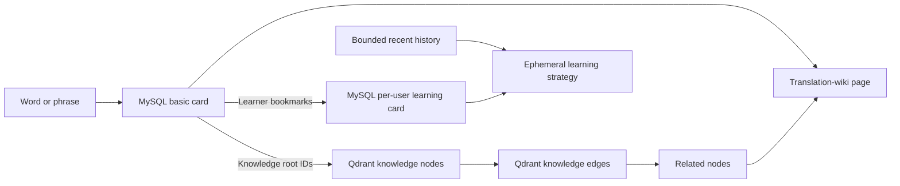
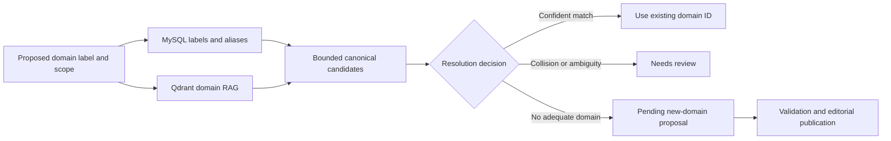
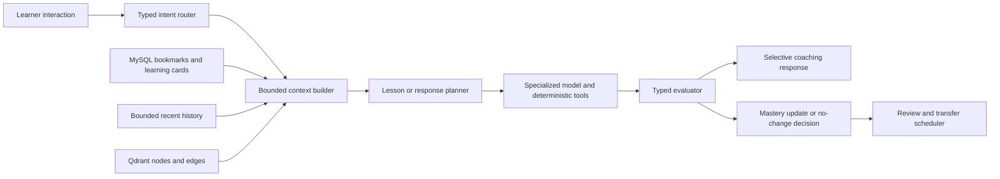

# Transnet English-learning agent design

中文：[Transnet 英语学习代理设计](../docs_cn/transnet_cn.md)

Status: target product design. The repository runtime implements only a subset; interface and guide status notes identify current and proposed behavior.

Transnet is a self-directed English-learning agent for adult learners from CEFR A1 through C2. It combines translation, vocabulary development, spelling, grammar, writing, cultural communication, listening, pronunciation, and continuous review in one adaptive learning experience.

English is the target language. The learner may choose another supported language for explanations, select an English dialect, and control how much first-language support appears. These presentation preferences do not become learning-strategy evidence.

The primary outcome is independent comprehension and natural production in unfamiliar situations. Looking up a word, recognizing an answer, or correcting one sentence is useful only when it contributes to durable recall and transfer.

## Contents

- [Learning principles](#learning-principles)
- [Core learning loop](#core-learning-loop)
- [Translation and lexical learning](#translation-and-lexical-learning)
  - [Input normalization and identity](#input-normalization-and-identity)
  - [Words and lexical phrases](#words-and-lexical-phrases)
  - [Sentences and passages](#sentences-and-passages)
- [Card and knowledge storage](#card-and-knowledge-storage)
  - [MySQL basic cards](#mysql-basic-cards)
  - [Canonical domains](#canonical-domains)
  - [MySQL per-user learning cards](#mysql-per-user-learning-cards)
  - [Short personal history](#short-personal-history)
  - [Qdrant knowledge nodes](#qdrant-knowledge-nodes)
  - [Qdrant knowledge edges](#qdrant-knowledge-edges)
- [Translation-wiki retrieval](#translation-wiki-retrieval)
  - [Relationship safety](#relationship-safety)
  - [Knowledge-chain example](#knowledge-chain-example)
  - [Knowledge publication](#knowledge-publication)
- [Continuous learning](#continuous-learning)
  - [Learning strategy context](#learning-strategy-context)
  - [Review scheduling](#review-scheduling)
  - [Feedback and transfer](#feedback-and-transfer)
- [Practice design](#practice-design)
  - [Vocabulary and spelling](#vocabulary-and-spelling)
  - [Grammar and sentence construction](#grammar-and-sentence-construction)
  - [Writing workshop](#writing-workshop)
  - [Communication and culture](#communication-and-culture)
- [Listening and pronunciation](#listening-and-pronunciation)
  - [Reference speech](#reference-speech)
  - [Learner pronunciation](#learner-pronunciation)
- [Agent technology design](#agent-technology-design)
  - [Intent routing](#intent-routing)
  - [Logical model roles](#logical-model-roles)
  - [Orchestration flow](#orchestration-flow)
  - [Knowledge grounding](#knowledge-grounding)
  - [Structured generation](#structured-generation)
  - [Evaluation authority](#evaluation-authority)
  - [Safety and reproducibility](#safety-and-reproducibility)
- [Quality scenarios](#quality-scenarios)

## Learning principles

- Teach meanings and skills in context instead of treating a spelling as one undivided fact.
- Keep recognition, recall, spelling, grammar, writing, listening, and pronunciation as separate mastery dimensions.
- Prefer one clear learning objective and one or two actionable corrections per turn.
- Require active production, focused retry, and later transfer instead of relying on passive explanations.
- Preserve the learner's intended meaning and voice when correcting language.
- Present cultural guidance as context-dependent behavior, not a universal rule about a group.
- Distinguish sourced knowledge, generated teaching material, and uncertain inference.
- Return uncertainty when the available evidence cannot support a reliable judgment.

The skill framework is informed by the [CEFR Companion Volume](https://rm.coe.int/cefr-companion-volume-with-new-descriptors-2020/16809ea0d4), including reception, production, interaction, mediation, phonological control, and pluricultural competence.

## Core learning loop

Every interaction receives useful one-off help. A durable learning loop begins only for a bookmarked word or phrase:

1. Resolve the word or phrase to a canonical basic card and knowledge node.
2. Create a private learning card when the learner bookmarks the selected sense.
3. Reconstruct strategy from current bookmarks and bounded recent history.
4. Diagnose the most likely gap for the bookmarked target.
5. Teach one concept with a concise explanation, contrast, or example.
6. Ask the learner to retrieve, repair, compose, or pronounce the target.
7. Evaluate the attempt with deterministic checks and bounded model judgment.
8. Store only a compact outcome and update demonstrated mastery dimensions.
9. Give immediate feedback and a focused retry when useful.
10. Schedule later review and transfer in a different context.

Correct recognition does not imply that the learner can recall, spell, inflect, collocate, write, hear, or pronounce the same language. Each of those abilities advances independently.

## Translation and lexical learning

The agent chooses an experience from linguistic intent rather than a fixed character limit. A word, term, idiom, phrasal verb, or other established expression receives a translation-wiki page. A complete clause, sentence, or passage receives a translation-first response. An ambiguous short fragment defaults to the simpler translation experience unless it is confidently recognized as a lexical unit.

### Input normalization and identity

The system preserves the exact learner input for display and diagnosis but never uses that raw string as card identity. A versioned normalizer derives retrieval forms by applying Unicode NFKC normalization, language-aware case folding, outer-whitespace trimming, internal-whitespace collapsing, and canonical equivalents for typographic punctuation. Thus `Make`, `make`, and `make ` share a case-folded lookup form.

A second, relaxed retrieval form may remove decorative leading or trailing symbols and separators inside an otherwise alphabetic candidate. This allows `make*` and a likely accidental `ma-ke` to retrieve `make`, but it is an alias candidate rather than an automatic identity merge. Exact canonical and exact alias matches rank before relaxed matches.

Normalization must not erase lexical meaning. Case, apostrophes, hyphens, plus signs, number signs, periods, and other symbols remain available as disambiguation features when a language or domain treats them as significant. For example, `C`, `C++`, and `C#` remain distinct, as do terms whose hyphen changes meaning. If a relaxed form collides with multiple canonical entries, the resolver returns ranked alternatives or asks for context instead of selecting or creating a card.

Cards use stable sense IDs, not normalized strings, as identity. The system stores the original input, the matched canonical form, the normalization version, the transformations applied, and the match class: exact, canonical alias, inflection, spelling correction, or relaxed alias. New cards are created only after canonical resolution and collision checks fail under the content-publication workflow.

### Words and lexical phrases

A translation-wiki page begins with the concise MySQL basic card, then enriches it with related knowledge from Qdrant. Distinct meanings and parts of speech remain separate so examples, relationships, grammar, pronunciation, and usage guidance stay attached to the applicable sense.

The page includes only sections that materially help with that sense. Sections may be reordered by relevance, and empty or weakly supported sections are omitted. Explanations remain concise and use short natural examples. The separate learning card is a bookmarked, learner-owned practice artifact rather than the full knowledge page.

#### Taxonomy and intensity scales

Show broader categories, narrower variants, and meaningful degree relationships. Semantic hierarchy and intensity are different structures: a hypernym names a broader category, a hyponym names a more specific member, and a gradient orders words along a shared dimension.

For example, `warm → hot → sweltering → scorching` is an intensity scale, not a parent-child hierarchy. The page names the dimension being compared and does not imply that adjacent words are interchangeable in every context.

#### Valency and syntax patterns

Show the grammatical wiring required to use the word or phrase naturally. Patterns expose structural slots, required prepositions, and permitted complements instead of presenting grammar as an abstract label.

Examples include `show [someone] [something]` and `dissuade [someone] from [doing something]`. A pattern includes a short filled example when the structure is not self-explanatory.

#### Collocations and fixed phrases

Show words that naturally cluster with the selected sense and established expressions that should be learned as units. Prefer strong, useful combinations such as `sweltering heat`, `stifling humidity`, and `blistering pace` over long lists of merely possible neighbors.

Keep fixed expressions distinct from productive collocations, and explain restrictions belonging to a particular meaning, grammatical form, or setting.

#### Focus, nuance, and connotation

Explain what dimension the selected word emphasizes and how it differs from close alternatives. Relevant distinctions may include physical temperature, lack of airflow, emotional intensity, discomfort, approval, or danger.

State positive, negative, neutral, humorous, euphemistic, or offensive connotations when they affect the choice. Near-synonyms include a contrast rather than being presented as interchangeable.

#### Register, scene, and domain suitability

Describe where the word or phrase sounds natural, including casual conversation, technical reports, journalism, legal contracts, academic writing, professional communication, and literary prose.

Formality, dialect, period, region, and specialist domain appear only when they affect suitability. The guidance explains the consequence for the scene instead of attaching an unexplained label.

#### Morphology and derivations

Connect roots, inflections, affixes, and useful part-of-speech shifts. Show how form changes affect grammar or meaning, as in `swelter → sweltering → swelteringly`.

Prioritize common, productive forms. Mark irregular, uncommon, or stylistically restricted derivations instead of presenting them as equally natural.

#### Cultural idioms and metaphorical extensions

Explain idiomatic meanings, cultural associations, and conceptual metaphors that cannot be recovered reliably from literal translation. Heat, for example, may extend to anger, pressure, conflict, danger, or passion.

Distinguish widely understood extensions from culture-specific or regional expressions. Give enough context to understand and use the expression without turning the card into a general cultural essay.

### Sentences and passages

The translated text is always the primary result. Preserve meaning, tone, register, and paragraph structure while keeping the target-language wording natural.

Add no more than two tips, with each tip limited to one sentence. Include a tip only for a meaningful ambiguity, idiom, consequential register choice, or cultural context needed to understand the translation. When no tip is necessary, return only the translation.

Tips do not restate the translation, list routine vocabulary, or expand into a grammar lesson. Detailed lexical analysis appears only when the learner requests it.

## Card and knowledge storage

MySQL stores concise canonical cards and private learning artifacts. Qdrant stores the shared translation-wiki knowledge graph as versioned node and edge collections. No third graph database is required while exploration remains bounded to shallow neighborhoods.

### MySQL basic cards

A `BasicCard` is the concise canonical representation of one word or phrase sense. It contains:

- stable card and sense IDs;
- canonical form, language, part of speech, and normalized forms;
- concise translations and definitions;
- pronunciation and morphology summaries;
- CEFR difficulty and domain tags;
- one or more Qdrant knowledge-node IDs; and
- content version and publication status.

The basic card remains useful when semantic retrieval is unavailable. Detailed relationships, encyclopedia knowledge, cultural material, and exploratory associations are not copied into it.

### Canonical domains

A domain is a versioned canonical concept, not a free-form model tag. MySQL stores its stable domain ID, canonical label, concise scope definition, aliases, status, release, and optional broader-domain IDs. Basic cards and knowledge records reference domain IDs. Labels such as `IT`, `information technology`, and `computing` may resolve to one domain when their published scopes agree; overlapping but materially different scopes remain separate and related.

Qdrant indexes the public domain definitions, aliases, scope notes, representative concepts, and verified domain relationships. Domain resolution first checks normalized MySQL labels and aliases, then uses hybrid RAG to retrieve likely existing domains and directly related broader, narrower, sibling, and cross-disciplinary domains. The model receives this bounded candidate set before assigning a domain.

The domain resolver returns either `use_existing` with a domain ID and evidence, `needs_review` with competing candidates, or `propose_new` with a proposed label, definition, scope boundary, aliases, broader-domain candidates, related-domain candidates, evidence, and the reason existing domains are insufficient. A model cannot insert or activate a domain directly. A proposed domain remains pending until deterministic normalization and collision checks plus editorial validation confirm that it is not an alias, duplicate, or unjustified subdivision; publication then assigns its stable ID and graph relationships.

Related domains influence retrieval expansion and examples but do not imply equivalence or learner interest. Personal domain inference still comes only from canonical domain IDs attached to current bookmarks and bounded history.

### MySQL per-user learning cards

Creating a bookmark generates a complete learner-owned `LearningCard` copy. It contains:

- learner and bookmark IDs;
- source basic-card and selected-sense IDs;
- frozen front, back, example, pronunciation cue, hints, and practice prompts;
- targets for recall, spelling, sentence construction, writing, usage, listening, or pronunciation;
- inferred level and relevant domain at generation time;
- knowledge release, generator, prompt, rubric, and evaluator versions; and
- learning state, skill-specific mastery, due time, and revision.

Only bookmarked words and phrases receive durable learning cards. Removing a bookmark removes the card from future scheduling. Related Qdrant nodes may enrich examples and transfer tasks but do not become study targets automatically.

A new knowledge release never silently rewrites a learner card. Refreshing creates a new frozen revision while preserving compatible review state. A corrected, quarantined, or withdrawn source marks dependent cards for regeneration before their next review.

The inferred level and domain stored with a card explain how that revision was generated; they are not fed back as an independent personalization source. Future strategy is always reconstructed from current bookmarks and bounded history.

### Short personal history

Personal history retains at most the newest 200 compact events from the previous 30 days. An event contains only:

- canonical basic-card or knowledge-node ID;
- selected sense;
- lookup, bookmark, review, or expansion action;
- timestamp; and
- compact review outcome, hint count, and misconception category when applicable.

Raw queries, passages, writing, answers, conversations, generated explanations, and recordings are not stored as strategy history. Clearing history immediately removes its influence on the learning strategy.

### Qdrant knowledge nodes

Each active knowledge release has an immutable `knowledge_nodes` collection. A node represents one independently explainable subject:

- lexical sense or phrase;
- scientific, technical, historical, or cultural concept;
- person, place, event, domain, or named phenomenon;
- idiom, metaphor, speech act, or cultural practice;
- grammar pattern, collocation, or common misconception.

A node point contains a deterministic node ID and type; canonical label; aliases, translations, transliterations, and romanizations; a concise retrieval description; language, dialect, region, period, domain, and CEFR metadata; evidence IDs; confidence; verification state; release ID; a dense cross-lingual semantic vector; and a sparse lexical vector.

The dense vector retrieves concepts with similar meaning across wording or language. The sparse vector preserves exact terminology, abbreviations, proper names, formulas, and uncommon technical expressions. Payload filters prevent results from crossing incompatible releases, languages, domains, regions, or publication states.

### Qdrant knowledge edges

Each active knowledge release also has an immutable `knowledge_edges` collection. An edge is both a typed graph connection and an independently searchable description of why two nodes are related.

An edge point contains a deterministic edge ID; source and target node IDs; relation type and direction; a concise relationship explanation; domain, language, region, period, and sense restrictions; evidence IDs; confidence; verification state; release ID; a dense embedding of the complete source–relation–target explanation; and a sparse representation for exact terminology.

Relationship families are:

- Naming: translation, alias, transliteration, abbreviation, and named-after.
- Lexical: synonym, antonym, hypernym, hyponym, morphology, collocation, and valency.
- Conceptual: definition, part, prerequisite, mechanism, cause, effect, application, and example.
- Contrast: commonly confused, superficially similar, and different mechanism.
- Cultural: idiomatic extension, metaphor, regional usage, historical origin, and speech-act convention.
- Exploratory: embedding neighbor or analogy without verified factual equivalence.

Qdrant payload indexes cover source node, target node, both endpoint IDs, relation type, verification state, language, domain, and release. Endpoint filters provide shallow adjacency lookup; vector search finds relationship descriptions relevant to the learner's current question. The agent performs traversal and interpretation because Qdrant does not supply ontology semantics, joins, or referential integrity.

This design uses Qdrant's named dense and sparse vectors, hybrid queries, and payload filtering as described in [hybrid search](https://qdrant.tech/documentation/search/text-search/hybrid-search/) and [Qdrant fundamentals](https://qdrant.tech/documentation/faq/).

## Translation-wiki retrieval

The word or phrase page merges concise translation with relevant knowledge:

1. Preserve the original input, derive versioned exact and relaxed retrieval forms, and resolve a basic card and sense in MySQL without using a normalized string as identity.
2. Use its Qdrant root-node IDs, or use hybrid node search when no exact card resolves the term.
3. Retrieve verified incoming and outgoing edges through indexed endpoint filters.
4. Search node and edge vectors for semantically relevant descriptions.
5. Fetch target nodes by ID and discard candidates from another release or an ineligible source.
6. Deduplicate by canonical sense or concept.
7. Rerank by exactness, evidence quality, domain relevance, relationship diversity, and the ephemeral learner strategy.
8. Assemble translations, terminology, definitions, applications, relationships, contrasts, and cultural context into one page.
9. Retrieve another bounded neighborhood only after the learner selects a related node.

Hybrid retrieval combines exact-form and sparse lexical matches with dense semantic candidates. A later reranking stage may refine the bounded candidate set, but it cannot manufacture relationship types or evidence.

### Relationship safety

Verified relationships and exploratory associations appear in separate sections. A verified edge requires a typed relation, compatible endpoint senses, explicit scope, and adequate evidence. An exploratory association requires only retrieval relevance and a concise explanation of the possible learning connection.

Dense-vector proximity alone never establishes translation, synonymy, hierarchy, causation, shared mechanism, or cultural meaning. The LLM may explain an exploratory bridge, but it must also state the limitation when the concepts are merely analogous or visually similar.

Multi-hop exploration expands one selected node at a time. The agent does not automatically turn a chain of individually plausible similarities into a factual path.

### Knowledge-chain example

For `Coriolis force`, the concise basic card identifies the physics term and its selected sense. The verified knowledge graph may connect it to:

- `科里奥利力` through a transliteration relation, with `kē lǐ ào lì lì` as romanization;
- `地转偏向力` through a meteorological domain-translation relation;
- rotating reference frames through a mechanism relation;
- geostrophic wind, atmospheric circulation, and ocean currents through application relations; and
- Gaspard-Gustave de Coriolis through a named-after relation.

`Liquid rope coiling` may appear only as an exploratory association when the visual idea of curved or rotating motion is useful. Its bridge explicitly states that liquid-rope coiling is a viscous buckling phenomenon and does not share the Coriolis mechanism.

The terminology distinction is illustrated by the [Hong Kong Observatory's explanation of geostrophic wind](https://www.weather.gov.hk/tc/education/weather/meteorology-basics/00010-geostrophic-wind.html), while the different mechanism of liquid-rope coiling is described in this [fluid-mechanics review summary](https://dare.uva.nl/record/1/380859).

### Knowledge publication

Publication generates deterministic IDs before embedding and builds nodes before edges. Validation rejects orphan endpoints, cross-release references, invalid direction, duplicate typed edges, missing evidence, incompatible senses, and unsupported language or domain claims.

Reconciliation compares node and edge counts, endpoint coverage, content hashes, embedding versions, and release metadata against a manifest. Node and edge collections activate as one logical release, and every retrieval pins both versions. A partial build never becomes visible.

Exploratory neighbors remain derived and rebuildable. They are not promoted into verified edge records without a separate evidence-backed publishing decision.

A dedicated graph engine is reconsidered only when the product requires arbitrary-depth path queries, shortest paths, centrality calculations, or highly mutable graph transactions. Bounded translation-wiki exploration uses Qdrant endpoint filters and point retrieval.

## Continuous learning

Continuous learning is bookmark-driven. The agent provides complete one-off help for every lookup or translation, but only an explicit bookmark creates a durable learning card and makes a word or phrase eligible for scheduled study.

The learner can inspect, pause, reprioritize, refresh, or remove any learning card. Incidental words, related Qdrant nodes, writing content, conversations, and pronunciation recordings never become durable targets automatically.

### Learning strategy context

Bookmarks and short history are the only personal inputs to learning strategy. Public metadata attached to their canonical IDs supplies CEFR difficulty, domain, sense, and relationship information without copying a private behavioral profile into Qdrant.

The agent infers:

- approximate level from bookmarked-card difficulty and recent review outcomes;
- domain interests from the tags of bookmarked and recently visited canonical items;
- weak skills from compact outcomes for bookmarked learning cards; and
- review priority from bookmark state, recency, difficulty, hints, and demonstrated recall.

Bookmarks carry more weight than browsing history, and history influence decays with age. If the evidence is sparse or contradictory, the agent uses a neutral general-English strategy and treats its level or domain estimate as low confidence.

Domains such as mathematics, IT, science, business, or daily communication influence which definitions, examples, related nodes, and writing scenarios are selected. They do not suppress the basic meaning of a bookmarked item or permanently label the learner.

Each learning card tracks independently assessable skills relevant to its bookmarked sense or phrase. These may include recognition, recall, spelling, morphology, collocation, grammar, sentence composition, writing, register, cultural pragmatics, listening, and pronunciation. Only demonstrated skills advance.

### Review scheduling

Daily practice combines due bookmarked cards, unresolved compact misconceptions, and transfer tasks derived from directly relevant Qdrant relationships. New bookmarked material does not crowd out fragile due knowledge, and an unbookmarked related node is never inserted into the queue automatically.

Scheduling uses a versioned FSRS-style model of difficulty, stability, and retrievability rather than fixed intervals. The algorithm and its parameters remain identifiable so schedule changes can be evaluated and reproduced. The design follows the memory-state concepts described by the [Free Spaced Repetition Scheduler](https://github.com/open-spaced-repetition/fsrs4anki/wiki/The-Algorithm/e6ded59fa6d1d6bb2950a759d53b14575e9e586c).

Objective correctness and hint use are the primary scheduling signals. Response time has only a bounded, learner-relative influence and can be ignored for accessibility. An uncertain evaluation does not reduce mastery.

### Feedback and transfer

Feedback follows a short cycle: identify the issue, explain the smallest useful rule or contrast, ask for a focused retry, and confirm what changed. The agent does not overwhelm the learner with every detectable imperfection unless a full review is requested.

A later session tests the same target with different wording, content, or social context. Repeating the original prompt measures memory of an example; successful transfer demonstrates a usable skill.

## Practice design

Practice progresses from controlled recognition to independent production. Generated activities retain their target, accepted evidence, difficulty, prompt, rubric, evaluator assumptions, and model versions so the same attempt can be interpreted consistently.

### Vocabulary and spelling

- Match a definition or context to the intended sense.
- Recall an English word from a meaning, image, or first-language cue.
- Complete or repair a spelling from sound and context.
- Type a heard word or phrase as dictation.
- Produce an inflection or derivation required by a sentence.
- Distinguish confusable spellings, forms, and near-synonyms.
- Select a natural word for a new context rather than repeating a memorized example.

Spelling feedback identifies the useful pattern and requests a retry. It does not treat a single typo as evidence of a durable weakness unless the error repeats or the learner fails a focused check.

### Grammar and sentence construction

- Order words or clauses into a natural sentence.
- Complete a sentence with a required grammatical form.
- Fill valency slots, articles, prepositions, or clause complements.
- Repair an unnatural collocation or construction.
- Correct a sentence while preserving its intended meaning.
- Compose a sentence under a meaning, register, or grammar constraint.
- Translate a cue into English without copying the earlier translation.

Evaluation separates grammatical acceptability from naturalness and task fulfillment. A valid regional or stylistic alternative is not marked wrong merely because it differs from the preferred answer.

### Writing workshop

Writing practice ranges from one sentence to a complete message, explanation, narrative, argument, or professional document. The task states its audience, purpose, medium, desired register, and relevant constraints.

Feedback evaluates:

- task fulfillment and preservation of intended meaning;
- clarity, organization, and cohesion;
- grammatical control;
- lexical precision, range, and collocation;
- naturalness and sentence variety;
- tone, register, and politeness; and
- cultural and situational appropriateness.

The response presents the learner's original text, a minimal correction, an optional more natural version, concise reasons for the highest-value changes, and a focused rewrite task. The minimal correction fixes material problems while preserving voice. The improved version is an alternative, not the only acceptable expression.

The learner rewrites before seeing additional unrelated advice. Later practice reuses the same writing skill with a new topic or audience.

### Communication and culture

Communication practice focuses on speech acts and their likely interpretation in a particular relationship, setting, medium, and region. Scenarios include requesting, refusing, disagreeing, apologizing, persuading, giving feedback, making small talk, joining a conversation, and closing an exchange.

The agent explains directness, politeness, implied meaning, idiom, humor, taboo, hierarchy, distance, and regional convention when they affect communication. It avoids claims such as “people from this culture always...” and instead states the scope, common variation, and safer alternatives.

Role-play may use choices or open responses. After each response, the agent explains how it could be interpreted, offers alternatives with different levels of warmth or formality, and repeats the communication goal in a changed relationship or setting. Cultural knowledge improves communication only when it becomes a flexible choice rather than a memorized stereotype.

## Listening and pronunciation

Pronunciation practice combines generated reference audio with analysis of an optional learner recording. The goal is intelligible, confident communication, not imitation of one prestige accent.

### Reference speech

A provider-independent text-to-speech capability generates audio for headwords, contrasting words, minimal pairs, examples, dictation, and shadowing. The learner may select dialect and voice and may compare normal and slowed speech. Slowed speech preserves natural stress and phrasing rather than stretching every sound mechanically.

Audio should begin playing before complete generation when the selected speech engine supports streaming. The experience clearly identifies generated voices. Streaming audio, selectable voices, speaking instructions, and multiple output formats are examples of established TTS capabilities described in this [text-to-speech guide](https://developers.openai.com/api/docs/guides/text-to-speech); the agent design does not depend on that provider.

Reference material may expose syllable boundaries, primary stress, phonemic transcription, and a short articulatory cue when those details help the learner. Example sentences also teach rhythm, reductions, linking, and contrastive stress.

### Learner pronunciation

A pronunciation attempt follows this evidence pipeline:

1. Check duration, silence, clipping, background noise, and speech presence.
2. Transcribe the recording against the expected language and optional target phrase.
3. Align recognized words and phonemes with the expected utterance.
4. Estimate acoustic confidence, timing, stress, rhythm, and linking evidence.
5. Select no more than two targets that most affect intelligibility.
6. Let the language model turn the measured evidence into a concise explanation and retry prompt.

The language model never invents phoneme-level accuracy from transcript text alone. When recording quality, alignment, accent coverage, or acoustic confidence is inadequate, the result explains that the attempt could not be assessed and asks for a new recording instead of returning a score.

Feedback distinguishes substitutions, omissions, stress placement, timing, and connected-speech effects. It provides a reference, one concrete physical or listening cue, and an immediate retry. A later task tests the feature in another word or sentence.

Recordings are not retained as learning history by default. The learner model keeps only the minimum derived outcome needed for review unless the learner makes a separate informed choice.

## Agent technology design

The agent is a typed, tool-using state machine. The language model plans and explains, while specialized models and deterministic tools provide translation, retrieval, scoring, speech, and scheduling evidence.

### Intent routing

Each interaction is classified as one or more bounded intents: lexical lookup, translation, tutoring, writing, cultural communication, review, listening, or pronunciation. The router also identifies the learner's requested depth, target language skill, and whether the interaction may affect continuous learning.

Low-confidence routing chooses the least intrusive useful response. It does not start a lesson, store a target, or assess ability merely because a normal translation contains language worth teaching.

### Logical model roles

- The translator preserves meaning, structure, tone, and register.
- The lexical analyst separates senses and produces structured usage candidates.
- The lesson planner selects one objective and an appropriate teaching move.
- The exercise generator creates bounded activities from explicit targets and evidence.
- The writing evaluator applies a versioned multidimensional rubric.
- The pragmatic coach evaluates likely interpretation within a stated scene.
- The TTS engine produces reference speech.
- The speech recognizer transcribes learner audio.
- The pronunciation analyzer supplies alignment and acoustic measurements.

One underlying model may perform several roles, but each role retains its own input schema, output schema, prompt, rubric, limits, and version. Replacing one role does not silently change the contract of another.

### Orchestration flow

The context builder supplies the selected basic card, relevant Qdrant knowledge, current learning-card state, and the minimum bookmark/history evidence needed to infer level, domain, and recent misconception. Learner content and retrieved documents are delimited as data and cannot replace system instructions.

### Knowledge grounding

Lexical facts, pronunciation notation, usage restrictions, relationship descriptions, domain knowledge, and cultural claims are retrieved from versioned Qdrant nodes and edges backed by curated evidence. Hybrid dense and sparse retrieval identifies the sense, dialect, region, time period, domain, and evidence scope needed by the current task.

The agent may generate explanations, examples, role-play, and exercises from that evidence. It labels generated material and does not present vector similarity or unsupported generation as a dictionary fact, typed relationship, or universal cultural rule. Conflicting reputable evidence remains visible as variation or uncertainty.

### Structured generation

Every model role returns a typed result rather than presentation-ready prose alone. A generated exercise identifies its learning target, prompt type, intended answer or rubric, allowed variants, difficulty, hints, and explanation. An evaluation identifies observations, evidence, confidence, rubric dimensions, mastery effect, and the next teaching action.

Invalid structured output receives one bounded repair attempt. If it remains invalid, the agent uses deterministic partial behavior or reports that the activity cannot be evaluated; it does not guess a grade.

### Evaluation authority

Deterministic checks own exact spelling, normalization, accepted forms, fixed-answer matching, and other objectively defined results. Structured linguistic tools may provide parses, alignments, or pronunciation measurements. The language model evaluates open writing and communication only through an explicit rubric and cited observations.

Free production may return `correct`, `needs_revision`, or `needs_review`. Only a sufficiently confident, rubric-supported result changes mastery. The evaluator ignores stylistic differences that do not violate the task and never rewards verbosity by itself.

### Safety and reproducibility

Prompts, schemas, rubrics, retrieval releases, model roles, normalization rules, pronunciation analyzers, and scheduler parameters are versioned. Evaluations can therefore be reproduced, compared, and rolled back.

Each role has adversarial and pedagogical evaluation sets covering prompt injection, ambiguous answers, dialect variation, false corrections, cultural stereotyping, unsupported claims, noisy recordings, and overconfident scoring. Learner text, recordings, and model output are treated as untrusted content.

## Quality scenarios

The design is successful when these scenarios behave consistently:

- A word lookup resolves a concise MySQL basic card, follows its Qdrant root ID, and assembles relevant translation-wiki sections and reference audio.
- A normal sentence returns only a translation, while an idiomatic sentence adds one concise tip.
- Exact and hybrid retrieval resolve a technical term through its translations, transliterations, domain aliases, and concept relationships.
- `Make`, `make`, `ma-ke`, `make*`, and `make ` retrieve the same likely lexical candidate without collapsing meaningful symbol distinctions such as `C`, `C++`, and `C#`.
- Domain RAG reuses an existing canonical domain or returns a reviewable new-domain proposal with broader and related candidates; it never lets the model create an active free-form domain.
- Verified edges remain distinct from embedding-only associations, and a candidate with a missing endpoint or unsupported relation never appears.
- Selecting a related node expands one bounded neighborhood without asserting that an exploratory multi-hop chain is factual.
- Bookmarking a selected sense creates a complete per-user learning-card copy; a new knowledge release creates a traceable revision rather than silently rewriting it.
- Mathematics or IT bookmarks and recent canonical history influence the inferred domain and examples without creating a permanent hidden profile.
- A repeated spelling mistake on a bookmarked card becomes a repair exercise and later reappears in dictation.
- A learner composes a sentence, receives a minimal correction, retries it, and later transfers the pattern to a new context.
- A writing sample receives layered feedback without erasing intentional voice or treating one rewrite as uniquely correct.
- A refusal changes appropriately between a friend, colleague, and manager without cultural stereotyping.
- A pronunciation attempt receives feedback derived from acoustic and alignment evidence; noisy audio returns uncertainty.
- Removing a bookmark stops its scheduling, and clearing short history removes its influence on inferred level, domain, and strategy.
- When Qdrant is unavailable, the learner still receives the concise MySQL basic card without invented related knowledge.
- Correct recognition advances recognition only, leaving spelling, writing, cultural, listening, and pronunciation mastery unchanged until demonstrated.
