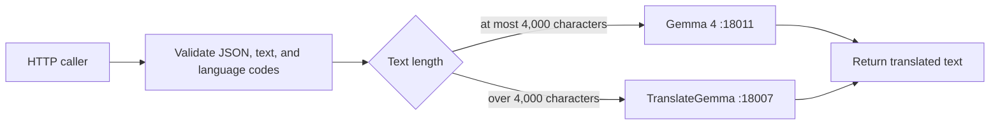
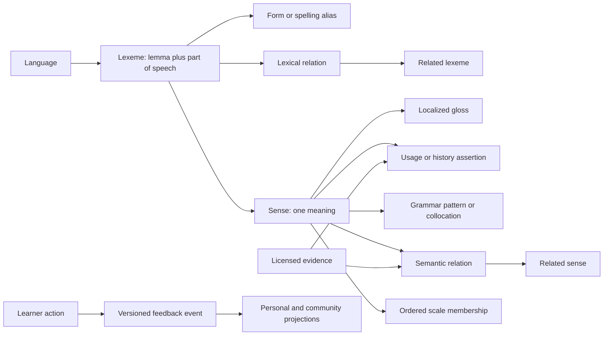
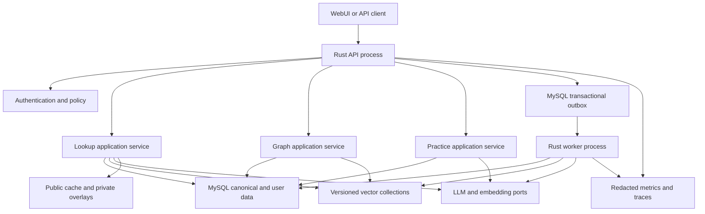
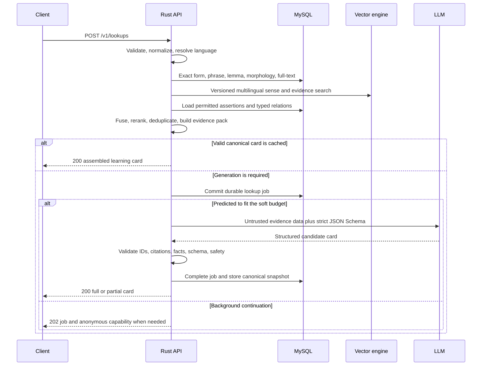

# Transnet design and architecture

## Document status

This document owns the system design and architecture for Transnet. The [current implementation](#current-implementation) describes behavior on `feat/basic-core`. Sections marked as target architecture remain proposed and are not yet implemented.

Detailed contracts and procedures live in focused documents:

- [English-learning experience](product/learning-experience.md): learner behavior, learning cards, relationships, practice, personalization, and privacy controls.
- [Learning HTTP API](reference/learning-api.md): proposed `/v1` routes, payloads, errors, idempotency, and caching semantics.
- [MySQL schema](reference/mysql-schema.md): tables, DDL, encryption fields, keys, retention, and transactional invariants.
- [Content publishing](guides/content-publishing.md): source licensing, ingestion, validation, vector builds, publication, removal, and rollback.
- [Quality assurance](guides/quality-assurance.md): benchmarks, failure tests, release gates, and production monitoring.
- [Overall plan](todo.md): decisions, phases, dependencies, acceptance criteria, and deferred work.

## Product boundary

Transnet evolves from a stateless text-translation service into an evidence-backed English-learning backend. It accepts a word or short expression in a supported language and returns structured English senses, usage, related language, provenance, and optional learner state.

The target product supports a separate WebUI but does not contain the browser application. It returns a bounded semantic graph suitable for draggable 3D rendering and an accessible non-spatial representation.

MySQL is the source of truth for lexical assertions, relationship versions, users, history, feedback, practice, and operations. A vector database is a rebuildable semantic retrieval index. LLMs synthesize explanations and exercises from retrieved evidence but do not become the factual authority.

## Goals

- Help learners move from a source-language concept to natural English comprehension and production.
- Return every supported part of speech and sense relevant to the query without mixing unrelated homographs.
- Explain real usage, including grammar, collocations, register, dialect, frequency, connotation, and common errors.
- Represent typed, directional, evidence-backed relationships at the correct lexical level.
- Allow personal and community feedback without letting votes rewrite facts or embeddings directly.
- Turn selected senses into adaptive practice and spaced review.
- Expose provenance, confidence, content versions, and coverage gaps.
- Remain useful through deterministic fallbacks when optional AI dependencies fail.
- Preserve the existing `/translate` contract during staged implementation.

## Non-goals for basic core

- Replacing general document or conversation translation.
- Treating vector similarity as a lexical fact.
- Letting one user directly edit the global knowledge graph.
- Training foundation models online from individual actions.
- Social feeds, public profiles, teacher administration, or classroom management.
- Full speech scoring, handwriting recognition, or collaborative graph editing.
- Supporting every language or dialect before its data and evaluation pass release gates.

## Architecture principles

1. **Sense first.** Meaning, examples, usage, semantic relations, saved vocabulary, and mastery attach to a sense.
2. **Use the right entity level.** Inflection and derivation attach to lexemes or forms; semantic relations attach to senses; collocations retain grammatical roles.
3. **Evidence before generation.** Curated records and permitted evidence fragments are authoritative; the LLM explains them.
4. **Structured uncertainty.** Unsupported, disputed, policy-filtered, and temporarily unavailable content remain distinguishable.
5. **Canonical versus derived.** MySQL is authoritative; vector indexes, caches, projections, and generated artifacts are rebuildable.
6. **Personal before global.** Personal usefulness changes immediately; community effects are aggregated, bounded, reviewed, and reversible.
7. **Stable contracts.** Public IDs, relation versions, schemas, and content releases outlive provider or prompt changes.
8. **Private by construction.** Learner text is excluded from telemetry and shared indexes, caches separate public content from private overlays, and retention is explicit.
9. **Degrade by section.** An optional provider failure removes an optional section rather than an otherwise useful lookup.
10. **Modular monolith first.** One package with explicit domain and adapter boundaries precedes any service split.

## Current implementation

Transnet is one Rust package and one HTTP process. It preserves the direct text translator and implements the first model-backed structured English-learning lookup slice.



Gemma 4 receives standard system and user chat messages. TranslateGemma receives one structured user content item containing `type`, `source_lang_code`, `target_lang_code`, and complete source `text`. Long text is not chunked.

Each direct-translation provider has its own timeout, bounded-concurrency bulkhead, retry policy, circuit breaker, and redacted counters. Only timeouts, connection-establishment failures, `429`, selected transient statuses (`500`, `502`, `503`, and `504`), and unusable successful envelopes retry; a valid `Retry-After` is honored within the configured maximum. A full bulkhead or open circuit returns the existing HTTP 503 provider-unavailable response without sending another provider request. Structured lookup uses the Gemma 4 resilience policy independently and applies the same classification.

```mermaid
flowchart LR
  learner["POST /v1/lookups"] --> http["HTTP DTO validation"]
  http --> domain["Normalized translation input"]
  domain --> app["Lookup application service"]
  app --> port["Learning model port"]
  port --> adapter["OpenAI-compatible adapter"]
  adapter --> schema["Strict JSON Schema output"]
  schema --> validate["Parse and validate nested learning fields"]
  validate --> response["Generated learning card"]
  schema -->|"invalid once"| repair["One bounded repair request"]
  repair --> validate
```



The structured lookup normalizes query and context text to Unicode NFC, accepts an explicit BCP-47 source language or `auto`, supports `en-US` and `en-GB`, and optionally adapts explanations to a CEFR level. Its model contract separates English meanings by part of speech and returns definitions, localized glosses, pronunciations, forms, usage notes, examples, etymology, and typed related-word suggestions.

This slice has no canonical lexical store or retrieval index. It therefore marks every learning assertion as generated, returns null canonical IDs, exposes empty evidence lists, sets `evidence_backed` to false, and prevents generated relations from appearing to be graph facts. Responses are synchronous, anonymous, and `no-store`. History, persistence, retrieval, canonical sense resolution, and graph feedback remain target work.

The default executable exposes `GET /health`, `GET /livez`, `GET /readyz`, `POST /translate`, and `POST /v1/lookups`. A host that explicitly injects a canonical `GraphService` also receives bounded public graph-read routes, but this executable does not inject one and has no production graph adapter. There is no authentication, persistence, vector index, canonical lexical content, history, private graph feedback overlay, or practice system in the default runtime. Liveness reports process availability without probing providers; readiness delegates to an injected dependency probe and is always ready in the current model-only runtime. The HTTP boundary applies a configured request-size limit, safe request IDs, redacted structured request tracing, and exact-origin CORS when configured. Provider telemetry exposes static boundary and outcome fields plus redacted in-process counters; it never records learner input, generated output, provider response bodies, credentials, or identity data.

Related implemented contracts: [API](reference/transnet-api.md), [configuration](guides/configuration.md), and [development](guides/development.md).

## Target domain model



### Entity definitions

- A **lexeme** is a language-specific lemma plus part of speech, such as English adjective `hot`.
- A **form** is an inflection or spelling variant, such as `hotter` or `hottest`.
- A **sense** is one meaning of a lexeme. `Hot` meaning high temperature and `hot` meaning popular are separate.
- A **semantic relation** connects sense versions for synonymy, opposition, hierarchy, translation equivalence, confusion, or association.
- A **lexical relation** connects lexemes for inflection, modern derivation, or documented etymology.
- A **construction** records grammar or collocation roles instead of flattening them into a symmetric edge.
- A **scale** stores an ordered, context-qualified dimension such as `cool < warm < hot < scorching`.
- A **concept** is post-basic-core. The first release uses explicit translation-equivalent edges rather than unsourced universal concept nodes.

### Invariants

- Semantic relations never attach to an undifferentiated spelling.
- One authoritative directed assertion produces its inverse at read time.
- Symmetric edges store endpoints in canonical ID order.
- Synonymy and antonymy are not transitive.
- Vector proximity can propose `associated_with` but cannot assert a stronger relation type.
- Modern derivation and historical etymology use different relation types.
- Scale adjacency is projected from ordered members and is not a parent-child hierarchy.
- CEFR, frequency, dialect, register, pronunciation, and history are qualified by source and version.
- Generated material remains non-authoritative unless reviewed and promoted.
- Sense split or merge creates successor mappings so learner state does not silently change meaning.

Detailed learner-facing relation behavior is in [English-learning experience](product/learning-experience.md). Table-level representation is in [MySQL schema](reference/mysql-schema.md).

## Target architecture



### Component responsibilities

| Component | Responsibility |
| --- | --- |
| API process | HTTP validation, authentication, authorization, rate limits, idempotency, deadlines, and response assembly |
| Lookup service | Language resolution, morphology, hybrid retrieval, evidence packing, constrained generation, validation, and fallback |
| Graph service | Typed traversal, filtering, ranking, bounded expansion, private overlays, and feedback writes |
| Practice service | Session selection, frozen exercise delivery, deterministic grading first, and mastery transitions |
| MySQL | Canonical facts, versions, users, private data, feedback events, projections, practice, jobs, and active content pointer |
| Vector engine | Approximate nearest-neighbor search over versioned senses, gloss views, evidence, and relation candidates |
| Cache | Context-free canonical cards and topology, with private data joined after shared retrieval |
| Worker | Durable generation, embeddings, reconciliation, aggregation, cleanup, export, deletion, and content jobs |
| Model ports | Provider-neutral embeddings and schema-constrained LLM generation |

MySQL and the worker are required for the target platform. Redis and a dedicated broker are optional. Basic core uses an in-process L1 cache and a transactional MySQL outbox; Redis becomes an L2 cache only when multiple replicas require it.

## Rust boundaries

The target remains one Cargo package with two binaries:

```text
src/
  api/v1/          HTTP parsing, authentication context, and status mapping
  application/     lookup, graph, feedback, practice, and privacy orchestration
  domain/          pure lexical, relation, and learner invariants
  ports/           repository, retriever, model, cache, clock, and queue traits
  adapters/        MySQL, vector, cache, and provider implementations
  bin/transnet.rs  API process
  bin/worker.rs    durable background worker
```

Public JSON DTOs, domain values, SQL rows, and provider payloads are distinct types. Provider formats remain private to adapters. Port injection supplies deterministic fakes for application tests.

Split into independent services only after measured deployment or ownership constraints justify the operational cost. Module boundaries are designed to allow that split without changing domain contracts.

## Lookup architecture



### Lookup stages

1. Validate Unicode, lengths, language tags, requested sections, and response limits.
2. Preserve the original query and build an NFC, language-aware search key.
3. Resolve explicit language, known learner languages, or automatic detection; abstain when confidence is low.
4. Retrieve exact forms, phrases, lemmas, morphology, and full-text candidates from MySQL.
5. Retrieve filtered multilingual sense and evidence candidates from the active vector collection.
6. Keep exact, morphology, lexical rank, embedding similarity, context relevance, frequency, learner fit, and source quality as separate features.
7. Load assertion-level evidence and apply source permissions before model use.
8. Commit a durable job before provider work so a soft deadline can safely return `202`.
9. Generate schema-constrained JSON only when deterministic content is insufficient.
10. Validate all IDs, evidence references, enums, bounds, content policy, and learner level.
11. Make at most one bounded repair attempt, then drop invalid sections or return deterministic content.
12. Store only context-free canonical cards in shared snapshots.
13. Apply context reranking, mature-content rules, personalization, history, and mastery after the shared layer.

Context can change ordering but not erase other supported senses. Context-bearing envelopes use private no-store responses and are never coalesced across users. Encrypted job payloads erase raw context after completion or expiry and never become history.

## Retrieval and RAG architecture

Hybrid retrieval is mandatory because short words, rare forms, morphology, and polysemy perform poorly with vector search alone.

The ranker fuses:

```text
exact form match
+ phrase and lemma match
+ morphology confidence
+ lexical full-text rank
+ multilingual vector similarity
+ context relevance
+ source-qualified frequency
+ learner level fit
+ source quality
```

The service stores feature values and a ranking version. It does not expose the weighted total as semantic truth or a calibrated probability.

### Evidence contract

- Every factual assertion links to permitted evidence fragments.
- Generated examples and mnemonics are labeled and cannot cite themselves recursively.
- Etymology, dates, dialect, register, pronunciation, frequency, and CEFR require appropriate source types.
- Definition simplification preserves sense and material restrictions.
- Conflicting reputable sources remain separate or produce `disputed` coverage.
- Source policy independently controls storage, display, embedding, provider processing, and API redistribution.
- Private learner text never enters shared evidence or vector collections.

### LLM boundary

The server supplies a strict schema, candidate IDs, permitted evidence IDs, learner settings, and explicit abstention rules. Query, context, and retrieved material are delimited as untrusted data rather than interpolated into instructions.

The model cannot create stable IDs, sources, relation status, vote counts, frequency values, CEFR estimates, historical dates, or confidence scores. The server calculates or resolves these values and can discard one invalid generated section without losing a valid deterministic card.

Prompts, JSON Schemas, model routing, rubrics, and evaluator rules are reviewed, versioned, evaluated, and rollback-capable like code.

## Vector architecture

The vector database is a rebuildable derived index. Logical collections include:

| Collection | Unit |
| --- | --- |
| `sense_embeddings_vN` | One sense and one purpose/content language, such as canonical English meaning or a localized-gloss view |
| `evidence_embeddings_vN` | One independently citable permitted evidence fragment |
| `relation_candidates_vN` | One proposed sense pair and contextual evidence bundle |

Each record identifies entity, purpose, content language, embedding model, dimensions, normalization, chunking, content hash, lexicon release, and collection version. Raw similarity is not comparable across models, collection releases, or relation types.

Blue-green rebuilds write a new collection, backfill idempotently, reconcile every expected entity, run quality gates, and mark the collection ready. Publication updates one MySQL `active_content_version` pointer to a compatible lexicon/collection pair. Requests use the exact pair instead of assuming cross-store atomicity.

## Relationship architecture

Relationship ranking keeps independent signals:

| Signal | Owner |
| --- | --- |
| Evidence confidence | Canonical versioned assertion |
| Embedding similarity | Vector collection and model version |
| Context relevance | Request-time ranker |
| Community posterior | Versioned aggregation job |
| Personal usefulness | Private learner projection |
| Pedagogical fit | Personalization ranker |

One mutable weight cannot represent all signals. The graph response returns useful components and a ranking version; the client uses `display_rank` only for the current response.

Feedback has two dimensions. Personal usefulness affects only the learner. Accuracy reports can enter a community posterior after minimum voter thresholds, capped trust, shrinkage, rate limits, anomaly detection, and moderation. `unsure` is abstention.

Every feedback event pins an edge version. Publishing a new version creates an empty projection unless an explicit reviewed migration creates a new event. Feedback never changes evidence confidence, relation type, embeddings, or canonical status directly.

## Graph architecture

The API returns topology; the separate WebUI owns the 3D renderer, physics, camera, and dragging.

Basic-core defaults are depth 1, 75 nodes, and 200 edges, with a hard maximum depth of 2. The service ranks and truncates before returning a response and provides typed-node expansion cursors.

Stored feedback-enabled edges use stable public IDs and relation versions. Derived scale or visual edges use release-scoped namespaced IDs, have no relation version, and reject feedback.

Shared topology and aggregate features are cached separately from personal overlays. Authenticated graph ETags include content release, ranker, aggregate version, personal projection version, and filters.

Dragging is local state. Explicitly saved coordinates are private, finite, bounded, versioned presentation hints. Coordinates, force-layout distance, UMAP, or t-SNE output never count as semantic evidence.

The full graph contract is in [Learning HTTP API](reference/learning-api.md).

## Practice architecture

Practice state is keyed by `(user, sense, skill)`. Frozen exercise instances identify a focus sense, every secondary sense/pattern/collocation/scale target, prompt language, dialect, level, content release, generator, model, prompt, answer normalization, rubric, evaluator, and scheduler version.

Objective grading is deterministic first. Free-form evaluation has low authority and returns `needs_review` without changing mastery when uncertain. Correctness and hint use dominate scheduling; response time has only bounded learner-relative influence and can be disabled for accessibility.

Claiming the next item is a mutation. One transaction returns an outstanding item or marks one queued item served. Attempt submission locks the owned item, resolves idempotency, inserts one immutable event, updates counters, and advances mastery exactly once.

Raw answers are encrypted for a short correction window and then redacted. Historical score and scheduler effects remain. Detailed exercise behavior is in [English-learning experience](product/learning-experience.md).

## Persistence architecture

One physical MySQL database is sufficient for basic core, with logical boundaries for canonical, generated, user-owned, community, and operational data.

Important patterns:

- Immutable content releases and active version pointers.
- Stable public identity plus versioned assertions.
- Assertion-level provenance and source policy.
- Append-only feedback and attempt ledgers with current projections.
- Application encryption for learner text and HMAC equality tokens.
- Ownership foreign keys and explicit deletion behavior.
- Transactional outbox for cross-store and durable background work.
- Idempotency records binding user, route, key HMAC, request hash, and stored response.
- Owner or capability authorization for asynchronous and post-deletion workflows.
- Indexed retention and archival before any separately designed partitioning.

Detailed table definitions and transactional invariants are in [MySQL schema](reference/mysql-schema.md).

## Caching and consistency

- L1 in-process caching is the initial implementation; Redis L2 is optional.
- Shared card keys include lexical identity, languages, dialect, level band, requested sections, content release, vector collection, ranker, schema, prompt, and model.
- Shared snapshots contain no original query, lookup ID, context ordering, mature-content decision, or private state.
- Context responses bypass shared response caching and cross-user request coalescing.
- Mature-content and personal policy apply after shared retrieval.
- Graph topology and private feedback overlay use separate cache entries.
- Feedback updates the personal projection synchronously and community aggregation asynchronously.
- Content publication uses new versions rather than wildcard cache deletion.
- Quarantined content is filtered by canonical status immediately and vector payload status during cleanup lag.

## Durable work

The worker handles model generation, embedding synchronization, vector reconciliation, community aggregation, content import, cleanup, export, and deletion.

Jobs use leases, heartbeats, bounded retries with jitter, maximum attempts, a dead state, and operator-controlled replay. Operations are idempotent by type, entity, and version. Durable work never relies only on detached Tokio tasks.

Sensitive lookup-job payloads are encrypted, excluded from the outbox, and erased after completion or expiry. Anonymous jobs use a high-entropy capability returned once; only its hash is retained.

## Reliability

| Failure | Behavior |
| --- | --- |
| LLM unavailable | Return a deterministic or permitted stale card, otherwise a typed retryable error |
| Vector unavailable | Continue exact, phrase, morphology, and full-text lookup |
| MySQL unavailable | Fail readiness, authentication, ownership, and writes closed |
| Cache unavailable | Read through to canonical dependencies under bounded concurrency |
| Invalid model output | One repair attempt, then partial or deterministic fallback |
| Feedback worker delayed | Preserve the personal projection and expose aggregate age |
| Uncertain practice grader | Return `needs_review` and leave mastery unchanged |
| Oversized graph | Return ranked truncation and a cursor |
| Database/vector drift | Require active-version match, alert, reconcile, and rebuild |

The fallback order is validated cache, canonical retrieval, permitted stale content, deterministic partial response, then a typed dependency error. Optional-section failures produce coverage warnings rather than failing the whole card.

Deadlines propagate end to end. Provider clients use bounded concurrency, bulkheads, circuit breakers, and retries only for safe transient timeouts, `429`, or selected `5xx` responses while honoring `Retry-After`.

`/livez` reports process liveness. The current model-only runtime injects an always-ready `/readyz` probe. In the target deployment, `/readyz` will check configuration, migration compatibility, MySQL, and dependencies declared mandatory for the deployed mode; a deployment may remain ready in retrieval-only mode during an optional model outage.

## Security and privacy

- The Rust API owns OIDC authorization code with PKCE, state, nonce, service-session rotation, reuse detection, and revocation.
- Same-site WebUI/API deployment is preferred; cross-site cookies require `SameSite=None`, TLS, exact credentialed CORS, origin validation, and session-bound CSRF protection.
- Missing and non-owned private IDs return the same `404` to avoid an existence oracle.
- Public IDs never substitute for authorization.
- Rate limits combine account, anonymous capability, network risk, endpoint cost, and model budget.
- Raw queries, context, answers, notes, comments, identities, and credentials never appear in logs or traces.
- Database storage is encrypted, and learner content plus identity display fields use application authenticated encryption.
- Private content never enters shared vector indexes or shared snapshots.
- History is opt-in, has retention, supports incognito, and can be deleted or exported.
- Learner data is excluded from model training without separate informed opt-in.
- Source and generated content are treated as untrusted model data.
- Sensitive vocabulary is explained neutrally for legitimate education rather than silently mistranslated.
- Child-directed use requires a separate consent, retention, and content design before launch.

## Observability

Metrics cover route latency and outcomes, retrieval paths, candidate counts, ambiguity, coverage, model schema validation, repair/fallback, tokens, graph size, feedback, practice, source freshness, outbox age, vector lag, and reconciliation.

Traces use request, lookup, generation-run, practice-session, and job IDs. User IDs and content do not appear in metric labels or ordinary traces. Security audit records cover administrative, moderation, export, and deletion actions rather than private learning content.

Evaluation and numeric release gates are owned by [Quality assurance](guides/quality-assurance.md).

## Deployment shape

Basic core deploys:

- One or more stateless API processes.
- One or more worker processes.
- MySQL 8 as required state.
- One selected vector engine with versioned collections.
- Existing local translation providers plus selected learning LLM/embedding providers.
- Optional Redis only when shared cache pressure justifies it.
- TLS and ingress request limits in front of the API.

API and worker versions declare compatible database migrations, content schema, and job payload versions. A rolling deploy preserves the immediately previous application version until migration contract steps complete.

## Capacity guidance

Preliminary engineering budgets, to be validated against selected hardware and providers:

| Operation | Target |
| --- | --- |
| Cached public card | p95 below 200 ms |
| Deterministic exact lookup | p95 below 600 ms |
| Generated synchronous card | p95 below 6 s with async escape |
| Depth-1 graph | p95 below 500 ms at default limits |
| Feedback write | p95 below 300 ms |
| Objective attempt | p95 below 500 ms |
| Vector synchronization lag | below 5 minutes normally |
| Community aggregation lag | below 15 minutes normally |

These are internal starting budgets, not external promises. Token or cost pressure may defer optional generation or return deterministic coverage, but never changes factual authority silently.

## Delivery

Implementation order, decisions, exit criteria, and deferred features are maintained in [Basic-core overall plan](todo.md). No proposed section in this document becomes implemented documentation until its code, tests, migration, observability, and rollback behavior ship.
