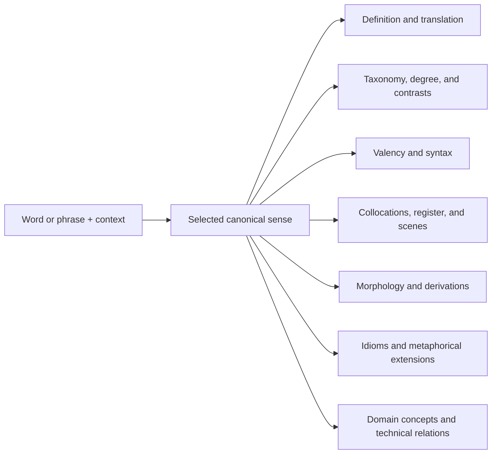

# Transnet: LLM translation and relationship knowledge design

中文：[Transnet：LLM 翻译与关系知识设计](../docs_cn/transnet_cn.md)

Status: authoritative target design. The checked-in runtime currently implements loopback translation and a structured-lookup subset. Canonical MySQL/Qdrant grounding and advanced orchestration remain target capabilities unless their interface documents say otherwise.

## Product focus

Transnet is an LLM-based translation and relationship-exploration application. Translation is the entry point; the differentiated product is the useful network around a selected sense or domain concept. It has two connected experiences:

- **Sentences and passages:** translate meaning, intent, tone, terminology, and structure into natural target-language text.
- **Words, terms, and lexical phrases:** build a concise translation-wiki page around the selected sense or concept and reveal the relationships needed to understand and use it.

The important idea is: **one resolved meaning is the anchor, but the experience is not limited to one isolated word**. A lookup starts from the requested expression, resolves an applicable lexical sense or domain concept, and then explains its useful neighborhood. For ordinary words this includes categories, intensity, grammar, collocations, contrasts, register, morphology, idioms, and cultural extensions. For specialist terms it also includes terminology, domain membership, mechanisms, prerequisites, phenomena, technologies, applications, measurements, standards, and usage conventions. The page remains focused because every displayed node must have an explicit, useful path back to the root.

The project concentrates on these innovations:

1. **Relationship-first exploration.** A lookup produces a small, typed, purpose-ranked subgraph rather than a dictionary entry followed by a flat list of related words.
2. **LLM composition grounded by canonical knowledge.** The model selects, orders, contrasts, and explains; MySQL and Qdrant supply versioned facts and relationship candidates.
3. **Adaptive domain expansion.** The LLM judges whether the resolved meaning is domain-specific and, when useful, opens a technical knowledge neighborhood across languages and disciplines.
4. **Relationship precision.** Taxonomy, degree, synonymy, collocation, syntax, morphology, cultural extension, and exploratory association remain distinct rather than being flattened into “related words.”
5. **Concise, evidence-aware output.** Only useful, supported sections appear; uncertainty and scope are stated instead of filled with plausible-sounding content.

Learning profiles, lessons, exercises, mastery, review scheduling, coaching, and progress tracking are outside this design and are not Transnet modules.

## Core experience

### Intent routing

A word, term, idiom, phrasal verb, or established lexical phrase receives a translation-wiki page. A clause, sentence, or passage receives translation first. An ambiguous short fragment defaults to translation unless it is confidently recognized as a lexical unit. The user does not need to choose an internal model or workflow.

Optional request-scoped context—language, dialect, domain, sentence context, audience, purpose, and register—helps select the intended meaning and control the response. It is discarded after the request.

The same canonical neighborhood may be ranked differently for conversation, academic writing, legal text, technical work, or translation. Context changes selection, ordering, and explanation; it never changes canonical identity or silently rewrites relationship facts.

### Input normalization and sense identity

A versioned normalizer derives bounded lookup forms through Unicode normalization, language-aware case folding, whitespace handling, and punctuation equivalents. Exact canonical and alias matches precede inflection, spelling correction, and semantic retrieval. Meaningful symbols remain distinct: `C`, `C++`, and `C#` must not collapse into one entry.

Cards use stable sense IDs, not normalized strings, as identity. If a form maps to several meanings or parts of speech, Transnet ranks them from the request context or asks for clarification. New cards and aliases are created only by the content-publication workflow, never as a lookup side effect.

## Words, terms, and lexical phrases

A translation-wiki page begins with the concise MySQL basic card, then enriches it with related knowledge from Qdrant. Distinct meanings and parts of speech remain separate so examples, relationships, grammar, pronunciation, and usage guidance stay attached to the applicable sense.

The selected sense is the page root. Related nodes are included only when their connection helps explain or use that sense; they do not turn the page into an unrestricted graph search. Sections may be reordered by relevance, and empty or weakly supported sections are omitted. Explanations remain concise and use short, natural examples.

For a compound or established phrase, the page separates compositional meaning from phrase-level meaning. It explains which parts are predictable from the component words and which relationships, restrictions, or meanings belong only to the expression as a whole.

### Taxonomy and intensity scales

Show broader categories, narrower variants, and meaningful degree relationships. Semantic hierarchy and intensity are different structures: a hypernym names a broader category, a hyponym names a more specific member, and a gradient orders words along a shared dimension.

For example, `warm → hot → sweltering → scorching` is an intensity scale, not a parent-child hierarchy. The page names the comparison dimension and does not imply that adjacent words are interchangeable in every context.

### Valency and syntax patterns

Show the grammatical wiring required to use the word or phrase naturally. Patterns expose structural slots, required prepositions, and permitted complements instead of presenting grammar as an abstract label.

Examples include `show [someone] [something]` and `dissuade [someone] from [doing something]`. A pattern includes a short filled example when the structure is not self-explanatory.

### Collocations and fixed phrases

Show words that naturally cluster with the selected sense and established expressions that function as units. Prefer strong, useful combinations such as `sweltering heat`, `stifling humidity`, and `blistering pace` over long lists of merely possible neighbors.

Keep fixed expressions distinct from productive collocations, and explain restrictions belonging to a particular meaning, grammatical form, or setting.

### Focus, nuance, and connotation

Explain what dimension the selected word emphasizes and how it differs from close alternatives. Relevant distinctions may include physical temperature, lack of airflow, emotional intensity, discomfort, approval, or danger.

State positive, negative, neutral, humorous, euphemistic, or offensive connotations when they affect the choice. Near-synonyms include a contrast rather than being presented as interchangeable.

Alternatives are organized contrastively by the dimension they change—such as degree, formality, approval, danger, domain, or syntax—rather than as a flat synonym list. Each contrast states the practical consequence for choosing one expression over another.

### Register, scene, and domain suitability

Describe where the word or phrase sounds natural, including casual conversation, technical reports, journalism, legal contracts, academic writing, professional communication, and literary prose.

Formality, dialect, period, region, and specialist domain appear only when they affect suitability. Guidance explains the consequence for the scene instead of attaching an unexplained label.

### Morphology and derivations

Connect roots, inflections, affixes, and useful part-of-speech shifts. Show how form changes affect grammar or meaning, as in `swelter → sweltering → swelteringly`.

Prioritize common, productive forms. Mark irregular, uncommon, or stylistically restricted derivations instead of presenting them as equally natural.

### Cultural idioms and metaphorical extensions

Explain idiomatic meanings, cultural associations, and conceptual metaphors that cannot be recovered reliably from literal translation. Heat, for example, may extend to anger, pressure, conflict, danger, or passion.

Distinguish widely understood extensions from culture-specific or regional expressions. Give enough context to understand and use the expression without turning the card into a general cultural essay.

## Domain-aware knowledge expansion

Domain expansion is the central innovation beyond a conventional translation or dictionary page. It applies to a specialist term, abbreviation, formula, named effect, process, material, instrument, method, standard, or other expression whose useful meaning depends on a field of knowledge.

### Domain detection and concept resolution

After lexical sense resolution, the LLM produces a bounded domain assessment: `general`, `domain_specific`, `mixed`, or `uncertain`, with candidate domains and a reason. Signals include the form itself, aliases, definition, sentence context, co-occurring terminology, and canonical domain matches. Deterministic code validates candidate domain IDs and retrieval bounds; the model does not create a canonical domain or fact during lookup.

Domain expansion runs when it is likely to add useful information. A familiar word used technically—such as `field`, `stress`, or `cell`—can therefore open a domain view when its context selects a technical sense. Conversely, a term-looking string with weak evidence stays in lexical mode or is marked uncertain rather than receiving invented specialist detail.

Resolution is concept-first and multilingual. Labels such as `地转偏向力`, `科里奥利力`, and `Coriolis force` may point to one canonical concept while preserving preferred-term, translated-term, alias, region, discipline, and usage-status differences. `卷绳效应` and `rope-coiling effect` similarly resolve to their own shared concept node. Matching translations do not by themselves assert that the two example concepts are related.

### Domain node and edge model

A domain page may contain lexical senses, multilingual terms, concepts, phenomena, mechanisms, processes, equations, quantities, materials, instruments, methods, technologies, applications, standards, organizations, people, places, and misconceptions. The ontology is extensible, but relation meaning must remain explicit.

Useful domain relation families include:

- **terminology:** preferred term, translated as, alias of, abbreviation of, symbol for, named after, and deprecated term;
- **meaning:** defines, is a type of, contrasts with, part of, property of, and measured by;
- **domain:** belongs to field, used in subfield, shared across fields, and field-specific sense of;
- **technical:** caused by, contributes to, governed by, derived from, depends on, implemented by, produces, prevents, and applied in;
- **usage:** preferred in a standard, conventional in a discipline, informal among practitioners, easily confused with, and search synonym; and
- **evidence:** supported by source, disputed by source, valid under condition, and superseded by revision.

Every edge carries direction, a human-readable explanation, applicable domain and sense, conditions, evidence status, confidence, and provenance. Symmetric, inverse, transitive, and causal properties are defined per relation type; the UI and LLM must not guess them from wording.

### Domain-first presentation

The result uses progressive disclosure rather than dumping a graph:

1. Show the resolved concept, concise translation, definition, aliases, and detected domains.
2. Show the highest-value direct relationships grouped by meaning: terminology, mechanism, neighboring phenomena, applications, and usage conventions.
3. Answer “how are these connected?” with a short, evidence-backed path such as `term → phenomenon → mechanism → application`; every intermediate step has a named relation and independently valid evidence.
4. Keep cross-domain or similarity-based candidates in a visibly separate exploratory section.

The LLM chooses what is useful and explains why a relationship matters. Canonical edges are labeled `verified`; evidence-grounded synthesis that is not yet canonical is labeled `inferred`; vector or model proposals are labeled `exploratory`. Inferred and exploratory items are request-local, cannot be silently phrased as facts, and never write themselves into the graph.

For example, a lookup of `地转偏向力` should first resolve the concept and show `Coriolis force` plus the alias `科里奥利力`. It can then expose relevant fields, its rotating-reference-frame mechanism, governing quantities or equations, observable phenomena, common misconceptions, and professional usage. A lookup of `卷绳效应` should resolve `rope-coiling effect` and build a fluid-mechanics neighborhood. The system connects those two roots only if a named, supported relation exists; co-retrieval or visual similarity is not enough.

## Sentences and passages

The translated text is always the primary result. Translation preserves meaning, tone, register, terminology, paragraph structure, protected spans, and formatting while keeping the target-language wording natural.

At most two one-sentence tips appear, and only for a material ambiguity, idiom, consequential register choice, or cultural context. When context is insufficient, the response may include one clearly labeled alternative. Detailed lexical exploration stays in the separate word-page experience.

Long or difficult text may use request-local chunk planning and a terminology ledger to keep names, abbreviations, and repeated terms consistent. This ledger is discarded after the response and is not a persistent user translation memory.

## How the LLM builds a relationship page

The LLM is the page composer, not the source of truth for every fact. The target pipeline is:

The model performs the tasks where language reasoning adds value:

- disambiguate the requested form and resolve a lexical sense or domain concept from bounded context;
- judge whether domain expansion adds value and propose candidate fields;
- decide which relationship sections materially help;
- contrast close alternatives in natural language;
- generate short examples when clearly labeled as generated;
- adapt explanation language and detail; and
- state uncertainty when evidence or context is insufficient.

During composition, the model may detect that an expected relationship is absent. It may emit a structured gap proposal for the offline content-review workflow, including proposed endpoints, relation type, rationale, and candidate evidence. A live lookup never publishes, persists, or presents that proposal as a verified edge.

Deterministic code owns normalization, exact matching, stable IDs, release filters, graph bounds, required fields, and evidence eligibility. Invalid structured output receives bounded repair and otherwise fails safely.

## Canonical knowledge and relationship model

**MySQL basic cards** are authoritative for compact canonical content: cards, senses, forms, aliases, definitions, translations, pronunciation, morphology, examples, usage notes, domains, evidence metadata, immutable revisions, and release manifests.

**Qdrant** is a rebuildable, release-pinned projection. Nodes represent senses, phrases, terms, concepts, entities, phenomena, mechanisms, processes, equations, quantities, instruments, methods, technologies, applications, standards, idioms, metaphors, grammar patterns, collocations, misconceptions, and domains. Edges are searchable explanations of typed relationships. Every edge records endpoints, direction, relation type, restrictions, domain and sense scope, evidence, confidence, verification state, provenance, and release.

Relationship families include:

- lexical naming and translation equivalence;
- hypernym, hyponym, instance, and part-whole structure;
- synonymy, antonymy, contrast, and named intensity dimensions;
- valency, grammar pattern, collocation, and fixed-expression membership;
- derivation, inflection, and other morphological links;
- register, dialect, region, period, scene, and domain suitability;
- idiomatic, metaphorical, and cultural extensions;
- domain membership, mechanism, causation, dependency, implementation, application, measurement, standardization, and terminology conventions; and
- clearly separated exploratory associations.

Lookup resolves MySQL first, then performs exact, hybrid, endpoint, and shallow graph retrieval. Filters apply before limiting by release, publication state, language, dialect, region, period, domain, evidence, and verification state. Vector similarity proposes candidates only; it never proves translation, synonymy, hierarchy, causation, shared mechanism, or cultural meaning.

The service does not perform arbitrary-depth traversal or return every neighbor. Relationship direction, comparison dimension, applicable sense, and usage restrictions must remain visible. If Qdrant is unavailable, a resolved MySQL card may be returned with explicit degraded metadata and no invented relationships.

## Service boundary and quality, briefly

Transnet is stateless and runs behind a private gateway or service mesh. Text, context, and intermediate analysis exist only for the request lifetime and must not be written to MySQL, Qdrant, caches, logs, metrics, traces, telemetry, vectors, or durable queues. Callers must not send user identities, profiles, private history, or end-user credentials.

Prompts, schemas, models, normalizers, retrieval configuration, evidence policy, and knowledge releases are versioned. Quality evaluation covers sense selection, relationship precision, omission and fabrication, translation fidelity, naturalness, terminology, register, cultural scope, degraded reads, prompt injection resistance, and request non-persistence. Human review and curated challenge sets remain necessary; vector similarity, round-trip translation, and LLM judging are signals rather than sole authorities.

The design succeeds when a user can translate connected text or deeply understand one selected lexical sense or domain concept through concise, accurate, useful relationships—without being overwhelmed by unrelated knowledge or misled by unsupported LLM output.

## Related documents

- [Service interface](interfaces/port.md)
- [MySQL interface](interfaces/mysql.md)
- [Qdrant interface](interfaces/qdrant.md)
- [Service behavior](product/service-behavior.md)
- [Content publishing](guides/content-publishing.md)
- [Quality assurance](guides/quality-assurance.md)
