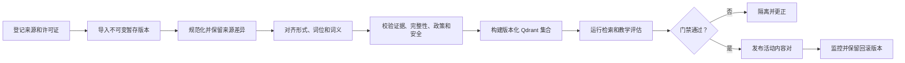

# 发布词汇内容

English: [publish lexical content](../../docs/guides/content-publishing.md)

Island-port 通过 MySQL 和 Qdrant 适配器拥有此持久化流程。当前 Transnet 可执行文件没有数据库、向量集合、导入流水线或 worker 组合。本指南描述拟议流程，不代表当前分支已实现。

## 状态

本流程是 Island-port 的拟议内容摄取与发布流程；当前 Transnet 运行时不实现数据库或向量发布工作。

## 前置条件

导入前记录来源所有者和稳定名称、精确版本、获取日期、内容哈希、许可证及完整条款位置、署名文本和 URL、存储/转换/显示/嵌入/再分发权限、字段和地区限制、删除与更正联系人，以及语言、脚本、方言、领域和日期范围。权限不清的内容不得导入；只能内部搜索而不能再分发的来源必须在每个派生证据片段上保留限制。

## 发布流程

## 1. 登记来源

先建立带来源策略的 `lexical_sources`；资产级元数据必须反映定义、例句、音频和词源等不同许可。

## 2. 创建暂存版本

创建带 source-manifest hash 的不可变 `lexicon_releases`。导入按来源、版本、本地 ID 和内容哈希幂等；重试不能重复证据。

## 3. 规范化语言数据

保留原始 Unicode、语言和方言标签、重音、标点、大小写、脚本、分词器和形态版本；同形词与词义分开，屈折、派生和语义关系分开建模。

## 4. 对齐与去重

先用确定性 ID 和规则对齐，再使用嵌入寻找候选；向量相似度不能单独证明同义、反义、上下位、翻译等关系。歧义合并、拆分、跨语言概念和强关系必须人工审查。

## 5. 校验规范内容

校验必须覆盖证据许可、版本、关系方向、实体类型、同义/反义边、搭配角色、尺度顺序和生成内容的非权威性。隔离、退休或禁止内容不能进入默认查词或图。

## 6. 构建 Qdrant 集合

Qdrant 使用按词义、用途、语言、嵌入模型和集合版本划分的不可变集合。记录维度、归一化、分块、模型、发布版本和状态到 MySQL；检索候选仍须回 MySQL 校验权限与证据。不得把私有查询、上下文、笔记、答案或评论嵌入共享集合。

## 7. 评估版本

发布前运行[质量保证](quality-assurance_cn.md)。许可证、来源、schema、重大误译、关系正确性或安全门禁失败时不得发布。

## 8. 发布

先标记集合 ready，再更新 MySQL 的活动 `(词典版本, 集合版本, schema 版本, ranker 版本)` 元组。MySQL 与 Qdrant 不在同一事务切换，因此每个请求必须读取元组并查询精确的物理集合；保留上一个兼容对以便回滚。

## 9. 观察与更正

监控来源新鲜度、检索质量、证据失败、向量漂移、审核报告和按语言划分的错误率。更正创建新的暂存版本；已发布版本保持不可变。

## 来源移除

来源删除时，先停止新生成和显示，找出所有证据、关系、示例、音频、卡片、manifest、缓存和向量，按政策移除、替换或隔离，再构建、评估和发布替代版本。

## 词义演变

词义拆分或合并要记录 successor；歧义映射暂停相关掌握度，历史练习和尝试保留原始版本与词义。

## 回滚

不得回滚到因许可证或重大安全原因被删除内容的版本；这种情况必须发布修正后的后继版本。

## 相关文档

- [系统设计](../transnet_cn.md)
- [MySQL](../interfaces/mysql_cn.md)
- [Qdrant](../interfaces/qdrant_cn.md)
- [Island-port](../interfaces/port_cn.md)
- [质量保证](quality-assurance_cn.md)
- [总体计划](../todo_cn.md)
