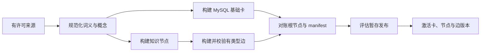

# 发布规范知识内容

English: [Publish canonical knowledge content](../../docs/guides/content-publishing.md)

本指南定义 MySQL 基础卡以及配对 Qdrant 知识节点/知识边集合的拟议发布流程，面向内容工程师和发布运维人员。

状态：拟议；当前运行时没有摄取或发布流水线。

## 前置条件

每个来源都必须有所有者、许可与展示策略、语言/领域、证据粒度、更新频率和删除流程。发布钉住规范化、对齐、嵌入、schema 和证据策略版本。输入不得包含凭据、用户数据、原始生产请求或未审核模型输出。

## 发布流程

## 规范化卡与节点

规范化 Unicode、语言/文字标签、语言感知的规范形式和查询形式、词性、词义、翻译、转写、发音、形态、领域、方言、地区、时代和证据范围，并在嵌入前生成确定性 ID。

每个可独立选择的词义创建一个无 Qdrant 仍可用的精简 MySQL `BasicCard`，包含规范形式与别名、精简翻译与定义、发音与形态摘要、例句、用法说明、领域、证据元数据、发布状态和知识根 ID。Qdrant 节点表示可独立解释的词义、短语、术语、概念、实体、现象、机理、过程、方程、物理量、材料、仪器、方法、技术、应用、标准、组织、人物、地点、习语、隐喻、语法模式、搭配、误解和领域。

## 构建与校验边

节点先于边构建。每条边指定两端、类型、方向、完整解释、适用词义与领域、条件、语言、方言、地区、时代、证据状态、置信度、来源、验证状态和发布。版本化关系注册表定义逆关系、对称性、传递性和因果性，不从标签猜测。校验拒绝孤立端点、跨发布引用、无效方向、重复边、缺失证据与不兼容词义。强度不得冒充分类，探索邻居与已验证边分开。

## 构建不可变 Qdrant 集合

为发布创建一个不可变节点集合和一个不可变边集合，同时使用具名稠密/稀疏向量和 [Qdrant 合同](../interfaces/qdrant_cn.md)的 Payload 索引。在 Manifest 中记录维度、规范化、嵌入模型、哈希、Schema、数量和端点覆盖率。边稠密向量嵌入完整的源–关系–目标解释；重建探索邻居不会修改已验证内容。

## 对账与评估

对账所有 MySQL 根节点、边端点、数量、ID、哈希、证据覆盖、嵌入版本和发布元数据。任何缺失、多余、过时或不兼容记录都使暂存失败。按[质量保证指南](quality-assurance_cn.md)评估精确/混合词义与概念解析、跨语言术语、领域评估、词义分离、关系精度、页面实用性、无支持路径拒绝、MySQL-only 降级、文化范围与延迟边界。

## 激活与回滚

MySQL 卡片发布和配对 Qdrant 节点/边版本作为一个逻辑发布激活，每个请求钉住三者。部分构建不可见，别名不作为版本权威；回滚选择未改动的保留三件组。已发布规范记录绝不静默改写。

## 修正、隔离与删除

紧急隔离先使受影响卡、节点和边不合格，再删除派生向量并对账。Transnet 没有需要迁移或再生成的私有记录。普通修正创建新不可变发布并保留证据谱系；只有有证据的发布决策才能改变已验证边。来源移除遵循许可流程，并覆盖派生别名、向量、边、例句和缓存工件。

## 相关文档

- [系统设计](../transnet_cn.md)
- [MySQL](../interfaces/mysql_cn.md)
- [Qdrant](../interfaces/qdrant_cn.md)
- [质量保证](quality-assurance_cn.md)
