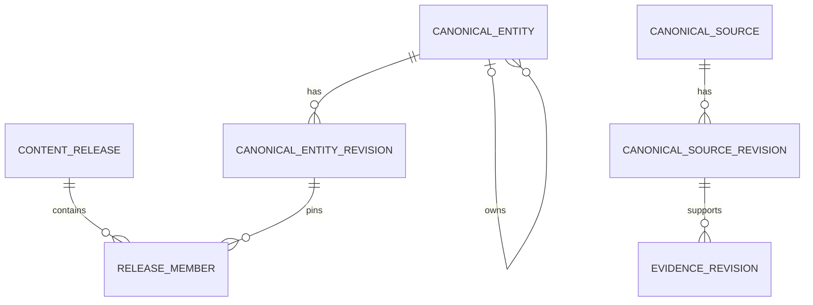

# 规范数据 endpoint 接口

English: [Canonical-data endpoint interface](../../docs/interfaces/canonical-data.md)

本合同定义 island-port 提供的存储无关 HTTP endpoint，涵盖共享规范翻译、单词、短语、词义、领域、证据元数据和不可变内容发布。每个操作均为 UDS 上的 JSON。各 endpoint 的请求示例表示置于通用请求 envelope 内的 `input` object；响应示例是完整 body。MySQL 是计划中的 island-port 实现，不属于本线上合同。

状态：目标 island-port 服务端合同，Transnet 读取 client 已实现。可执行文件可选地组合严格出站 `canonical-data-v1` client 与 active-release 就绪探针；`POST /api/v1/basic-cards/lookup` 和固定发布的 `POST /api/v1/senses/get` 使用该依赖。已实现 client 按本文通用 envelope 与严格 response echo 校验覆盖 active-release、translation candidate、basic-card candidate、sense-detail、有界 domain-inventory、精确 fact revision、完整 semantic scale 与权威 knowledge-node 读取。Domain-assessment 与 knowledge-view application 基础尚未作为在线 route 暴露。外部 island-port server 尚未按本合同完成验证；生产 MySQL migration、publisher/write 操作、旧发布保留及真实端到端验收仍需在本仓库之外完成。

仓库内 M3 publication foundation 建模 Qdrant build lifecycle、idempotency、compatibility receipt 与 reconciliation hash。其出站 publication port 与严格 island-port client 承载有界 build contract；`KnowledgePublicationService` 基于权威 status 恢复，驱动 node/edge publication 直至 reconciliation，且不保存本地 progress。Reconciliation 成功后只返回强类型 activation candidate。仅离线的 `OfflinePublicationService` 与严格 `release-control-v1` client 显式向 island-port 提交该 candidate，或选择已保留的 rollback target；它们不进入在线 `AppState`，也不自行修改 active pointer。仓库没有新增 island-port publication server、MySQL build/reconciliation persistence、active-pointer transaction 或 rollback implementation；这些 authority-owned operation 仍是外部要求。

## 目录

- [规范数据 endpoint 接口](#规范数据-endpoint-接口)
  - [目录](#目录)
  - [endpoint 参考](#endpoint-参考)
  - [存储边界](#存储边界)
  - [精选翻译存储](#精选翻译存储)
  - [领域 assertion 与语义尺度](#领域-assertion-与语义尺度)
  - [通用操作 envelope](#通用操作-envelope)
  - [POST /api/v1/releases/active](#post-apiv1releasesactive)
  - [POST /api/v1/knowledge-releases/active](#post-apiv1knowledge-releasesactive)
  - [POST /api/v1/translations/resolve](#post-apiv1translationsresolve)
  - [POST /api/v1/translations/stage](#post-apiv1translationsstage)
  - [POST /api/v1/basic-cards/resolve](#post-apiv1basic-cardsresolve)
  - [POST /api/v1/senses/get](#post-apiv1sensesget)
  - [POST /api/v1/domains/resolve](#post-apiv1domainsresolve)
  - [POST /api/v1/assertions/get](#post-apiv1assertionsget)
  - [POST /api/v1/semantic-scales/get](#post-apiv1semantic-scalesget)
  - [POST /api/v1/knowledge-nodes/get](#post-apiv1knowledge-nodesget)
  - [领域提案处理](#领域提案处理)
  - [POST /api/v1/cards/revisions/stage](#post-apiv1cardsrevisionsstage)
  - [POST /api/v1/releases/activation-candidates/submit](#post-apiv1releasesactivation-candidatessubmit)
  - [POST /api/v1/releases/rollback/select](#post-apiv1releasesrollbackselect)
  - [相关文档](#相关文档)

## endpoint 参考

Island-port 默认监听 `/run/island-port/island-port.sock`，并遵循[共享 UDS JSON 传输](transnet_cn.md)。调用方绝不直接连接 MySQL 或提交 SQL；查询、事务、schema 兼容性、凭据和连接池均由 island-port 负责。只有 Transnet 运行时和经过认证的发布工具可以访问套接字。运行时调用方具有读取权限；变更 endpoint 还要求 publisher 服务账户。授权来自套接字文件系统凭据，而不是 JSON 字段或转发的 header。

所有路由统一使用 `/api/v1` 前缀。Island-port 套接字与资源路径共同标识本结构化数据 API；调用方无需在路径中添加 `data`、`sql` 或存储厂商名称。

## 存储边界

本 endpoint 背后的 `transnet_canonical` MySQL schema 是精简结构化词汇内容、经审慎选择的规范翻译和发布状态的权威存储。它不包含用户、学习者、账户、画像、偏好、历史、保存项目、书签、练习、答案、掌握度、日程、图布局、反馈、隐私请求或所有权记录；也绝不保留实时翻译请求、查询文本、消歧上下文或未审核 provider 输出。只有通过下述发布工作流，才可存储规范源文与译文。Island-port 可以使用独立授权的产品 schema 保存私有状态，但该 schema 不属于此 endpoint，Transnet 也无权访问。

允许的 Transnet 服务数据：

- 不可变知识发布和兼容性 manifest；
- 规范单词和短语、带语言标签的词形、别名和词义；
- 来源与发布权利已知、面向单词、固定短语或可复用段落的已审核源文—译文；
- 精简定义、翻译、发音、形态、例句和用法说明；
- 规范领域及其范围定义；
- 指向 Qdrant 知识根和证据记录的稳定引用；
- 发布任务、校验结果、幂等记录和 Qdrant 投影 outbox，且均不含请求文本或用户数据。

使用 `utf8mb4`、UTC 微秒时间、不透明稳定公开 ID、在两端均为单一具体类型时使用显式外键，以及不可变已发布修订。凭据和加密密钥置于 MySQL 之外。

目标 schema 有意采用关系型与 JSON 混合模型。稳定身份、生命周期、发布成员关系、关系 endpoint、评估资格和高频查询键使用有类型且带索引的列；随内容族变化的有界字段使用闭合且带版本的 JSON payload schema。这样既避免为每种卡片子项或领域属性建立一张表，也不会让核心 join 和过滤退化成 JSON 扫描。`entity_type_revision` 使新增内容族由数据驱动，无需 `ALTER TABLE`；发布进入活动状态前，必须校验固定的类型定义、payload schema、引用及多态 `release_member` 目标。

## 精选翻译存储

规范翻译模型保存小型已审核目录，而不是流量历史或缓存。`entity_type = 'translation'` 的 `canonical_entity` 行为一个源文—译文选择提供稳定身份。其不可变 `canonical_entity_revision` 将规范化查询键、语言、可选词义身份、发布状态和内容 hash 提升为列；带版本的 payload 包含单词、短语或段落单元，带语言标签的源文与译文，normalizer 版本与源文 fingerprint，可选方言、语域和领域范围，证据与来源引用，发布权利声明、选择理由及审核决定。一条 `release_member` 记录把一个已批准修订固定到发布。基础卡 payload 引用这些翻译实体，不再维护第二份独立发布的翻译值。



来源引文、权利与生命周期数据使用不可变 `canonical_source_revision` 行。Evidence 固定一个精确 source revision，发布同时固定精确 source 与 evidence 修订。因此，更新署名或撤回权利会创建新的 source revision 与发布，不能静默改变旧保留发布看到的来源。

规范公共 ID 遵循 `canonical-id-v1`：实体族前缀标识实体种类，其余不透明值由 publisher 分配，绝不能由规范化文本或内容 hash 派生。在一个发布中，已发布翻译修订由源语言、`translation-source-v1` fingerprint、目标语言及其显式词义或范围键唯一选择。稳定 translation ID 在修正时保持不变；每次修正创建新的正数不可变修订及后续发布成员关系，而不是修改已发布内容。存储源文以便 Transnet 在检索后进行精确比较；仅 fingerprint 匹配绝不充分。词汇范围保留 sense、词性、短语级或组合式含义，以及有界规范领域，从而避免同形词与领域特定含义发生碰撞。Passage 条目有配置长度上限，且必须是可复用参考内容，不能是私人通信或任意提交文本。

重要性是带可审计理由的编辑决定，例如已批准术语、固定习语、可复用产品文案或已审核参考段落。不得通过记录请求文本来推断频率。发布激活前必须完成 publisher 认证、来源检查、权利审核和人工批准。运行时翻译路由没有写权限，也没有 `save` 或 `important` 字段。

用户保存是另一项职责。终端用户加星或保存翻译时，island-port 在其产品数据库中存储该私有记录，并依其同意与保留政策决定是否保留展示结果。它不得把用户 ID、保存状态或私有源文发送到这些规范发布 endpoint。

## 领域 assertion 与语义尺度

规范数据还拥有领域知识 profile、原子 assertion 和语义尺度。领域修订存储多语言名称与别名、定义、包含/排除范围、上层领域 ID，以及包含可用事实族、语言、已验证事实数和覆盖状态（`seed`、`partial` 或 `curated`）的知识 profile。覆盖描述活动发布，绝不声称完整。

Canonical assertion 使用 publisher 所有的 assertion entity 与不可变修订，保存 relation type、registry revision、已审核 statement、适用范围、完整 evidence lineage、provenance 与 verification state。`canonical_assertion_participant` 是有序 schema-defined 实体或有类型字面值角色的权威来源，从而支持二元与 n-ary assertion，且不在单个 JSON blob 中重复 subject/object 值。Assertion 仍可独立审核并按发布寻址；扁平 subject/predicate/object fact 不是第二权威。

`relation_type_revision` 是版本化关系 registry。它定义方向、inverse 行为、对称与传递策略、因果性、允许的 participant role、endpoint 类型兼容性与校验 schema。发布固定精确 registry 修订；UI 与模型都不得从 label 推断这些属性。

`canonical_relationship_revision` 是一个精确 assertion 修订的已校验二元 traversal 投影。它把稳定公开 edge ID 和正关系版本映射到 source/target endpoint、固定 relation-registry 版本、方向、限制与评估资格。Endpoint 和关系字段保留为索引列；解释及有界范围/支持列表使用带版本 payload。该投影支持高效知识视图，但不成为第二权威来源。关系判断与聚合保留在[目标 MySQL 实现](../../docs/interfaces/tables/mysql.sql)定义的独立授权 island-port 产品 schema 中；Transnet 无法访问私有行。

每个 domain 引用都是在同一发布中解析的规范 `DomainId`；label 或自由文本领域名绝不是 identity。关系与 scale condition 使用 registry 自有对象，包含 `condition_id`、`condition_type` 和已排序的 `parameter_ids`，并全部在该发布中解析。展示 prose 可以从这些记录补全，但自由文本 condition 不得进入规范 scope 或 projection identity。

语义尺度使用 `entity_type = 'semantic_scale'` 的 `canonical_entity`。其不可变修订 payload 存储命名维度、递增或递减方向、适用领域与条件、有序词义限定节点成员及证据引用。成员位置只定义顺序。发布拒绝重复位置、缺失成员、混合不兼容词义、缺失证据，以及把尺度编码成 `is_a` 分类的行为。基础卡、事实、profile 与尺度均通过 `release_member` 加入发布。

## 通用操作 envelope

每个适配器操作携带请求 ID、deadline、预期 schema 版本，并可携带不可变内容发布。发布变更还要求幂等键。读操作返回 `ok`、`not_found`、`version_mismatch`、`content_release_unavailable`、`unavailable` 或 `timeout`；变更还可返回 `conflict` 或 `invalid`。`version_mismatch` 的结构化 code 必须是 `schema_incompatible`；只有明确指定的发布无法服务时，才返回 `content_release_unavailable` 及同名 code。不得从 message 文本推断类型。错误不得暴露 SQL、凭据、请求文本、provider body 或连接内部信息。

精确请求 body 为 `{"context": RequestContext, "input": EndpointInput}`。请求上下文：

```json
{
  "request_id": "req_01K4Z8P8Y7D3N5Q2F6M1J9T0VX",
  "deadline_at": "2026-09-12T10:30:05.000000Z",
  "schema_version": "canonical-data-v1",
  "content_release": "knowledge-2026-09"
}
```

Stage 3 Transnet client 要求每个响应在顶层回显 `request_id` 和 `schema_version`；成功的固定发布读取还必须返回 `content_release`。Client 拒绝 unknown field、重复的 indexed-lineage key、超限 body、缺失回显、不同 schema 或 release，以及任何不能通过当前 Rust domain constructor 重建的响应。仍实现旧示例的 island-port 部署必须先同步本节 contract delta；Transnet 不推导缺失的权威字段，也不回退到旧 schema。

关闭错误响应：

```json
{
  "request_id": "req_01K4Z8P8Y7D3N5Q2F6M1J9T0VX",
  "schema_version": "canonical-data-v1",
  "content_release": "knowledge-2026-09",
  "outcome": "content_release_unavailable",
  "error": {
    "code": "content_release_unavailable",
    "message": "The requested content release is not available.",
    "retryable": false
  }
}
```

## POST /api/v1/releases/active

Stage 4 在 application 请求开始时只选择一次 active 不可变规范发布版本。这是 island-port 的权威读取，不负责选择向量版本或排序策略。请求 context 不包含 `content_release`，因为本操作正负责选择它。`schema_version` 是 transport 合同版本；`canonical_schema_version` 是所选发布的内容 schema。成功值中的两个字段均为必填且有界。请求不携带源文。

```json
{
  "context": {
    "request_id": "req_example",
    "deadline_at": "2099-01-01T00:00:00Z",
    "schema_version": "canonical-data-v1"
  },
  "input": {}
}
```

```json
{
  "request_id": "req_example",
  "schema_version": "canonical-data-v1",
  "outcome": "ok",
  "value": {
    "content_release": "release_example",
    "canonical_schema_version": "canonical_example"
  }
}
```

闭合 outcome 为 `ok`、`not_found`（没有可安全服务的 active 发布）、`version_mismatch`、`unavailable` 与 `timeout`。错误沿用现有脱敏 `error` 对象，必须回显 request ID 和 schema，且不能携带成功值。未知、缺失、矛盾或超限响应全部 fail closed。`value` 不包含 `vector_collection_id` 或 `ranking_version`：向量组合属于后续工作，确定性排序策略由 Transnet 负责。发布 ID 和规范 schema 必须来自同一次原子 active 指针读取。同一请求后续所有规范读取都携带返回的 `content_release`；即使新发布激活，island-port 也必须能读取当前请求已固定的不可变旧发布，绝不能偷偷升级。若固定发布已无法安全服务，整个请求闭合失败。

island-port server 不在当前仓库，仍需实现该 operation、原子选择、在途有界请求所需的旧发布保留，以及闭合错误 outcome。Transnet 的出站 client 和 fake-UDS 测试不代表真实 MySQL 端到端部署已完成。

## POST /api/v1/knowledge-releases/active

通过一个只读原子 operation 选择完整 active canonical、node-collection 与 edge-collection tuple。本 operation 是 online projection readiness 的权威来源；它绝不激活、回滚、构建或变更发布。Context 省略 `content_release`，因为返回 tuple 自身选择该 pin。Request 与 `releases/active` 使用相同的空 input。

```json
{
  "context": {"request_id": "req_example", "deadline_at": "2099-01-01T00:00:00Z", "schema_version": "canonical-data-v1"},
  "input": {}
}
```

```json
{
  "request_id": "req_example",
  "schema_version": "canonical-data-v1",
  "outcome": "ok",
  "value": {
    "content_release": "knowledge-2026-09",
    "canonical_schema_version": "canonical-v1",
    "node_collection_id": "knowledge_nodes__knowledge_2026_09",
    "node_collection_content_hash": "sha256:aaaaaaaaaaaaaaaaaaaaaaaaaaaaaaaaaaaaaaaaaaaaaaaaaaaaaaaaaaaaaaaa",
    "edge_collection_id": "knowledge_edges__knowledge_2026_09",
    "edge_collection_content_hash": "sha256:bbbbbbbbbbbbbbbbbbbbbbbbbbbbbbbbbbbbbbbbbbbbbbbbbbbbbbbbbbbbbbbb",
    "relationship_registry_version": 1,
    "edge_dense_input_version": "edge-dense-input-v1",
    "edge_lexical_input_version": "edge-lexical-input-v1"
  },
  "error": null
}
```

两个 collection ID 必须不同。两个 hash 都是规范小写 SHA-256 值，registry revision 精确为 `1`，两个 edge input version 是冻结的 retrieval-data 值。只有当 active pointer 命名一个可安全读取的 canonical release、两个不可变 verified collection 且 endpoint reconciliation 完整时，island-port 才返回 `ok`。Code 为 `not_found` 的 `not_found` 表示没有完整 tuple 处于 active。其他精确组合为 `version_mismatch` 与 `schema_incompatible`、`unavailable` 与 `dependency_unavailable`、`timeout` 与 `timeout`。所有失败均无 value；所有成功均无 error。未知字段、部分 value、变化的 echo、发布成员不匹配、alias、未验证 collection、相同 collection ID、不兼容 version 或矛盾 outcome topology 全部闭合失败。

已实现的 Transnet `ActiveKnowledgeReleasePort` 与严格 island-port adapter 会重建完整 `NeighborProjectionExecutionExpectation` 并在返回前验证。启用的 knowledge composition 将其用于启动选择、route-bundle 一致性与 readiness。外部 island-port server 及其原子 active-pointer read 仍是外部工作。

对于下文有界的翻译及基础卡候选列表读取，合格的零命中搜索使用 `ok` 与空 `matches` 列表。Stage 4 组合不会把下游 `not_found` 悄悄转换为空结果；它仍是闭合错误，避免不可读取的固定发布被伪装成搜索未命中。

## POST /api/v1/translations/resolve

从一个不可变发布中解析完全匹配的已审核翻译。Transnet 在内存中计算带版本的 fingerprint，不向适配器发送实时源文或消歧句。适配器在限制内返回所有相同 fingerprint 的合格候选；Transnet 使用指定 normalizer 比较已存源文，并在采用候选前应用词义与范围约束。该读取可安全重试。

请求 `input`：

```json
{
  "source_fingerprint": "sha256:8bb7a7d7b6d9...",
  "normalizer_version": "translation-source-v1",
  "source_language": "en",
  "target_language": "zh-CN",
  "sense_id": "sense_sweltering_hot_01",
  "domain_ids": ["domain_weather"],
  "dialect": "en-US",
  "register": "neutral",
  "limit": 5
}
```

响应。词汇候选必须包含 `scope`；可复用 passage 必须使用 `scope: null`：

```json
{
  "request_id": "req_01K4Z8P8Y7D3N5Q2F6M1J9T0VX",
  "schema_version": "canonical-data-v1",
  "outcome": "ok",
  "value": {
    "matches": [
      {
        "translation_id": "tr_sweltering_zh_cn_01",
        "revision": 3,
        "unit": "word",
        "source_fingerprint": "sha256:8bb7a7d7b6d9...",
        "source": {"text": "sweltering", "language": "en"},
        "target": {"text": "酷热的", "language": "zh-CN"},
        "scope": {
          "lexeme_id": "lexeme_sweltering_en_adj_01",
          "sense_id": "sense_sweltering_hot_01",
          "part_of_speech": "adjective",
          "composition": "compositional",
          "domain_ids": ["domain_weather"]
        },
        "evidence_ids": ["evidence_dictionary_1042"]
      }
    ]
  },
  "content_release": "knowledge-2026-09"
}
```

## POST /api/v1/translations/stage

暂存一个候选修订，供审核及后续发布激活。只有经过认证的发布工具可以调用此幂等变更。暂存不会使内容对运行时流量可读。Publisher 必须提供规范、非个人文本，并声明已经审核来源与发布权利。

请求 `input`：

```json
{
  "translation_id": "tr_up_in_the_air_zh_cn_01",
  "unit": "phrase",
  "source": {"text": "up in the air", "language": "en"},
  "target": {"text": "悬而未决", "language": "zh-CN"},
  "sense_id": "sense_up_in_the_air_undecided_01",
  "domain_ids": ["domain_general"],
  "dialect": "en-US",
  "register": "neutral",
  "normalizer_version": "translation-source-v1",
  "selection_reason": "established_idiom",
  "evidence_ids": ["evidence_dictionary_2117"],
  "provenance": ["source_dictionary_2026_01"],
  "rights_assertion": "approved_for_canonical_publication",
  "idempotency_key": "stage-translation-up-in-the-air-zh-cn-r1",
  "review": {
    "state": "approved",
    "policy_version": "canonical-translation-review-v1"
  }
}
```

响应：

```json
{
  "outcome": "ok",
  "value": {
    "translation_id": "tr_up_in_the_air_zh_cn_01",
    "revision": 1,
    "publication_state": "staged",
    "content_hash": "sha256:4ef760d1..."
  }
}
```

使用同一幂等键与相同请求 fingerprint 会返回原结果；对不同内容复用则返回 `conflict`。激活使用现有发布暂存和激活操作，并验证每个翻译修订已经批准、内部一致且有证据支持。

## POST /api/v1/basic-cards/resolve

输入规范化属于 Transnet 运行时。适配器只接收有界、排序后的派生形式，绝不接收原始查询、中间变换或上下文。精确规范形式和别名优先于屈折、拼写修正和宽松别名；`C`、`C++`、`C#` 等有意义符号不合并。

本操作返回固定发布的 identity/core candidate data，而不是最终展示卡。Transnet 负责确定性 ranking、dedup、歧义解析和 coverage；选定 sense 后再调用 `senses/get`，最终 `CanonicalLookupCard` 由 application 层形成。Rank、fusion score、coverage 和最终 resolution 都不是 island-port authority；Qdrant 与 knowledge-root 数据不属于 Milestone 2。

请求：

```json
{
  "lookup_forms": [
    {
      "form": "sweltering",
      "match_class": "exact_canonical",
      "rank": 0
    }
  ],
  "normalizer_version": "unicode-nfc-lookup-v1",
  "source_language": "en",
  "explanation_language": "zh-CN",
  "dialect": "en-US",
  "evidence_use": "api_redistribution",
  "limit": 5
}
```

响应：

```json
{
  "request_id": "req_01K4Z8P8Y7D3N5Q2F6M1J9T0VX",
  "schema_version": "canonical-data-v1",
  "outcome": "ok",
  "value": {
    "matches": [
      {
        "matched_form": "sweltering",
        "match_class": "exact_canonical",
        "matched_form_id": "form_sweltering_lemma_01",
        "lexical_score_basis_points": 10000,
        "candidate": {
          "lexeme": {"id": "lexeme_sweltering_en_adj_01", "language": "en", "lemma": "sweltering", "lemma_evidence_ids": ["evidence_dictionary_lemma_1041"], "normalized_lemma": "sweltering", "part_of_speech": "adjective", "status": "active"},
          "sense": {"id": "sense_sweltering_hot_01", "lexeme_id": "lexeme_sweltering_en_adj_01", "sense_key": "weather-hot", "definition": "uncomfortably hot", "definition_evidence_ids": ["evidence_dictionary_1042"], "status": "active"},
          "forms": [{"id": "form_sweltering_lemma_01", "lexeme_id": "lexeme_sweltering_en_adj_01", "form": "sweltering", "normalized_form": "sweltering", "kind": "lemma", "morphology": null, "evidence_ids": ["evidence_dictionary_1042"], "status": "active"}],
          "sources": [{"release_id": "knowledge-2026-09", "source": {"id": "source_dictionary_2026_01", "name": "Reviewed dictionary", "version": "2026-09", "license": "reviewed", "attribution": "Dictionary publisher (2026)", "permissions": {"storage": true, "display": true, "embedding": true, "model_processing": true, "api_redistribution": true}}}],
          "evidence": [{"id": "evidence_dictionary_lemma_1041", "source_id": "source_dictionary_2026_01", "source_reference": "entry:sweltering:lemma", "language": "en", "kind": "other", "confidence": "high", "text": "sweltering", "content_hash": "sha256:lemma...", "permissions": {"storage": true, "display": true, "embedding": true, "model_processing": true, "api_redistribution": true}, "status": "active"}, {"id": "evidence_dictionary_1042", "source_id": "source_dictionary_2026_01", "source_reference": "entry:sweltering:adj:1", "language": "en", "kind": "definition", "confidence": "high", "text": "uncomfortably hot", "content_hash": "sha256:4ef760d1...", "permissions": {"storage": true, "display": true, "embedding": true, "model_processing": true, "api_redistribution": true}, "status": "active"}]
        }
      }
    ],
    "alternatives": [],
    "truncated": false
  },
  "content_release": "knowledge-2026-09"
}
```

唯一性由稳定的词形、卡片和词义 ID 及已发布规范形式/别名行维护，不依赖临时规范化检索字符串。最佳适用层级的所有合格冲突均须返回，由服务解析。

`matched_form_id` 与 `matched_form` 是证明输入，不是展示提示。Transnet 要求该 ID 解析到返回 lexeme 所属的 active form，并要求 surface value 与存储 form 完全一致。声明的类别还必须符合权威 form role：`exact_canonical` 要求 lemma，`exact_alias` 要求已发布 spelling variant、alias 或 phrase，`inflection` 要求 inflection。拼写修正与转写结果仍须指明权威存储目标 form。任何不匹配都使整个权威响应闭合失败，而不会降级成 semantic nomination。

每个候选必须为每条 evidence 提供权威且固定发布的 source 记录。`source.id` 必须等于 `evidence.source_id`；source 和 evidence 的权限均须允许请求用途，且 evidence 权限不得超过 source 权限。公开再分发所需的 `source.attribution` 必须是非空、经过权利审核的人类可读署名（最多 256 个 Unicode 字符），不能由 source ID 或名称拼接。缺失、重复、冲突、无许可或跨发布的 source/evidence 记录均闭合失败。适配器将严格私有 DTO 映射至已有 candidate/source/evidence domain 类型；真实交付前 island-port 必须补齐此数据链。content hash 和权限位仍仅供内部使用。

`lexeme.lemma_evidence_ids` 是必填、排序且唯一的 1 至 8 个 evidence ID，专门支持 canonical lemma assertion。它不能借用 sense definition evidence，不暗示存在 `FormKind::Lemma`，也永不参与 lexeme identity。每个 ID 必须通过响应 evidence/source chain（或 `senses/get` 的 indexed `lineages` map）解析到同一发布及请求 permission；dangling、重复、冲突或未使用 lineage 均闭合失败。

Stage 4 canonical-only 调用方以 `unicode-nfc-lookup-v1` 标识其实际的基础 NFC/小写查询行为；先前示意性的 `unicode-nfkc-v2` 值并不描述该实现。此版本是 request-local normalization metadata，不是规范权威数据或身份。

## POST /api/v1/senses/get

返回可独立构造的 typed canonical sense details。`target` 包含完整权威 Lexeme 与 Sense；`lineages` 是以 evidence ID 为键的对象，assertion 通过 ID 引用。Island-port 拒绝重复或冲突 ID；Transnet 在构造 `CanonicalSenseDetails` 前拒绝 dangling reference、未使用 lineage、release/target mismatch、permission escalation、无效 lifecycle state 与不兼容 evidence kind。

请求：

```json
{
  "sense_id": "sense_sweltering_hot_01",
  "explanation_language": "zh-CN",
  "dialect": "en-US",
  "evidence_use": "api_redistribution"
}
```

响应：

```json
{
  "request_id": "req_01K4Z8P8Y7D3N5Q2F6M1J9T0VX",
  "schema_version": "canonical-data-v1",
  "outcome": "ok",
  "content_release": "knowledge-2026-09",
  "value": {
    "canonical_schema_version": "canonical-v1",
    "target": {
      "lexeme": {"id": "lexeme_sweltering_en_adj_01", "language": "en", "lemma": "sweltering", "lemma_evidence_ids": ["evidence_dictionary_lemma_1041"], "normalized_lemma": "sweltering", "part_of_speech": "adjective", "status": "active"},
      "sense": {"id": "sense_sweltering_hot_01", "lexeme_id": "lexeme_sweltering_en_adj_01", "sense_key": "weather-hot", "definition": "uncomfortably hot", "definition_evidence_ids": [], "status": "active"}
    },
    "lineages": {"evidence_dictionary_lemma_1041": {"source": {"id": "source_dictionary_2026_01", "name": "Reviewed dictionary", "version": "2026-09", "license": "reviewed", "attribution": "Dictionary publisher (2026)", "permissions": {"storage": true, "display": true, "embedding": true, "model_processing": true, "api_redistribution": true}}, "fragment": {"id": "evidence_dictionary_lemma_1041", "source_id": "source_dictionary_2026_01", "source_reference": "entry:sweltering:lemma", "language": "en", "kind": "other", "confidence": "high", "text": "sweltering", "content_hash": "sha256:lemma...", "permissions": {"storage": true, "display": true, "embedding": true, "model_processing": true, "api_redistribution": true}, "status": "active"}, "origin": {"kind": "licensed_source"}}},
    "localized_glosses": [],
    "pronunciations": [],
    "usage_labels": [],
    "grammar_patterns": [],
    "collocations": [],
    "examples": [],
    "pitfalls": [],
    "etymologies": [],
    "history": []
  }
}
```

成功的 sense value 必须包含 `canonical_schema_version`，并与调用方提供的不可变 `CanonicalReleasePin` 一致，否则闭合失败。active 从 R1 切至 R2 后，固定 R1 的读取仍必须服务 R1；island-port 须在约定的请求中/后续读取窗口内保留旧发布。若明确指定的 R1 无法服务，返回 `content_release_unavailable` 及同名 code；adapter/schema 不兼容则返回 `version_mismatch` 与 `schema_incompatible`。不得偷偷选择 R2，也不得根据错误 message 分类。

## POST /api/v1/domains/resolve

领域是规范版本化记录，不是自由标签。先匹配已发布名称和别名；若多个范围均匹配，适配器返回候选，由发布流程消歧。

请求：

```json
{
  "context": {
    "request_id": "req_01K4Z8P8Y7D3N5Q2F6M1J9T0VX",
    "deadline_at": "2026-09-18T12:00:02Z",
    "schema_version": "canonical-data-v1",
    "content_release": "knowledge-2026-09"
  },
  "input": {
    "normalized_labels": ["meteorology", "weather"],
    "scope_key": "earth-atmosphere-weather",
    "languages": ["en", "zh-CN"],
    "limit": 5
  }
}
```

响应：

```json
{
  "request_id": "req_01K4Z8P8Y7D3N5Q2F6M1J9T0VX",
  "schema_version": "canonical-data-v1",
  "outcome": "ok",
  "content_release": "knowledge-2026-09",
  "value": {
    "catalog_complete": true,
    "candidates": [
      {
        "domain_id": "domain_weather",
        "revision": 4,
        "labels": [{"language": "en", "text": "weather"}, {"language": "zh-CN", "text": "天气"}],
        "aliases": [{"language": "en", "text": "meteorological weather"}],
        "definitions": [{"language": "en", "text": "Conditions of the atmosphere at a place and time."}, {"language": "zh-CN", "text": "某一地点和时间的大气状态。"}],
        "inclusion_scope": ["humidity", "precipitation", "temperature", "wind"],
        "exclusion_scope": ["long-term climate classification"],
        "broader_domain_ids": ["domain_earth_science"],
        "knowledge_profile": {
          "available_fact_families": ["definition", "measurement", "taxonomy", "terminology"],
          "languages": ["en", "zh-CN"],
          "verified_fact_count": 184,
          "coverage_state": "partial"
        }
      }
    ]
  }
}
```

每条记录的 request 与 response 上限分别为 32 个 candidate、8 个 label、16 个 alias、8 个 definition、16 个 inclusion item、16 个 exclusion item、8 个 broader domain、16 个 fact family 与 8 个 profile language。Candidate 必须按 `domain_id` 严格排序且唯一；label、alias 与 definition 必须先按规范 language tag、再按精确 text 严格排序且唯一。Inclusion scope、exclusion scope、broader-domain ID、fact family 与 profile language 也必须排序且唯一。每个 candidate 均属于回显的不可变发布，`domain_id` 与 `broader_domain_ids` 使用规范 `DomainId`，绝不使用 label 充当 identity。

`catalog_complete` 表示 island-port 已检查本次有界查询下完整的合格已发布 catalog；它不声称人类知识完整。Transnet 仅依据这份精确返回的 allowlist 校验全部所选 ID。清单不可用、畸形、跨发布或以其他方式失败时，application 结果必须为 `uncertain`。只有 `catalog_complete` 为 true、可选 broader ID 来自该 allowlist，且规范 language-plus-label pair 不与所提供的任何 label 或 alias 精确冲突时，才允许请求级 `proposed_new`。两个操作均不写入领域。

## POST /api/v1/assertions/get

在向量检索后按顺序、有界地补全精确 canonical assertion 修订。Qdrant 仅提供 relationship projection proof：edge/relationship 修订、assertion/registry 修订、所选 traversal、endpoint 与有类型 relation。Island-port 返回权威 assertion、完整 evidence lineage 及精确 resolved registry entry。Transnet 将三者一起校验；不存在另一个扁平 fact 权威。冻结的子合同为 `canonical-data-v1` envelope 中的 `canonical-assertions-v1`。

请求 `input`：

```json
{
  "projections": [{"edge_id":"edge_heat_01","relationship_revision":3,"assertion_id":"assertion_heat_01","assertion_revision":2,"traversal_id":"traversal_degree","source_node_id":"node_scorching_heat_01","target_node_id":"node_sweltering_hot_01","relation_type":"higher_degree_than","relation_registry_revision":1}],
  "assertion_contract_version": "canonical-assertions-v1",
  "content_release": "knowledge-2026-09",
  "canonical_schema_version": "canonical-v1",
  "evidence_use": "display",
  "limit": 20
}
```

响应：

```json
{
  "request_id": "01K6G7R1S8Z3Q4P5T6V7W8X9Y0",
  "schema_version": "canonical-data-v1",
  "canonical_schema_version": "canonical-v1",
  "outcome": "ok",
  "value": {"assertion_contract_version":"canonical-assertions-v1","assertions":[]},
  "content_release": "knowledge-2026-09"
}
```

返回顺序是移除被排除引用后的请求子序列。每个未省略项包含 `projection`、`assertion` 与 `registry`。Assertion 携带有序 role participant、结构化 domain/condition、适用 sense、evidence ID 与完整 lineage、provenance ID 及 verification state。Registry 携带 role cardinality/value rule、同发布 resolved domain/condition record 与显式 binary traversal。Transnet 拒绝被替换的修订、未知 role/traversal、endpoint/relation 不一致、不支持或跨发布 scope，以及不允许所请求用途的 evidence。请求和响应最多包含 50 个 projection。Island-port server/schema 实现与 Qdrant edge payload 重建仍是外部工作。

## POST /api/v1/semantic-scales/get

按稳定 ID 返回完整的权威语义尺度。调用方通常从 Qdrant 获取候选尺度 ID，并提供选定词义或节点，以便 island-port 应用范围与条件资格。尺度要么完整返回，要么省略；调用方不得从无关的成对边重建梯度。

请求 `input`：

```json
{
  "scale_ids": ["scale_environmental_heat_intensity_01"],
  "for_node_id": "node_sweltering_hot_01",
  "content_release": "knowledge-2026-09",
  "canonical_schema_version": "canonical-v1",
  "verification_states": ["verified"],
  "limit": 5
}
```

响应：

```json
{
  "request_id": "01K6G7R1S8Z3Q4P5T6V7W8X9Y0",
  "schema_version": "canonical-data-v1",
  "canonical_schema_version": "canonical-v1",
  "outcome": "ok",
  "value": {
    "scales": [
      {
        "scale_id": "scale_environmental_heat_intensity_01",
        "revision": 1,
        "dimension": "environmental_heat_intensity",
        "direction": "increasing",
        "domain_ids": ["domain_weather"],
        "conditions": [{"condition_id": "condition_environmental_weather_01", "condition_type": "usage_context", "parameter_ids": ["context_environment", "context_weather"]}],
        "members": [
          {"node_id": "node_warm_temperature_01", "position": 10},
          {"node_id": "node_hot_temperature_01", "position": 20},
          {"node_id": "node_sweltering_hot_01", "position": 30},
          {"node_id": "node_scorching_heat_01", "position": 40}
        ],
        "evidence_ids": ["evidence_dictionary_1042"],
        "verification_state": "verified"
      }
    ]
  },
  "content_release": "knowledge-2026-09"
}
```

`position` 只建立序数顺序，绝不表示数值强度间隔。调用方从返回的尺度推导相邻程度展示；分类仍是独立类型的 `is_a` / `has_subtype` 关系。

响应顺序是所请求 scale ID 的子序列。每个返回尺度必须包含 `for_node_id`、携带正修订、包含两至 32 个唯一 member 且 position 为严格递增的正数，并提供一至 32 个排序唯一 evidence ID。请求和响应最多包含 50 个尺度；`limit` 不得超过 50。

## POST /api/v1/knowledge-nodes/get

为检索提名的 node 补全适合展示的权威值。当知识视图会显示 node label、language、domain membership 或 evidence reference 时，建议使用本操作；最小 Qdrant candidate payload 只是提名数据，不是权威。

请求 `input`：

```json
{
  "node_ids": ["node_sweltering_hot_01"],
  "content_release": "knowledge-2026-09",
  "canonical_schema_version": "canonical-v1",
  "evidence_use": "api_redistribution",
  "limit": 20
}
```

响应：

```json
{
  "request_id": "01K6G7R1S8Z3Q4P5T6V7W8X9Y0",
  "schema_version": "canonical-data-v1",
  "canonical_schema_version": "canonical-v1",
  "outcome": "ok",
  "value": {
    "nodes": [
      {
        "node_id": "node_sweltering_hot_01",
        "revision": 4,
        "node_type": "lexical_sense",
        "sense_id": "sense_sweltering_hot_01",
        "canonical_label": "sweltering",
        "language": "en",
        "domain_ids": ["domain_weather"],
        "evidence_ids": ["evidence_dictionary_1042"],
        "verification_state": "verified"
      }
    ]
  },
  "content_release": "knowledge-2026-09"
}
```

三个 hydration operation 都要求 input 包含 `content_release` 与 `canonical_schema_version`，并在顶层精确回显二者。Transnet 拒绝任一不匹配；transport `schema_version` 不能替代内容 schema pin。

响应顺序是移除不合格值后的请求 node ID 子序列。每个 node 都有正不可变修订、闭合 node family、可选规范 BCP 47 language、最多 512 个 scalar 的已审核 label、排序唯一 domain ID，以及一至 32 个排序唯一 evidence ID。`lexical_sense` node 必须携带其规范 `sense_id`；其他每种 node family 都必须把 `sense_id` 设为 `null`。请求和响应最多包含 50 个 node。缺失或不合格值会被省略；未请求、重复、跨发布、未验证或格式错误的 node 会使整个响应闭合失败。

## 领域提案处理

不存在 live 创建领域 endpoint。Transnet 向 LLM 提供领域解析返回的有界 allowlist。若 LLM 不选择任何项并输出结构化提案，确定性代码为该请求返回 `proposed_new`。清单不可用或失败时返回 `uncertain`，而非提案。运行时流量不能写入提案。

离线 publisher 可在普通暂存发布工件中加入提议领域、生成事实候选、语义尺度及其来源。它们适用与其他规范内容相同的冲突、范围、证据、权利、审核、幂等和不可变发布校验。因此新领域不需要领域专用创建 endpoint。

## POST /api/v1/cards/revisions/stage

暂存不可变的单词或短语修订及其 Qdrant 根引用。暂存校验所有结构化字段，但不会让内容从活动发布中读取。

请求：

```json
{
  "card": {
    "card_id": "card_sweltering_en_adj_01",
    "sense_id": "sense_sweltering_hot_01",
    "canonical_form": "sweltering",
    "language": "en",
    "part_of_speech": "adjective",
    "definitions": ["uncomfortably hot, especially because of the weather"],
    "translations": [
      {
        "language": "zh-CN",
        "text": "酷热的"
      }
    ],
    "knowledge_root_ids": ["node_sweltering_hot_01"],
    "domain_ids": ["domain_weather"]
  },
  "target_release": "knowledge-2026-10",
  "source_revision": 3,
  "evidence_ids": ["evidence_dictionary_1042"],
  "idempotency_key": "stage-card-sweltering-r4"
}
```

响应：

```json
{
  "outcome": "ok",
  "value": {
    "card_id": "card_sweltering_en_adj_01",
    "sense_id": "sense_sweltering_hot_01",
    "revision": 4,
    "publication_state": "staged",
    "target_release": "knowledge-2026-10"
  }
}
```

## POST /api/v1/releases/activation-candidates/submit

这个仅 publisher 可用的 island-port operation 接收已完成 reconciliation 的 activation proof。Island-port 执行原子选择，并拒绝缺失或不兼容的 canonical content、collection manifest、active-release precondition 或 append-only audit precondition。严格 Transnet client 提交 build 与 reconciliation identity、存储无关 canonical-content hash、两个不可变 collection proof、publication manifest、idempotency key 与精确的下一 audit sequence，并校验 receipt 的每个 echo。

引用的 Qdrant manifest 是向量合同定义的完整强类型发布三件套：一个规范发布及 schema、一个已验证不可变节点 collection，以及一个针对该精确节点哈希构建的已验证不可变边 collection。激活不接受单个通用 vector collection ID、活动 alias、不完整 collection 对或 Transnet 本地 ranking version。所提供的 manifest hash 覆盖 collection ID、schema、嵌入修订、数量、哈希与完整端点覆盖。

请求：

```json
{
  "build_id": "sha256:aaaaaaaaaaaaaaaaaaaaaaaaaaaaaaaaaaaaaaaaaaaaaaaaaaaaaaaaaaaaaaaa",
  "reconcile_id": "sha256:bbbbbbbbbbbbbbbbbbbbbbbbbbbbbbbbbbbbbbbbbbbbbbbbbbbbbbbbbbbbbbbb",
  "release_id": "knowledge-2026-10",
  "canonical_schema_version": "canonical-v1",
  "expected_active_release": "knowledge-2026-09",
  "canonical_content_hash": "sha256:cccccccccccccccccccccccccccccccccccccccccccccccccccccccccccccccc",
  "publication_manifest_hash": "sha256:dddddddddddddddddddddddddddddddddddddddddddddddddddddddddddddddd",
  "node_collection_id": "knowledge_nodes__knowledge_2026_10",
  "node_projection_hash": "sha256:eeeeeeeeeeeeeeeeeeeeeeeeeeeeeeeeeeeeeeeeeeeeeeeeeeeeeeeeeeeeeeee",
  "node_persisted_hash": "sha256:ffffffffffffffffffffffffffffffffffffffffffffffffffffffffffffffff",
  "node_point_count": 184220,
  "edge_collection_id": "knowledge_edges__knowledge_2026_10",
  "edge_projection_hash": "sha256:1111111111111111111111111111111111111111111111111111111111111111",
  "edge_persisted_hash": "sha256:2222222222222222222222222222222222222222222222222222222222222222",
  "edge_point_count": 612840,
  "edge_verified_node_projection_hash": "sha256:eeeeeeeeeeeeeeeeeeeeeeeeeeeeeeeeeeeeeeeeeeeeeeeeeeeeeeeeeeeeeeee",
  "expected_endpoint_count": 1225680,
  "resolved_endpoint_count": 1225680,
  "dense_artifact_revision": "deployment-supplied-immutable-revision",
  "sparse_encoder_revision": "v1",
  "idempotency_key": "activate-knowledge-2026-10",
  "prior_audit_sequence": 183,
  "audit_sequence": 184
}
```

响应：

```json
{
  "request_id": "req_activate_01",
  "schema_version": "release-control-v1",
  "content_release": "knowledge-2026-10",
  "outcome": "ok",
  "value": {
    "active_release": "knowledge-2026-10",
    "previous_release": "knowledge-2026-09",
    "selected_at": "2026-10-01T00:00:00Z",
    "audit_sequence": 184,
    "publication_manifest_hash": "sha256:dddddddddddddddddddddddddddddddddddddddddddddddddddddddddddddddd"
  },
  "error": null
}
```

隔离、撤回和修正会创建新的发布状态或发布，绝不静默重写已发布行。

## POST /api/v1/releases/rollback/select

这个仅 publisher 可用的 island-port operation 选择一个此前已验证、已保留且可寻址的不可变 trio。严格 `release-control-v1` 请求给出 expected active release、目标 canonical-content 与 publication-manifest proof、idempotency key、精确的下一 audit sequence，以及 `verification_failure`、`canonical_defect`、`projection_defect` 或 `security_quarantine` 之一。它绝不改写目标。

请求 `input`：

```json
{
  "expected_active_release": "knowledge-2026-10",
  "target_release": "knowledge-2026-09",
  "target_canonical_content_hash": "sha256:3333333333333333333333333333333333333333333333333333333333333333",
  "target_publication_manifest_hash": "sha256:4444444444444444444444444444444444444444444444444444444444444444",
  "reason_code": "verification_failure",
  "idempotency_key": "rollback-knowledge-2026-09",
  "prior_audit_sequence": 184,
  "audit_sequence": 185
}
```

响应使用 activation receipt shape，其中 `active_release` 为 `knowledge-2026-09`、`previous_release` 为 `knowledge-2026-10`，并精确回显 target manifest 与 audit sequence。

两个 release-control operation 都使用共享 context envelope。`prior_audit_sequence` 是离线 caller 最后观察到的 authority receipt，`audit_sequence` 必须恰好是其 checked successor；client 在 transport 前拒绝 gap，island-port 再原子检查该 precondition。封闭 outcome 是 `ok`、`invalid_payload`、`version_mismatch`、`conflict`、`missing`、`unavailable` 与 `timeout`；client 校验 outcome/code 配对而不解析 message。以同一 idempotency key 提交不同 proof、过期的 expected-active release、不连续的 audit sequence、未知字段、不匹配 echo、格式错误 timestamp 或矛盾 receipt 都闭合失败。

## 相关文档

- [共享 UDS JSON 传输与 Transnet 接口](transnet_cn.md)
- [目标 MySQL 实现](../../docs/interfaces/tables/mysql.sql)
- [Transnet 设计与外部接口](../transnet_cn.md)
- [检索数据接口](retrieval-data_cn.md)
- [内容发布](../guides/content-publishing_cn.md)
