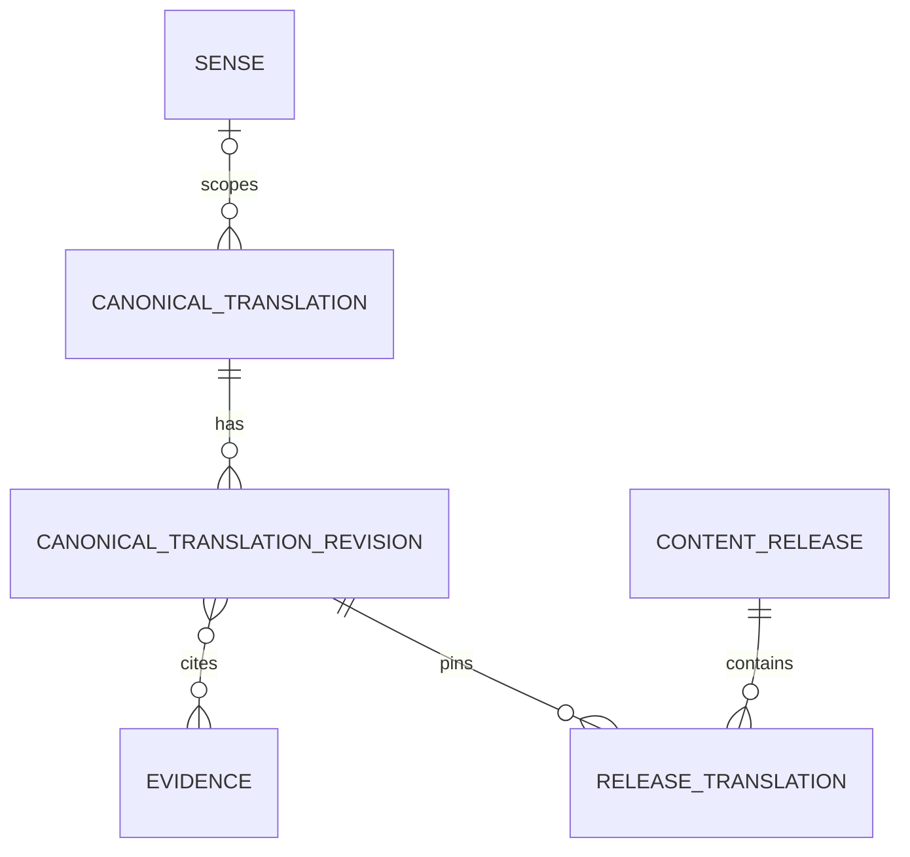

# SQL 数据 endpoint 接口

English: [SQL data endpoint interface](../../docs/interfaces/mysql.md)

本合同定义 island-port 提供的结构化数据 HTTP endpoint，涵盖共享规范翻译、单词、短语、词义、领域、证据元数据和不可变内容发布。每个操作均为 UDS 上的 JSON。各 endpoint 的请求示例表示置于通用请求 envelope 内的 `input` object；响应示例是完整 body。

状态：目标合同；当前可执行文件尚未组合此服务客户端。

## 目录

- [SQL 数据 endpoint 接口](#sql-数据-endpoint-接口)
  - [目录](#目录)
  - [endpoint 参考](#endpoint-参考)
  - [存储边界](#存储边界)
  - [精选翻译存储](#精选翻译存储)
  - [领域事实与语义尺度](#领域事实与语义尺度)
  - [通用操作 envelope](#通用操作-envelope)
  - [POST /data/sql/v1/translations/resolve](#post-datasqlv1translationsresolve)
  - [POST /data/sql/v1/translations/stage](#post-datasqlv1translationsstage)
  - [POST /data/sql/v1/basic-cards/resolve](#post-datasqlv1basic-cardsresolve)
  - [POST /data/sql/v1/senses/get](#post-datasqlv1sensesget)
  - [POST /data/sql/v1/domains/resolve](#post-datasqlv1domainsresolve)
  - [POST /data/sql/v1/knowledge-facts/get](#post-datasqlv1knowledge-factsget)
  - [POST /data/sql/v1/semantic-scales/get](#post-datasqlv1semantic-scalesget)
  - [领域提案处理](#领域提案处理)
  - [POST /data/sql/v1/cards/revisions/stage](#post-datasqlv1cardsrevisionsstage)
  - [POST /data/sql/v1/releases/activate](#post-datasqlv1releasesactivate)
  - [相关文档](#相关文档)

## endpoint 参考

- [SQL 数据 endpoint 接口](#sql-数据-endpoint-接口)
  - [目录](#目录)
  - [endpoint 参考](#endpoint-参考)
  - [存储边界](#存储边界)
  - [精选翻译存储](#精选翻译存储)
  - [领域事实与语义尺度](#领域事实与语义尺度)
  - [通用操作 envelope](#通用操作-envelope)
  - [POST /data/sql/v1/translations/resolve](#post-datasqlv1translationsresolve)
  - [POST /data/sql/v1/translations/stage](#post-datasqlv1translationsstage)
  - [POST /data/sql/v1/basic-cards/resolve](#post-datasqlv1basic-cardsresolve)
  - [POST /data/sql/v1/senses/get](#post-datasqlv1sensesget)
  - [POST /data/sql/v1/domains/resolve](#post-datasqlv1domainsresolve)
  - [POST /data/sql/v1/knowledge-facts/get](#post-datasqlv1knowledge-factsget)
  - [POST /data/sql/v1/semantic-scales/get](#post-datasqlv1semantic-scalesget)
  - [领域提案处理](#领域提案处理)
  - [POST /data/sql/v1/cards/revisions/stage](#post-datasqlv1cardsrevisionsstage)
  - [POST /data/sql/v1/releases/activate](#post-datasqlv1releasesactivate)
  - [相关文档](#相关文档)

Island-port 默认监听 `/run/island-port/island-port.sock`，并遵循[共享 UDS JSON 传输](transnet_cn.md)。调用方绝不直接连接 MySQL 或提交 SQL；查询、事务、schema 兼容性、凭据和连接池均由 island-port 负责。只有 Transnet 运行时和经过认证的发布工具可以访问套接字。运行时调用方具有读取权限；变更 endpoint 还要求 publisher 服务账户。授权来自套接字文件系统凭据，而不是 JSON 字段或转发的 header。

## 存储边界

MySQL 是精简结构化词汇内容、经审慎选择的规范翻译和发布状态的权威存储。它不包含用户、学习者、账户、画像、偏好、历史、保存项目、书签、练习、答案、掌握度、日程、图布局、反馈、隐私请求或所有权记录；也绝不保留实时翻译请求、查询文本、消歧上下文或未审核 provider 输出。只有通过下述发布工作流，才可存储规范源文与译文。

允许的 Transnet 服务数据：

- 不可变知识发布和兼容性 manifest；
- 规范单词和短语、带语言标签的词形、别名和词义；
- 来源与发布权利已知、面向单词、固定短语或可复用段落的已审核源文—译文；
- 精简定义、翻译、发音、形态、例句和用法说明；
- 规范领域及其范围定义；
- 指向 Qdrant 知识根和证据记录的稳定引用；
- 发布任务、校验结果、幂等记录和 Qdrant 投影 outbox，且均不含请求文本或用户数据。

使用 `utf8mb4`、UTC 微秒时间、不透明稳定公开 ID、显式外键和不可变已发布修订。凭据和加密密钥置于 MySQL 之外。

## 精选翻译存储

规范翻译模型保存小型已审核目录，而不是流量历史或缓存。`canonical_translation` 行为一个源文—译文选择提供稳定 `translation_id`、`unit`（`word`、`phrase` 或 `passage`）、源语言与目标语言标签，以及可选规范 `sense_id`。不可变 `canonical_translation_revision` 包含源文、译文、normalizer 版本与源文 fingerprint、可选方言、语域和领域范围、证据 ID、来源、发布权利声明、选择理由、审核决定及内容 hash。发布成员行把一个已批准修订固定到内容发布。基础卡翻译引用这些 ID，不再维护第二份独立发布的翻译值。



已发布身份按源语言、带版本的源文 fingerprint、目标语言、词义或范围键及内容发布唯一。存储源文以便 Transnet 在检索后进行精确比较；仅 fingerprint 匹配绝不充分。Passage 条目有配置长度上限，且必须是可复用参考内容，不能是私人通信或任意提交文本。

重要性是带可审计理由的编辑决定，例如已批准术语、固定习语、可复用产品文案或已审核参考段落。不得通过记录请求文本来推断频率。发布激活前必须完成 publisher 认证、来源检查、权利审核和人工批准。运行时翻译路由没有写权限，也没有 `save` 或 `important` 字段。

用户保存是另一项职责。终端用户加星或保存翻译时，island-port 在其产品数据库中存储该私有记录，并依其同意与保留政策决定是否保留展示结果。它不得把用户 ID、保存状态或私有源文发送到这些规范发布 endpoint。

## 领域事实与语义尺度

MySQL 还拥有规范领域知识 profile、原子基本事实和语义尺度。领域修订存储多语言名称与别名、定义、包含/排除范围、上层领域 ID，以及包含可用事实族、语言、已验证事实数和覆盖状态（`seed`、`partial` 或 `curated`）的知识 profile。覆盖描述活动发布，绝不声称完整。

`knowledge_fact_revision` 存储稳定事实 ID、主体节点、有类型谓词、客体节点或有类型字面值、陈述、适用词义与领域、条件、证据 ID、来源 ID、验证状态、内容 hash 和不可变修订。事实可独立审核并按发布寻址。Qdrant 边与事实检索 point 引用权威事实修订，不成为第二权威来源。

`semantic_scale_revision` 存储稳定尺度 ID、命名维度、递增或递减方向、适用领域与条件、有序词义限定节点成员、证据 ID、验证状态、内容 hash 和不可变修订。成员位置只定义顺序。发布拒绝重复位置、缺失成员、混合不兼容词义、缺失证据，以及把尺度编码成 `is_a` 分类的行为。基础卡、事实、profile 与尺度加入同一不可变发布。

## 通用操作 envelope

每个适配器操作携带请求 ID、deadline、预期 schema 版本，并可携带不可变内容发布。发布变更还要求幂等键。读操作返回 `ok`、`not_found`、`version_mismatch`、`unavailable` 或 `timeout`；变更还可返回 `conflict` 或 `invalid`。错误不得暴露 SQL、凭据、请求文本、provider body 或连接内部信息。

精确请求 body 为 `{"context": RequestContext, "input": EndpointInput}`。请求上下文：

```json
{
  "request_id": "req_01K4Z8P8Y7D3N5Q2F6M1J9T0VX",
  "deadline_at": "2026-09-12T10:30:05.000000Z",
  "schema_version": "mysql-adapter-v1",
  "content_release": "knowledge-2026-09"
}
```

关闭错误响应：

```json
{
  "outcome": "version_mismatch",
  "error": {
    "code": "content_release_mismatch",
    "message": "The requested content release is not available.",
    "retryable": false
  }
}
```

## POST /data/sql/v1/translations/resolve

从一个不可变发布中解析完全匹配的已审核翻译。Transnet 在内存中计算带版本的 fingerprint，不向适配器发送实时源文或消歧句。适配器在限制内返回所有相同 fingerprint 的合格候选；Transnet 使用指定 normalizer 比较已存源文，并在采用候选前应用词义与范围约束。该读取可安全重试。

请求 `input`：

```json
{
  "source_fingerprint": "sha256:8bb7a7d7b6d9...",
  "normalizer_version": "translation-source-v1",
  "source_language": "en",
  "target_language": "zh-CN",
  "sense_id": "sense_sweltering_hot_01",
  "domain_ids": ["domain_weather"],
  "dialect": "en-US",
  "register": "neutral",
  "content_release": "knowledge-2026-09",
  "limit": 5
}
```

响应：

```json
{
  "outcome": "ok",
  "value": {
    "matches": [
      {
        "translation_id": "tr_sweltering_zh_cn_01",
        "unit": "word",
        "source": {"text": "sweltering", "language": "en"},
        "target": {"text": "酷热的", "language": "zh-CN"},
        "sense_id": "sense_sweltering_hot_01",
        "domain_ids": ["domain_weather"],
        "evidence_ids": ["evidence_dictionary_1042"],
        "revision": 3
      }
    ]
  },
  "content_release": "knowledge-2026-09"
}
```

## POST /data/sql/v1/translations/stage

暂存一个候选修订，供审核及后续发布激活。只有经过认证的发布工具可以调用此幂等变更。暂存不会使内容对运行时流量可读。Publisher 必须提供规范、非个人文本，并声明已经审核来源与发布权利。

请求 `input`：

```json
{
  "translation_id": "tr_up_in_the_air_zh_cn_01",
  "unit": "phrase",
  "source": {"text": "up in the air", "language": "en"},
  "target": {"text": "悬而未决", "language": "zh-CN"},
  "sense_id": "sense_up_in_the_air_undecided_01",
  "domain_ids": ["domain_general"],
  "dialect": "en-US",
  "register": "neutral",
  "normalizer_version": "translation-source-v1",
  "selection_reason": "established_idiom",
  "evidence_ids": ["evidence_dictionary_2117"],
  "provenance": ["source_dictionary_2026_01"],
  "rights_assertion": "approved_for_canonical_publication",
  "idempotency_key": "stage-translation-up-in-the-air-zh-cn-r1",
  "review": {
    "state": "approved",
    "policy_version": "canonical-translation-review-v1"
  }
}
```

响应：

```json
{
  "outcome": "ok",
  "value": {
    "translation_id": "tr_up_in_the_air_zh_cn_01",
    "revision": 1,
    "publication_state": "staged",
    "content_hash": "sha256:4ef760d1..."
  }
}
```

使用同一幂等键与相同请求 fingerprint 会返回原结果；对不同内容复用则返回 `conflict`。激活使用现有发布暂存和激活操作，并验证每个翻译修订已经批准、内部一致且有证据支持。

## POST /data/sql/v1/basic-cards/resolve

输入规范化属于 Transnet 运行时。适配器只接收有界、排序后的派生形式，绝不接收原始查询、中间变换或上下文。精确规范形式和别名优先于屈折、拼写修正和宽松别名；`C`、`C++`、`C#` 等有意义符号不合并。

本操作与 `get_sense` 返回相同的精简 `BasicCard` 结构，包括规范形式与别名、精简定义与翻译、发音与形态摘要、短规范例句与用法说明、领域与证据元数据、知识根、修订和发布；关系详情留在 Qdrant。

请求：

```json
{
  "lookup_forms": [
    {
      "form": "sweltering",
      "match_class": "exact_canonical",
      "rank": 0
    }
  ],
  "normalizer_version": "unicode-nfkc-v2",
  "source_language": "en",
  "explanation_language": "zh-CN",
  "dialect": "en-US",
  "content_release": "knowledge-2026-09",
  "limit": 5
}
```

响应：

```json
{
  "outcome": "ok",
  "value": {
    "matches": [
      {
        "matched_form": "sweltering",
        "match_class": "exact_canonical",
        "card": {
          "card_id": "card_sweltering_en_adj_01",
          "sense_id": "sense_sweltering_hot_01",
          "canonical_form": "sweltering",
          "aliases": ["oppressively hot"],
          "language": "en",
          "part_of_speech": "adjective",
          "translations": [
            {
              "language": "zh-CN",
              "text": "酷热的"
            }
          ],
          "definitions": ["uncomfortably hot, especially because of the weather"],
          "pronunciations": [{"dialect": "en-US", "ipa": "/ˈswɛltərɪŋ/"}],
          "forms": [{"form": "swelteringly", "label": "adverb"}],
          "examples": [{"text": "We waited until evening to leave the sweltering house.", "translation": "我们一直等到傍晚才离开闷热难耐的房子。"}],
          "usage_notes": ["Usually describes weather or an uncomfortably hot place."],
          "knowledge_root_ids": ["node_sweltering_hot_01"],
          "domain_ids": ["domain_weather"],
          "evidence_ids": ["evidence_dictionary_1042"],
          "revision": 3
        }
      }
    ],
    "alternatives": []
  },
  "content_release": "knowledge-2026-09"
}
```

唯一性由稳定的词形、卡片和词义 ID 及已发布规范形式/别名行维护，不依赖临时规范化检索字符串。最佳适用层级的所有合格冲突均须返回，由服务解析。

## POST /data/sql/v1/senses/get

使用共享 `BasicCard` 结构返回一个精简规范词义修订。

请求：

```json
{
  "sense_id": "sense_sweltering_hot_01",
  "explanation_language": "zh-CN",
  "dialect": "en-US",
  "content_release": "knowledge-2026-09"
}
```

响应：

```json
{
  "outcome": "ok",
  "value": {
    "card_id": "card_sweltering_en_adj_01",
    "sense_id": "sense_sweltering_hot_01",
    "canonical_form": "sweltering",
    "aliases": ["oppressively hot"],
    "language": "en",
    "part_of_speech": "adjective",
    "definitions": ["uncomfortably hot, especially because of the weather"],
    "translations": [
      {
        "language": "zh-CN",
        "text": "酷热的"
      }
    ],
    "pronunciations": [
      {
        "dialect": "en-US",
        "ipa": "/ˈswɛltərɪŋ/"
      }
    ],
    "forms": [
      {
        "form": "swelteringly",
        "label": "adverb"
      }
    ],
    "examples": [
      {
        "text": "We waited until evening to leave the sweltering house.",
        "translation": "我们一直等到傍晚才离开闷热难耐的房子。"
      }
    ],
    "usage_notes": ["Usually describes weather or an uncomfortably hot place."],
    "knowledge_root_ids": ["node_sweltering_hot_01"],
    "domain_ids": ["domain_weather"],
    "evidence_ids": ["evidence_dictionary_1042"],
    "revision": 3
  },
  "content_release": "knowledge-2026-09"
}
```

## POST /data/sql/v1/domains/resolve

领域是规范版本化记录，不是自由标签。先匹配已发布名称和别名；若多个范围均匹配，适配器返回候选，由发布流程消歧。

请求：

```json
{
  "normalized_labels": ["meteorology", "weather"],
  "scope_key": "earth-atmosphere-weather",
  "content_release": "knowledge-2026-09",
  "limit": 5
}
```

响应：

```json
{
  "outcome": "ok",
  "value": {
    "candidates": [
      {
        "domain_id": "domain_weather",
        "canonical_label": "weather",
        "definition": "Conditions of the atmosphere at a place and time.",
        "inclusion_scope": ["temperature", "precipitation", "wind", "humidity"],
        "exclusion_scope": ["long-term climate classification"],
        "broader_domain_ids": ["domain_earth_science"],
        "knowledge_profile": {
          "available_fact_families": ["definition", "taxonomy", "terminology", "measurement"],
          "languages": ["en", "zh-CN"],
          "verified_fact_count": 184,
          "coverage_state": "partial"
        },
        "revision": 4
      }
    ]
  },
  "content_release": "knowledge-2026-09"
}
```

## POST /data/sql/v1/knowledge-facts/get

在向量检索后按顺序、有界地补全精确事实修订。Qdrant 可以提名 `fact_id`，但绝不能提供权威陈述、证据、权利或验证状态。调用方提供发布版本与合格事实 ID；适配器会排除该发布中不存在或不符合资格的 ID。该读取可安全重试。

请求 `input`：

```json
{
  "fact_ids": ["fact_sweltering_degree_scorching_01"],
  "content_release": "knowledge-2026-09",
  "verification_states": ["verified"],
  "limit": 20
}
```

响应：

```json
{
  "outcome": "ok",
  "value": {
    "facts": [
      {
        "fact_id": "fact_sweltering_degree_scorching_01",
        "revision": 2,
        "statement": "For environmental heat, scorching usually indicates greater intensity than sweltering.",
        "subject_node_id": "node_scorching_heat_01",
        "predicate": "higher_degree_than",
        "object_node_id": "node_sweltering_hot_01",
        "domain_ids": ["domain_weather"],
        "applicable_sense_ids": ["sense_sweltering_hot_01"],
        "conditions": ["describes weather or an environment"],
        "evidence_ids": ["evidence_dictionary_1042"],
        "provenance": ["source_dictionary_2026_01"],
        "verification_state": "verified"
      }
    ]
  },
  "content_release": "knowledge-2026-09"
}
```

返回顺序遵循请求顺序，并移除被排除的 ID。事实是原子项：响应投影可以摘要它们，但在 `full` 级别呈现事实性断言时必须保留精确事实 ID 与证据状态。

## POST /data/sql/v1/semantic-scales/get

按稳定 ID 返回完整的权威语义尺度。调用方通常从 Qdrant 获取候选尺度 ID，并提供选定词义或节点，以便 island-port 应用范围与条件资格。尺度要么完整返回，要么省略；调用方不得从无关的成对边重建梯度。

请求 `input`：

```json
{
  "scale_ids": ["scale_environmental_heat_intensity_01"],
  "for_node_id": "node_sweltering_hot_01",
  "content_release": "knowledge-2026-09",
  "verification_states": ["verified"],
  "limit": 5
}
```

响应：

```json
{
  "outcome": "ok",
  "value": {
    "scales": [
      {
        "scale_id": "scale_environmental_heat_intensity_01",
        "revision": 1,
        "dimension": "environmental_heat_intensity",
        "direction": "increasing",
        "domain_ids": ["domain_weather"],
        "conditions": ["describes weather or an environment"],
        "members": [
          {"node_id": "node_warm_temperature_01", "position": 10},
          {"node_id": "node_hot_temperature_01", "position": 20},
          {"node_id": "node_sweltering_hot_01", "position": 30},
          {"node_id": "node_scorching_heat_01", "position": 40}
        ],
        "evidence_ids": ["evidence_dictionary_1042"],
        "verification_state": "verified"
      }
    ]
  },
  "content_release": "knowledge-2026-09"
}
```

`position` 只建立序数顺序，绝不表示数值强度间隔。调用方从返回的尺度推导相邻程度展示；分类仍是独立类型的 `is_a` / `has_subtype` 关系。

## 领域提案处理

不存在 live 创建领域 endpoint。Transnet 向 LLM 提供领域解析返回的有界 allowlist。若 LLM 不选择任何项并输出结构化提案，确定性代码为该请求返回 `proposed_new`。清单不可用或失败时返回 `uncertain`，而非提案。运行时流量不能写入提案。

离线 publisher 可在普通暂存发布工件中加入提议领域、生成事实候选、语义尺度及其来源。它们适用与其他规范内容相同的冲突、范围、证据、权利、审核、幂等和不可变发布校验。因此新领域不需要领域专用创建 endpoint。

## POST /data/sql/v1/cards/revisions/stage

暂存不可变的单词或短语修订及其 Qdrant 根引用。暂存校验所有结构化字段，但不会让内容从活动发布中读取。

请求：

```json
{
  "card": {
    "card_id": "card_sweltering_en_adj_01",
    "sense_id": "sense_sweltering_hot_01",
    "canonical_form": "sweltering",
    "language": "en",
    "part_of_speech": "adjective",
    "definitions": ["uncomfortably hot, especially because of the weather"],
    "translations": [
      {
        "language": "zh-CN",
        "text": "酷热的"
      }
    ],
    "knowledge_root_ids": ["node_sweltering_hot_01"],
    "domain_ids": ["domain_weather"]
  },
  "target_release": "knowledge-2026-10",
  "source_revision": 3,
  "evidence_ids": ["evidence_dictionary_1042"],
  "idempotency_key": "stage-card-sweltering-r4"
}
```

响应：

```json
{
  "outcome": "ok",
  "value": {
    "card_id": "card_sweltering_en_adj_01",
    "sense_id": "sense_sweltering_hot_01",
    "revision": 4,
    "publication_state": "staged",
    "target_release": "knowledge-2026-10"
  }
}
```

## POST /data/sql/v1/releases/activate

激活是原子的，必须引用兼容的不可变 Qdrant 节点/边发布。若任一卡片根、领域、证据记录、内容哈希或 Qdrant manifest 缺失或不兼容，激活失败。

请求：

```json
{
  "release_id": "knowledge-2026-10",
  "expected_active_release": "knowledge-2026-09",
  "mysql_content_hash": "sha256:9c49d7f6...",
  "qdrant_manifest_hash": "sha256:2e17a054...",
  "idempotency_key": "activate-knowledge-2026-10"
}
```

响应：

```json
{
  "outcome": "ok",
  "value": {
    "active_release": "knowledge-2026-10",
    "previous_release": "knowledge-2026-09",
    "activated_at": "2026-10-01T00:00:00.000000Z"
  }
}
```

隔离、撤回和修正会创建新的发布状态或发布，绝不静默重写已发布行。

## 相关文档

- [共享 UDS JSON 传输与 Transnet 接口](transnet_cn.md)
- [Transnet 设计与外部接口](../transnet_cn.md)
- [Qdrant 接口](qdrant_cn.md)
- [内容发布](../guides/content-publishing_cn.md)
