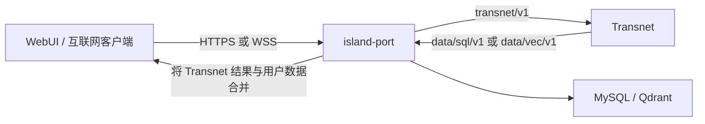

# Transnet 服务接口

English: [Transnet service interface](../../docs/interfaces/transnet.md)

本合同定义 island-port 如何向 Transnet 请求翻译与关系知识，并获得构建客户端响应所需的信息。它是内部服务接口，不是面向互联网的 WebUI API。Island-port 负责客户端 HTTPS/WSS 传输、认证、用户数据、个性化、响应合并和最终公开响应。Transnet 不接收终端用户身份或用户所属状态。

本文档同时定义所有涉及 Transnet 的内部进程边界共享的传输合同，适用于 island-port、Transnet、发布工具和部署工具。

状态：目标合同。当前运行时仍暴露过渡性回环 HTTP，且尚未组合数据服务。

## 连接合同

所有涉及 Transnet 的内部接口均使用 Unix 域流套接字（UDS）上的 HTTP/1.1。TCP listener、主机名和端口号不属于这些内部合同。Island-port 通过 `/run/transnet/transnet.sock` 调用 Transnet；Transnet 通过 `/run/island-port/island-port.sock` 调用 island-port 的结构化、向量与图 endpoint。部署可通过配置迁移套接字，但 endpoint 路径和 payload schema 不变。客户端到 island-port 的流量不受本 UDS 规则约束，而使用 island-port 的公开 HTTPS/WSS 合同。

套接字所属进程创建父目录；仅在确认无活跃 listener 后删除自己的陈旧套接字；以 `0660` 模式绑定并使用专用服务账户运行。配置的用户组授予调用权限，套接字目录权限防止路径替换。服务拒绝从 TCP 转发的请求，也不信任客户端提供的身份 header。

在单机环境中，套接字所有权用于认证调用工作负载。这些 Transnet 与数据库 port 接口仅支持 UDS，不向互联网客户端暴露。



## HTTP 与 JSON 规则

请求使用 HTTP/1.1 origin-form 路径及 `Host: localhost`；Host 值不参与路由。请求与响应 body 均为 UTF-8 JSON，并设置 `Content-Type: application/json`。包括读取与探针在内的所有操作均使用 `POST` 并携带一个 JSON object；空输入为 `{}`。拒绝 query string、表单、multipart body、协议升级和流式响应。

Endpoint namespace 标识所属服务和合同版本：

- Transnet：`/transnet/v1/...`
- 结构化数据：`/data/sql/v1/...`
- 向量与图数据：`/data/vec/v1/...`

客户端发送 `Accept: application/json`、有界 `Content-Length`，并可发送 `X-Request-Id`。拒绝 chunked request body。服务端返回 `X-Request-Id`，拒绝未知 JSON 字段，并在有界请求数后关闭连接。ID 为不透明 URL-safe 字符串；时间为 UTC RFC 3339 微秒精度。

应用成功与错误 schema 由各接口合同定义。HTTP status 表示传输级接收结果；数据操作还可在 JSON 中返回其文档定义的闭合 outcome。Island-port 在两个方向上传播 request ID，但绝不向 Transnet 转发用户身份或用户所属状态。格式错误 JSON、不支持的媒体类型、未知 endpoint 或不支持的方法会在应用分派前失败。

## Deadline、限制与生命周期

内部数据请求在文档定义的 request context 中携带 `deadline_at`。公开 Transnet 请求继承服务端的有界 deadline，除非 endpoint schema 明确接受该字段。接收方拒绝已过期 deadline，调用下游时不得延长。所属合同会明确可重试操作；变更重试必须携带幂等键。

默认最大 body 为 1,048,576 字节，除非 endpoint 规定更小限制。服务端限制响应大小、并发、解析时间和连接寿命。优雅停机时停止接受新连接，在 deadline 内完成已接收请求，关闭 listener，随后 unlink 自己的套接字。

日志和指标不得包含请求 body、响应 body、规范文本、向量、凭据或套接字 peer 细节。可观测性可以记录 request ID、静态 endpoint 模板、outcome 类别、字节数和耗时。

## 示例

以下调用使用 curl 的 Unix socket 支持；URL host 只是占位符，不会建立 TCP 连接。

```bash
curl --unix-socket /run/transnet/transnet.sock \
  --request POST http://localhost/transnet/v1/health \
  --header 'content-type: application/json' \
  --header 'accept: application/json' \
  --data '{}'
```

本文档是 Transnet 的主接口合同。Transnet 是共享、无用户状态的翻译与关系知识服务：翻译连续文本，并围绕一个或多个实质合理的词汇词义或领域概念构建有界的含义专属详情。调用产品负责其用户、私有状态和展示工作流。

状态：目标服务合同。当前运行时仍使用过渡性回环 TCP listener 和旧路径；运行时可用性以本文档说明为准。

## 服务边界

Transnet 不接受用户 ID、学习者 ID、账户 ID、Cookie、终端用户 Bearer token、画像、偏好集合、保存项目状态、掌握度状态或持久个人历史记录。它只接受 island-port 选择的最小先前翻译 turn 作为请求级语言上下文。学习画像、课程、练习、掌握度、复习日程、辅导、进度追踪、写作评估、语音和发音都不是 Transnet 模块。

当前文本与翻译历史是请求载荷，不是用户记录。它们只能在有界请求生命周期内存在于内存中，绝不能写入 MySQL、Qdrant、日志、指标、trace、缓存或持久队列。Island-port 负责历史选择及响应与终端用户之间的所有关联。

Transnet 默认仅通过 `/run/transnet/transnet.sock` 上的 HTTP/1.1 提供服务，不绑定 TCP 端口，也不终止 TLS。文件系统所有权认证本地调用服务而非终端用户。跨主机网关认证远程调用方并通过本地套接字连接。

## 共享线上规则

请求和响应均使用 JSON。每个响应返回 `X-Request-Id`。时间为 UTC RFC 3339 微秒精度；ID 为不透明 URL-safe 字符串，客户端不得推断类型或顺序。未知请求字段会被拒绝。

成功应用响应使用 `data` 和 `meta`。`meta.request_id` 与响应头一致；规范读取还会返回用于应答的不可变内容发布。

```json
{
  "data": {},
  "meta": {
    "request_id": "req_01K4Z8P8Y7D3N5Q2F6M1J9T0VX",
    "content_release": "knowledge-2026-09"
  }
}
```

错误使用统一安全 envelope，绝不回显请求文本、上下文、凭据、provider body、向量或存储内部信息。

```json
{
  "error": {
    "code": "invalid_request",
    "message": "The request is invalid.",
    "request_id": "req_01K4Z8P8Y7D3N5Q2F6M1J9T0VX",
    "retryable": false,
    "fields": [
      {
        "field": "target_language",
        "message": "A valid BCP 47 language tag is required."
      }
    ]
  }
}
```

常见状态码为：`400` JSON 格式错误或未知字段，`401` 部署认证失败，`404` 未知规范资源，`409` 发布冲突，`413` 请求体过大，`422` 语义输入无效，`429` 有界容量限制，`502` provider 结果无效，`503` 必需依赖不可用，`504` 超时。

## 简单翻译请求

易用性是合同要求。WebUI 只要求文本、源语言、目标语言和响应级别，不要求用户选择翻译或查询、领域、方言、受众、目的、语域、格式策略、检索过滤器或模型。Island-port 转发相同四个字段，并可添加请求级历史；其他决定均由 Transnet 自动推导。

```json
{
  "text": "What does ‘hot’ mean here?",
  "source_language": "auto",
  "target_language": "zh-CN",
  "response_level": "standard"
}
```

初始版本中，`source_language` 只接受 `auto`、`en` 或 `zh-CN`，`target_language` 只接受 `en` 或 `zh-CN`。WebUI 可显示“中文”或“CN”，但线上值使用有效语言标签 `zh-CN`。`response_level` 只接受 `brief`、`standard` 或 `full`。Island-port 在调用 Transnet 前校验这些闭合值，Transnet 再次校验。

## 请求级翻译历史

Island-port 可添加 `history` 以支持多轮翻译。数组按时间从旧到新排列，每项只包含先前源文本、译文及其语言。合同不限制项目数量：island-port 负责选择、截断与发送数量。通用最大请求 body 仍适用，因此“无限”表示没有独立历史条数上限，而不是 HTTP body 无界。

```json
{
  "text": "Make that more natural.",
  "source_language": "en",
  "target_language": "zh-CN",
  "response_level": "standard",
  "history": [
    {
      "source_text": "The launch date is still up in the air.",
      "translated_text": "发布日期仍未确定。",
      "source_language": "en",
      "target_language": "zh-CN"
    }
  ]
}
```

历史是语言上下文，不是被存储的历史记录。它不含 turn ID、时间、用户 ID、反馈、偏好、领域标签、模型元数据或保存状态。Transnet 只将其用于指代解析、术语一致、语气连续和后续指令，并在当前请求结束后丢弃；响应绝不逐字返回历史。

## 共享翻译结果

每个成功翻译都在 `data.translation` 返回一个 `TranslationResult`。`translations` 是有序数组而不是单一字符串，因为单词或短语可能需要多个实质不同的含义。第一项是根据当前文本与历史得出的首选解释；仅在歧义有实质意义时返回其他项，不使用无关同义词填充响应。

每项稳定包含 `text` 与 `language`。返回多项时由 `meaning` 区分。只有指定不可变发布中的已审核内容才包含 `canonical`。`details` 是按 `response_level` 选择的词义级投影，不是单独数据库记录。

包含两个必要含义的 brief 单词响应：

```json
{
  "translation": {
    "unit": "word",
    "detected_source_language": "en",
    "translations": [
      {"text": "热的", "language": "zh-CN", "meaning": "having a high temperature"},
      {"text": "热门的", "language": "zh-CN", "meaning": "currently popular or receiving much attention"}
    ]
  }
}
```

来自相同规范记录的 full 单词响应：

```json
{
  "translation": {
    "unit": "word",
    "detected_source_language": "en",
    "translations": [
      {
        "text": "酷热的",
        "language": "zh-CN",
        "meaning": "uncomfortably hot, especially because of the weather",
        "canonical": {
          "translation_id": "tr_sweltering_zh_cn_01",
          "sense_id": "sense_sweltering_hot_01",
          "release": "knowledge-2026-09"
        },
        "details": {
          "type": "word",
          "part_of_speech": "adjective",
          "aliases": ["oppressively hot"],
          "pronunciations": [{"dialect": "en-US", "ipa": "/ˈswɛltərɪŋ/"}],
          "examples": [
            {
              "source_text": "It was a sweltering afternoon.",
              "translated_text": "那是一个酷热难耐的下午。"
            }
          ],
          "domain_assessment": {
            "classification": "domain_specific",
            "resolution": "existing",
            "selected_domain_ids": ["domain_weather"]
          },
          "domain_facts": [
            {
              "fact_id": "fact_sweltering_degree_scorching_01",
              "statement": "For environmental heat, scorching usually indicates greater intensity than sweltering.",
              "evidence_ids": ["evidence_dictionary_1042"],
              "evidence_state": "verified"
            }
          ],
          "taxonomy": {"hypernyms": ["hot"], "hyponyms": []},
          "intensity_scales": [
            {
              "dimension": "temperature_intensity",
              "items": ["warm", "hot", "sweltering", "scorching"],
              "selected_index": 2
            }
          ]
        }
      }
    ]
  }
}
```

Standard 短语响应：

```json
{
  "translation": {
    "unit": "phrase",
    "detected_source_language": "en",
    "translations": [
      {
        "text": "悬而未决",
        "language": "zh-CN",
        "meaning": "not yet decided or settled",
        "details": {
          "type": "phrase",
          "phrase_type": "idiom",
          "usage_notes": ["Used for plans or questions whose outcome is uncertain."],
          "example": {
            "source_text": "Our travel dates are still up in the air.",
            "translated_text": "我们的旅行日期仍未确定。"
          }
        }
      }
    ]
  }
}
```

Standard 段落响应：

```json
{
  "translation": {
    "unit": "passage",
    "detected_source_language": "en",
    "translations": [
      {
        "text": "那个计划仍然悬而未决。",
        "language": "zh-CN",
        "details": {
          "type": "passage",
          "tips": [
            {
              "kind": "idiom",
              "message": "“up in the air” means undecided rather than physically airborne."
            }
          ]
        }
      }
    ]
  }
}
```

以上示例展示可复用内部 payload，未包含外层 `data` 与 `meta` 成功 envelope；下方 endpoint 示例均为完整响应 body。

## 响应级别

所有响应级别可使用相同 MySQL 卡片、规范翻译记录和同一组 Qdrant 合格事实。确定性响应投影器在词义解析后选择字段并应用大小上限；它不会要求模型发明更小的 schema。

| 级别 | 始终返回 | 其他合格内容 |
| --- | --- | --- |
| `brief` | 单元、检测源语言、有序翻译，以及歧义需要时的短含义标签 | 不返回例句、提示或关系展开 |
| `standard` | `brief` 的全部内容 | 精简定义或短语用法、每个含义最多一个例句、最多两条段落提示，以及仅有实质价值的对比或关系 |
| `full` | `standard` 的全部内容 | 发音、别名、形态、更多例句与用法、领域事实、来源、分类、上位词、下位词、强度尺度及其他有界关系组 |

当省略会造成误导时，多含义优先于简短。每一级别都省略空字段与空关系组。较低级别不会改变有序含义及其译文，只投影更少的支持字段。

领域评估使用闭合 `resolution` 值 `existing`、`proposed_new`、`general` 和 `uncertain`。`proposed_new` 没有领域 ID，只可在 `full` 级别包含请求级名称、定义、候选上层领域和理由，且绝不表示为已验证知识。加载已有领域清单失败时必须返回 `uncertain`，不能返回 `proposed_new`。

## 翻译持久化

实时翻译结果是临时数据，不提供保存字段。Transnet 可以先从固定的 MySQL 发布中解析完全匹配的已审核规范翻译；否则调用 provider，并在有界请求结束后丢弃请求、响应和中间术语台账。它绝不把 provider 结果作为流量副作用存储，也不根据用户行为判断重要性。

“重要”有两种含义，归属不同。终端用户保存、加星或标记重要的翻译属于私有产品数据，其关联由 island-port 在 Transnet 之外存储。对共享语言产品重要的翻译属于规范内容候选：经授权的发布工具携带来源与权利元数据暂存，审核者批准后，由后续不可变内容发布使其可供 Transnet 读取。[SQL 数据 endpoint 合同](mysql_cn.md)负责该存储和发布设计。

## POST /transnet/v1/health

返回进程健康，不探测依赖，也不泄露配置。

请求：

```json
{}
```

响应 `200`：

```json
{
  "data": {"status": "ok"},
  "meta": {"request_id": "req_01K4Z8P8Y7D3N5Q2F6M1J9T0VX"}
}
```

## POST /transnet/v1/livez

进程事件循环可响应时返回成功。

请求：

```json
{}
```

响应 `200`：

```json
{
  "data": {"status": "ok"},
  "meta": {"request_id": "req_01K4Z8Q8X2A6B7C4D9E0F3G5HJ"}
}
```

## POST /transnet/v1/readyz

仅在已启用路由所需依赖就绪时返回 `200`。可选能力可降级而不使进程变为未就绪。

请求：

```json
{}
```

响应 `200`：

```json
{
  "data": {
    "status": "ok",
    "dependencies": {
      "mysql": "ready",
      "qdrant": "ready",
      "translation_provider": "ready"
    },
    "capabilities": {
      "translation": "available",
      "canonical_lookup": "available",
      "relationship_pages": "available"
    }
  },
  "meta": {"request_id": "req_01K4Z8R4CX7E2J6K1M9N3P5Q8S"}
}
```

`503` 使用标准错误 envelope，代码为 `not_ready`。它可说明依赖类别，但不得暴露主机、凭据、集合名称或 provider 响应。

## POST /transnet/v1/translations

这是新翻译 turn 的唯一入口。它翻译单词、短语、句子或段落，并自动选择词汇查询、领域展开或连续文本翻译。WebUI 和 island-port 都不选择该模式。请求使用上述简单字段；`history` 可省略，默认空数组。

请求：

```json
{
  "text": "That plan is still up in the air.",
  "source_language": "auto",
  "target_language": "zh-CN",
  "response_level": "standard",
  "history": []
}
```

响应 `200`：

```json
{
  "data": {
    "translation": {
      "unit": "passage",
      "detected_source_language": "en",
      "translations": [
        {
          "text": "那个计划仍然悬而未决。",
          "language": "zh-CN",
          "details": {
            "type": "passage",
            "tips": [
              {
                "kind": "idiom",
                "message": "“up in the air” means undecided rather than physically airborne."
              }
            ]
          }
        }
      ]
    }
  },
  "meta": {
    "request_id": "req_01K4Z8S1AK6C8D2F0G4H7J9M3N",
    "response_level": "standard",
    "model_version": "translate-2026-09"
  }
}
```

Passage 的 `tips` 最多两条，每条一句；没有实质价值时省略。受保护片段、段落结构与格式由服务自动推断并保留。长文处理使用的分块计划或术语台账随请求丢弃。若 Qdrant 不可用但 MySQL 已解析规范单词或短语，Transnet 返回合格词汇字段，省略关系分区并设置 `meta.degraded: true`，不得编造替代关系。

## POST /transnet/v1/senses/get

读取一个规范词义及其精简 MySQL 卡片。服务不保存访问或已保存项目记录。

请求：

```json
{
  "sense_id": "sense_sweltering_hot_01",
  "explanation_language": "zh-CN",
  "release": "knowledge-2026-09"
}
```

响应 `200`：

```json
{
  "data": {
    "card_id": "card_sweltering_en_adj_01",
    "sense_id": "sense_sweltering_hot_01",
    "canonical_form": "sweltering",
    "aliases": ["oppressively hot"],
    "language": "en",
    "part_of_speech": "adjective",
    "definitions": ["uncomfortably hot, especially because of the weather"],
    "translations": [{"language": "zh-CN", "text": "酷热的"}],
    "forms": [{"form": "swelteringly", "label": "adverb"}],
    "examples": [{"text": "We waited until evening to leave the sweltering house.", "translation": "我们一直等到傍晚才离开闷热难耐的房子。"}],
    "usage_notes": ["Usually describes weather or an uncomfortably hot place."],
    "knowledge_root_ids": ["node_sweltering_hot_01"],
    "domain_ids": ["domain_weather"],
    "evidence_ids": ["evidence_dictionary_1042"]
  },
  "meta": {
    "request_id": "req_01K4Z8V2DE5F7G9H1J3K6M8NPQ",
    "content_release": "knowledge-2026-09"
  }
}
```

## POST /transnet/v1/graph/get

读取以一个词义、概念节点或领域为根的有界规范子图。`depth` 受配置的浅层最大值限制。结果保持有根、有类型且经过范围过滤；本端点不是通用图查询语言或无限制邻居倾倒接口。

请求：

```json
{
  "root_kind": "sense",
  "root_id": "sense_sweltering_hot_01",
  "depth": 1,
  "relation_types": ["lower_degree", "higher_degree", "collocation"],
  "verification_state": "verified",
  "node_limit": 20,
  "edge_limit": 30,
  "release": "knowledge-2026-09"
}
```

响应 `200`：

```json
{
  "data": {
    "root": {"kind": "sense", "id": "sense_sweltering_hot_01", "node_id": "node_sweltering_hot_01"},
    "nodes": [
      {"node_id": "node_sweltering_hot_01", "node_type": "lexical_sense", "label": "sweltering"},
      {"node_id": "node_scorching_heat_01", "node_type": "lexical_sense", "label": "scorching"}
    ],
    "edges": [
      {
        "edge_id": "edge_sweltering_scorching_01",
        "source_node_id": "node_sweltering_hot_01",
        "target_node_id": "node_scorching_heat_01",
        "relation_type": "higher_degree",
        "explanation": "Scorching usually expresses a stronger degree of heat than sweltering.",
        "restrictions": {"dimension": "temperature_intensity"},
        "evidence_state": "verified",
        "confidence": 0.96,
        "provenance": ["evidence_dictionary_1042"],
        "verification_state": "verified"
      }
    ],
    "truncated": false
  },
  "meta": {
    "request_id": "req_01K4Z8W9RS2T4V6X0Y1Z3A5BCD",
    "content_release": "knowledge-2026-09"
  }
}
```

## POST /transnet/v1/graph/neighbors

分页读取一个规范节点的直接入边和出边。cursor 绑定根、过滤条件和发布，且不得包含请求文本。

请求：

```json
{
  "kind": "knowledge_node",
  "id": "node_sweltering_hot_01",
  "direction": "both",
  "relation_types": ["lower_degree", "higher_degree"],
  "verification_state": "verified",
  "limit": 10,
  "cursor": null,
  "release": "knowledge-2026-09"
}
```

响应 `200`：

```json
{
  "data": {
    "root_node_id": "node_sweltering_hot_01",
    "neighbors": [
      {
        "edge": {
          "edge_id": "edge_hot_sweltering_01",
          "source_node_id": "node_hot_temperature_01",
          "target_node_id": "node_sweltering_hot_01",
          "relation_type": "higher_degree",
          "explanation": "Sweltering expresses a more uncomfortable degree of heat than hot.",
          "restrictions": {"dimension": "temperature_intensity"},
          "evidence_state": "verified",
          "confidence": 0.96,
          "provenance": ["evidence_dictionary_1042"],
          "verification_state": "verified"
        },
        "node": {"node_id": "node_hot_temperature_01", "node_type": "lexical_sense", "label": "hot"}
      }
    ],
    "next_cursor": null
  },
  "meta": {
    "request_id": "req_01K4Z8X6FG1H3J5K7M9N2P4QRS",
    "content_release": "knowledge-2026-09"
  }
}
```

## 相关文档

- [系统设计](../transnet_cn.md)
- [MySQL 接口](mysql_cn.md)
- [Qdrant 接口](qdrant_cn.md)
