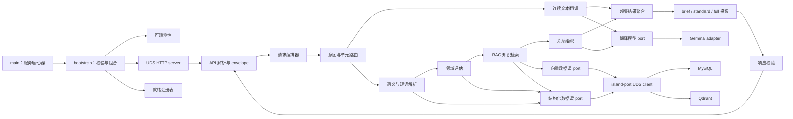
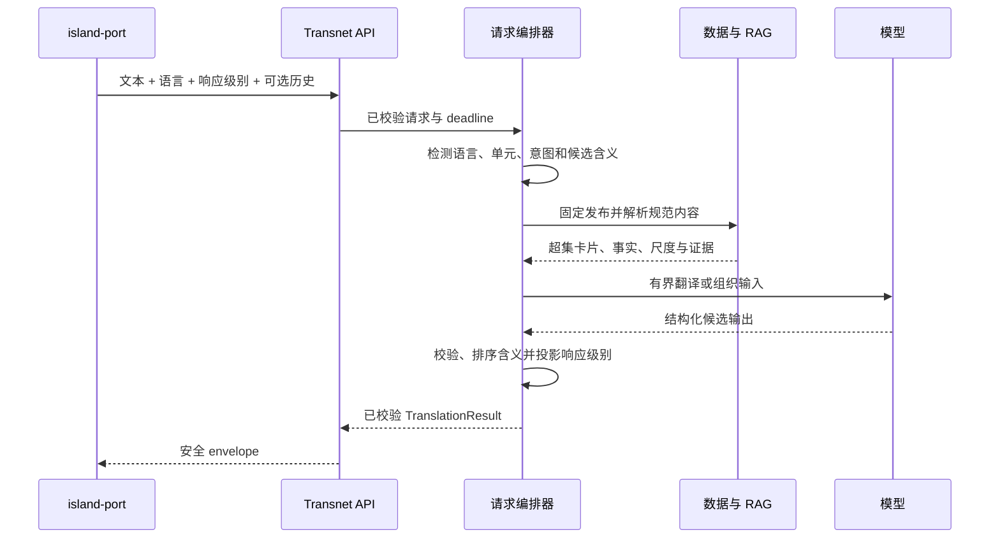

# 服务模块参考

English: [Service module reference](../../docs/reference/modules.md)

本参考定义从进程启动到翻译、RAG、存储、发布与停机的目标模块边界，并映射仓库中的 Rust 模块，使实现者可以区分当前运行时行为与目标架构。

状态：包含当前运行时清单的目标模块设计。目标布局中的名称是架构目的地，不表示对应文件已经存在。

## 依赖规则

Transnet 保持单一 Cargo package。运行时依赖向内指向：`transport -> application -> domain <- ports <- adapters`。Domain 代码不了解 HTTP、Unix socket、数据库、provider 或日志实现。API 模块只校验和映射线上数据，不包含翻译、检索或持久化决策。Application 模块通过窄 port 编排用例，adapter 实现 provider 与 island-port I/O。

在线服务只接收只读结构化/向量 port。只有单独的离线 publisher 组合接收可变更 port。当前文本和翻译历史绝不经过持久写 port。

## 端到端组件

WebUI 调用 island-port，绝不直接调用 Transnet。除输入文本外，用户只选择源语言、目标语言和响应级别。Island-port 可添加最小先前翻译 turn，Transnet 自动选择上图所有内部分支。

## 当前模块清单

| 状态 | 模块 | 职责与处置 |
| --- | --- | --- |
| 当前已连接 | `src/main.rs`、`src/api.rs`、`src/config.rs`、`src/logger.rs`、`src/provider.rs`、`src/resilience.rs` | 启动过渡回环 server、暴露旧路由、配置 provider、按长度路由普通翻译并提供容错/日志。保留有用行为，重构到目标边界。 |
| 当前已连接 | `src/application/lookup.rs`、`src/adapters/learning_model.rs` | 提供模型驱动的旧结构化查询。以共享翻译聚合和自动路由取代其学习专用 schema。 |
| 已有基础，未生产组合 | 规范查询/卡片/缓存/词义、检索、图、图拓扑缓存、内容发布、请求 ID、问题映射、就绪、指标及其 port/内存 adapter | 复用已测试不变量，然后通过生产 UDS adapter 与目标请求编排器连接。 |
| 需要收窄的已有基础 | `src/domain/graph.rs` 及图 application/port 模块 | 保留词义限定节点、关系方向、证据和语义尺度概念；扩展到目标事实/领域，同时移除反馈或用户视图职责。 |
| 计划移除 | 学习者/画像/词汇、练习/掌握度/排程、私有反馈、保存图视图、查询任务、持久 worker 及其 port/adapter/路由 | 这些属于产品或持久请求工作流，不在聚焦 Transnet 边界内，不得作为可达或可复用服务 API。 |

当前可执行文件绑定回环 TCP，只连接健康、翻译和旧模型查询。源代码中已有词义、图、发布和检索基础，不表示默认启动器已经组合这些能力。

## 目标源码布局

### 启动与组合

- `src/main.rs`：不解析业务输入；调用 bootstrap、报告致命启动失败并选择进程退出状态。
- `src/bootstrap.rs`：加载并校验配置，初始化可观测性，构建 adapter 与 application 服务，注册就绪状态，绑定所属 UDS 并协调优雅停机。
- `src/config.rs`：有类型配置、默认值、跨字段校验和 secret 引用，绝不读取请求数据。
- `src/resilience.rs`：为幂等 provider 与数据读取提供有界 deadline、并发、重试和断路器。
- `src/observability/mod.rs`、`logging.rs`、`metrics.rs`：只记录安全聚合事件；绝不格式化当前文本、历史、规范文本、provider body、向量或凭据。

启动顺序为：配置 -> 可观测性 -> provider client -> island-port client -> application 服务 -> 就绪注册表 -> UDS bind -> accept loop。停机停止接收，在 deadline 内排空已接收工作，关闭 client，只 unlink 自己的 socket，刷新安全遥测后退出。

### 传输与 API

- `src/transport/uds_server.rs`：配置 Unix stream socket 上的 HTTP/1.1、所有权/mode 检查、连接边界和优雅 listener 生命周期。
- `src/transport/json.rs`：UTF-8 JSON media type、body 限制、严格解码、响应编码及禁止 body 日志。
- `src/transport/middleware.rs`：请求 ID、deadline、并发、outcome 指标和安全 status 映射。
- `src/api/request.rs`：精确线上请求，包括简单翻译 turn 和最小历史项。
- `src/api/response.rs`：成功元数据、`TranslationResult`、多含义、详情、图读取和响应级别序列化。
- `src/api/problem.rs`：不回显请求或存储/provider 内部信息的闭合安全错误。
- `src/api/v1/probes.rs`、`translations.rs`、`sense.rs`、`graph.rs`：薄 handler。`translations` 是唯一新 turn 入口；词义与图路由按返回的规范 ID 执行后续读取。

### Application 编排

- `request_orchestrator.rs`：在路由、provider、检索、组织、投影与校验间共享一个 deadline 与发布固定值。
- `intent_router.rs`：分类单词、短语或段落，并在无 WebUI mode 的情况下选择词汇/领域或连续文本处理。
- `translation.rs`：翻译短连续文本并构建主要段落结果。
- `long_text.rs`：请求级分块计划与术语台账，返回前全部丢弃。
- `sense_resolution.rs`：规范化并排序精确、别名、屈折、拼写和语义候选；多个含义实质合理时予以保留。
- `domain_assessment.rs`：检索已有领域、限制模型选择，并输出 `existing`、`proposed_new`、`general` 或 `uncertain`。
- `knowledge_retrieval.rs`：读取领域 profile、检索 Qdrant 候选、从结构化数据补全权威事实/证据并构建有界事实 bundle。
- `relationship_ranker.rs`：只排序词义适用、领域适用、证据合格的事实；保持分类、强度、对比和相似性分离。
- `page_composer.rs`：组织含义专属词汇/领域详情和精简解释，不改变事实身份或证据状态。
- `response_projection.rs`：通过确定性字段/项目 allowlist 将一个超集投影为 `brief`、`standard` 或 `full`。
- `validation.rs`：强制语言支持、历史结构、含义一致性、发布 ID、关系方向、证据标签、图边界与响应大小。

### Domain 类型

- `language.rs`：当前产品语言选择器——自动源语言、英语、简体中文——及规范内部语言标签映射。
- `request.rs`：当前文本、请求语言、响应级别及按时间排序的最小翻译历史。
- `translation.rs`：单元分类、有序含义专属译文、段落提示和规范翻译引用。
- `lexical.rs`：词位、短语、稳定词义、定义、发音、形态、例句、用法和别名。
- `domain.rs`：领域身份、范围、已有/新建解析和知识覆盖 profile。
- `knowledge.rs`：原子事实身份、有类型陈述、条件、证据、来源、验证和发布。
- `relationship.rs`：精确关系注册表，包括 `is_a`、`has_subtype`、对比、语法、术语、技术事实和派生程度比较。
- `semantic_scale.rs`：命名维度、方向、条件、有序词义限定成员与证据；绝不是分类别名。
- `evidence.rs`：来源、权利、支持状态和可安全展示的 provenance。
- `release.rs`：不可变兼容 MySQL/Qdrant 发布身份及降级状态。
- `response_level.rs`：闭合 `brief`、`standard`、`full` 值及投影策略 ID。

### Port 与 adapter

- `ports/translation_model.rs`：连续文本翻译和有界结构化组织操作。
- `ports/structured_data.rs`：面向操作的规范翻译、卡片、词义、领域清单、事实补全、尺度、证据与发布读取。
- `ports/vector_data.rs`：面向操作的节点、事实/边、邻域与语义尺度检索。
- `ports/clock.rs` 与 `ports/metrics.rs`：deadline 时间与安全聚合 outcome。
- `adapters/providers/openai.rs`、`gemma4.rs`、`translate_gemma.rs`：协议 client、角色专属 prompt 与严格 schema。
- `adapters/island_port/uds_client.rs`、`sql.rs`、`vector.rs`：通过 island-port socket 执行有界 HTTP/1.1 JSON 调用。Transnet 不包含直接 MySQL 或 Qdrant driver。

Port trait 表达 application 操作而非泛型持久化。读取输入可包含派生查询形式、fingerprint、规范 ID、过滤器和发布 ID，但绝不包含用户身份。运行时组合不接收任何变更方法。

## 翻译 turn 生命周期

历史是只读上下文，从旧到新排列，没有独立项目数上限。Island-port 使其符合请求 body 限制；Transnet 接受完整 body 或拒绝，绝不静默丢弃 turn。请求拥有全部历史内存。任何缓存键、指标、trace、provider 日志、向量、队列或持久 adapter 都不得保留它。

无论响应级别如何，编排器都构建一个发布固定的超集。多个词汇含义根据当前文本和历史排序。较低响应级别可移除支持字段和低价值项目，但如果隐藏实质合理含义会造成误导，则不得隐藏。

## 领域与 RAG 生命周期

领域评估先检索已有领域 ID、多语言名称、范围边界、上层领域和 RAG 覆盖的精简清单。模型只能选择提供的 ID。未选择任何 ID 且给出结构化说明时，产生请求级新领域提案；清单不可用时产生 `uncertain`。两者都不写存储。

对已选已有领域，检索器读取知识 profile，只请求有用且可用的事实族，从 Qdrant 检索候选，并通过结构化数据 port 补全精确基本事实与证据。Composer 接收带显式缺失事实族与来源的事实。向量相似度仅用于候选选择。

分类与强度是贯穿 domain schema、发布校验、向量投影、检索和响应的核心垂直切片。`is_a` 指向“子词义 -> 父类别”，`has_subtype` 为其逆关系。`warm -> hot -> sweltering -> scorching` 等语义尺度是带命名维度和条件的独立有序实体。派生相邻程度边绝不成为父子边。

## 离线发布组合

发布代码是 `src/publication` 下的可复用库代码：暂存、校验、投影、对账、激活、隔离和回滚。若本仓库拥有启动器，`src/bin/transnet-publisher.rs` 与在线服务分开组合。这是唯一允许可变更结构化/向量 port 的组合。

Publisher 接受有许可来源和专门生成的种子候选。生成候选记录模型、prompt、schema、run 与时间，并从隔离状态开始。进入不可变激活前必须具备证据或明确批准的编辑来源策略、权利审核、确定性校验和审核者批准。发布先构建 MySQL 规范翻译/卡片/领域/事实/尺度，再投影 Qdrant 节点与边，对账 hash 与引用，评估精确发布对，并原子激活。

## 失败与就绪职责

只有启用路由所需依赖可提供兼容 schema 与活动发布时，bootstrap 才报告 ready。Provider 失败可使用有界备用 provider。Qdrant 失败将已解析词汇响应降级为 MySQL 内容。缺失可选事实族产生显式部分覆盖。MySQL 或发布不兼容使规范读取安全失败。领域清单失败不能创建新领域提案。Deadline 耗尽会停止下游工作并返回安全超时 envelope。

## 迁移顺序

1. 在不改变当前 listener 的情况下引入共享请求、历史、语言、响应级别、翻译结果与超集类型。
2. 用单一自动编排路径替换旧翻译与学习查询 handler。
3. 添加确定性响应投影和多含义合同测试。
4. 在面向操作的结构化/向量 port 后组合规范读取基础。
5. 添加领域清单、事实补全、语义尺度检索和关系组织。
6. 迁移到 UDS 传输和生产 island-port adapter。
7. 添加单独 publisher 组合和配对发布激活。
8. 移除不可达的学习者、练习、反馈、保存视图、任务和持久工作模块。

每个切片同步更新类型、handler、port、adapter、测试、当前/目标状态及中英文文档树。

## 相关文档

- [系统设计](../transnet_cn.md)
- [Transnet 服务接口](../interfaces/transnet_cn.md)
- [SQL 数据 endpoint](../interfaces/mysql_cn.md)
- [向量数据 endpoint](../interfaces/qdrant_cn.md)
- [内容发布](../guides/content-publishing_cn.md)
- [质量保证](../guides/quality-assurance_cn.md)
