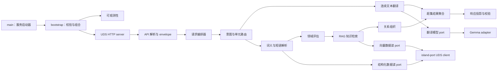

# 服务模块参考

English: [Service module reference](../../docs/reference/modules.md)

本目录定义从进程启动到翻译、检索、发布与停机的目标模块边界。每个目标模块都有一份专属参考页；本目录页只负责模块间共享的依赖规则、当前运行时清单、端到端关系和阅读顺序。

状态：包含当前运行时清单的目标模块设计。除非链接页面的状态说明明确标识已纳入仓库并完成组合，否则目标页面描述的是架构目的地。

## 依赖规则

Transnet 保持单一 Cargo package。运行时依赖向内指向：`transport -> application -> domain <- ports <- adapters`。Domain 代码不了解 HTTP、Unix socket、数据库、provider 或日志实现。API 模块只校验和映射线上数据，不包含翻译、检索或持久化决策。Application 模块通过窄 port 编排用例，adapter 实现 provider 与 island-port I/O。

在线服务只接收只读结构化/向量 port。只有单独的离线 publisher 组合接收可变更 port。当前文本和翻译历史绝不经过持久写 port。

## 端到端组件

WebUI 调用 island-port，绝不直接调用 Transnet。Island-port 可添加最小先前翻译 turn 作为请求级上下文。Transnet 自动选择内部路径、固定一组兼容发布三元组，并随请求丢弃当前文本、历史、中间模型输出和请求级提案。

## 当前模块清单

- 当前已连接：`src/main.rs`、`src/api.rs`、`src/config.rs`、`src/logger.rs`、`src/provider.rs`、`src/resilience.rs`、`src/application/lookup.rs` 与 `src/adapters/learning_model.rs` 启动过渡回环 server、暴露旧路由、配置并保护 provider、按长度路由普通翻译，并提供模型驱动的旧结构化查询。
- 已有基础，未生产组合：规范查询、卡片、缓存、词义、检索、图、图拓扑缓存、内容发布、请求 ID、问题映射、就绪、指标及其 port/内存 adapter 为目标服务提供已测试基础。
- 需要收窄的已有基础：图 domain、application 与 port 模块保留有用的词义限定节点、关系方向、证据和语义尺度概念，但必须移除反馈与用户视图职责。
- 计划移除：学习者/画像/词汇、练习/掌握度/排程、私有反馈、保存图视图、查询任务、持久 worker 及其 port、adapter 与路由属于 Transnet 边界之外的产品或持久请求工作流。

当前可执行文件绑定回环 TCP，只连接健康、翻译和旧模型查询。已纳入仓库的基础或目标参考页都不表示默认启动器已经组合该能力。

## 启动与组合

- [Main 启动器](main_cn.md)：进程入口、致命启动错误报告与退出状态。
- [Bootstrap](bootstrap_cn.md)：配置、adapter 组合、就绪、listener 所有权与停机。
- [配置](config_cn.md)：有类型设置、默认值、校验和 secret 引用。
- [容错](resilience_cn.md)：有界 timeout、并发、重试和断路器。
- [可观测性](observability/overview_cn.md)、[日志](observability/logging_cn.md)与[指标](observability/metrics_cn.md)：不含请求内容的安全聚合遥测。

## 传输与 API

- [UDS server](transport/uds_server_cn.md)、[JSON 传输](transport/json_cn.md)与[传输 middleware](transport/middleware_cn.md)：所属 Unix socket 上的 HTTP/1.1、严格 body、请求边界和安全结果。
- [API 请求类型](api/request_cn.md)、[响应类型](api/response_cn.md)与[问题响应](api/problem_cn.md)：精确线上映射与闭合安全错误。
- [探针](api/v1/probes_cn.md)、[翻译](api/v1/translations_cn.md)、[词义读取](api/v1/sense_cn.md)与[图读取](api/v1/graph_cn.md)：薄版本化路由 handler。

## Application 编排

- [请求编排器](application/request_orchestrator_cn.md)：一轮翻译共享一个 deadline 与发布固定值。
- [意图路由器](application/intent_router_cn.md)：自动分类单词、短语或段落。
- [翻译](application/translation_cn.md)与[长文本](application/long_text_cn.md)：连续文本翻译以及请求级分块和术语规划。
- [词义解析](application/sense_resolution_cn.md)与[领域评估](application/domain_assessment_cn.md)：规范候选排序和闭合领域结果。
- [知识检索](application/knowledge_retrieval_cn.md)、[关系排序器](application/relationship_ranker_cn.md)与[页面组织器](application/page_composer_cn.md)：证据感知的事实补全、排序和解释。
- [响应投影](application/response_projection_cn.md)与[校验](application/validation_cn.md)：确定性 `brief`、`standard`、`full` 视图及最终不变量检查。

## Domain 类型

- [语言](domain/language_cn.md)、[请求](domain/request_cn.md)、[翻译](domain/translation_cn.md)与[响应级别](domain/response_level_cn.md)：独立于传输的请求和结果词汇。
- [词汇](domain/lexical_cn.md)与[领域](domain/domain_cn.md)：稳定词义、短语和知识领域身份。
- [知识](domain/knowledge_cn.md)、[关系](domain/relationship_cn.md)与[语义尺度](domain/semantic_scale_cn.md)：原子事实、精确类型化关系和有序非分类程度维度。
- [证据](domain/evidence_cn.md)与[发布](domain/release_cn.md)：支持、来源、不可变兼容发布身份和降级状态。

## Port 与 adapter

- [翻译模型](ports/translation_model_cn.md)、[结构化数据](ports/structured_data_cn.md)与[向量数据](ports/vector_data_cn.md)：面向操作的模型和规范/检索读取。
- [时钟](ports/clock_cn.md)与[指标](ports/metrics_cn.md)：deadline 时间和聚合结果边界。
- [OpenAI-compatible 协议](adapters/providers/openai_cn.md)、[Gemma 4](adapters/providers/gemma4_cn.md)与[TranslateGemma](adapters/providers/translate_gemma_cn.md)：协议和角色专属 provider adapter。
- [Island-port UDS client](adapters/island_port/uds_client_cn.md)、[SQL adapter](adapters/island_port/sql_cn.md)与[向量 adapter](adapters/island_port/vector_cn.md)：不使用直接 MySQL 或 Qdrant driver 的有界 JSON 调用。

Port trait 表达 application 操作而非泛型持久化。读取输入可包含派生查询形式、fingerprint、规范 ID、过滤器和发布 ID，但绝不包含用户身份。运行时组合不接收任何变更方法。

## 离线发布

- [发布模块](publication/overview_cn.md)：暂存、校验、投影、对账、激活、隔离与回滚库边界。
- [Publisher 启动器](bin/transnet-publisher_cn.md)：唯一接收可变更结构化/向量 port 的可选组合根。

Publisher 先构建权威结构化内容，再投影不可变向量 collection，对账精确发布三元组，完成评估并原子激活。实时请求处理绝不自行发布。

## 迁移顺序

1. 在不改变当前 listener 的情况下引入共享请求、历史、语言、响应级别、翻译结果与超集类型。
2. 用单一自动编排路径替换旧翻译与学习查询 handler。
3. 添加确定性响应投影和多含义合同测试。
4. 在面向操作的结构化/向量 port 后组合规范读取基础。
5. 添加领域清单、事实补全、语义尺度检索和关系组织。
6. 迁移到 UDS 传输和生产 island-port adapter。
7. 添加单独 publisher 组合和配对发布激活。
8. 移除不可达的学习者、练习、反馈、保存视图、任务和持久工作模块。

每个切片同步更新类型、handler、port、adapter、测试、当前/目标状态及中英文文档树。

## 相关文档

- [系统设计](../transnet_cn.md)
- [Transnet 服务接口](../interfaces/transnet_cn.md)
- [SQL 数据 endpoint](../interfaces/mysql_cn.md)
- [向量数据 endpoint](../interfaces/qdrant_cn.md)
- [内容发布](../guides/content-publishing_cn.md)
- [质量保证](../guides/quality-assurance_cn.md)
