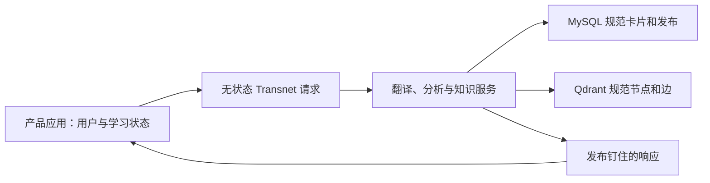

# Transnet 服务与集成设计

English: [Transnet service and integration design](../docs/transnet.md)

状态：权威目标设计。Transnet 是更大英语学习系统中的无状态语言与规范知识服务。外围产品拥有人员、账户、书签、历史、掌握度、复习日程、练习会话和保留策略；Transnet 不拥有任何用户数据。

## 目录

- [Transnet 服务与集成设计](#transnet-服务与集成设计)
  - [目录](#目录)
  - [系统边界](#系统边界)
  - [学习能力地图](#学习能力地图)
  - [翻译与词汇学习](#翻译与词汇学习)
    - [意图路由](#意图路由)
    - [输入规范化与身份](#输入规范化与身份)
    - [单词与词汇短语](#单词与词汇短语)
    - [句子与篇章](#句子与篇章)
  - [规范卡片与知识图](#规范卡片与知识图)
    - [MySQL 基础卡与领域](#mysql-基础卡与领域)
    - [Qdrant 节点与边](#qdrant-节点与边)
    - [检索安全](#检索安全)
  - [产品拥有的学习循环](#产品拥有的学习循环)
  - [练习、写作、听力与发音](#练习写作听力与发音)
    - [无状态练习与反馈生成](#无状态练习与反馈生成)
    - [写作与沟通](#写作与沟通)
    - [参考语音与发音分析](#参考语音与发音分析)
  - [代理技术设计](#代理技术设计)
    - [模型角色与编排](#模型角色与编排)
    - [落地、评估与可复现性](#落地评估与可复现性)
  - [内容发布与质量](#内容发布与质量)
  - [相关文档](#相关文档)

## 系统边界

Transnet 当前公开有界的翻译、词汇解析、规范词义详情和图探索请求。目标能力地图还包括无状态写作评估、参考语音、发音评估和练习生成；这些操作在加入接口合同和运行时前仍未发布。它运行在私有网关或服务网格之后；部署认证识别允许的调用服务，不识别终端用户。

请求可以在处理期间携带文本、上下文、语言、方言、语域、目的和有界音频。它们绝不写入 MySQL、Qdrant、缓存、日志、指标、trace、遥测、向量或持久队列。调用方不得发送 Cookie、终端用户 Bearer token、账户 ID、学习者 ID、画像或私有状态。

产品层是独立的记录系统。它可以保留书签、选择练习、计算日程、记录尝试，或将 Transnet 响应关联到某人；只把单次操作所需的最少请求级语言输入传给 Transnet。



## 学习能力地图

系统支持翻译、词汇、拼写、语法、写作、文化沟通、听力、发音和后续复习。这些是能力地图，不是 Transnet 内部关于某个人的证据。

Transnet 返回可复用、有范围的材料：规范词义、例句、语法模式、修正、发音提示和有证据关系解释。产品决定何时显示响应、是否保留、如何创建练习以及如何衡量进度。

英语是主要目标语言。请求级讲解语言、英语方言、母语支架、无障碍选项、语域、受众、目的和媒介只控制响应，不会被存储或用于推断画像。

## 翻译与词汇学习

### 意图路由

单词、术语、习语、短语动词或固定词汇短语获得规范查询响应；分句、句子或篇章优先翻译。歧义短片段默认翻译，除非可高置信识别为词汇单元。低信心路由选择最少干预的有用响应，并在需要时声明不确定性。

### 输入规范化与身份

规范化仅限请求内。版本化 normalizer 通过 Unicode 规范化、语言感知大小写折叠、空白处理和等价标点生成有界检索形式。精确规范和精确别名匹配优先于屈折、拼写修正和宽松别名；`C`、`C++` 和 `C#` 保持不同。

卡片用稳定词义 ID 而非规范化字符串作为身份。服务只把有界派生形式传给 MySQL，绝不持久化原始文本、中间形式、上下文或变换轨迹。新卡片和别名只能由内容发布流程创建。

### 单词与词汇短语

翻译维基响应从精简 MySQL 基础卡开始，再加入有界 Qdrant 知识。词义与词性保持分离，分区按相关性排序，证据不足的分区被省略。

服务可按词义提供：分类和强度尺度、配价和句法槽位、搭配和固定短语、焦点与细微差异、含义与语域、场景/方言/地区/领域适用性、形态和派生，以及有明确范围的习语、文化语境和隐喻延伸。

例如 `warm → hot → sweltering → scorching` 是强度尺度，不是父子分类。近义词必须给出对比，不能无支持地宣称可互换。

### 句子与篇章

翻译保留含义、语气、语域和段落结构。响应最多两条一句提示，只在重大歧义、习语、重要语域选择或文化语境时增加。详细词汇分析通过独立查询请求。

## 规范卡片与知识图

### MySQL 基础卡与领域

MySQL 是精简规范内容的权威来源：卡片、词义、词形、别名、定义、翻译、发音、形态、例句、用法说明、领域、证据元数据、不可变修订和发布 manifest。`BasicCard` 含稳定卡片/词义 ID、规范形式、语言、词性、精简定义和翻译、CEFR 与领域元数据、Qdrant 根 ID、证据引用、修订和发布状态。

领域是规范版本化概念，不是自由模型标签。它包含稳定 ID、名称、别名、范围边界、上位领域 ID、证据和修订。精确 MySQL 匹配优先于有界 Qdrant 领域检索；草稿创建、冲突解析和激活都是发布操作，绝不作为运行时副作用。

### Qdrant 节点与边

Qdrant 是可重建、发布钉住的投影。节点表示词义、短语、概念、实体、现象、习语、隐喻、言语行为、文化实践、语法模式、搭配、误解和领域；使用命名跨语言稠密向量及稀疏词法向量。

边是有类型关系的可检索解释，包含两端、关系类型、限制、证据、信心、验证状态和发布。关系族包括命名、词汇、概念、对比、文化、领域与探索性关系。强度关系必须命名比较维度。

### 检索安全

查询先解析 MySQL，再执行精确、混合、端点和有界图检索。限制结果前按发布、状态、语言、方言、地区、时期、领域、证据和验证状态过滤。已验证关系与探索关联保持分离；向量相似度仅是候选证据，不能证明翻译、同义、层级、因果、共同机制或文化意义。

Qdrant 不可用时，可返回带显式降级元数据的 MySQL 卡片，绝不编造关系。图扩展浅层且以一个选定规范资源为根；任意深度遍历、最短路径和可变图事务不在合同内。

## 产品拥有的学习循环

以下完整学习循环保留为项目地图，但由产品层实现并持久化：

1. 通过 Transnet 将单词或短语解析为规范词义和知识根。
2. 产品逻辑可为该词义创建书签和冻结的学习工件。
3. 产品逻辑可根据自己的书签和有界历史重建策略。
4. 产品选择诊断或练习目标，并调用 Transnet 获得解释、练习、修正、参考语音或发音分析。
5. 产品按自己的策略评估或记录尝试、更新掌握维度，并安排后续复习和迁移。

识别、回忆、拼写、形态、搭配、语法、写作、语域、文化语用、听力和发音是独立维度。产品必须用直接证据推进维度；Transnet 响应本身不是持久掌握度证据。

书签、历史、掌握度、日程、尝试、反馈记录和保留音频均为外部产品数据，Transnet 绝不接受、存储或重建。

## 练习、写作、听力与发音

### 无状态练习与反馈生成

产品可调用 Transnet 为指定规范目标生成受控识别、回忆、拼写、听写、形态、搭配、语法、写作或迁移材料。响应包含目标、提示、允许变体或 rubric、难度、提示和版本元数据；不会创建练习记录或队列。

### 写作与沟通

写作评估请求可声明受众、目的、媒介、语域、约束和文本。Transnet 返回最小修正、可选自然版本、最多两项重点解释和重试提示；保留原意和声音，区分语法可接受性与自然度，不把一种改写当作唯一正确表达。

沟通与文化指导描述特定关系、场景、媒介、方言和地区下的可能解读，提供有范围的替代表达，拒绝刻板印象和对群体的绝对化断言。

### 参考语音与发音分析

参考语音可生成单词、最小对立、例句、听写和跟读 TTS，支持方言、声音、正常或自然慢速以及用途，并标注为生成音频。

发音评估接收有界音频和预期语言或目标短语，检查录音质量、对齐信心、时序、重音、节奏、连读及其他声学证据；最多返回两个可理解性目标和重录提示。音频不足时返回不确定性而不评分，音频只用于本次请求，不保留。

## 代理技术设计

### 模型角色与编排

模型是有界服务组件，不是自主个人代理。角色包括翻译、词汇分析、规范内容整理、关系解释、领域草稿、练习生成、写作评估、语用教练、TTS、语音识别和发音分析。每个角色有独立、版本化的输入输出 schema、prompt、限制和评估标准。

```mermaid
flowchart LR
  input["有界请求"] --> route["有类型意图路由"]
  route --> context["请求内上下文构建"]
  cards["MySQL 规范卡片"] --> context
  graph["Qdrant 节点和边"] --> context
  context --> plan["响应规划器"]
  plan --> tools["专用模型与确定性工具"]
  tools --> validate["Schema 和证据校验"]
  validate --> response["无状态响应"]
```

### 落地、评估与可复现性

确定性逻辑负责规范化、规范 ID、精确匹配、发布资格、边界、过滤和响应 envelope。结构化工具可提供解析、对齐和声学测量。模型必须标注生成材料，不得把生成文本或相似度提升为规范事实。

Prompt、schema、模型、normalizer、检索配置、证据策略、分析器和发布均版本化。无效结构化输出只进行有界修复，未解决时安全失败。Provider 遥测只含操作和可靠性元数据，绝不含请求/响应内容、凭据、向量或调用方身份。

## 内容发布与质量

发布暂存不可变 MySQL 修订，先构建确定性 Qdrant 节点再构建边，针对经认证 manifest 对账哈希和端点覆盖，并原子激活兼容发布对。修正创建新发布；隔离阻止不合格内容；回滚选择未变更保留对。

质量场景包括翻译优先路由、词汇冲突安全、词义分离、跨语言术语、证据范围、关系精度、MySQL-only 降级、文化安全、参考语音质量、发音不确定性、发布激活、回滚、prompt 注入抵抗和请求非持久化。

当产品可以使用 Transnet 的有依据响应组合丰富学习体验，同时 Transnet 保持没有用户身份和个人学习状态时，设计即成功。

## 相关文档

- [服务接口](interfaces/port_cn.md)
- [MySQL 接口](interfaces/mysql_cn.md)
- [Qdrant 接口](interfaces/qdrant_cn.md)
- [服务行为](product/learning-experience_cn.md)
- [内容发布](guides/content-publishing_cn.md)
- [质量保证](guides/quality-assurance_cn.md)
