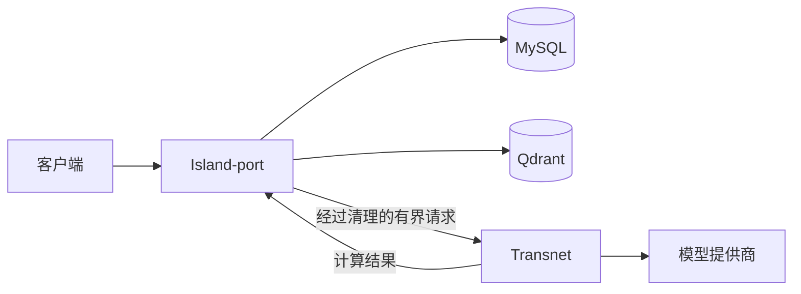

# Transnet 计算服务架构

English: [compute-service architecture](../docs/transnet.md)

## 边界

Transnet 是由 Island-port 调用的纯回环计算服务。它负责确定性输入校验、模型提供商调用、结果解析、纯排序与组装、提供商容错，以及脱敏的计算遥测。

Island-port 负责公共 API、身份与权限、用户数据、隐私、加密、持久化、缓存策略、幂等、限流、持久任务、内容发布、MySQL、Qdrant，以及所有有状态的产品变更。`transnet_*` 表属于 Island-port 的产品域命名空间，不由本进程拥有。

## 信任合同

- Transnet 只绑定回环地址，不构成公共安全边界。
- Island-port 在调用前删除 Cookie、Bearer token、`X-Island-*`、调用者标识、角色、持久化指令、幂等键和任务能力。
- 只有计算需要的查询和上下文才会发送；Transnet 不记录或保留它们。
- 计算输出不证明历史记录、保存、反馈、尝试、任务或其他变更已经提交。
- 数据辅助计算只接收 Island-port 提供的有界、已授权快照，不接收数据库连接信息、表名、集合凭据或原始查询能力。

## 当前运行时

| 路由 | 职责 |
| --- | --- |
| `GET /health` | 进程健康 |
| `GET /livez` | 进程存活 |
| `GET /readyz` | 计算就绪 |
| `POST /translate` | 直接文本翻译 |
| `POST /v1/lookups` | 结构化学习卡计算 |

Gemma 4 处理短文本翻译和结构化查词，TranslateGemma 处理较长的直接翻译。每个提供商使用独立的超时、重试、并发和熔断策略；请求、凭据和提供商正文不会进入 trace。

仓库还包含规范内容、图遍历、学习者状态、反馈、练习、任务、缓存和 repository 的遗留基础设施。它们不是部署权威，不得被暴露为 Transnet 自有的 HTTP 或存储接口。

## 未来计算扩展

只有保持无身份、无存储的端点才适合加入，例如对给定候选集排序、从授权快照组装卡片、生成冻结练习候选、按给定评分标准评答案，或根据给定拓扑计算图布局。

相关合同见 [Island-port 接口](interfaces/port_cn.md)、[MySQL 适配器](interfaces/mysql_cn.md) 和 [Qdrant 适配器](interfaces/qdrant_cn.md)。
