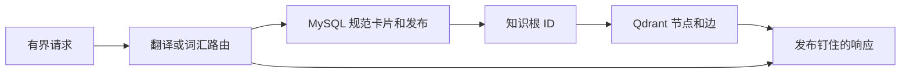

# Transnet 服务设计

English: [Transnet service design](../docs/transnet.md)

状态：权威目标设计。Transnet 是私有、无状态的语言与规范知识服务：翻译有界文本、解析单词和短语、读取版本化关系图的有界内容。它不是终端用户应用、学习产品、账户系统或个人数据存储。

## 目录

- [服务边界](#服务边界)
- [请求处理](#请求处理)
- [规范内容](#规范内容)
- [检索与图安全](#检索与图安全)
- [内容发布](#内容发布)
- [HTTP 服务](#http-服务)
- [代理技术](#代理技术)
- [安全与可复现性](#安全与可复现性)
- [质量场景](#质量场景)

## 服务边界

Transnet 只拥有共享语言与知识能力：

- 翻译句子、篇章或有界文本片段；
- 为单词、术语、习语、短语动词和固定短语进行词汇解析；
- 提供精简规范词义信息，包括定义、翻译、发音、形态、例句和用法限制；以及
- 提供规范概念间已验证且明确标注为探索性的关系。

Transnet 不接受、推导、存储或返回用户 ID、学习者 ID、账户 ID、画像、偏好集合、历史、保存项目、书签、掌握度记录、日程、答题记录、录音、图布局、反馈、导出或删除请求。产品应用可以代表终端用户调用 Transnet，但负责认证、授权、个性化、保留策略和用户与 Transnet 响应之间的一切关联。

请求文本和可选消歧上下文是临时输入，只能在有界请求生命周期内存在于内存中；绝不进入 MySQL、Qdrant、日志、指标、trace、缓存、遥测或持久队列。语言、方言、语域和详情等请求级选项只指导单次响应，不创建持久状态。

## 请求处理

服务按语言形态路由，而非按调用方身份路由：

1. 句子、分句或篇章优先翻译，并保留含义、语气、语域和段落结构。
2. 单词、术语、习语、短语动词或固定词汇短语被解析为规范词义。
3. 歧义短片段默认翻译，除非可高置信识别为词汇单元。
4. 只有重大歧义、习语、语域后果或文化语境才增加最多两条精简提示。

输入规范化仅限请求内。版本化 normalizer 生成有界检索形式，使用 Unicode 规范化、语言感知大小写折叠、空白处理和等价标点。精确规范形式和精确别名优先于屈折、拼写修正和宽松别名。符号仍是消歧特征：`C`、`C++` 和 `C#` 是不同的规范形式。原始文本和规范化轨迹不持久化。

## 规范内容

MySQL 是精简规范内容和发布状态的权威来源。每张 `BasicCard` 表示一个单词或短语词义，包含稳定卡片/词义 ID、规范形式、语言、词性、精简定义和翻译、发音和形态摘要、CEFR 元数据、领域 ID、Qdrant 根 ID、证据引用、修订和发布状态。

规范领域是版本化概念，不是自由模型标签。领域包含稳定 ID、名称、别名、精简范围定义、包含和排除边界、可选上位领域 ID、证据引用和修订。冲突在发布决策解决前保持独立。

Qdrant 是可重建的只读投影，含发布钉住的不可变 `knowledge_nodes` 与 `knowledge_edges` 集合。节点表示可独立解释的词义、短语、概念、实体、现象、习语、隐喻、言语行为、文化实践、语法模式、搭配、误解或领域；边表示有类型、有解释、有证据的关系。

两个数据库都不包含请求文本或任何用户相关数据。MySQL 不存原始检索形式或上下文；Qdrant 不嵌入运行时输入。

## 检索与图安全

词汇查询先解析精简 MySQL 卡片，再用 Qdrant 通过精确、稠密、稀疏和端点检索获取有界的合格节点和有类型边。响应将已验证关系与探索性关联分开。

稠密相似度仅用于召回候选，绝不能证明翻译、同义、层级、因果、共同机制或文化意义。服务在限制结果数量前应用发布、发布状态、语言、方言、地区、时期、领域、证据和验证状态过滤。规范解析支持不足时返回不确定性或候选。

图扩展限制在选定根和浅层深度。任意深度遍历、最短路径、中心性、可变图事务，以及将相似链展示为事实，都不属于服务合同。

## 内容发布

规范内容在请求处理之外准备。发布管道：

1. 在 MySQL 中解析或暂存稳定卡片、词义、领域、证据引用、别名和 Qdrant 根 ID；
2. 校验唯一性、范围、语言、领域、证据、端点和发布兼容性；
3. 向新的不可变 Qdrant 集合先写确定性节点 point，再写边 point；
4. 对账数量、端点覆盖、内容哈希、向量元数据和经认证 manifest；以及
5. 原子激活兼容的 MySQL 与 Qdrant 发布。

修正创建新的不可变发布。隔离会先阻止不合格内容，再在后续发布中移除。回滚选择未变更的保留发布对。运行时查询绝不创建卡片、领域、边或可变图状态。

## HTTP 服务

主 HTTP 合同是 [Transnet 服务接口](interfaces/port_cn.md)。公开服务面刻意保持精简：

- 进程探针：`GET /health`、`GET /livez` 和 `GET /readyz`；
- 翻译：`POST /translate`；
- 词汇查询：`POST /v1/lookups`；
- 规范词义读取：`GET /v1/senses/{sense_id}`；以及
- 有界图读取：`GET /v1/graph` 和 `GET /v1/graph/nodes/{kind}/{id}/neighbors`。

服务绑定私有地址且不终止公网 TLS。部署认证识别被允许的调用服务，不识别终端用户。响应返回 `X-Request-Id`、相关的显式内容发布元数据和安全错误 envelope，且不回显请求文本或基础设施内部信息。

## 代理技术

模型是有界服务组件，而非自主的个人代理。角色包括翻译、词汇分析、规范内容整理、关系解释和领域草稿协助。每个角色都具有版本化输入输出 schema、prompt、限制和评估标准。

结构化生成在使用前校验。确定性逻辑负责规范化、规范 ID、发布资格、精确匹配、边界、过滤和响应 envelope。非规范、非证据支持的生成材料必须标注为生成内容。无效模型输出在配置限制内修复，否则安全拒绝。

Provider 遥测只包含静态 provider 边界、操作名、尝试次数、结果类别、状态类别、耗时和重试延迟；不含请求内容、响应内容、凭据、向量或调用方身份。

## 安全与可复现性

每个响应均可针对记录的内容发布、schema 版本、normalizer 版本、检索配置和模型合同版本复现。规范断言含证据引用和验证状态；已验证关系与探索性关联清晰区分。

Transnet 不使用请求输入训练模型、创建画像或推断兴趣。它拒绝公共边缘认证材料，且不得以优化为由增加隐藏持久化。若启用缓存，只能缓存安全的、发布钉住的规范工件，绝不包含请求内容或调用方身份。

## 质量场景

- 句子得到翻译优先响应；词汇单元得到词义特定的规范信息。
- `C`、`C++` 和 `C#` 在规范化及冲突解析中保持不同。
- Qdrant 不可用时 MySQL 卡片仍有用，且响应声明关系能力降级。
- Qdrant 结果绝不将向量相似度提升为已验证事实。
- 发布激活拒绝缺失端点、不匹配哈希、不兼容嵌入元数据和无支持证据主张。
- 请求、上下文、调用方身份和生成的 provider body 不存在于存储、缓存、日志、trace、指标和向量中。
- 服务合同变化时，英文和中文合同、OpenAPI、指南和测试同步更新。

## 相关文档

- [Transnet 服务接口](interfaces/port_cn.md)
- [MySQL 适配器接口](interfaces/mysql_cn.md)
- [Qdrant 适配器接口](interfaces/qdrant_cn.md)
- [内容发布](guides/content-publishing_cn.md)
- [质量保证](guides/quality-assurance_cn.md)
