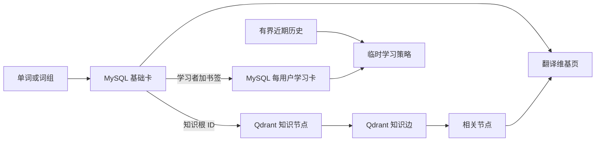
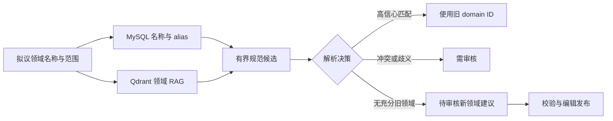
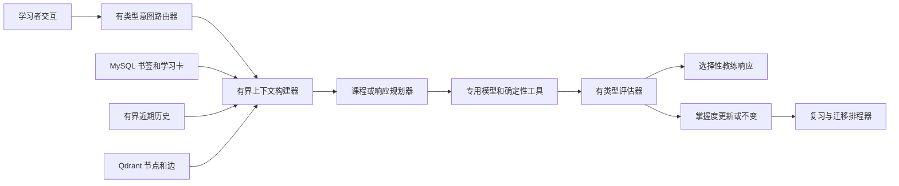

# Transnet 英语学习代理设计

English: [Transnet English-learning agent design](../docs/transnet.md)

状态：目标产品设计。仓库运行时只实现了其中一部分；接口和指南中的状态说明会区分当前行为与拟议行为。

Transnet 是面向 CEFR A1 至 C2 成年学习者的自主英语学习代理，在一个自适应体验中结合翻译、词汇、拼写、语法、写作、文化沟通、听力、发音和持续复习。

英语始终是目标语言。学习者可选择讲解语言、英语方言和母语支架程度，但这些展示偏好不作为学习策略证据。核心成果是在陌生情境中独立理解并自然产出语言。

## 目录

- [学习原则](#学习原则)
- [核心学习循环](#核心学习循环)
- [翻译与词汇学习](#翻译与词汇学习)
- [卡片与知识存储](#卡片与知识存储)
- [翻译维基检索](#翻译维基检索)
- [持续学习](#持续学习)
- [练习设计](#练习设计)
- [听力与发音](#听力与发音)
- [代理技术设计](#代理技术设计)
- [质量场景](#质量场景)

## 学习原则

- 在语境中教意义和技能，不把一种拼写当成不可分割的事实。
- 分别跟踪识别、回忆、拼写、语法、写作、听力和发音。
- 每轮聚焦一个明确目标和一至两个可操作的修正。
- 要求主动产出、聚焦重试和后续迁移，而非只提供被动解释。
- 修正时保留学习者的意图和声音。
- 文化指导必须限定语境，不对群体作绝对化断言。
- 区分有来源的知识、生成的教学材料和不确定推断。
- 证据不足时返回不确定性。

## 核心学习循环

每次交互都可提供一次性帮助，但只有书签单词或词组才启动持久学习：

1. 把目标解析为规范基础卡和知识节点。
2. 学习者为选定词义加书签时创建私有学习卡。
3. 仅根据当前书签和有界近期历史重建策略。
4. 诊断目标最可能的缺口，教一个概念并要求主动回忆、修复、写作或发音。
5. 用确定性检查和有界模型判断评估，只保存紧凑结果并更新已证明技能。
6. 给出即时反馈、聚焦重试、后续复习和新语境迁移。

## 翻译与词汇学习

代理按语言意图选择体验，不用固定字符数决定产品行为。单词、术语、习语、短语动词和固定表达进入翻译维基；从句、句子和篇章优先返回翻译。不确定的短片段默认进入较简单的翻译体验。

### 输入规范化与身份

系统保留学习者的完整原始输入供展示和诊断，但不把原始字符串当作卡片身份。版本化 normalizer 生成 Unicode NFKC、语言感知 case folding、去除首尾空白、折叠内部空白以及排版标点等价形式。因此 `Make`、`make` 和 `make ` 共享一个大小写折叠检索形式。

第二个宽松检索形式可移除首尾装饰符号以及纯字母候选中的分隔符，使 `make*` 和可能误输的 `ma-ke` 能召回 `make`。但它只是 alias 候选，不会自动合并身份；精确规范和精确 alias 匹配优先。

规范化不得擦除词汇意义。大小写、撗号、连字符、加号、井号、句点和其他有意义符号保留为消歧特征；`C`、`C++` 和 `C#` 必须不同。宽松形式冲突时，resolver 返回排序备选或请求上下文，不擅自选择或新建卡。

卡片身份使用稳定词义 ID，不使用规范化字符串。系统保存原始输入、匹配规范形式、normalization 版本、已应用变换和 exact/canonical alias/inflection/spelling correction/relaxed alias 匹配类型。

### 单词与词汇短语

翻译维基页先显示 MySQL 中精简的基础卡，再用 Qdrant 中的相关知识增强。词义和词性分开。页面只显示有实质帮助的分区，并按相关性排序。

#### 分类与强度尺度

上位词、下位词和梯度是不同结构。`warm → hot → sweltering → scorching` 是强度尺度，不是父子分类。

#### 配价与句法模式

显示自然使用所需的结构槽位、介词和补语，如 `show [someone] [something]` 和 `dissuade [someone] from [doing something]`。

#### 搭配与固定短语

优先显示强而实用的组合，区分固定表达与可生产搭配，并标明词义、形式和场景限制。

#### 焦点、细微差异与含义

解释目标词强调的维度以及与近义词的差别，并说明正面、负面、中性、幽默、婉转或冒犯性含义。

#### 语域、场景与领域适用性

只在影响适用性时显示正式度、方言、时代、地区和专业领域，并解释对具体场景的影响。

#### 形态与派生

连接词根、屈折形式、词缀和实用词性变化，并标明不规则、不常见或风格受限的形式。

#### 文化习语与隐喻延伸

解释无法从字面翻译稳定推出的习语、文化联想和概念隐喻，并区分广泛理解与特定地区表达。

### 句子与篇章

翻译始终是主结果，保留意义、语气、语域和段落结构。仅在关键歧义、习语、重要语域选择或理解必需的文化语境中增加提示，最多两条，每条一句。

## 卡片与知识存储

MySQL 存储精简规范卡和私有学习工件。Qdrant 用版本化节点和边集合存储共享翻译维基知识图谱。

### MySQL 基础卡

`BasicCard` 是一个单词或词组词义的精简规范表示，包含稳定 ID、规范形式、语言、词性、简明翻译与定义、发音与形态摘要、CEFR 难度、领域、Qdrant 根 ID 和发布状态。Qdrant 不可用时它仍必须有用。

### 规范领域

领域是版本化规范概念，不是模型自由标签。MySQL 存储稳定 domain ID、规范名称、精简范围定义、alias、状态、发布和可选上位领域 ID；基础卡和知识记录只引用 domain ID。

Qdrant 索引公开领域定义、alias、范围说明、代表概念和已验证领域关系。解析先查 MySQL 规范名称与 alias，再用混合 RAG 召回可能的旧领域和直接相关的上位、下位、同级及跨学科领域，然后才让模型决定。

Resolver 返回 `use_existing` 加 domain ID 与证据、`needs_review` 加竞争候选，或 `propose_new` 加名称、定义、范围边界、alias、上位/相关候选、证据和旧领域不足的理由。模型不得直接插入或激活领域。新建议必须通过规范化、冲突检查和编辑审核，确认不是 alias、重复或无理细分后才发布。相关领域只影响检索与例子，不表示等价或学习者兴趣。

### MySQL 每用户学习卡

书签会创建完整、学习者所有的 `LearningCard` 副本，冻结正反面、例句、发音提示、练习目标、生成语境、知识发布、模型、prompt、rubric、评估器、掌握度和日程版本。新知识发布不会静默改写旧卡；刷新会创建可追溯修订。

### 短期个人历史

每位学习者最多保留过去 30 天内最新的 200 个紧凑事件，只包含规范 ID、词义、操作、时间和可选的紧凑结果、提示数或误解类别。原始查询、篇章、写作、答案、对话、解释和录音不进入历史。

### Qdrant 知识节点

每个活动发布都有不可变的 `knowledge_nodes` 集合。节点表示可独立解释的词义、短语、概念、实体、现象、习语、言语行为、文化实践、语法模式、搭配或误解，并同时使用跨语言稠密向量和精确词法稀疏向量。

### Qdrant 知识边

每个发布也有不可变的 `knowledge_edges` 集合。边同时是有类型的图连接和可搜索的关系解释，包含两端、类型、方向、限制、证据、信心、验证状态和发布。关系分为命名、词汇、概念、对比、文化和探索六类。

## 翻译维基检索

检索先解析 MySQL 基础卡和词义，再用其根 ID 或混合搜索召回 Qdrant 节点、经验证的入边与出边以及语义相关描述。候选项必须检查发布、证据和资格，按精确度、证据、领域、关系多样性和临时策略重排。

### 关系安全

已验证关系与探索性关联分区显示。稠密向量接近绝不能单独证明翻译、同义、层级、因果、共同机制或文化意义。多跳探索一次只扩展一个由学习者选中的节点。

### 知识链示例

`Coriolis force` 可通过经验证的翻译、机制、应用和命名关系连接 `科里奥利力`、`地转偏向力`、旋转参考系、地转风和 Coriolis 本人。`Liquid rope coiling` 只能作为视觉类比的探索关联，并必须明示其机制不同。

### 知识发布

发布先生成确定性 ID 和节点，再生成边。校验拒绝孤立端点、跨发布引用、无效方向、重复边、缺失证据和不兼容词义。节点与边作为一个逻辑发布激活，任何部分构建都不可见。

## 持续学习

持续学习由书签驱动。任何查询或翻译都可获得完整的一次性帮助，但只有明确书签才创建持久卡和日程目标。

### 学习策略上下文

书签和短期历史是唯一个人策略输入。代理可以带信心地推断大致等级、领域、薄弱技能和复习优先级。书签权重高于浏览历史，历史影响随时间衰减；证据不足时使用中性通用英语策略。

### 复习排程

每日练习结合到期书签卡、未解决的紧凑误解和由直接相关知识边导出的迁移任务。版本化 FSRS 风格模型跟踪难度、稳定性和可检索性。正确性和提示使用是主要信号；不确定评估不降低掌握度。

### 反馈与迁移

反馈遵循识别问题、解释最小有用规则、聚焦重试、确认变化的短循环。后续会话使用不同措辞、内容或社交语境来测试迁移。

## 练习设计

练习从受控识别逐步过渡到独立产出。生成活动保留目标、可接受证据、难度、prompt、rubric、评估假设和模型版本。

### 词汇与拼写

活动覆盖定义匹配、英语回忆、拼写修复、听写、屈折和派生、易混形式及新语境用词。一次偶发拼写错误不自动成为持久弱点。

### 语法与句子构建

练习覆盖词序、形式补全、配价槽位、介词、定冠词、搭配修复、保留意义的修改、受约束写句和翻译产出。评估分开语法可接受性、自然度和任务完成度。

### 写作工作坊

写作任务明确受众、目的、媒介、语域和约束。反馈评估任务、意义、结构、语法、词汇、自然度、语气和文化适宜性，提供最小修正、可选自然版本和聚焦重写，不把一种改写当作唯一正确表达。

### 沟通与文化

练习聚焦特定关系、场景、媒介和地区中的言语行为与可能解读。代理说明直接度、礼貌、含蓄意义、幽默、禁忌、层级和地区变体，但不作群体刻板化断言。

## 听力与发音

发音练习结合生成的参考音频和对可选学习者录音的分析，目标是可理解、自信的沟通，而不是模仿单一声望口音。

### 参考语音

与供应商无关的 TTS 生成单词、最小对立、例句、听写和跟读音频。可选方言、声音、正常和慢速；慢速仍保留自然重音和韵律，并明示生成音色。

### 学习者发音

评估依次检查时长、静音、削波、噪声和语音，再做转写、词与音素对齐、声学信心、时序、重音、节奏和连读分析。模型最多选择两个影响可理解性的目标。证据不足时要求重录，不给分。

## 代理技术设计

代理是有类型、使用工具的状态机。语言模型负责计划和解释，专用模型与确定性工具提供翻译、检索、评分、语音和排程证据。

### 意图路由

每次交互被分类为词汇查询、翻译、辅导、写作、文化沟通、复习、听力或发音。低信心路由选择最少干预但仍有用的结果，不擅自启动课程、保存目标或评估能力。

### 逻辑模型角色

角色包括翻译器、词汇分析器、课程规划器、练习生成器、写作评估器、语用教练、TTS、语音识别器和发音分析器。一个底层模型可承担多个角色，但每个角色保持独立输入、输出、prompt、rubric、限制和版本。

### 编排流程

### 知识落地

词汇、发音、用法限制、关系、领域和文化声明来自有证据的版本化 Qdrant 节点与边。生成的解释和练习要标注性质，不把相似度或生成内容当成词典事实。

### 结构化生成

每个模型角色返回有类型结果。无效结构最多修复一次，仍无效时使用确定性部分行为或报告无法评估，不猜测成绩。

### 评估权威

确定性检查负责拼写、规范化、可接受形式和固定答案。开放写作和沟通仅通过明确 rubric 和可引用观察评估。自由产出返回 `correct`、`needs_revision` 或 `needs_review`，只有高信心的证据才改变掌握度。

### 安全与可复现性

Prompt、schema、rubric、检索发布、模型角色、规范化规则、发音分析器和排程参数全部版本化。对抗评估覆盖 prompt injection、歧义、方言变体、错误修正、文化刻板印象、无支持声明、噪声录音和过度自信评分。

## 质量场景

- 单词查询通过 MySQL 基础卡和 Qdrant 根组装翻译维基页；Qdrant 故障时仍返回基础卡。
- 普通句子只返回翻译，习语句最多增加两条精简提示。
- `Make`、`make`、`ma-ke`、`make*` 和 `make ` 召回同一个可能词汇候选，但 `C`、`C++` 和 `C#` 等有意义符号差异不会被合并。
- 领域 RAG 要么复用规范旧领域，要么返回带上位和相关候选的可审核新领域建议；模型不得直接创建活动自由领域。
- 已验证边与嵌入关联分开，缺端点或无支持关系不会出现。
- 书签创建完整私有卡，新知识发布只创建可追溯修订。
- 书签和近期规范历史影响领域与例子，但不创建永久隐藏画像。
- 拼写、句子、写作、文化和发音反馈都聚焦重试并在新语境中迁移。
- 删除书签停止排程，清除历史立即移除其策略影响。
- 识别正确只提升识别，其他技能必须分别证明。
