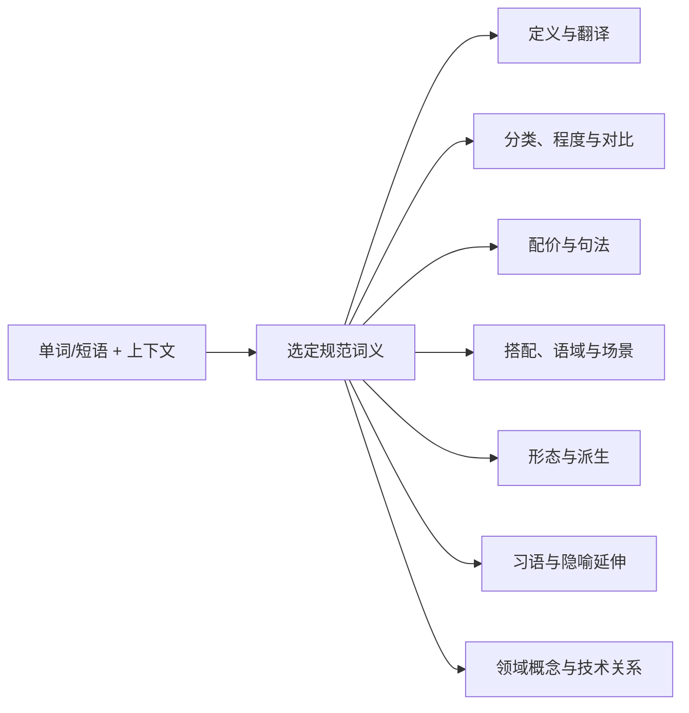

# Transnet：LLM 翻译与关系知识设计

English: [Transnet: LLM translation and relationship knowledge design](../docs/transnet.md)

状态：权威目标设计。仓库中的当前运行时已实现回环地址上的翻译服务和部分结构化查询。除非相关接口文档另有说明，MySQL/Qdrant 规范知识落地和高级编排仍属于目标能力。

## 产品焦点

Transnet 是一个基于 LLM 的翻译与关系探索应用。翻译是入口；产品的差异化价值是围绕选定词义或领域概念构建有用的关系网络。它提供两种相互连接的体验：

- **句子与篇章：** 把含义、意图、语气、术语和结构翻译成自然的目标语文本。
- **单词、术语与词汇短语：** 围绕选定词义或概念构建精简的“翻译 Wiki”页面，展示理解和使用它所需的关系。

核心理念是：**一个已解析含义是锚点，但体验不局限于一个孤立单词**。查询从用户输入的表达开始，解析适用的词汇词义或领域概念，再解释它有用的知识邻域。普通词的邻域包括分类、强度、语法、搭配、对比、语域、形态、习语和文化延伸；专业术语则进一步包括术语体系、领域归属、机理、前置概念、现象、技术、应用、测量、标准和使用惯例。每个展示节点都必须经由一条明确、有用的路径回到根节点。

项目聚焦以下创新：

1. **关系优先的探索。** 查询生成小型、有类型、按用途排序的子图，而不是词典条目加一份扁平“相关词”列表。
2. **由规范知识支撑的 LLM 组织。** 模型负责选择、排序、对比和解释；MySQL 与 Qdrant 提供版本化事实和关系候选。
3. **自适应领域展开。** LLM 判断已解析含义是否具有领域特异性，并在有用时跨语言、跨学科打开技术知识邻域。
4. **精确的关系语义。** 分类、程度、同义、搭配、句法、形态、文化延伸和探索性关联保持分离，而不是全部压成“相关词”。
5. **精简且证据感知的输出。** 只显示有用、有支持的分区；面对不确定性和范围限制时明确说明，而不是用似是而非的内容填充。

学习者画像、课程、练习、掌握度、复习排程、辅导和进度跟踪均不属于本设计，也不是 Transnet 模块。

## 核心体验

### 意图路由

单词、术语、习语、短语动词或固定词汇短语获得翻译 Wiki 页面；分句、句子或篇章优先翻译。歧义短片段默认翻译，除非可高置信识别为词汇单元。用户无需选择内部模型或流程。

可选的请求级上下文——语言、方言、领域、所在句、受众、目的和语域——帮助选择预期含义并控制响应。它在请求结束后即被丢弃。

同一个规范邻域可针对会话、学术写作、法律文本、技术工作或翻译重新排序。上下文只改变内容选择、顺序和解释，绝不改变规范身份，也不会静默改写关系事实。

### 输入规范化与词义身份

版本化 Normalizer 通过 Unicode 规范化、语言感知大小写折叠、空白处理和等价标点生成有界检索形式。精确规范和别名匹配优先于屈折词形、拼写修正和语义检索。有意义的符号保持不同：`C`、`C++` 和 `C#` 不得合并为同一词条。

卡片使用稳定词义 ID 而非规范化字符串作为身份。如果一个形式对应多种含义或词性，Transnet 根据请求上下文排序，或请求澄清。新卡片和别名只由内容发布流程创建，绝不作为查询副作用。

## 单词、术语与词汇短语

翻译 Wiki 页面以精简的 MySQL 基础卡开始，然后使用 Qdrant 的相关知识进行丰富。不同含义和词性保持分离，使例句、关系、语法、发音和用法指导始终归属于适用词义。

选定词义是页面根节点。只有当相关节点有助于解释或使用该词义时才会显示，不会把页面变成无限制图搜索。各分区可按相关性重排，空分区或支持较弱的分区会被省略。解释保持精简，并使用简短、自然的例句。

对于复合词或固定短语，页面将组合式含义与短语整体含义分开，说明哪些部分可从组成词预测，哪些关系、限制或含义只属于整个表达。

### 分类与强度尺度

展示上位类别、下位变体和有意义的程度关系。语义层级与强度是不同结构：上位词命名更宽泛的类别，下位词命名更具体的成员，梯度则沿共享维度对词进行排序。

例如，`warm → hot → sweltering → scorching` 是强度尺度，而非父子层级。页面必须命名比较维度，也不得暗示相邻词在所有上下文中都可互换。

### 配价与句法模式

展示自然使用单词或短语所需的语法接线。模式应暴露结构槽位、必需介词和允许的补语，而不是只显示抽象语法标签。

例如 `show [someone] [something]` 和 `dissuade [someone] from [doing something]`。当结构不能自我解释时，模式需附带一个简短填充例句。

### 搭配与固定短语

展示与选定词义自然聚集的词，以及在使用中构成整体的固定表达。优先显示 `sweltering heat`、`stifling humidity` 和 `blistering pace` 等强且实用的组合，而不是大量仅仅可能共现的邻词。

固定表达与生产性搭配保持分离，并说明属于特定词义、语法形式或场景的限制。

### 焦点、细微差异与含义色彩

解释选定词强调哪个维度，以及它与近义表达的区别。相关区别可包括物理温度、空气不流通、情绪强度、不适、赞许或危险。

当正面、负面、中性、幽默、委婉或冒犯性含义影响选择时，必须说明。近义词必须包含对比，不得被呈现为完全可互换。

备选表达应按其改变的维度——如程度、正式度、赞许、危险、领域或句法——进行对比式组织，而不是展示扁平同义词列表。每项对比都需说明选择其中一个表达的实际后果。

### 语域、场景与领域适用性

说明词或短语在哪些场景中自然，包括日常会话、技术报告、新闻、法律合同、学术写作、职场沟通和文学散文。

正式度、方言、时代、地区和专业领域只在影响适用性时出现。指导需解释对场景的实际影响，而不是只贴一个未解释标签。

### 形态与派生

连接词根、屈折、词缀和有用的词性转换。展示形式变化如何影响语法或含义，例如 `swelter → sweltering → swelteringly`。

优先显示常见、生产性形式。不规则、罕见或风格受限派生必须明确标注，不得与自然形式等量齐观。

### 文化习语与隐喻延伸

解释无法从字面翻译中可靠恢复的习语含义、文化联想和概念隐喻。例如，“热”可延伸为愤怒、压力、冲突、危险或激情。

广泛理解的延伸与特定文化或地区表达保持区分。提供足够上下文以理解和使用，但不把词条变成泛文化文章。

## 领域感知的知识展开

领域展开是传统翻译或词典页面之上的核心创新。它适用于专业术语、缩写、公式、命名效应、过程、材料、仪器、方法、标准，以及其他需依赖领域知识才能有效理解的表达。

### 领域检测与概念解析

词汇词义解析后，LLM 输出有界的领域评估：`general`、`domain_specific`、`mixed` 或 `uncertain`，并附候选领域和理由。判断信号包括输入形式、别名、定义、所在句、共现术语和规范领域匹配。确定性代码校验候选领域 ID 和检索边界；模型不在查询过程中创建规范领域或事实。

当领域展开可能增加有用信息时才执行。因此，`field`、`stress` 或 `cell` 这类常见词在上下文选中技术词义时也能打开领域视图。相反，形似术语但证据较弱的字符串应保持词汇模式或标记为不确定，不得虚构专业细节。

解析应以概念为中心并支持多语言。`地转偏向力`、`科里奥利力` 和 `Coriolis force` 可指向同一规范概念，同时保留首选术语、译名、别名、地区、学科和使用状态的差异。`卷绳效应` 与 `rope-coiling effect` 同样解析到它们自己的共享概念节点。译名匹配本身不会声称这两个示例概念彼此相关。

### 领域节点与边模型

领域页面可包含词汇词义、多语言术语、概念、现象、机理、过程、方程、物理量、材料、仪器、方法、技术、应用、标准、组织、人物、地点和误解。本体可扩展，但关系含义必须明确。

有用的领域关系族包括：

- **术语：** 首选术语、译为、是…的别名、缩写、符号、命名来源和废弃术语；
- **含义：** 定义、属于某类、对比、整体—部分、属性和测量方式；
- **领域：** 属于某领域、用于某子领域、跨领域共享和某领域中的特定词义；
- **技术：** 由…引起、促成、由…支配、源于、依赖、由…实现、产生、防止和应用于；
- **用法：** 标准中首选、学科惯用、从业者非正式用语、易混淆概念和检索同义词；
- **证据：** 来源支持、被来源质疑、特定条件下有效和被某修订取代。

每条边都携带方向、人可读解释、适用领域与词义、条件、证据状态、置信度和来源。对称、逆关系、传递性和因果性应按关系类型定义；界面与 LLM 不得仅凭措辞猜测。

### 领域优先的展示

结果应渐进展开，而不是一次性倾倒整张图：

1. 展示已解析概念、简明译名、定义、别名和已检测领域。
2. 按含义分组展示最高价值的直接关系：术语、机理、相邻现象、应用和使用惯例。
3. 用 `术语 → 现象 → 机理 → 应用` 这类短且有证据的路径回答“它们如何相连？”；每个中间步骤都必须有关系名称和独立有效的证据。
4. 跨领域或基于相似度的候选必须放在视觉上分离的探索区。

LLM 选择有用内容，并解释关系为何重要。规范边标记为 `verified`；基于证据但尚未规范化的综合标记为 `inferred`；向量或模型提案标记为 `exploratory`。推断项和探索项仅在请求内存在，不得被静默表述为事实，也绝不会自行写入图。

例如，查询 `地转偏向力` 时应先解析概念，展示 `Coriolis force` 及别名 `科里奥利力`；然后可展示相关学科、旋转参考系机理、支配物理量或方程、可观测现象、常见误解和专业用法。查询 `卷绳效应` 时应解析 `rope-coiling effect`，并构建流体力学邻域。系统只在存在有名、有支持的关系时才连接这两个根节点；共同检索或视觉相似性不足以构成关系。

## 句子与篇章

译文始终是主要结果。翻译保留含义、语气、语域、术语、段落结构、保护片段和格式，同时使目标语表达自然。

最多显示两条一句话提示，且仅用于重要歧义、习语、关键语域选择或文化语境。上下文不足时，可返回一个明确标注的备选。详细词汇探索保留在独立词条页面中。

长文或困难文本可使用请求内分块规划和术语台账，保证名称、缩写和重复术语一致。台账在响应后丢弃，不是持久用户翻译记忆。

## LLM 如何构建关系页面

LLM 是页面组织者，而不是每个事实的权威来源。目标流程为：

模型负责需要语言推理的任务：用有界上下文消歧并解析词汇词义或领域概念；判断领域展开是否有价值并提出候选领域；决定哪些关系分区确有帮助；用自然语言对比近义表达；在明确标注为生成内容时生成短例句；调整讲解语言和详细程度；在证据或上下文不足时说明不确定性。

在组织页面时，模型可检测预期关系的缺失，并向离线内容审核流程输出结构化缺口提案，其中包含建议端点、关系类型、理由和候选证据。实时查询绝不会发布、持久化该提案，也不会将其展示为已验证边。

确定性代码负责规范化、精确匹配、稳定 ID、发布过滤、图范围、必需字段和证据资格。无效结构化输出仅进行有界修复，否则安全失败。

## 规范知识与关系模型

**MySQL 基础卡**是精简规范内容的权威来源：卡片、词义、词形、别名、定义、翻译、发音、形态、例句、用法说明、领域、证据元数据、不可变修订和发布 Manifest。

**Qdrant** 是可重建、锁定到发布版本的投影。节点表示词义、短语、术语、概念、实体、现象、机理、过程、方程、物理量、仪器、方法、技术、应用、标准、习语、隐喻、语法模式、搭配、误解和领域。边是有类型关系的可检索解释；每条边记录端点、方向、关系类型、限制、领域与词义范围、证据、置信度、验证状态、来源和发布版本。

关系族包括：

- 词汇命名与翻译等价；
- 上位词、下位词、实例与整体—部分结构；
- 同义、反义、对比与明确命名的强度维度；
- 配价、语法模式、搭配与固定表达归属；
- 派生、屈折和其他形态关系；
- 语域、方言、地区、时期、场景与领域适用性；
- 习语、隐喻和文化延伸；
- 领域归属、机理、因果、依赖、实现、应用、测量、标准化和术语惯例；
- 与已验证关系明确分离的探索性关联。

查询先解析 MySQL，再执行精确、混合、端点和浅层图检索。按发布、状态、语言、方言、地区、时期、领域、证据和验证状态的过滤在限制结果前执行。向量相似度只提名候选，绝不能证明翻译、同义、层级、因果、共同机制或文化含义。

服务不执行任意深度遍历，也不返回所有邻居。关系方向、比较维度、适用词义和用法限制必须可见。Qdrant 不可用时，可返回带明确降级元数据的 MySQL 卡片，但不得编造关系。

## 服务边界与质量（简述）

Transnet 是无状态服务，运行在私有网关或服务网格之后。文本、上下文和中间分析只在请求生命期内存在，不得写入 MySQL、Qdrant、缓存、日志、指标、Trace、遥测、向量或持久队列。调用方不得发送用户身份、画像、私有历史或终端用户凭据。

Prompt、Schema、模型、Normalizer、检索配置、证据策略和知识发布均版本化。质量评估覆盖词义选择、关系精度、遗漏与编造、翻译忠实度、自然度、术语、语域、文化范围、降级读取、Prompt 注入抵抗和请求不持久化。人工评审与精选挑战集仍然必要；向量相似度、回译和 LLM 裁判都只是信号，而非唯一权威。

当用户既可以翻译连续文本，也可以通过精简、准确、有用的关系深入理解一个选定词汇词义或领域概念，同时不被无关知识淹没、不被缺乏支持的 LLM 输出误导时，设计即成功。

## 相关文档

- [服务接口](interfaces/port_cn.md)
- [MySQL 接口](interfaces/mysql_cn.md)
- [Qdrant 接口](interfaces/qdrant_cn.md)
- [服务行为](product/service-behavior_cn.md)
- [内容发布](guides/content-publishing_cn.md)
- [质量保证](guides/quality-assurance_cn.md)
