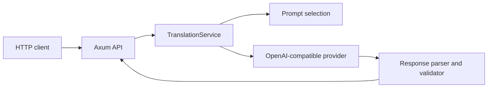

# Transnet core

`island-transnet` is the Rust translation service for Island. It exposes a small HTTP API, classifies input, builds mode-specific prompts, calls an OpenAI-compatible provider, and validates the provider's JSON before returning it.

The crate is transport-oriented core infrastructure. It does not contain a web UI, persistence, authentication, semantic indexing, or IPC.

## Architecture



`api` owns HTTP routing and status mapping. `llm` owns request validation, provider selection, retries, and orchestration. `prompt` owns prompt text. `format` owns parsing and structural validation. `types` owns the transport-independent public contract.

## Run

Configure `config/transnet.toml` and `config/transnet_llm.toml`, then run from either the repository root or this crate directory:

```bash
cargo run -p transnet --bin transnet-core
```

The server reads configuration relative to the crate manifest, not the shell's working directory. `config/transnet_api.toml` and `config/transnet_db.toml` document deferred settings and are not loaded by the current binary.

The default listener is `127.0.0.1:35792`. The default provider endpoints are local OpenAI-compatible services; start those services separately or change the provider configuration.

## HTTP API

`GET /health` returns the standard success envelope. `POST /translate` accepts `text`, `source_lang`, `target_lang`, and optional `mode` and `input_type` fields. See [the core API contract](../docs/reference/core/api.md) for wire examples and errors.

## Development

From the repository root:

```bash
cargo fmt --all -- --check
cargo check -p transnet
cargo test -p transnet
cargo clippy -p transnet --all-targets -- -D warnings
```

Module design notes start at the [core reference index](../docs/reference/core/README.md).

## License

MIT
